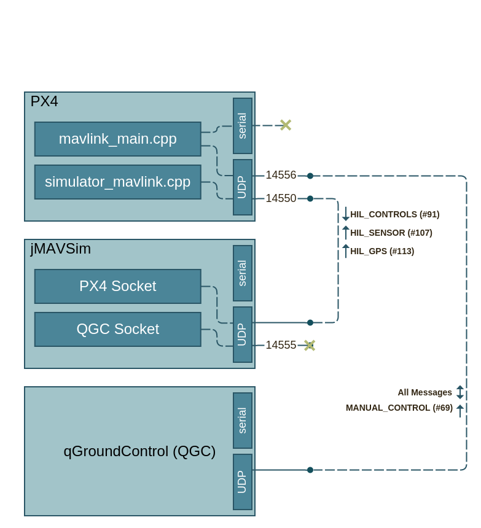

[TOC]

# Introduction

The HIL architecture allows you to test the flight stack replacing the real physical vehicle and sensors with a simulator of vehicle dynamics and sensor outputs.  The flight stack "is not aware" that it is not on a real vehicle.  This is a powerful tool for develping and testing code rapidly in a benchtop environment. 

The flight stack can be run anywhere that supports a network connection to the simulator (with sufficient bandwidth and latency to transport the sensor and actuator messages).  This can be on a standard linux workstation, an on-target linux image, or the on-target DSP image.  These modes can be selected based on the goals of the testing.  Workstation is useful for rapid testing in a tool-rich environment.  DSP image testing is the closest to the final implementation, so is useful for testing actual HW operation, other than the physical sensing and actuation.

## Px4 High-level HIL Architecture

A diagram of the setup described is shown here.  Note that UDP port numbers are only displayed on the socket server and are left blank on the socket client. 

(???NOTES:  This diagram needs to be updated to use control inputs over UDP, either from QGC or from other)

  

## Requirements
The simulator that is currently supported is jMAVSim.  The setup described here requires PX4 and jMAVSim installed and running.  qGroundControl (QGC) is also required because it is the supported method of providing manual control commands.  

## Assumptions

# Compiling Code

## JMAVSim

### Platform Requirements
Linux with java-1.7.x or greater

### Build Instructions
In a clean directory
```
> git clone https://github.com/PX4/jMAVSim.git
> cd jMAVSim
> git submodule init
> git submodule update
> ant
```

## qGroundControl

### Platform Requirements
Windows 7
Logitech Gamepad F310 joystick controller

### Download/Install Instructions
Download QGC from http://qgroundcontrol.org/downloads and install using the windows executable.


## PX4

### Platform Requirements
Linux or Eagle with a working IP interface (?? does this need further instructions?)

### Build Host Requirements
(???Notes:  Windows?)

### Download & Build Instructions

### Installing binaries on the Qualcomm Target

# Running PX4 in HIL Mode

## Starting PX4 on Qualcomm Eagle

```
> adb shell
# bash
root@linaro-developer:/# cd ???
root@linaro-developer:/# ./mainapp
App name: mainapp
Enter a command and its args:
uorb start
muorb start
mavlink start -u 14556
simulator start -p
```

## Starting jMAVSim
In the directory where jMAVSim is installed
```
 java -cp lib/*:out/production/jmavsim.jar me.drton.jmavsim.Simulator -udp <IPADDR>:14560 -n 100
```
replacing <IPADDR> with the IP address of the machine running PX4 (Eagle).  This can be found by running "ifconfig" on that machine.

## Starting qGroundControl
Launch the qGroundControl application
1. Set up the communication to the flight stack.  In the menu File:Settings:CommLinks, select Add.  Enter a Link Name of your choice.  Select Link Type: UDP.  Set the listening port to an unused port (example: 14561).  Select Add.  Enter the IP address and port of the PX4 Mavlink app, which is <IPADDR>:14556 with <IPADDR> being the IP address of the Eagle board. Select OK.
1. Set up the joystick.  Plug in the joystick to your Windows machine.  In the menu File:Settings:CommLinks, check Enable Controllers.  Select "Gamepad F310".  Select "Manual".  Set the axes/channel mapping to 0:Yaw, 1:Throttle, 2:unset, 3:Pitch, 4:Roll.  Seletct "Inverted" for the throttle axis.  Click "Calibrate range".  Move the right joystick through its full range of motion.  Move the left joystick full left then full right.  Move the left joystick full forward (but not full backward).  Click "end calibration."
1. Connect to the flight stack.  Click Analyze.  Click the "Connect" button in the upper right, and select the connection that you created in the first step.

You should now be connected to the flight stack.  You can see incoming Mavlink packets using the MAVLink Instpector (from Advanced:Tool Widgets)


## Controlling PX4 flight in HIL Mode
The joystick can now be used to fly the simulated vehicle.  The jMAVSim world visualization gives a FPV view, and QGC can be used to display instruments such as artificial horizon and maps (if GPS simulation is enabled).


# Debugging/FAQ
