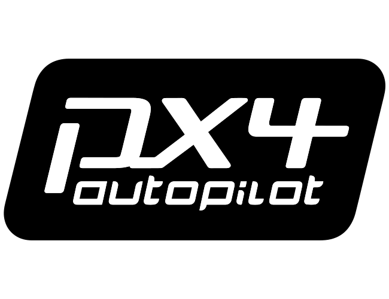

<p align="center">
  <a href="https://px4.io">
    
  </a>
</p>

<p align="center">
  <em>The autopilot stack the industry builds on.</em>
</p>

<p align="center">
  <a href="https://github.com/PX4/PX4-Autopilot/releases"></a>
  <a href="https://zenodo.org/badge/latestdoi/22634/PX4/PX4-Autopilot"></a>
  <a href="https://github.com/PX4/PX4-Autopilot/actions/workflows/build_all_targets.yml"></a>
  <a href="https://discord.gg/dronecode"></a>
</p>

---

## About

PX4 is an open-source autopilot stack for drones and unmanned vehicles. It supports multirotors, fixed-wing, VTOL, helicopters, rovers, and many more experimental platforms from racing quads to industrial survey aircraft. It runs on [NuttX](https://nuttx.apache.org/), Linux, and macOS. Licensed under [BSD 3-Clause](LICENSE).

## Why PX4

**Modular architecture.** PX4 is built around [uORB](https://docs.px4.io/main/en/middleware/uorb.html), a [DDS](https://docs.px4.io/main/en/middleware/uxrce_dds.html)-compatible publish/subscribe middleware. Modules are fully parallelized and thread safe. You can build custom configurations and trim what you don't need.

**Wide hardware support.** PX4 runs on a wide range of [autopilot boards](https://docs.px4.io/main/en/flight_controller/) and supports an extensive set of sensors, telemetry radios, and actuators through the [Pixhawk](https://pixhawk.org/) ecosystem.

**Developer friendly.** First-class support for [MAVLink](https://mavlink.io/) and [DDS / ROS 2](https://docs.px4.io/main/en/ros2/) integration. Comprehensive [SITL simulation](https://docs.px4.io/main/en/simulation/), hardware-in-the-loop testing, and [log analysis](https://docs.px4.io/main/en/log/flight_log_analysis.html) tools. An active developer community on [Discord](https://discord.gg/dronecode) and the [weekly dev call](https://docs.px4.io/main/en/contribute/).

**Vendor neutral governance.** PX4 is hosted under the [Dronecode Foundation](https://www.dronecode.org/), part of the Linux Foundation. Business-friendly BSD-3 license. No single vendor controls the roadmap.

## Supported Vehicles

<table>
  <tr>
    <td align="center">
      <a href="https://docs.px4.io/main/en/frames_multicopter/">
        <br>
        <sub>Multicopter</sub>
      </a>
    </td>
    <td align="center">
      <a href="https://docs.px4.io/main/en/frames_plane/">
        <br>
        <sub>Fixed Wing</sub>
      </a>
    </td>
    <td align="center">
      <a href="https://docs.px4.io/main/en/frames_vtol/">
        <br>
        <sub>VTOL</sub>
      </a>
    </td>
    <td align="center">
      <a href="https://docs.px4.io/main/en/frames_multicopter/index.md#helicopter">
        <br>
        <sub>Helicopter</sub>
      </a>
    </td>
    <td align="center">
      <a href="https://docs.px4.io/main/en/frames_rover/">
        <br>
        <sub>Rover</sub>
      </a>
    </td>
  </tr>
</table>

<sub>…and many more: autogyros, airships, submarines, boats, and experimental platforms. See the <a href="https://docs.px4.io/main/en/airframes/airframe_reference.html">full airframe reference</a>.</sub>

## Quick Start

```bash
git clone https://github.com/PX4/PX4-Autopilot.git --recursive
cd PX4-Autopilot
make px4_sitl
```

> See the [Development Guide](https://docs.px4.io/main/en/development/development.html) for toolchain setup and build options.

## Documentation & Resources

| Resource | Description |
| --- | --- |
| [User Guide](https://docs.px4.io/main/en/) | Build, configure, and fly with PX4 |
| [Developer Guide](https://docs.px4.io/main/en/development/development.html) | Modify the flight stack, add peripherals, port to new hardware |
| [Airframe Reference](https://docs.px4.io/main/en/airframes/airframe_reference.html) | Full list of supported frames |
| [Autopilot Hardware](https://docs.px4.io/main/en/flight_controller/) | Compatible flight controllers |
| [Release Notes](https://docs.px4.io/main/en/releases/) | What's new in each release |
| [Contribution Guide](https://docs.px4.io/main/en/contribute/) | How to contribute to PX4 |

## Community

- **Weekly Dev Call** — open to all developers ([Dronecode calendar](https://www.dronecode.org/calendar/))
- **Discord** — [Join the Dronecode server](https://discord.gg/dronecode)
- **Discussion Forum** — [PX4 Discuss](https://discuss.px4.io/)
- **Maintainers** — see [`MAINTAINERS.md`](MAINTAINERS.md)
- **Contributor Stats** — [LFX Insights](https://insights.lfx.linuxfoundation.org/foundation/dronecode)

## Contributing

We welcome contributions of all kinds — bug reports, documentation, new features, and code reviews. Please read the [Contribution Guide](https://docs.px4.io/main/en/contribute/) to get started.

## Governance

PX4 is hosted by the [Dronecode Foundation](https://www.dronecode.org/), part of the Linux Foundation.

<p align="center">
  <a href="https://www.dronecode.org/">
    
  </a>
</p>
