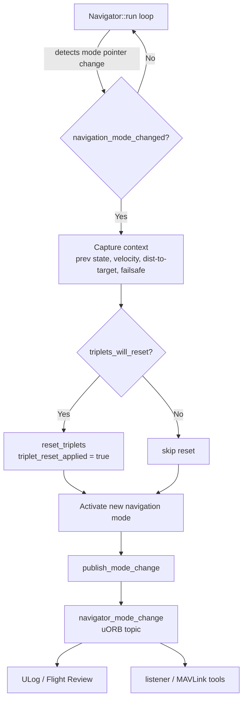
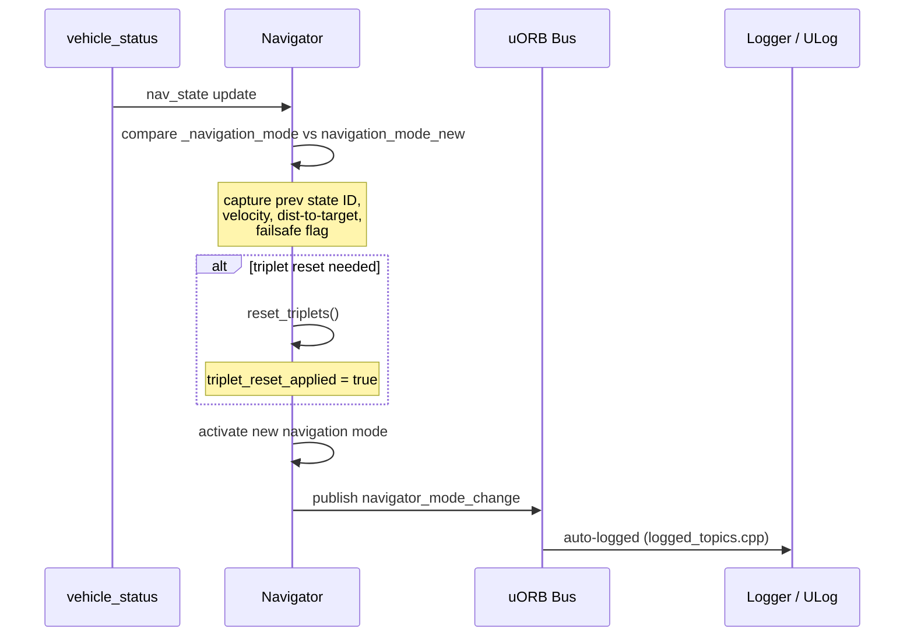
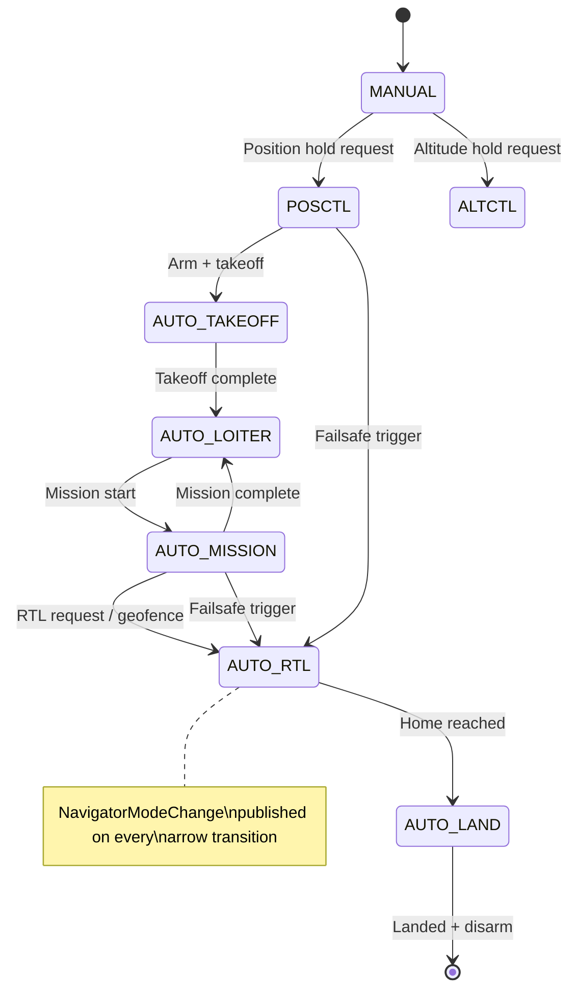

# PX4-Autopilot — Navigator Mode Change Telemetry

> **This is a contribution fork of [PX4/PX4-Autopilot](https://github.com/PX4/PX4-Autopilot)** (11k+ stars, the industry-standard open-source drone autopilot stack).
> The contribution is documented below. For general PX4 documentation, see the upstream repo.

---

## Contribution: Structured Telemetry for Autonomous Mode Transitions

**Status:** `Open PR upstream` → [PX4/PX4-Autopilot #26947](https://github.com/PX4/PX4-Autopilot/pull/26947)

**What I built:** A new `NavigatorModeChange` uORB message that publishes a structured, machine-readable record every time the vehicle switches autonomous navigation modes — automatically captured in every ULog flight recording.

**Problem it solves:** Post-flight analysis of why a vehicle transitioned out of a mission or into failsafe required manually correlating timestamps across multiple log topics. This feature collapses that into a single purpose-built record with all relevant context captured at the exact moment of transition — velocity, distance-to-target, failsafe state, user intention, and whether waypoints were reset.

### Files I Changed

| File | Change |
|---|---|
| [`msg/NavigatorModeChange.msg`](msg/NavigatorModeChange.msg) | New uORB message definition |
| [`msg/CMakeLists.txt`](msg/CMakeLists.txt) | Register new message in build system |
| [`src/modules/navigator/navigator_main.cpp`](src/modules/navigator/navigator_main.cpp) | Detect transitions, capture context, publish |
| [`src/modules/navigator/navigator.h`](src/modules/navigator/navigator.h) | Publisher declaration and method signature |
| [`src/modules/logger/logged_topics.cpp`](src/modules/logger/logged_topics.cpp) | Register topic for automatic ULog recording |

### Why This Approach

**Why a uORB message instead of debug logs?**
`PX4_DEBUG` strings are stripped in release builds and cannot be queried after a flight. A uORB message is recorded at full fidelity in every ULog, parseable by Flight Review and pyulog scripts, with negligible overhead — one small struct publish per mode change.

**Why capture velocity and distance-to-target?**
Transitions at high speed or far from the intended waypoint are the ones most likely to cause anomalous behavior. Having these values at the exact moment — not reconstructed from nearby samples — makes debugging significantly more reliable.

**Why `nav_state_user_intention`?**
Failsafe transitions overwrite `nav_state`, but the user's intended state is preserved separately in `vehicle_status`. Recording both makes it immediately clear whether a transition was commanded or automatic.

---

## Message Schema

```
msg/NavigatorModeChange.msg
```

| Field | Type | Description |
|---|---|---|
| `timestamp` | `uint64` | Time since system start (microseconds) |
| `nav_state_prev` | `uint8` | Navigation state before transition |
| `nav_state_new` | `uint8` | Navigation state after transition |
| `nav_state_user_intention` | `uint8` | User-intended state at time of transition |
| `in_failsafe` | `bool` | Whether vehicle was in failsafe |
| `triplet_reset_applied` | `bool` | Whether `reset_triplets()` was called on entry |
| `entry_velocity_xy` | `float32` | Horizontal ground speed at transition [m/s] |
| `entry_dist_to_target` | `float32` | Distance to active waypoint [m], NaN if none |

---

## Architecture


```mermaid
flowchart TD
    A[Navigator::run loop] -->|detects mode pointer change| B{navigation_mode_changed?}
    B -- No --> A
    B -- Yes --> C[Capture context\nprev state, velocity, dist-to-target, failsafe]
    C --> D{triplets_will_reset?}
    D -- Yes --> E[reset_triplets\ntriplet_reset_applied = true]
    D -- No --> F[skip reset]
    E --> G[Activate new navigation mode]
    F --> G
    G --> H[publish_mode_change]
    H --> I[navigator_mode_change\nuORB topic]
    I --> J[ULog / Flight Review]
    I --> K[listener / MAVLink tools]
```

---

## Mode Transition Sequence


```mermaid
sequenceDiagram
    participant V as vehicle_status
    participant N as Navigator
    participant U as uORB Bus
    participant L as Logger / ULog

    V->>N: nav_state update
    N->>N: compare _navigation_mode vs navigation_mode_new
    Note over N: capture prev state ID,<br/>velocity, dist-to-target,<br/>failsafe flag
    alt triplet reset needed
        N->>N: reset_triplets()
        Note over N: triplet_reset_applied = true
    end
    N->>N: activate new navigation mode
    N->>U: publish navigator_mode_change
    U->>L: auto-logged (logged_topics.cpp)
```

---

## Navigation State Machine


```mermaid
stateDiagram-v2
    [*] --> MANUAL
    MANUAL --> POSCTL : Position hold request
    MANUAL --> ALTCTL : Altitude hold request
    POSCTL --> AUTO_TAKEOFF : Arm + takeoff
    AUTO_TAKEOFF --> AUTO_LOITER : Takeoff complete
    AUTO_LOITER --> AUTO_MISSION : Mission start
    AUTO_MISSION --> AUTO_RTL : RTL request / geofence
    AUTO_MISSION --> AUTO_LOITER : Mission complete
    AUTO_RTL --> AUTO_LAND : Home reached
    AUTO_LAND --> [*] : Landed + disarm

    AUTO_MISSION --> AUTO_RTL : Failsafe trigger
    POSCTL --> AUTO_RTL : Failsafe trigger

    note right of AUTO_RTL : NavigatorModeChange\npublished on every\narrow transition
```

---

## Usage

### Query transitions from a flight log (pyulog)

```python
from pyulog import ULog

log = ULog('flight.ulg')
mode_changes = log.get_dataset('navigator_mode_change')

for i, ts in enumerate(mode_changes.data['timestamp']):
    print(f"{ts/1e6:.3f}s  {mode_changes.data['nav_state_prev'][i]} -> "
          f"{mode_changes.data['nav_state_new'][i]}  "
          f"failsafe={bool(mode_changes.data['in_failsafe'][i])}  "
          f"v_xy={mode_changes.data['entry_velocity_xy'][i]:.1f} m/s")
```

**Example output:**
```
12.541s   0 -> 3   failsafe=False  v_xy=0.0 m/s
47.382s   3 -> 4   failsafe=False  v_xy=4.2 m/s
91.017s   4 -> 5   failsafe=True   v_xy=6.8 m/s
```

### Live monitoring in SITL

```bash
make px4_sitl_default gazebo-classic_iris
# In the PX4 shell:
listener navigator_mode_change
```

### Run tests

```bash
make tests TESTFILTER=navigator
```

---

*For full PX4 build instructions and documentation, see the [upstream repository](https://github.com/PX4/PX4-Autopilot).*
