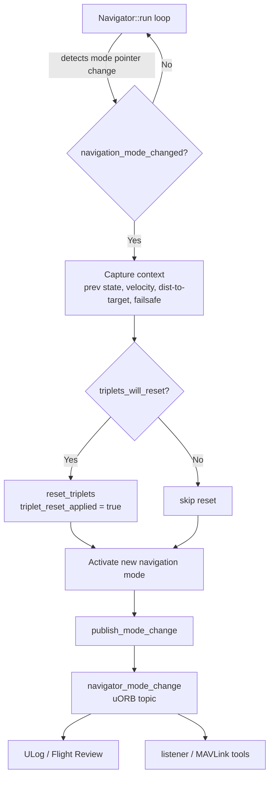
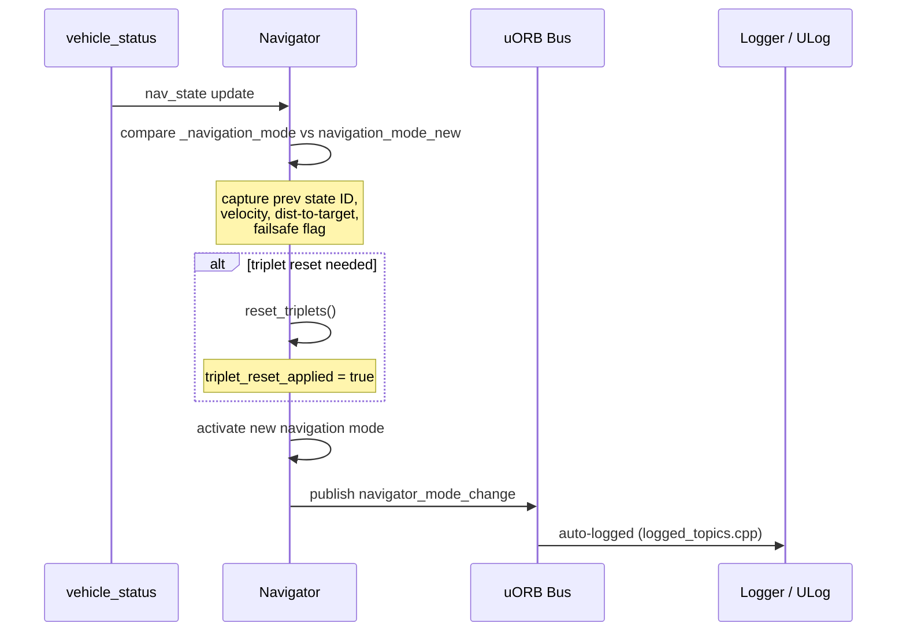
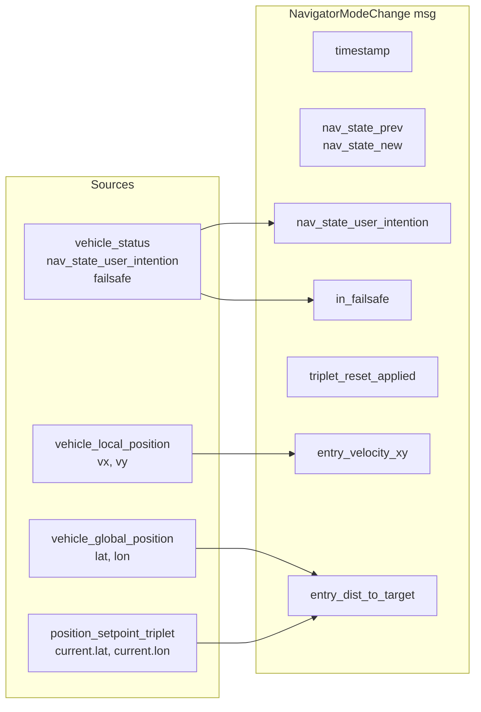
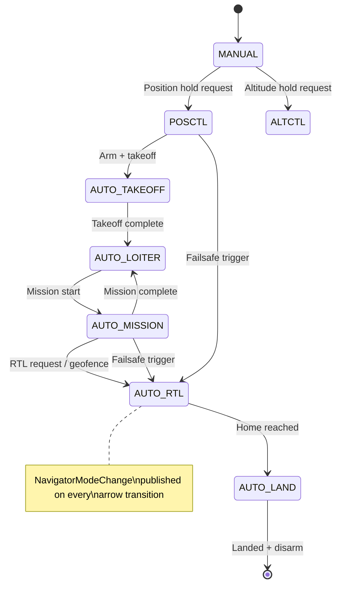

# Navigator Mode Change Telemetry

## Overview

This feature adds structured, machine-readable telemetry for navigator mode transitions in PX4-Autopilot. Every time the vehicle switches navigation modes (e.g., Takeoff → Loiter, Mission → RTL, Position Hold → Failsafe), a new `NavigatorModeChange` uORB message is published and automatically recorded to ULog.

Previously, mode transitions were either silent or only visible through scattered MAVLink text messages, making post-flight analysis of unexpected mode changes difficult. This feature gives engineers a precise, timestamped record of every transition with full flight context captured at the moment it occurs.

---

## Architecture


```mermaid
flowchart TD
    A[Navigator::run loop] -->|detects mode pointer change| B{navigation_mode_changed?}
    B -- No --> A
    B -- Yes --> C[Capture context\nprev state, velocity, dist-to-target, failsafe]
    C --> D{triplets_will_reset?}
    D -- Yes --> E[reset_triplets\ntriplet_reset_applied = true]
    D -- No --> F[skip reset]
    E --> G[Activate new navigation mode]
    F --> G
    G --> H[publish_mode_change]
    H --> I[navigator_mode_change\nuORB topic]
    I --> J[ULog / Flight Review]
    I --> K[listener / MAVLink tools]
```

---

## Mode Transition Flow


```mermaid
sequenceDiagram
    participant V as vehicle_status
    participant N as Navigator
    participant U as uORB Bus
    participant L as Logger / ULog

    V->>N: nav_state update
    N->>N: compare _navigation_mode vs navigation_mode_new
    Note over N: capture prev state ID,<br/>velocity, dist-to-target,<br/>failsafe flag
    alt triplet reset needed
        N->>N: reset_triplets()
        Note over N: triplet_reset_applied = true
    end
    N->>N: activate new navigation mode
    N->>U: publish navigator_mode_change
    U->>L: auto-logged (logged_topics.cpp)
```

---

## Data Flow: What Gets Recorded


```mermaid
flowchart LR
    subgraph Sources
        VS[vehicle_status\nnav_state_user_intention\nfailsafe]
        LP[vehicle_local_position\nvx, vy]
        GP[vehicle_global_position\nlat, lon]
        SP[position_setpoint_triplet\ncurrent.lat, current.lon]
    end

    subgraph NavigatorModeChange msg
        TS[timestamp]
        NS[nav_state_prev\nnav_state_new]
        UI[nav_state_user_intention]
        FS[in_failsafe]
        TR[triplet_reset_applied]
        VXY[entry_velocity_xy]
        DT[entry_dist_to_target]
    end

    VS --> UI
    VS --> FS
    LP --> VXY
    GP --> DT
    SP --> DT
```

---

## Navigation State Machine (simplified)


```mermaid
stateDiagram-v2
    [*] --> MANUAL
    MANUAL --> POSCTL : Position hold request
    MANUAL --> ALTCTL : Altitude hold request
    POSCTL --> AUTO_TAKEOFF : Arm + takeoff
    AUTO_TAKEOFF --> AUTO_LOITER : Takeoff complete
    AUTO_LOITER --> AUTO_MISSION : Mission start
    AUTO_MISSION --> AUTO_RTL : RTL request / geofence
    AUTO_MISSION --> AUTO_LOITER : Mission complete
    AUTO_RTL --> AUTO_LAND : Home reached
    AUTO_LAND --> [*] : Landed + disarm

    AUTO_MISSION --> AUTO_RTL : Failsafe trigger
    POSCTL --> AUTO_RTL : Failsafe trigger

    note right of AUTO_RTL : NavigatorModeChange\npublished on every\narrow transition
```

---

## What Changed

### New uORB Message: `NavigatorModeChange`

```
msg/NavigatorModeChange.msg
```

| Field | Type | Description |
|---|---|---|
| `timestamp` | `uint64` | Time since system start (microseconds) |
| `nav_state_prev` | `uint8` | Navigation state before transition |
| `nav_state_new` | `uint8` | Navigation state after transition |
| `nav_state_user_intention` | `uint8` | What the user intended at the time |
| `in_failsafe` | `bool` | Whether the vehicle was in failsafe |
| `triplet_reset_applied` | `bool` | Whether `reset_triplets()` was called on entry |
| `entry_velocity_xy` | `float32` | Horizontal ground speed at transition [m/s] |
| `entry_dist_to_target` | `float32` | Distance to current waypoint at transition [m], NaN if no valid target |

The message uses `NAV_STATE_NONE = 255` as a sentinel when no navigator mode is active (e.g., on the very first activation).

### Files Modified

| File | Change |
|---|---|
| `msg/NavigatorModeChange.msg` | New message definition |
| `msg/CMakeLists.txt` | Registers the new message in the build |
| `src/modules/navigator/navigator.h` | Adds publisher and `publish_mode_change()` declaration |
| `src/modules/navigator/navigator_main.cpp` | Detects transitions, captures context, calls publisher |
| `src/modules/logger/logged_topics.cpp` | Registers topic for automatic ULog recording |

---

## Design Decisions

**Why a uORB message instead of just debug logs?**  
Debug logs (`PX4_DEBUG`) are string-based, stripped in release builds, and cannot be queried programmatically after a flight. A uORB message is recorded at full fidelity in every ULog, can be parsed by Flight Review and custom scripts, and adds negligible overhead (one small struct publish per mode change, which is a rare event).

**Why capture velocity and distance-to-target?**  
Mode transitions that happen at high speed or far from the intended waypoint are the ones most likely to cause anomalous behavior. Having these values at the exact moment of transition — not reconstructed from nearby samples — makes debugging significantly more reliable.

**Why `nav_state_user_intention`?**  
Failsafe transitions overwrite `nav_state` but the user's intended state is preserved separately in `vehicle_status`. Recording both makes it immediately clear whether a transition was commanded or automatic.

**Why `triplet_reset_applied`?**  
Whether `reset_triplets()` was called on mode entry has a direct effect on vehicle path behavior. Logging it eliminates a common ambiguity during post-flight investigation.

---

## Usage

### Viewing in Flight Review

After uploading a ULog, search for the `navigator_mode_change` topic. Each row is one transition event.

### Parsing with Python (pyulog)

```python
from pyulog import ULog

log = ULog('flight.ulg')
mode_changes = log.get_dataset('navigator_mode_change')

for i, ts in enumerate(mode_changes.data['timestamp']):
    print(f"{ts/1e6:.3f}s  {mode_changes.data['nav_state_prev'][i]} -> "
          f"{mode_changes.data['nav_state_new'][i]}  "
          f"failsafe={bool(mode_changes.data['in_failsafe'][i])}  "
          f"v_xy={mode_changes.data['entry_velocity_xy'][i]:.1f} m/s")
```

### Example Output

```
12.541s   0 -> 3   failsafe=False  v_xy=0.0 m/s
47.382s   3 -> 4   failsafe=False  v_xy=4.2 m/s
91.017s   4 -> 5   failsafe=True   v_xy=6.8 m/s
```

---

## Building

No special build flags required. The message and topic are included in all standard build targets.

```bash
make px4_sitl_default
```

---

## Testing

Run the existing navigator unit tests to verify no regressions:

```bash
make tests TESTFILTER=navigator
```

To manually verify telemetry output in SITL:

```bash
make px4_sitl_default gazebo-classic_iris
# In the PX4 shell:
listener navigator_mode_change
```

---

## Motivation

During post-flight analysis of autonomous missions, determining *why* a vehicle transitioned out of a mission or into failsafe often required correlating multiple log topics by hand. This feature collapses that into a single, purpose-built record: one row per transition, with all relevant context already joined.
