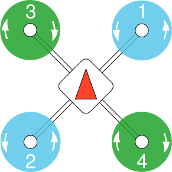
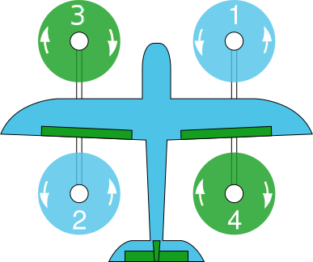
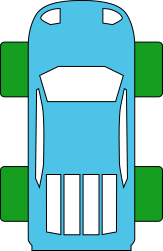

<p align="center">
  <a href="https://px4.io">
    
  </a>
</p>

[](https://github.com/PX4/PX4-Autopilot/releases) [](https://zenodo.org/badge/latestdoi/22634/PX4/PX4-Autopilot)

<p align="center">
  <a href="https://github.com/PX4/PX4-Autopilot/releases"></a>
  <a href="https://www.bestpractices.dev/projects/6520"></a>
  <a href="https://zenodo.org/badge/latestdoi/22634/PX4/PX4-Autopilot"></a>
  <a href="https://github.com/PX4/PX4-Autopilot/actions/workflows/build_all_targets.yml"></a>
  <a href="https://discord.gg/dronecode"></a>
</p>

---

## About

PX4 is an open-source autopilot stack for drones and unmanned vehicles. It supports multirotors, fixed-wing, VTOL, rovers, and many more experimental platforms from racing quads to industrial survey aircraft. It runs on [NuttX](https://nuttx.apache.org/), Linux, and macOS. Licensed under [BSD 3-Clause](LICENSE).

## Why PX4

**Modular architecture.** PX4 is built around [uORB](https://docs.px4.io/main/en/middleware/uorb.html), a [DDS](https://docs.px4.io/main/en/middleware/uxrce_dds.html)-compatible publish/subscribe middleware. Modules are fully parallelized and thread safe. You can build custom configurations and trim what you don't need.

**Wide hardware support.** PX4 runs on a wide range of [autopilot boards](https://docs.px4.io/main/en/flight_controller/) and supports an extensive set of sensors, telemetry radios, and actuators through the [Pixhawk](https://pixhawk.org/) ecosystem.

**Developer friendly.** First-class support for [MAVLink](https://mavlink.io/) and [DDS / ROS 2](https://docs.px4.io/main/en/ros2/) integration. Comprehensive [SITL simulation](https://docs.px4.io/main/en/simulation/), hardware-in-the-loop testing, and [log analysis](https://docs.px4.io/main/en/log/flight_log_analysis.html) tools. An active developer community on [Discord](https://discord.gg/dronecode) and the [weekly dev call](https://docs.px4.io/main/en/contribute/).

**Vendor neutral governance.** PX4 is hosted under the [Dronecode Foundation](https://www.dronecode.org/), part of the Linux Foundation. Business-friendly BSD-3 license. No single vendor controls the roadmap.

## Supported Vehicles

<table>
  <tr>
    <td align="center">
      <a href="https://docs.px4.io/main/en/frames_multicopter/">
        <br>
        <sub>Multicopter</sub>
      </a>
    </td>
    <td align="center">
      <a href="https://docs.px4.io/main/en/frames_plane/">
        <br>
        <sub>Fixed Wing</sub>
      </a>
    </td>
    <td align="center">
      <a href="https://docs.px4.io/main/en/frames_vtol/">
        <br>
        <sub>VTOL</sub>
      </a>
    </td>
    <td align="center">
      <a href="https://docs.px4.io/main/en/frames_rover/">
        <br>
        <sub>Rover</sub>
      </a>
    </td>
  </tr>
</table>

<sub>…and many more: helicopters, autogyros, airships, submarines, boats, and other experimental platforms. These frames have basic support but are not part of the regular flight-test program. See the <a href="https://docs.px4.io/main/en/airframes/airframe_reference.html">full airframe reference</a>.</sub>

## Quick Start

```bash
git clone https://github.com/PX4/PX4-Autopilot.git --recursive
cd PX4-Autopilot
make px4_sitl
```

> [!NOTE]
> See the [Development Guide](https://docs.px4.io/main/en/development/development.html) for toolchain setup and build options.

## Documentation & Resources

| Resource | Description |
| --- | --- |
| [User Guide](https://docs.px4.io/main/en/) | Build, configure, and fly with PX4 |
| [Developer Guide](https://docs.px4.io/main/en/development/development.html) | Modify the flight stack, add peripherals, port to new hardware |
| [Airframe Reference](https://docs.px4.io/main/en/airframes/airframe_reference.html) | Full list of supported frames |
| [Autopilot Hardware](https://docs.px4.io/main/en/flight_controller/) | Compatible flight controllers |
| [Release Notes](https://docs.px4.io/main/en/releases/) | What's new in each release |
| [Contribution Guide](https://docs.px4.io/main/en/contribute/) | How to contribute to PX4 |

## Community

- **Weekly Dev Call** — open to all developers ([Dronecode calendar](https://www.dronecode.org/calendar/))
- **Discord** — [Join the Dronecode server](https://discord.gg/dronecode)
- **Discussion Forum** — [PX4 Discuss](https://discuss.px4.io/)
- **Maintainers** — see [`MAINTAINERS.md`](MAINTAINERS.md)
- **Contributor Stats** — [LFX Insights](https://insights.lfx.linuxfoundation.org/foundation/dronecode)

## Contributing

We welcome contributions of all kinds — bug reports, documentation, new features, and code reviews. Please read the [Contribution Guide](https://docs.px4.io/main/en/contribute/) to get started.

## Governance

The PX4 Autopilot project is hosted by the [Dronecode Foundation](https://www.dronecode.org/), a [Linux Foundation](https://www.linuxfoundation.org/) Collaborative Project. Dronecode holds all PX4 trademarks and serves as the project's legal guardian, ensuring vendor-neutral stewardship — no single company owns the name or controls the roadmap. The source code is licensed under the [BSD 3-Clause](LICENSE) license, so you are free to use, modify, and distribute it in your own projects.

## Project Governance

The PX4 Autopilot project including all of its trademarks is hosted under [Dronecode](https://www.dronecode.org/), part of the Linux Foundation.

<a href="https://www.dronecode.org/" style="padding:20px" ></a>
<div style="padding:10px">&nbsp;</div>

## Auterion customizations (APX4 flavor)

[Latest squashed APX4 flavor commit right after branching off 3.2](https://github.com/Auterion/PX4_firmware_private/commit/0f400065fe39ad6533aef368581989a7c22b0663#diff-1da3cb9d91b3afe9d44c6282cfaa947fb04543aff7fe8cacea7fd662fb7301bbR11).
The current diff can diverge from this commit (from commits between last squash and current head).

The "Diff summary" string should be placed in a comment in the code, e.g.

```// APX4 flavor: vtol_defaults: MIS_TKO_LAND_REQ default to 5```

Note: as we squash the history on every relese the comments have to be in code, not in the commits.

### CI/Workflows
| Diff summary | Description | Reason | Comments |
|---|---|---|---|
| checks: Only for v5x, v6x | | we do not care about other boards | v6s as well, though its just a variant of v6x for skynode-s |
| build targets: add develop branch | | develop is our main development branch ||
| runs on: remove spt=false | Switch between spot and dedicated AWS instance types | Spot instances are cheaper, with short jobs are unlikely to be interrupted. Unless causes issues, stay with spot instead of dedicated instances ||
| add AUTERION_CI_ACCESS_TOKEN | | Ability to pull/push to Auterion private repos ||
| add submodules: recursive | | ? ||
| add AUTERION_BOARDS | add relevant boards (v5x, v6x, v6s) |  ||
| add restricted build | aka production build (disable some options like param setting) | production builds are deployed by projects to restrict how much the user can configure ||
| Remove upload to S3 | | We have not use for it ||
| Add secrets.GITHUB_TOKEN | | ||
| branches: - '**' instead of  - '*' | | | could be upstreamed |
| name: disable the keychain credential helper | | Deprecated. Update to v4 ASAP ||
| remove upload coverage | | ||
| remove compile_macos | | We don't care about compiling on mac ||
| compile_ubuntu, dev_container, flash_analysis, sitl_tests: runs-on: ubuntu-latest | | ||
| Add deploy_customer_repo | Create release branch in customer repos | tool to automatically push release branch to customer APX4 repos ||
| ekf_functional_change_indicator: disable the keychain credential helper | | Deprecated. Update to v4 ASAP  ||
| MAVROS mission test: remove upload coverage | | ||
| Add pr_github_label_title | Prefix PR title with [release/<version>] for PR's to release branches | Handy to differentiate release backports from other PRs | Could be upstreamed |
| Add: Build and deploy APX4 release | for v5x_default, v6x_default, v6s_default, v5x_performance-test, v6x_performance-test, v6s_performance-test, v6x_bootloader, v6s_bootloader, v6s_gcs. Dev and prod builds. Make PR against OS to update APX4.  |  ||
| Add Release ROS2 messages | | ||
| sitl_tests: change build_type for standard_vtol to RelWithDebInfo | | ? ||
| Sync ROS2 messages | | ||
| Add sync_to_release_repo | Sync PX4 Release Tags & Branches to Public Repo | ||
| Add sync_with_upstream | automatic upstream merge PR, every Monday | We want to keep develop in sync with upstream/main, and thus merge main once a week. ||
| JenkinksfileAuterionCI: add RepoPipeline {} | | ||
| test/mavsdk: add comment: the test with \"SYS_MC_EST_GROUP\": 3 is disabled because COM_ARM_WO_GPS is 0 by default" | | ||
| disable Fuzztesting | | ||
| disable dev container deployment | | ||
| Jammy CI | Upload prod, dev debs to Jammy as well, and open AuterionOS PR to jammy branch. | |  |
| increase build speed by re-add runs-on 8cores | | |  |
| ark_fmu-v6x | add arkjetson FMU to release deb | | |
| FLASH analysis | use auterion_fmu-v6x instead of px4_fmu-v6x | | |


### Boards, startup, configuration
| Diff summary | Description | Reason | Comments |
|---|---|---|---|
| Add ark/v6x cmake upload | | | upstream it |
| v5x, v6x: disable some drivers to save flash | drivers of sensors that are not used withing Auterion and customers | save flash ||
| v5x, v6x, v6s: enable rover in default build | | to have rover support without separate APX4 binary | not possible upstream due to tighter flash constrains |
| v5x: External components flashing | COM_EXT_COMP_EN |  | can it be upstreamed? |
| v5, v6x: Update default IP config if needed | netman update_default -i eth0 | ||
| v5x, v6x: mavlink: MAV_S_FORWARD | add new param MAV_S_FORWARD, and add -f to mavlink start if MAV_S_FORWARD is set  | ||
| v5x, v6x, v6s: mavlink: MAV_S_MODE | add new param MAV_S_MODE to control the mavlink profile between SOM and FMU | Auterion specific feature, not relevant for non-Skynode setups ||
| v5x, v6x: various changes in nsh/defconfig | | | we need it for HW testing, could be moved to recovery |
| v5x: add main_toc | image signiture? |  | is not used atm, can drop it |
| v5x_test: disable CONFIG_DRIVERS_SMART_BATTERY_BATMON |  | | remove, unless flash issue, check batmon can be removed upstream as well |
| Add v6s board config etc |  | Skynode S support | can't be upstreamed at this point for IP protection |
| v6x: enable SIH in defaut build | CONFIG_MODULES_SIMULATION_SIMULATOR_SIH=y | we want same features on v5x as v6x, and SIH is handy for devs | not possible upstream due to tighter flash constraints |
| ROMFS: remove some non-generic airframe files | of vehicles that are likely not used by Auterion customers | save flash ||
| rcS - also check for /new, not just for /ext_autostart | | airframe injection: we changed the name recently from /new to /ext_autostart | link to OS PR |
| v5x/v6s arkv6x boards: add Septentrio | CONFIG_DRIVERS_GNSS_SEPTENTRIO=y | Not possible to bring to main atm due to flash | |
| ark_fmu-v6x | rc.board_defaults customizations for arkjetson | Changes specific to integration between ark_fmu-v6x and arkjetson MC | |
|v5x/v6x/arkv6x: enable Figure of Eight|CONFIG_FIGURE_OF_EIGHT=y|Not enabled upstream due to QGC lacking this feature and flash constraints||
|ark v6x: disable MAV_2_CONFIG to fix SOM-FMU dropouts||When you connect the ARK v6x FMU to a baseboard with PHY it is reasonable to have this MAVLink instance, and our baseboard (the ARKJetson) does not offer a PHY so it does not make sense to start something on UDP||
| Fuel engine support in vanilla APX4 | add required modules to v5x, v6x, v6s and ark v6x | kept as flavor due to flash constraints |  |
| px4_fmu-v6x compile target removed | so that the correct auterion_fmu-v6x target is used | | |
| ark_fmu-v6x | GYRO_FFT removed, SIMULATION_SIMULATOR_SIH=y | SIH needed for POI simulation, removed GYRO_FFT to remove flash | | |

### Drivers
| Diff summary | Description | Reason | Comments |
|---|---|---|---|
| SDP3X startup| continously keep probing, sdp3x start -X -k | |  | drop customization and use upstream |
| UAVCAN: add check for firmware in the ext_autostart directory, move it to appropriate location on SD card | This is the location where OEMs can store UAVCAN firmware binaries and PX4 will update the corresponding UAVCAN peripherals with it |  | Can be upstreamed |
| distance sensors: remove some sensors that are not used by Auterion products | | save flash ||
| mag: remvoe  DRIVERS_MAGNETOMETER_ISENTEK_IST8308| | save flash ||
| mag: add cross axis compensation from device for ist8310 | | improved behavior - can't be upstreamed due to agreement with manufacturer? | |
| gps: GPS_CFG_WIPE 1 | causes the configuration FLASH to be wiped on every boot for u-blox GPS devices | our customers need a defined GPS configuration that always works. We experienced crashes when customers modified their configuration and forgot to restore it. This kind of error is prevented by wiping the FLASH on each boot ||
| payload_board: driver to receive status of payload boards | | can't be upstreamed due to agreement with manufacturer ||

### GNC
Board support
| Diff summary | Description | Reason | Comments |
|---|---|---|---|
| vtol_defaults: MIS_TKO_LAND_REQ default to 5 | | only Auterion has VTOL landing workflow ||
| vtol_defaults: RTL_TYPE to 0, RTL_APPR_FORCE to 1 | | only Auterion has VTOL landing workflow ||
| f7, h7: disable multi EKF | remove setting of EKF2_MULTI_IMU 3, remove setting of SENS_IMU_MODE to 0| ||
| f7: do not enable gyro fft | remove IMU_GYRO_FFT_EN 1 |  ||
| f7: do not enable CAN by default | remove UAVCAN_ENABLE 2| To reduce unnecessary resource usage ||
| Commander: by default require GPS | COM_ARM_WO_GPS to 0 | We by default want to prevent flying without GNSS ||
| By default disable Gyro auto cal| IMU_GYRO_CAL_EN to 0 | ? ||
| MavlinkMissionManager: clear_rally_points_with_approaches | |  ||
| Mission: try to restore previous mission if current mission is invalid and has some mission items. | |  ||
| GPS denied: created a singular param (COM_DLL_NAV_CTL) to determine how to reset nav fusion on link loss | On link loss depending on the value of our new param, GNSS and AGP fusion can be reset or disabled | Depending on the environment the user may want to fallback to specific navigation mode in event of a link loss, for example in GNSS denied environments they may want to revert to AGP fusion only, to avoid spoofed or invalid GNSS estimates. | ||

### Miscellaneous
| Diff summary | Description | Reason | Comments |
|---|---|---|---|
| PR template | | We want PR with JIRA link ||
| Labeler | | We want the APX4 version label in the PR appearing ||
| Tools: pre-push hook for not pushing apx4 to upstream | |  | Is this even working still? |
| Tools: setting nsh password optio | |  ||
| Tools: test_keys.json | |  ||
| Tools: allyesconfig.py: disble SYSTEMCMDS_MFT_CFG | disable manufactoring tool in SITL |  ||
| Tools: signtool |  test input to the sign function if not run from CLI |  | what is that? |
| debian | compat, config_package.py, control.em |  ||
| msg/LogMessamge.msg: add log_message_incoming | |  ||
| workqueue manager: increst stack of lp_default | for using LittleFS on Skynode S | ||
| add expample: external update checker | also new health check in Commander | | needs to be checked if still needed |
| Commander: change sched. priority | SCHED_PRIORITY_MAX - 24 instad of +40 | | [Original commit](https://github.com/Auterion/PX4_firmware_private/commit/1546d3393ecf1d2fdef55fb5fa48b7090a46fe56) |
| logger: add logging of camera_settings | | ||
| logger: add option to not log position data | SDLOG_NO_POS_DAT | ||
| mavlink streams: add OPEN_DRONE_ID_BASIC_ID | | ||
| mavlink: rename OPEN_DRONE_ID_SYSTEM to OPEN_DRONE_ID_BASIC_ID | and remove OPEN_DRONE_ID_ARM_STATUS |  ||
| mavlink parameters: add restricted build | whitelist certain params for the restricted build and do not map RC to params there |  ||
| mavlink parameters: incrase default for MAV_RADIO_TOUT from 5 to 25 | | to reduce TIMEOUT warnings e.g. on SIYI ||
| mavlink receiver: add pilot login message | publishes on log_message_incoming |  ||
| mavlink receiver: increase MAX_REMOTE_COMPONENTS from 16 to 32  |  |  | [Original PR](https://github.com/Auterion/PX4_firmware_private/pull/2302#pullrequestreview-1368310363) |
| mavlink timesync: ignore something |Herelink ground station keeps requesting to timesync by using MAV_COMP_ID_SYSTEM_CONTROL (Deprecated since 2018-11) as ID. |  ||
| MAV_${i}_RADIO_CTL: default to false |  |  ||
| systemcmds: add mtf_cfg |  |  ||
| systemcmds: netman: add update_default | Update stored config to new defaults (if set to previous defaults) |  ||
| export GAZEBO_MODEL_DATABASE_URI=http://simulation-models.tools.auterion.dev/ | |  | I think that can be removed |
| custom feasiblity check to disallow NAV_CMD_TAKEOFF and NAV_CMD_LAND for VTOL | | Not an auterion workflow, AMC does not allow it    ||
| CellularStatus.msg: add extension fields | | Not yet in mavlink/mavlink | PR added: https://github.com/Auterion/PX4_firmware_private/pull/2907 |
| Additional topics for uXRCE-DDS client | Adds /fmu/out/vehicle_acceleration, /fmu/out/vehicle_thrust_setpoint and /fmu/out/hover_thrust_estimate | Required by mc-follow and fw-landing | |
| Secure mode | Option to clear land approaches, missions and home position when landed to prevent getting GCS/start location on a landed vehicle. Also disables serial console.|  ||
| MAVLink parameters: add parameter to control access to params in prod | MAV_PARAM_LOCK |  | https://github.com/Auterion/PX4_firmware_private/pull/3041 |
