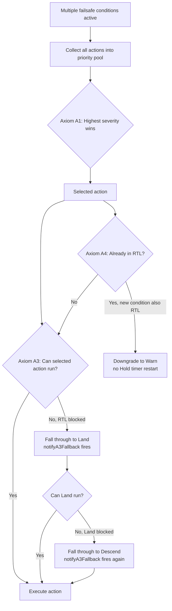
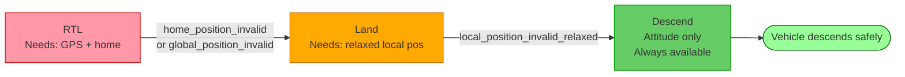
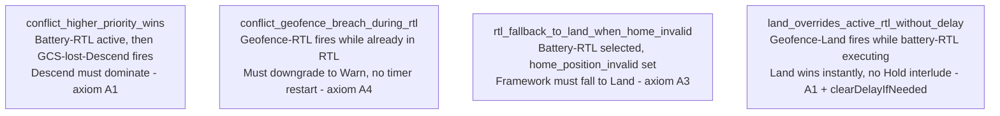

# PX4-Autopilot — Failsafe Priority Framework: Documentation, Tests & A3 Fallback Notification

> **This is a contribution fork of [PX4/PX4-Autopilot](https://github.com/PX4/PX4-Autopilot)** (11k+ stars, the industry-standard open-source drone autopilot stack).
> The contribution is documented below. For general PX4 documentation, see the upstream repo.

---

## Contribution: Failsafe Priority Framework Hardening

**Status:** `Open PR upstream` → [PX4/PX4-Autopilot #PENDING](#)

**What I built:** Comprehensive documentation, unit tests, and an operator-facing notification system for PX4's failsafe priority resolution framework — the safety-critical subsystem that decides what a drone does when multiple failure conditions occur simultaneously (e.g., low battery *and* geofence breach *and* GPS loss).

**Problem it solves:** The failsafe framework applies five undocumented priority axioms (A1–A5) to resolve conflicting conditions. Without inline documentation or tests, the behavior of edge cases — like "what happens if RTL is selected but there's no home position?" — was opaque and untestable. Additionally, when the framework silently degraded from RTL to Land due to GPS loss, operators received no notification. This contribution:
- Documents the priority axioms with concrete worked examples inline in the code
- Adds 4 unit tests covering the highest-risk conflict scenarios
- Adds operator-facing MAVLink/GCS notification when a safety fallback occurs
- Adds a Python log validator to verify fallback behavior from flight recordings

### Files Changed

| File | Change |
|---|---|
| [`src/modules/commander/failsafe/failsafe.cpp`](src/modules/commander/failsafe/failsafe.cpp) | Inline comments documenting priority axioms with worked examples |
| [`src/modules/commander/failsafe/failsafe_test.cpp`](src/modules/commander/failsafe/failsafe_test.cpp) | 4 new unit tests + `FailsafeTesterWithFallbackCapture` test fixture |
| [`src/modules/commander/failsafe/framework.cpp`](src/modules/commander/failsafe/framework.cpp) | A3 fallback event emission, competing-conditions diagnostic, A3 chain comments |
| [`src/modules/commander/failsafe/framework.h`](src/modules/commander/failsafe/framework.h) | `notifyA3Fallback()` virtual method declaration |
| [`src/modules/commander/failsafe/validate_a3_fallback_log.py`](src/modules/commander/failsafe/validate_a3_fallback_log.py) | Python post-flight log validator for A3 fallback chain |

---

## The Priority Axiom System

The failsafe framework uses five axioms to resolve conflicts. These were implicit before this contribution — now documented inline.



### Axiom Reference

| Axiom | Rule | Example |
|---|---|---|
| **A1** | Highest severity action always wins | Battery-Land (sev 7) beats Geofence-RTL (sev 6) |
| **A3** | If selected action can't run, fall through to next less severe | RTL → Land when `home_position_invalid`; Land → Descend when local position lost |
| **A4** | If already executing RTL, new RTL-level condition downgrades to Warn | Geofence-RTL fires during battery-RTL → Warn only, no restart |
| **A5** | Independent conditions add to pool, framework picks winner | Battery + Geofence both add their action; A1 resolves |

---

## A3 Fallback Chain

The most safety-critical path: what happens when the preferred action can't execute.



When any fallback occurs, `notifyA3Fallback()` fires **exactly once per worsening step** and sends:
- A `PX4_DEBUG` trace
- A `mavlink_log_critical` message visible in QGroundControl
- A structured `events::send` with human-readable action names (e.g., *"Failsafe: RTL not available, falling back to Land"*)

The anti-spam guard (`action > _selected_action`) ensures the event fires at most once per degradation step, never repeatedly during steady-state.

---

## New Unit Tests



### Test: `conflict_higher_priority_wins` — Axiom A1

```
Battery remaining low → Hold (delay) → RTL (sev 6)
GCS connection lost fires → Descend (sev 8)
Expected: Descend dominates immediately
GCS reconnects → Falls back to RTL
```

### Test: `rtl_fallback_to_land_when_home_invalid` — Axiom A3

```
Battery low + home_position_invalid both set
Hold delay expires → RTL selected by priority
RTL cannot run (no home) → framework falls to Land
Expected: selectedAction() == Land
```

### Test: `land_overrides_active_rtl_without_delay` — A1 + clearDelayIfNeeded

```
Battery-RTL already executing (_selected_action = RTL)
Geofence breach → Land (sev 7) fires
clearDelayIfNeeded() zeroes delay immediately (RTL > Hold)
Expected: Land on same cycle, no Hold interlude
```

---

## Post-Flight Log Validation

The new `validate_a3_fallback_log.py` script validates that A3 fallback events appear the correct number of times in a ULog — catching regressions in the anti-spam guard.

```bash
# Validate a flight log (GPS loss scenario → expects exactly 2 fallback events)
python3 src/modules/commander/failsafe/validate_a3_fallback_log.py path/to/flight.ulg

# Validate with specific expected count (e.g. GPS-only loss → 1 event)
python3 validate_a3_fallback_log.py flight.ulg --expected-count 1

# CI self-test
python3 validate_a3_fallback_log.py --self-test-allow-regression
```

**Example output:**
```
[OK] Found 2 'commander_failsafe_a3_fallback' event(s) – expected 2.
     Emission 1: RTL → Land  (t=47.382s)
     Emission 2: Land → Descend  (t=91.017s)
```

---

## Why This Matters for Safety

The failsafe framework is activated in emergencies — GPS loss over water, battery critical during autonomous mission, geofence breach at high speed. A silent degradation from RTL to Land (because GPS was lost mid-RTL) left operators unaware that the vehicle's behavior had changed. This contribution ensures:

1. **Operators are notified** the moment a fallback occurs via QGroundControl alert
2. **The behavior is documented** so future contributors understand the priority rules
3. **The behavior is tested** — 4 new tests covering the highest-risk conflict scenarios
4. **Flight logs are verifiable** — the Python tool confirms fallback events appear as expected

---

## Running Tests

```bash
make tests TESTFILTER=failsafe
```

All 4 new tests plus existing failsafe tests must pass.

---

*For full PX4 build instructions and documentation, see the [upstream repository](https://github.com/PX4/PX4-Autopilot).*
