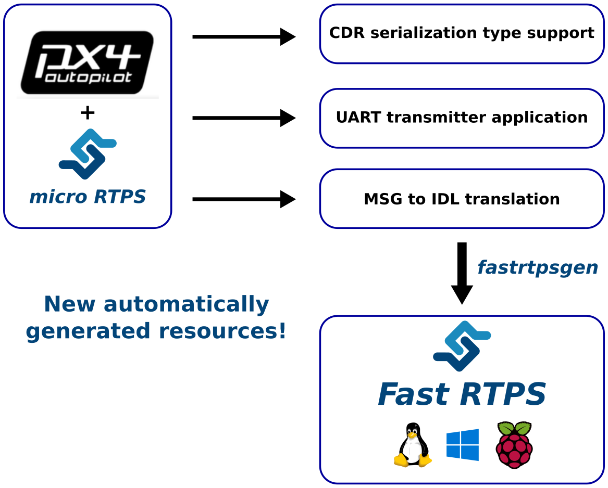
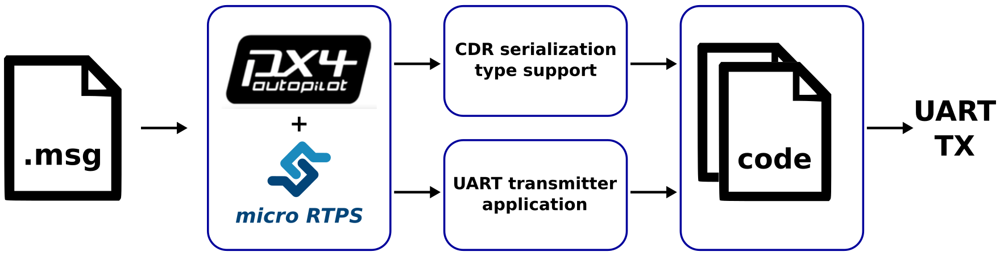
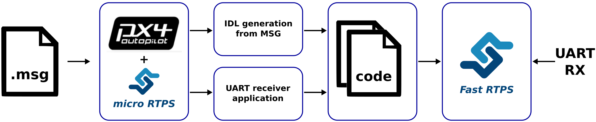

# PX4-FastRTPS bridge


This bridge add communication capabilities between a **PX4 Autopilot** and a **Fast RTPS** application through serial ports or sockets UDP using **CDR serialization**, aims to get information from a drone and carry to the DDS world through **Fast RTPS** and put information into the drone from DDS as same manner.



## Automatic code generation

The support for the new functionality added is mainly carried on inside three new (automatic generated) code blocks.

-  It's added a CDR serialization support directly on the original type support of the uORB topic adding a new interface to the code that do this directly. For *sensor_combined.msg* topic looks like this:

  ```sh
  void serialize_sensor_combined(const sensor_combined_s *input, char *output, uint32_t *length);
  void deserialize_sensor_combined(struct sensor_combined_s *output, char *input);
  ```

-  We have the capability under demand of the generation of an application to send and receive, through a selected UART or selected UDP ports, the serializated info from several topics (*miroRTPS_client.cpp*).



-  We also have the capacity of generate automatically the support for the other side of the communication, **Fast RTPS** through auto generated *microRTPS_agent.cxx* application and .idl files for demanded topics. For the case of *sensor_combined* topic it's generated *sensor_combined_.idl* file.



-  This covers the entire spectrum of communications.


The code for extended topic support is generated within the normal PX4 Firmware generation process. The other will be generated under demand calling the script **generate_microRTPS_bridge.py** placed in *Tools* folder, see section below.

### Generate and installing the client and the agent

**NOTE**: Before continue we need to have installed Fast RTPS. Visit its installation [manual](http://eprosima-fast-rtps.readthedocs.io/en/latest/sources.html) for more information.

To generate and install the code for the client (PX4 side) and the agent (Fast RTPS side) we need to execute the python script **generate_microRTPS_bridge.py** hosted in *Tools* folder.

  ```sh
  $ cd /path/to/PX4/Firmware
  $ python Tools/generate_microRTPS_bridge.py -h
  usage: generate_microRTPS_bridge.py [-h] [-s *.msg [*.msg ...]]
                                      [-r *.msg [*.msg ...]] [-a] [-c]
                                      [-t MSGDIR] [-o AGENTDIR] [-u CLIENTDIR]
                                      [-f FASTRTPSGEN]

  optional arguments:
    -h, --help            show this help message and exit
    -s *.msg [*.msg ...], --send *.msg [*.msg ...]
                          Topics to be sended
    -r *.msg [*.msg ...], --receive *.msg [*.msg ...]
                          Topics to be received
    -a, --agent           Flag for generate the agent, by default is true if -c
                          is not specified
    -c, --client          Flag for generate the client, by default is true if -a
                          is not specified
    -t MSGDIR, --topic-msg-dir MSGDIR
                          Topics message dir, by default msg/
    -o AGENTDIR, --agent-outdir AGENTDIR
                          Agent output dir, by default micrortps_agent/
    -u CLIENTDIR, --client-outdir CLIENTDIR
                          Client output dir, by default,
                          src/examples/micrortps_client
    -f FASTRTPSGEN, --fastrtpsgen-dir FASTRTPSGEN
                          fastrtpsgen installation dir, by default /bin
  ```

 - The argument **--send/-s** means that the application from PX4 side will send these messages, and the argument **--receive/-r** specifies which messages is going to be received.

 - The output appears in CLIENTDIR (**-o src/examples/micrortps_client**, by default) and in the AGENTDIR (**-u micrortps_agent**, by default). **CAUTION**: This script erase the content of the CLIENTDIR and the AGENTDIR before create new files and folders.

 - If no flag **-a** or **-c** is specified, both the client and the agent will be generated and installed.

 - The **-f** option may be needed if *Fast RTPS* was installed in other path different to default one (*-f /path/to/fastrtps/installation/bin*).

An example of use:

  ```sh
  $ cd /path/to/PX4/Firmware
  $ python Tools/generate_microRTPS_bridge.py -s msg/sensor_baro.msg -r msg/sensor_combined.msg
  ```
Checking the correct installation:

  ```sh
  $ tree micrortps_agent
  micrortps_agent
  ├── build
  ├── CMakeLists.txt
  ├── idl
  │   ├── sensor_baro_.idl
  │   └── sensor_combined_.idl
  ├── microRTPS_agent.cxx
  ├── microRTPS_transport.cxx
  ├── microRTPS_transport.h
  ├── RtpsTopics.cxx
  ├── RtpsTopics.h
  ├── sensor_baro_.cxx
  ├── sensor_baro_.h
  ├── sensor_baro_Publisher.cxx
  ├── sensor_baro_Publisher.h
  ├── sensor_baro_PubSubTypes.cxx
  ├── sensor_baro_PubSubTypes.h
  ├── sensor_combined_.cxx
  ├── sensor_combined_.h
  ├── sensor_combined_PubSubTypes.cxx
  ├── sensor_combined_PubSubTypes.h
  ├── sensor_combined_Subscriber.cxx
  └── sensor_combined_Subscriber.h

  2 directories, 20 files
  ```
  ```sh
  $ tree src/examples/micrortps_client
  src/examples/micrortps_client
  ├── CMakeLists.txt
  ├── microRTPS_client.cpp
  ├── microRTPS_transport.cxx
  └── microRTPS_transport.h

  0 directories, 4 files
  ```

PX4 Firmware: the micro RTPS client
-----------------------------------

On the *PX4* side, it will be used an application running as a uORB node and as a micro RTPS node at same time. This applicatgion as uORB node could be subscribed to a several topics as well as publish under internal uORB topics. The application receive from a internal publishers the messages, serializes the struct and writes it trough an UART device or UDP port selected by the user. Also will be reading from the UART device or UDP port and then publish the info to the internal subscribers.

Steps to use the auto generated application:

-  Uncomment or add the line *examples/micrortps_client* in cmake configs to compile this application along the **PX4** firmware. For the *Pixracer* platform we found this in *cmake/configs/nuttx_px4fmu-v4_default.cmake* file and for the *Snapdragon Flight* platform we found it in *cmake/configs/posix_sdflight_default.cmake*:

  ```sh
  # eProsima app
  examples/micrortps_client
  ```

-  Construct and upload the firmware executing, for example:

  ```sh
  # For Pixracer:
  $ make px4fmu-v4_default upload
  # For Snapdragon Flight:
  $ make eagle_default upload
  ```

After uploading the firmware, the application can be launched typing its name and passing an variable number of arguments as shown bellow:

  ```sh
  > micrortps_client start|stop [options]
    -t <transport>          [UART|UDP] Default UART
    -d <device>             UART device. Default /dev/ttyACM0
    -u <update_time_ms>     Time in ms for uORB subscribed topics update. Default 0
    -l <loops>              How many iterations will this program have. -1 for infinite. Default 10000
    -w <sleep_time_ms>      Time in ms for which each iteration sleep. Default 1ms
    -b <baudrate>           UART device baudrate. Default 460800
    -p <poll_ms>            Time in ms to poll over UART. Default 1ms
    -r <reception port>     UDP port for receiving. Default 2019
    -s <sending port>       UDP port for sending. Default 2020

  > micrortps_client start #by default -t UART -d /dev/ttyACM0 -u 0 -l 10000 -w 1 -b 460800 -p 1
  ```

**NOTE**: If the UART port selected is busy, it's possible that Mavlink applications were using them. If it is the case, you can stop Mavlink from NuttShell typing:

  ```sh
  > mavlink stop-all
  ```
## Fast RTPS: the micro RTPS agent

The *Fast RTPS* side will be explained taking a *Raspberry Pi* board to run an application as example.

The application have several functions and possibilities of use: get the sensor data from a system that is using the *PX4 Firmware* (obtaining the information from the selected transport: UDP or UART), publish this to a *Fast RTPS* environment and, in the other direction, to send through the selected transport the information of topics that are expected in the *PX4* side with the info even from subscribed messages from *Fast RTPS* side.

Before runnning the application, it is needed to have installed Fast RTPS. Visit it installation [manual](http://eprosima-fast-rtps.readthedocs.io/en/latest/sources.html) for more information.

This section explains how create *Fast RTPS* applications using the files generated by **generate_microRTPS_bridge.py** and **fastrtpsgen** (this step performed inside install script) from *Fast RTPS*.

On the *Fast RTPS* side, it will be used an application running as a Fast RTPS node and as a micro RTPS node at same time. This application allow to launch RTPS publishers and subscribers that will be using the information coming from and sending to uORB topics in the PX4 side thanks to the autogenerated idl file from the original msg file. The publisher will read data from UART/UDP, deserializes it, and make a Fast RTPS message mapping the attributes from the uORB message. The subscriber simply receives the Fast RTPS messages and send in the reverse sequence to the PX4 side. The subscriber can be launched on the Raspberry Pi or in any another device connected in the same network.

For create the application, compile the code:

  ```sh
  $ cd /agent/installation/path/
  $ mkdir build && cd build
  $ cmake ..
  $ make
  ```

**NOTE**: To cross compile for Snapdragon Fligth platform you can see this [link](https://github.com/eProsima/PX4-FastRTPS-PoC-Snapdragon-UDP#how-to-use).

To launch the publisher run:

  ```sh
  $ ./micrortps_agent [options]
    -t <transport>          [UART|UDP] Default UART
    -d <device>             UART device. Default /dev/ttyACM0
    -w <sleep_time_us>      Time in us for which each iteration sleep. Default 1ms
    -b <baudrate>           UART device baudrate. Default 460800
    -p <poll_ms>            Time in ms to poll over UART. Default 1ms
    -r <reception port>     UDP port for receiving. Default 2019
    -s <sending port>       UDP port for sending. Default 2020

  $ ./micrortps_agent # by default -t UART -d /dev/ttyACM0 -w 1 -b 460800 -p 1
  ```

Now we can add some code to print some info on the screen, for example:

  ```sh
  void sensor_combined_Subscriber::SubListener::onNewDataMessage(Subscriber* sub)
  {
      // Take data
      if(sub->takeNextData(&msg, &m_info))
      {
          if(m_info.sampleKind == ALIVE)
          {
              cout << "\n\n\n\n\n\n\n\n\n\n";
              cout << "Received sensor_combined data" << endl;
              cout << "=============================" << endl;
              cout << "timestamp: " << msg.timestamp() << endl;
              cout << "gyro_rad: " << msg.gyro_rad().at(0);
              cout << ", " << msg.gyro_rad().at(1);
              cout << ", " << msg.gyro_rad().at(2) << endl;
              cout << "gyro_integral_dt: " << msg.gyro_integral_dt() << endl;
              cout << "accelerometer_timestamp_relative: " << msg.accelerometer_timestamp_relative() << endl;
              cout << "accelerometer_m_s2: " << msg.accelerometer_m_s2().at(0);
              cout << ", " << msg.accelerometer_m_s2().at(1);
              cout << ", " << msg.accelerometer_m_s2().at(2) << endl;
              cout << "accelerometer_integral_dt: " << msg.accelerometer_integral_dt() << endl;
              cout << "magnetometer_timestamp_relative: " << msg.magnetometer_timestamp_relative() << endl;
              cout << "magnetometer_ga: " << msg.magnetometer_ga().at(0);
              cout << ", " << msg.magnetometer_ga().at(1);
              cout << ", " << msg.magnetometer_ga().at(2) << endl;
              cout << "baro_timestamp_relative: " << msg.baro_timestamp_relative() << endl;
              cout << "baro_alt_meter: " << msg.baro_alt_meter() << endl;
              cout << "baro_temp_celcius: " << msg.baro_temp_celcius() << endl;

              // Print your structure data here.
              ++n_msg;
              //std::cout << "Sample received, count=" << n_msg << std::endl;
              has_msg = true;

          }
      }
  }
  ```

**NOTE**: Normally, for UART transport it's necessary set up the UART port in the Raspberry Pi. To enable the serial port available on Raspberry Pi connector:

1. Make sure the userid (default is pi) is a member of the dialout group:

  ```sh
  $ groups pi
  $ sudo usermod -a -G dialout pi
  ```

2. You need to stop the already running on the GPIO serial console:

  ```sh
  $ sudo raspi-config
  ```

Go to *Interfacing options > Serial*, NO to *Would you like a login shell to be accessible over serial?*, valid and reboot.

3. Check UART in kernel:

  ```sh
  $ sudo vi /boot/config.txt
  ```

And enable UART setting *enable_uart=1*.

## Hello world and Throughput test

Please click in [Hello world](https://github.com/eProsima/Firmware/blob/micrortps/hello_world.md) or in [Throughput test](https://github.com/eProsima/Firmware/blob/micrortps/throughput_test.md) to see these couple of operative example of use.

## Graphical example of usage

This flow chart shows graphically how works a bridge for an example of use that sends the topic sensor_combined from a Pixracer to a Raspberry Pi through UART.


If all steps has been followed, you should see this output on the subscriber side of Fast RTPS.


