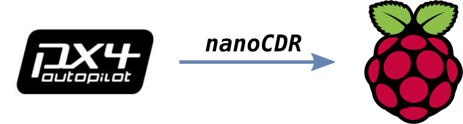

PX4-FastRTPS
============

This is a fork of PX4 Firmware repository to add communication capabilities between a **PX4 Autopilot** (in this README we will talk about **PIXracer**) and a machine running **Fast RTPS** through serial ports using **CDR serialization**, aims to get information from a drone and carry to the DDS world through **Fast RTPS**.

Automatic code generation
-------------------------

The tools developed perform the automatic code generation which support these tasks. This process it's implemented in two sides. For one hand it's added a CDR serialization support directly on the original type support of the uORB topic adding a new interface to the code that do this directly. By other hand we have the capability under demand of the generation of an application to send through a selected UART the info from the topic and serializated by CDR.

Now we also have the capacity of automatic generation of the support in the other side of the communication, **Fast RTPS**.

We generate all the code needed calling the new script **generate_microRTPS_support.py** in *Tools* folder:

.. code-block:: shell

    $ python Tools/generate_microRTPS_support.py msg/sensor_combined.msg
    
Output for this case:

.. code-block:: shell

    $ ls msgenerated/
     sensor_combined_.idl
     sensor_combined_uRTPS_UART_receiver.h
     sensor_combined_uRTPS_UART_receiver.cxx
     sensor_combined_uRTPS_UART_transmitter.cpp
     sensor_combined_CMakeLists.txt

PX4 Firmware
------------

On the *PX4* side, it will be used an application running an uORB node. This node will be subscribed to a internal topic. The applications read the message in a loop, serializes the struct and writes it trough an UART port selected by the user.

Steps to use the auto generated application:

-  Uncomment in *cmake/configs/nuttx_px4fmu-v4_default.cmake* file the *#examples/micrortps_transmitter* to compile this appication along the **PX4** firmware:

.. code-block:: shell

    # eProsima app
    examples/micrortps_transmitter
    
-  Copy the above generated application to the example folder:

.. code-block:: shell

    $ cp msgenerated/sensor_combined_uRTPS_UART_transmitter.cpp src/examples/micrortps_transmitter

-  Also copy and rename the CMakeList to the example folder:

.. code-block:: shell

    $ cp msgenerated/sensor_combined_CMakeLists.txt src/examples/CMakeLists.txt
    
-  Construct and upload the firmware executing:

.. code-block:: shell

   $ make px4fmu-v4_default upload

After uploading the firmware, the application can be launched on *NuttShell* typing its name and passing an available serial port as argument. Using */dev/ttyACM0*
will use the USB port as output. Using */dev/ttyS1* or */dev/ttyS2* will write the output trough TELEM1 or TELEM2 ports respectively.

.. code-block:: shell

    > sensor_combined_trans /dev/ttyACM0  #or /dev/ttySn

**NOTE**: If the UART port selected is busy, it's possible that Mavlink applications were using them. If it is the case, you can stop Mavlink from NuttShell typing:

.. code-block:: shell

    > mavlink stop-all

Fast RTPS (Raspberry PI application)
------------------------------------

In this project the *Raspberry Pi* will have two functions: get the sensor data from a system that is using the PX4 Firmware and publish it to a **Fast RTPS** environment.

This section explains how create a Fast RTPS application using the files generated by **generate_microRTPS_support.py** and with **fastrtpsgen**.

This application allow to launch a publisher or a subcriber that will be using the information coming from the uORB topic in the PX4 side thanks to the autogenerated idl file from the original msg file. The publisher will read data from the UART, deserializes it, and make a Fast RTPS message mapping the attributes from the uORB message. The subscriber simply receives the Fast RTPS messages and print them to the terminal. The subscriber can be launched on the Raspberry Pi or in any another device connected in the same network.

Before runnning the application, it is needed to have installed Fast RTPS. Visit it installation `manual <http://eprosima-fast-rtps.readthedocs.io/en/latest/sources.html>`_ for more information.

For create the application:

-  Create a folder and copy the generated files in this way:

.. code-block:: shell

    $ mkdir my_app && cd my_app
    $ cp /path/to/Firmware/msgenerated/sensor_combined_.idl .
    $ cp /path/to/Firmware/msgenerated/sensor_combined_uRTPS_UART_receiver.* .

-  Generate the base application with *fastrtpsgen*:

.. code-block:: shell

    $ /path/to/Fast-RTPS/fastrtpsgen/scripts/fastrtpsgen -example x64Linux2.6gcc sensor_combined_.idl
    
Now we need to do some modifications to use the both codes together.

-  *sensor_combined_PubSubMain.cxx*

line 60
.. code-block:: shell
         
         sensor_combined_Publisher mypub;
         if (mypub.init())
         {

         ...

         sensor_combined_Publisher mypub;
         std::string uart = "/dev/ttyACM0";
         if (argc > 2) uart = std::string(argv[2]);
         if (mypub.init(uart))
         {

For compiling the application run this commands in the Raspberry:

.. code-block:: shell

    $ git clone https://github.com/eProsima/PX4-FastRTPS-PoC.git
    $ cd PX4-FastRTPS-PoC/
    $ mkdir build && cd build
    $ cmake ..
    $ make

Now, to launch the publisher run:

.. code-block:: shell

    $ ./raspberry_px4 publisher /dev/ttyACM0 #or the selected UART

And, for launching the subscriber run:

.. code-block:: shell

    $ ./raspberry_px4 subscriber

**NOTE**: Normally, it's necessary set up the UART port in the Raspberry Pi. To enable the serial port available on Raspberry Pi connector:

1. Make sure the userid (default is pi) is a member of the dialout group:

.. code-block:: shell

    $ groups pi
    $ sudo usermod -a -G dialout pi

2. You need to stop the already running on the GPIO serial console:

.. code-block:: shell

    $ sudo raspi-config

Go to *Interfacing options > Serial*, NO to *Would you like a login shell to be accessible over serial?*, valid and reboot.

3. Check UART in kernel:

.. code-block:: shell

   $ sudo vi /boot/config.txt

And enable UART setting *enable_uart=1*.

Result
------

The entire application will follow this flow chart:

.. image:: doc/architecture.png

If all steps has been followed, you should see this output on the subscriber side of Fast RTPS.

.. image:: doc/subscriber.png

A video of this final process as demostration is available on `https://youtu.be/NF65EPD-6aY <https://youtu.be/NF65EPD-6aY>`_