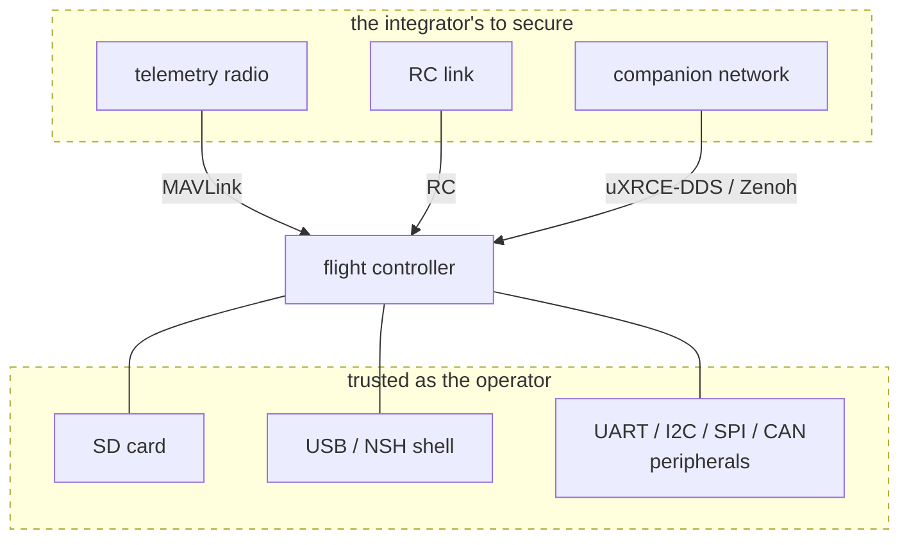

# PX4 Security Scope

This document says where PX4's security boundary sits, so a reporter can tell before filing whether a finding is considered a vulnerability, and a maintainer can say why it is or isn't.

It is not a threat model.
It does not enumerate threats, rate risks, or prescribe mitigations.
It describes the boundary the code implements today.

To use it: find your deployment under [Configurations](#configurations), then apply [What makes a finding a vulnerability](#what-makes-a-finding-a-vulnerability) and check [Out of scope](#out-of-scope).
The examples there cover the recurring cases, not every case.
A finding that fits none of them is a judgement call, and maintainers make it on the report.

Report through the GitHub Security tab as described in [SECURITY.md](SECURITY.md), which also lists the supported branches.

## What PX4 protects

PX4 protects one thing: who gets to fly/control the aircraft, and who gets to make it stop.

Everything else matters because of what it leads to, not in itself.
Logs, parameters and telemetry are worth protecting because of what someone can do with them next.
Reading a flight log is a far smaller problem than flying away with the vehicle.

Two things PX4 cannot promise: that a vehicle will not crash, and that a sensor is telling the truth about the world.

## The boundary

Everything above the flight controller is the integrator's to secure.
Everything below it is trusted as the operator: whoever has the SD card, the USB port or a peripheral bus can do anything the operator can.

PX4's job is what happens at the flight controller's interfaces: whatever arrives on them must not do more than the interface is documented to do.

## What PX4 assumes

- **Sensors report within specification.**
  PX4 cannot reliably distinguish a real GPS fix, rangefinder return or gyro reading from a spoofed one.
  Some spoofing detection exists and is best-effort.
- **Peripherals are the ones the operator installed.**
  No bus (UART, I2C, SPI, CAN, SMBus) is authenticated.
  A device on a bus is trusted as whatever driver the operator enabled for it.
- **Physical access is trusted as the operator.**
  The SD card holds logs, the MAVLink signing key, some boards' parameters or parameter backups and staged peripheral firmware, and it can contain boot scripts that are run at startup.
  Debug ports and the bootloader allow a full reflash.
- **The onboard shell is trusted as the operator.**
  A peer that can open the NSH shell can do anything the operator can.
  NuttX supports a console password; no PX4 board enables it.
- **The offboard transports are inside the boundary.**
  uXRCE-DDS and Zenoh publishers reach uORB directly, including `/fmu/in/actuator_motors`, `/fmu/in/actuator_servos` and `/fmu/in/vehicle_command`.
  They carry no external-origin marking, so the command guards that apply to MAVLink do not apply to them.
  A peer that can reach those transports is the operator, which is why keeping that network to trusted parties is the integrator's job and not an optional extra.
  A direct cable between the flight controller and the companion secures only that hop: the agent or router republishes into the DDS or Zenoh network on the companion, and anything that can reach the companion or that network reaches uORB too.
- **Securing MAVLink links is the integrator's job.**
  See [MAVLink Security Hardening](docs/en/mavlink/security_hardening.md).

These assumptions are the boundary.
If a report starts from one of them already being true, that the attacker has the SD card, or is on the companion network, then it is describing how PX4 works rather than finding a hole in it.

## Configurations

### As shipped

Every control interface is unauthenticated, unsigned and unencrypted.
Anyone who can reach a link can do anything the operator can do: arm, disarm, change mode, upload missions and geofences, set parameters, open a shell over `SERIAL_CONTROL`, read and write files over MAVLink FTP, terminate flight, reboot, etc.
[MAVLink Security Hardening](docs/en/mavlink/security_hardening.md) lists these capabilities in full.

This is the documented default and it is not a defect.
In this configuration a peer on any link already has the operator's access, so a finding reachable only from a link adds nothing to what that peer can do.
See [What makes a finding a vulnerability](#what-makes-a-finding-a-vulnerability).

### Hardened

An integrator can harden a deployment with any of:

- **Secure the link below PX4.**
  A secured radio, e.g. through a VPN or IPsec gives confidentiality and authentication using standard, reviewed cryptography.
  This is the strongest option (and has no direct PX4 integration).
- **Isolate the offboard transports.**
  uXRCE-DDS and Zenoh bypass every MAVLink control, so if an adversary can reach them, the rest of this list buys nothing.
  See [uXRCE-DDS](docs/en/middleware/uxrce_dds.md) and [Zenoh](docs/en/middleware/zenoh.md) for how.
- **Enable [MAVLink message signing](docs/en/mavlink/message_signing.md).**
  This authenticates MAVLink frames but does not encrypt them.
  A small allowlist (`HEARTBEAT`, `RADIO_STATUS`, `ADSB_VEHICLE`, `COLLISION`) is currently accepted unsigned.
  Signing is inactive if the key file is absent, which is deliberate: removing the card is the recovery path when a key is lost.
- **Lock the configuration.**
  Read-only parameters, [secure boot](docs/en/advanced_config/bootloader_secure_boot.md) with a replaced key, and no wired reflash.
  The in-tree secure boot variant ships a publicly committed test key that an integrator must replace.

What each of these buys is described where it is documented.
PX4 is responsible for the mechanisms it ships. If signing fails to authenticate, or secure boot accepts an unsigned image, that is a vulnerability in PX4. What PX4 does not guarantee is whether any combination of above is sufficient for a given deployment. That judgement belongs to the integrator, against the threat model for that deployment. 

## What makes a finding a vulnerability

A finding is a vulnerability when it gives capability to an attacker who has neither the operator's access nor physical access.

The positions that already have the operator's access are listed under [What PX4 assumes](#what-px4-assumes): the SD card, USB and the shell, the peripheral buses, the offboard transports, and any MAVLink link that has not been secured.
A finding that is reachable only from one of those positions describes something that attacker could already do, and it is a bug rather than a vulnerability.

That applies to memory corruption, races and hangs as much as to anything else.
These are bugs by default, and they are found and fixed routinely, for example by running SITL under [AddressSanitizer or ThreadSanitizer](docs/en/test_and_ci/sanitizers.md).
Send them as a pull request with a fix, or as an issue.
What makes one a vulnerability is not the class of bug but who can reach it.

The findings that do qualify cross from outside those positions to inside them, for example:

- **Bypassing a mechanism PX4 ships.**
  MAVLink signing accepting a message it should reject, including memory corruption in anything parsed before the signature is checked or in a message that is accepted unsigned.
  Secure boot with a replaced key accepting an unsigned image.
- **Turning an over-the-air input into more than a false reading.**
  Someone transmitting a spoofed GNSS signal, ADS-B traffic or an RC signal has neither the operator's access nor physical access.
  If what the receiver passes on from that signal makes PX4 corrupt memory, that is in scope; the vehicle acting on a false position or a phantom aircraft is not.
  A receiver that has itself been replaced or tampered with is physical access.

An in-tree board configuration is PX4's responsibility, not the integrator's.
"The integrator should have changed it" does not apply to a default that PX4 ships.

## Out of scope

- **Anything reachable only from a position that already has the operator's access.**
  Commanding the vehicle over an unsecured link, publishing on the offboard transports, and bugs in code that only those positions reach, memory corruption included.
- **Physical access**, except where a board is configured with a mechanism whose purpose is to resist it.
  On a secure boot board with a replaced key, wired reflash comes back into scope.
- **Spoofed physical inputs.**
  GPS spoofing, acoustic or EMI injection, magnetic interference.
  The vehicle acting on a false reading is out of scope; see above for when a spoofed input is not.
- **Plaintext telemetry.**
  PX4 does not encrypt telemetry, and eavesdropping on a link is not a finding on its own.
- **Code that only ever runs in simulation.**
  A finding in a simulator-only code path is a bug, not a vulnerability.
  This is about where the affected code runs, not where you reproduced it: if the code also runs on a flight target, a SITL reproducer is fine, and [SECURITY.md](SECURITY.md) asks for one.
- **Unsupported branches.**
  See [SECURITY.md](SECURITY.md).

A parameter precondition does not put a finding out of scope if the same link can set that parameter.

## Severity

Decide scope first, using [What makes a finding a vulnerability](#what-makes-a-finding-a-vulnerability) and [Out of scope](#out-of-scope).
A finding that is out of scope is closed, not scored.

What remains is scored with CVSS, because that is what GitHub advisories carry.
When choosing the impact metrics, rate the effect on the aircraft rather than on the data, in roughly this order:

1. Taking control of a vehicle that is flying or could be told to fly, and running your own code on it.
2. Forcing an unsafe state: corrupting the estimator, or spoofing a condition that trips a failsafe.
3. Persistence across reboot.
4. Loss of control or telemetry links, and disclosure.

A safety feature that happens to limit an attacker, such as a geofence around a hijacked vehicle, is not a security control and does not reduce the severity of a vulnerability.
Someone who is already flying the vehicle can reconfigure it.
