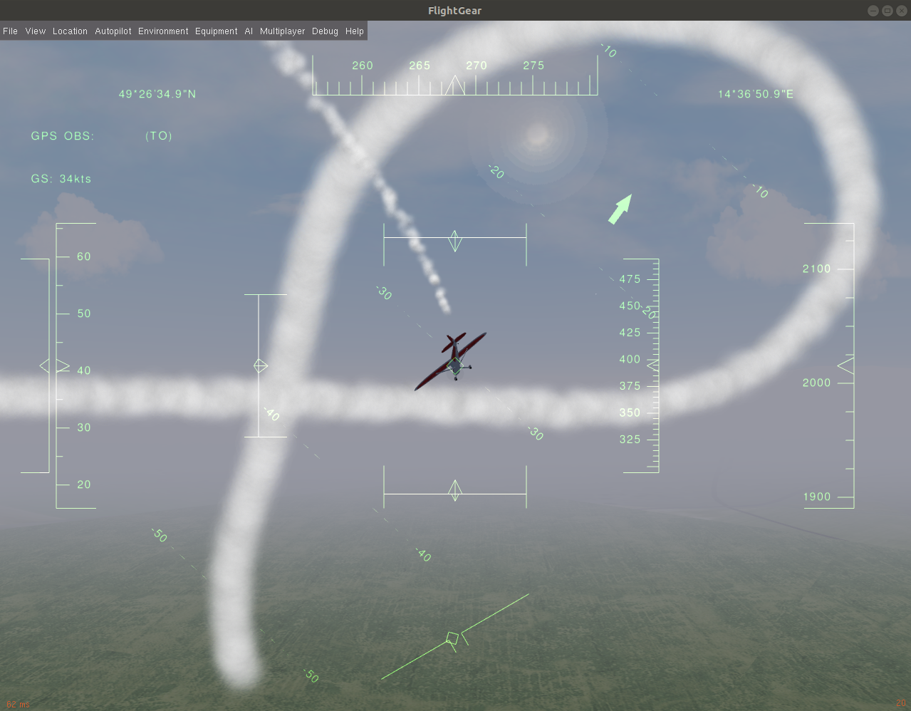
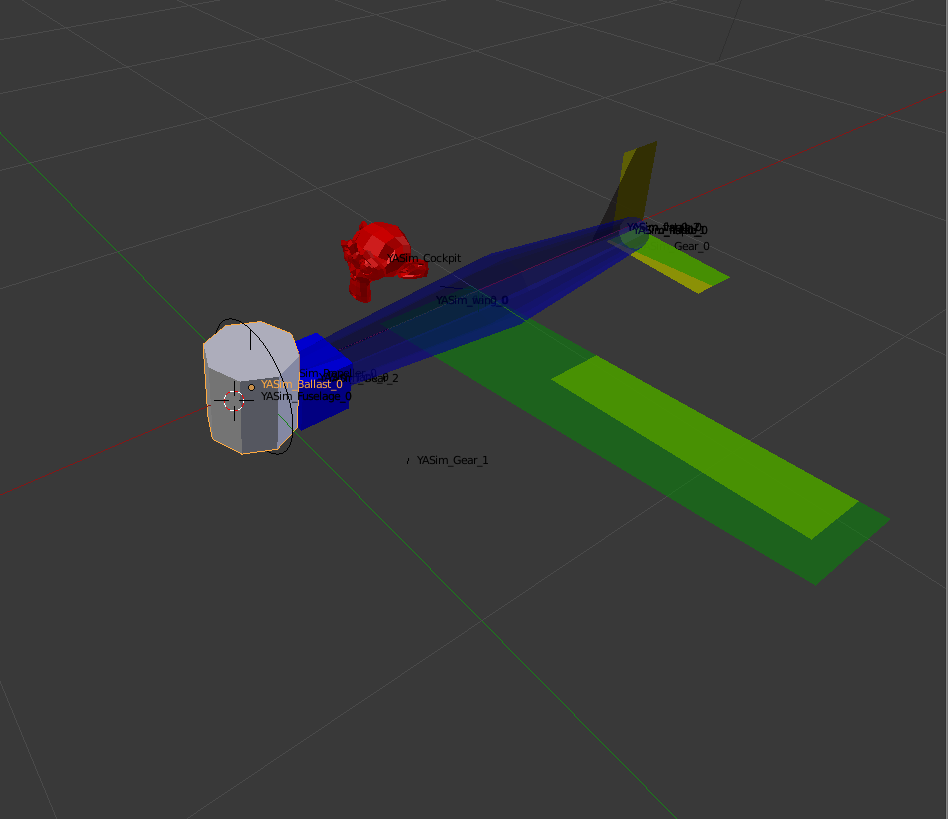

## Rascal 110  RC plane model

The FlightGear numerical model fits to JSBsim and YASim flight dynamics models (FDM). The aircraft model is optimized for UAV development. Therefore it has no graphic cockpit or pilot weight in the model.

This repository contain a fork from [FGAddon repository](https://sourceforge.net/p/flightgear/fgaddon/HEAD/tree/trunk/Aircraft/Rascal/). The current fork has the major issues of previous model solved.

### YASim model

The YASim model has two variants. The piston-engine and electric-engine. The both models are the basically same in other parameters.
But the piston-engine model introduces an "idle power", because the throttle of piston engine cannot be exactly zero to keep engine running. The result of this limitation is small trust generated by idle propeller RPM.  This trust could complicate the mission modes where stationary position is expected during zero throttle (especially for the landing and takeoff).

As result of above limitation the electric engine variant is strongly recommended for the use. Unfortunately only the FlightGear containing the [electric engine YASim patch](https://sourceforge.net/p/flightgear/flightgear/merge-requests/197/) could be used for that simulation. The patched version is currently available from [daily build FlightGear PPA](https://launchpad.net/~saiarcot895/+archive/ubuntu/flightgear-edge). 

### JSBsim model

The JSBsim was original FDM used for Rascal. It is based on combustion engine model Zenoah_G-26A.

## Credits

This fork was considerably improved by [ThunderFly s.r.o.](https://www.thunderfly.cz/) <info@thunderfly.cz>
