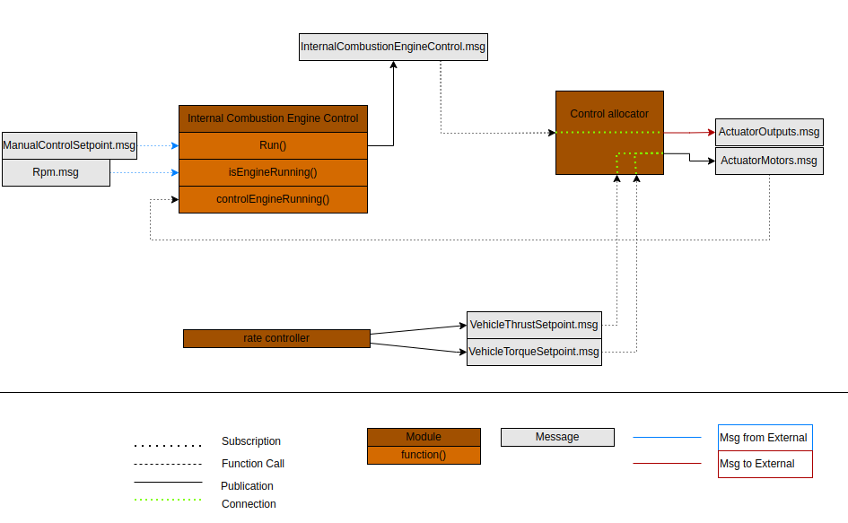
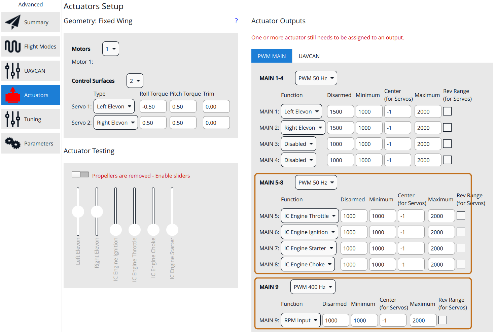
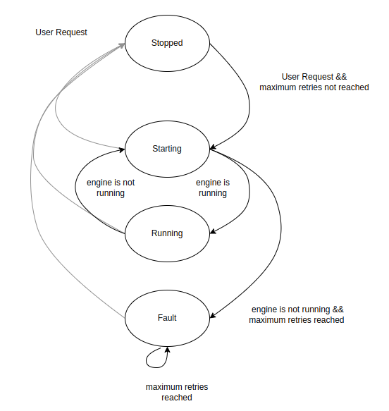

# Internal Combustion Engines (ICE)

PX4 can operate a spark-ignition internal combustion engine (ICE) — a petrol/nitro two- or four-stroke engine — as the propulsion system of a fixed-wing, VTOL, or helicopter vehicle.

Unlike an electric motor, an engine cannot simply be commanded to a thrust value: it has to be _started_ (choke, ignition, electric starter), it can _die_ in flight and need restarting, and it must be kept above a minimum idle speed to keep running at all.
The [`internal_combustion_engine_control`](../modules/modules_system.md#internal-combustion-engine-control) module implements this logic as a state machine that drives four dedicated actuator outputs and closes the loop on a measured engine speed (RPM).

::: warning
A running combustion engine with a propeller attached is dangerous.
The engine can be commanded to start automatically (for example on arming, or on a VTOL transition to fixed-wing), and the starter motor will crank the propeller without further warning.

- Always do first bench tests with the propeller removed.
- For continuious operation without propeller a fly wheel is recommended.
- Keep clear of the propeller arc whenever the vehicle is powered.
- Verify that the engine stop functionality (ignition off, chocke closed) reliably stops the engine before you rely on it.
:::

## How It Works



The module sits between the [control allocator](../config/actuators.md) and the outputs:

- It takes the **throttle demand** from `actuator_motors.control[0]`, i.e. the thrust that allocation computed for _Motor 1_.
  The engine is therefore configured as motor 1 of the airframe; it does not need an output assigned to the `Motor 1` function.
- It runs the start/stop state machine and publishes [InternalCombustionEngineControl](../msg_docs/InternalCombustionEngineControl.md) with the setpoints for ignition, throttle, choke, and starter.
- The mixer maps those four fields to the four `IC Engine *` [output functions](../config/actuators.md), which is where you wire the engine hardware.
- It subscribes to [Rpm](../msg_docs/Rpm.md) to know whether the engine is actually turning, and publishes [InternalCombustionEngineStatus](../msg_docs/InternalCombustionEngineStatus.md) with the current state.

The module runs at 50 Hz.

### Output Functions

| Output function      | Field in `InternalCombustionEngineControl` | Meaning                                                                                     |
| -------------------- | ------------------------------------------ | ------------------------------------------------------------------------------------------- |
| `IC Engine Ignition` | `ignition_on`                              | Spark/ignition enable. `false` cuts the spark and stops the engine (optional, many engine spark boxes always run when powered).                         |
| `IC Engine Throttle` | `throttle_control`                         | Throttle servo setpoint, `0`…`1`. `NAN` while the engine is commanded off (see note below). |
| `IC Engine Choke`    | `choke_control`                            | Choke servo setpoint, `0`…`1`, where `1` is fully closed (richest mixture). Optional actuator.                |
| `IC Engine Starter`  | `starter_engine_control`                   | Electric starter motor setpoint, `0`…`1`. Optional actuator, engine can also be hand-started.                                                           |

All four setpoints are in the range `[0, 1]` and are mapped to the `[-1, 1]` servo range before being scaled to the output's **Minimum**/**Maximum** values.
In other words a setpoint of `0` produces the configured **Minimum** output and `1` produces the configured **Maximum** output (or the reverse, if **Rev Range** is ticked).

::: info
In the `Stopped` state the throttle setpoint is `NAN`, which by definition drives the output to its configured **Disarmed** value rather than to **Minimum**.
This lets you park the throttle servo at an idle-stop position that is different from the closed-throttle position used to switch off the engine.
:::

## Hardware Requirements

- **Throttle servo** connected to a PWM/AUX output.
- **Ignition cut** on an output, typically through a relay or opto-isolated switch that shorts or interrupts the ignition circuit. Optional.
- **Choke servo** on an output (optional if the engine has no choke, or an automatic one — set [ICE_CHOKE_ST_DUR](../advanced_config/parameter_reference.md#ICE_CHOKE_ST_DUR) to `0` and leave the function unassigned).
- **Electric starter** on an output, typically through a relay or an ESC driving the starter motor. Optional, engine can also be hand-started.
- **RPM sensor** feeding the `RPM Input` function on a timer-capture-capable PWM pin, for example a Hall-effect or optical sensor on the crankshaft, or an ignition-pulse pickup.

::: warning
RPM feedback is **required**.
The state machine only leaves `Starting` for `Running` once it sees a measured engine speed above [ICE_MIN_RUN_RPM](../advanced_config/parameter_reference.md#ICE_MIN_RUN_RPM).
Without a working RPM sensor the module will exhaust its start attempts and latch into the `Fault` state.
:::

## Firmware Configuration

The module and the RPM capture driver are not in the default builds.
Add them to the [board configuration](../hardware/porting_guide_config.md) for your flight controller:

```
CONFIG_MODULES_INTERNAL_COMBUSTION_ENGINE_CONTROL=y
CONFIG_DRIVERS_RPM_CAPTURE=y
```

Both can also be enabled interactively with `make <target> boardconfig`, under **modules** and **drivers** respectively.

## Parameter Setup

Set the following and reboot:

- [ICE_EN](../advanced_config/parameter_reference.md#ICE_EN) to `Enabled`.
  The startup script only starts the module if this is set.
- [RPM_CAP_ENABLE](../advanced_config/parameter_reference.md#RPM_CAP_ENABLE) to `Enabled`.
- [RPM_PULS_PER_REV](../advanced_config/parameter_reference.md#RPM_PULS_PER_REV) to the number of sensor pulses per crankshaft revolution (for example `2` for a two-magnet setup, or `1` for a single ignition pulse per revolution on a two-stroke).

Then tune the remaining `ICE_*` parameters as described in the sections below.

## Actuator Configuration

Assign the four engine functions and the RPM input in [Actuator Configuration](../config/actuators.md), for example:



Points to note in the example above:

- **IC Engine Throttle** uses a **Disarmed** value that differs from **Minimum**: disarmed parks the servo at the idle stop, while **Minimum** is closed throttle.
- **IC Engine Choke** uses **Minimum** for choke open and **Maximum** for choke closed; **Rev Range** is used where the servo linkage is inverted.
- **IC Engine Ignition** and **IC Engine Starter** behave as on/off outputs: **Minimum** is "off" and **Maximum** is "on".
  Set both values so that the relay switches reliably, and make sure **Disarmed** corresponds to ignition off and starter off.
- **RPM Input** must be on a channel that supports timer capture on your board.

::: warning
Outputs are only driven while the vehicle is armed or [prearmed](../advanced_config/parameter_reference.md#COM_PREARM_MODE).
While disarmed, every output — including ignition, choke, and starter — is held at its **Disarmed** value regardless of what the module commands.

If you want to start the engine before arming (for example with an AUX switch, see [ICE_ON_SOURCE](#start-stop-command-source)), you must set [COM_PREARM_MODE](../advanced_config/parameter_reference.md#COM_PREARM_MODE) to `Always` (or `Safety button` and release the safety switch).
:::

## Start/Stop Command Source {#start-stop-command-source}

[ICE_ON_SOURCE](../advanced_config/parameter_reference.md#ICE_ON_SOURCE) selects what asks for the engine to run:

| Value                       | Engine is requested on when                                                                                                                            |
| --------------------------- | ------------------------------------------------------------------------------------------------------------------------------------------------------ |
| `On arming - disarming` (0) | The vehicle is armed. This is the default.                                                                                                             |
| `Aux1` (1)                  | The AUX1 manual control channel is above `0.5`; requested off when it goes below `-0.5`. Map a switch to it with `RC_MAP_AUX1`.                        |
| `Aux2` (2)                  | As above, using AUX2 and `RC_MAP_AUX2`.                                                                                                                |
| `On Vtol Transitions` (3)   | The vehicle is in fixed-wing mode or transitioning to fixed-wing. Use this on a hybrid VTOL where the engine only drives the pusher/forward propeller. |

::: info
For the AUX sources, values between `-0.5` and `0.5` leave the request unchanged.
This dead zone means a three-position switch has a middle position that does not change the engine state, and it avoids a channel that is momentarily centred (or lost and defaulted to zero) from cutting the engine.
:::

## State Machine



The module has four states, reported in `InternalCombustionEngineStatus.state`:

| State      | Ignition | Throttle                                | Choke                                 | Starter                               |
| ---------- | -------- | --------------------------------------- | ------------------------------------- | ------------------------------------- |
| `Stopped`  | off      | `NAN` (→ **Disarmed** value)            | `ICE_STOP_CHOKE ? 1 : 0`              | `0`                                   |
| `Starting` | on       | `ICE_STRT_THR`                          | see [start sequence](#start-sequence) | see [start sequence](#start-sequence) |
| `Running`  | on       | motor 1 demand, or idle governor output | `0`                                   | `0`                                   |
| `Fault`    | off      | `0`                                     | `ICE_STOP_CHOKE ? 1 : 0`              | `0`                                   |

Transitions:

- `Stopped` → `Starting` when the engine is requested on and the start attempt budget is not exhausted.
- `Starting` → `Running` as soon as the measured RPM exceeds [ICE_MIN_RUN_RPM](../advanced_config/parameter_reference.md#ICE_MIN_RUN_RPM). This can happen part way through an attempt.
- `Starting` → `Fault` when all attempts have been used without the engine coming up.
- `Running` → `Starting` if the RPM drops back below the threshold and [ICE_RUN_FAULT_D](../advanced_config/parameter_reference.md#ICE_RUN_FAULT_D) is enabled — this is the automatic in-air restart. An `IC engine fault detected` event is emitted.
- Any state → `Stopped` when the engine is requested off. This also resets the attempt counter, so switching the request off and on again is the way to clear a `Fault`.

::: info
The throttle setpoint is rate limited by [ICE_THR_SLEW](../advanced_config/parameter_reference.md#ICE_THR_SLEW) in all states, which protects the engine from abrupt throttle steps that would make it bog down or stall.
The limit does not apply to the `NAN` used in `Stopped`; the slew state is reset to zero instead, so the next start ramps up from closed throttle.
:::

### Start Sequence

One start attempt runs the following timeline, measured from entry into the attempt:

| From                               | To                                                | Ignition | Choke | Starter | Throttle       |
| ---------------------------------- | ------------------------------------------------- | -------- | ----- | ------- | -------------- |
| `0`                                | `ICE_IGN_DELAY`                                   | on       | `1`   | `0`     | `ICE_STRT_THR` |
| `ICE_IGN_DELAY`                    | `ICE_IGN_DELAY + ICE_CHOKE_ST_DUR`                | on       | `1`   | `1`     | `ICE_STRT_THR` |
| `ICE_IGN_DELAY + ICE_CHOKE_ST_DUR` | `ICE_IGN_DELAY + ICE_CHOKE_ST_DUR + ICE_STRT_DUR` | on       | `0`   | `1`     | `ICE_STRT_THR` |

- [ICE_IGN_DELAY](../advanced_config/parameter_reference.md#ICE_IGN_DELAY) holds the starter off for a moment after the ignition is switched on, for ignition systems that need time to come up.
- [ICE_CHOKE_ST_DUR](../advanced_config/parameter_reference.md#ICE_CHOKE_ST_DUR) is how long the choke stays closed. Note that the starter is already cranking during this window.
- [ICE_STRT_DUR](../advanced_config/parameter_reference.md#ICE_STRT_DUR) is how much longer the starter cranks with the choke open before the attempt is declared timed out.

If the attempt times out, the module rests for **1 second** with the ignition off and the throttle at its disarmed value (to reduce starter motor wear) and then begins the next attempt.

::: info
Choke and ignition delay are applied on the **first** attempt only.
Retries crank with the choke open immediately, on the assumption that the first attempt already primed the engine and that further choking would flood it.
:::

[ICE_STRT_ATTEMPT](../advanced_config/parameter_reference.md#ICE_STRT_ATTEMPT) caps the number of attempts before the module gives up and enters `Fault`.
A value of `0` means a single attempt with no retry.

## Idle RPM Governor

Left at a fixed low throttle, an engine tends either to die or to sit at an unpredictable idle speed that depends on temperature, air density, and mixture.
The idle governor closes the loop on measured RPM whenever the throttle demand is low, keeping the engine alive and ready to accelerate.

It is enabled by setting [ICE_IDLE_RPM](../advanced_config/parameter_reference.md#ICE_IDLE_RPM) to a non-zero idle speed.
When enabled, the `Running` state has two sub-states, reported in `InternalCombustionEngineStatus.substate`:

- `Run` — the throttle demand from allocation is passed straight through.
- `Idle` — the throttle output is produced by the governor instead.

The module enters `Idle` when the throttle demand drops below 2% (or becomes invalid, i.e. the vehicle is disarmed), **or** whenever the measured RPM falls below the idle setpoint.
The second condition is what catches a sagging engine: even at high commanded throttle, if the engine is being dragged below its idle speed the governor takes over and pushes the throttle to recover it.
It leaves `Idle` again as soon as the throttle demand exceeds the governor's current output, so the handover happens without a step in the output.

### Control Structure

The governor is a feed-forward plus PI controller with output clamped to `[0, 1]`:

```
throttle = ICE_IDLE_THR_FF + P · e + ∫ I · e dt
       e = ICE_IDLE_RPM − rpm_estimate
       P = ICE_IDLE_RPM_P · 1e-3
       I = ICE_IDLE_RPM_I · 1e-3
```

The `1e-3` scaling is what makes the gains convenient to reason about:

- [ICE_IDLE_RPM_P](../advanced_config/parameter_reference.md#ICE_IDLE_RPM_P) is the normalized throttle added per **1000 RPM** of error. `ICE_IDLE_RPM_P = 1` means an engine running 500 RPM slow gets `+0.5` throttle.
- [ICE_IDLE_RPM_I](../advanced_config/parameter_reference.md#ICE_IDLE_RPM_I) is the normalized throttle added per **1000 RPM·s** of accumulated error. `ICE_IDLE_RPM_I = 1` means a steady 100 RPM error winds the output up by `0.1` every second.
- [ICE_IDLE_THR_FF](../advanced_config/parameter_reference.md#ICE_IDLE_THR_FF) is the throttle that holds the idle speed on its own, so the PI terms only have to correct for the difference. It is applied as a constant offset whenever the governor is active.

The integrator is limited to `±1` and uses conditional integration: it stops winding up in whichever direction is already driving the output into saturation.
It is reset to zero every time the engine reaches `Running`, so a start never inherits wind-up from a previous run.

### Tuning Procedure

Do this on the ground, with the propeller removed or the vehicle firmly restrained, and with the engine warm.

1. **Find the idle speed.** Pick the [ICE_IDLE_RPM](../advanced_config/parameter_reference.md#ICE_IDLE_RPM) you want — low enough not to produce useful thrust, high enough that the engine runs smoothly and can accelerate without hesitating. The engine's specification or a hand-throttled test is the starting point.
2. **Find the feed-forward.** With the governor still off (`ICE_IDLE_RPM = 0`), start the engine and hold it at that RPM with the throttle stick in a manual mode. Read the commanded throttle off the log (`internal_combustion_engine_control.throttle_control`), set [ICE_IDLE_THR_FF](../advanced_config/parameter_reference.md#ICE_IDLE_THR_FF) to it, and set `ICE_IDLE_RPM` to the target.
3. **Verify feed-forward only.** With both gains still at `0`, restart and let the engine idle. It should settle near the setpoint. A large steady offset means the feed-forward is wrong — correct it before adding gains, because the PI terms are only meant to trim.
4. **Add proportional gain.** Raise [ICE_IDLE_RPM_P](../advanced_config/parameter_reference.md#ICE_IDLE_RPM_P) in steps (`0.2` is a reasonable first step) until the engine recovers briskly when you disturb it — for example by briefly blipping the throttle up and releasing it. Back off as soon as you see the RPM hunting or the throttle oscillating.
5. **Add integral gain.** Raise [ICE_IDLE_RPM_I](../advanced_config/parameter_reference.md#ICE_IDLE_RPM_I) just enough to remove any remaining steady-state RPM offset within a few seconds. Too much integral shows up as a slow oscillation around the setpoint.
6. **Check the handover.** Sweep the throttle demand up and back down through the idle point and confirm there is no jump or dead spot as the sub-state switches between `Idle` and `Run`.

The signals to look at in the [flight log](../log/flight_log_analysis.md):

| Signal                                                    | Use                                                                                     |
| --------------------------------------------------------- | --------------------------------------------------------------------------------------- |
| `rpm.rpm_estimate`                                        | Measured engine speed — compare against `ICE_IDLE_RPM`.                                 |
| `internal_combustion_engine_control.throttle_control`     | Throttle actually commanded, after the governor and the slew rate limit.                |
| `internal_combustion_engine_status.substate`              | Whether the governor is active (`1` = `Idle`).                                          |
| `internal_combustion_engine_status.pid_idle_rpm_integral` | Integrator state. Parked at `±1` means it is saturated and the feed-forward is far off. |
| `internal_combustion_engine_status.state`                 | State machine state — reveals unnoticed restarts.                                       |

Both `internal_combustion_engine_*` topics are logged when the module is running.

::: info
`rpm_capture` low-pass filters the RPM estimate with a 0.5 s time constant.
That lag is part of the loop you are tuning and puts a practical ceiling on how high the gains can go before the governor starts hunting.
:::

## Status and Telemetry

- [InternalCombustionEngineControl](../msg_docs/InternalCombustionEngineControl.md) carries the commanded setpoints and the current user request.
- [InternalCombustionEngineStatus](../msg_docs/InternalCombustionEngineStatus.md) carries the state machine state and the governor's integrator.
  The same topic is used by the [DroneCAN](../dronecan/index.md) ICE bridge (`UAVCAN_SUB_ICE`), which fills in the richer engine telemetry — temperatures, pressures, fuel flow — reported by a smart ECU.
- The status topic is streamed to a ground station as the MAVLink [EFI_STATUS](https://mavlink.io/en/messages/common.html#EFI_STATUS) message.

## Parameter Reference

| Parameter                                                                      | Unit | Default | Description                                                                  |
| ------------------------------------------------------------------------------ | ---- | ------- | ---------------------------------------------------------------------------- |
| [ICE_EN](../advanced_config/parameter_reference.md#ICE_EN)                     | —    | `0`     | Start the ICE control module. Requires a reboot.                             |
| [ICE_ON_SOURCE](../advanced_config/parameter_reference.md#ICE_ON_SOURCE)       | —    | `0`     | What requests the engine on/off: arming, AUX1, AUX2, or VTOL transitions.    |
| [ICE_MIN_RUN_RPM](../advanced_config/parameter_reference.md#ICE_MIN_RUN_RPM)   | rpm  | `2000`  | RPM above which the engine counts as running.                                |
| [ICE_IGN_DELAY](../advanced_config/parameter_reference.md#ICE_IGN_DELAY)       | s    | `0`     | Delay between switching on the ignition and engaging the starter.            |
| [ICE_CHOKE_ST_DUR](../advanced_config/parameter_reference.md#ICE_CHOKE_ST_DUR) | s    | `5`     | How long the choke stays closed on the first start attempt.                  |
| [ICE_STRT_DUR](../advanced_config/parameter_reference.md#ICE_STRT_DUR)         | s    | `5`     | Cranking time per attempt after the choke opens, before declaring a timeout. |
| [ICE_STRT_THR](../advanced_config/parameter_reference.md#ICE_STRT_THR)         | norm | `0.1`   | Throttle held during choking and cranking.                                   |
| [ICE_STRT_ATTEMPT](../advanced_config/parameter_reference.md#ICE_STRT_ATTEMPT) | —    | `3`     | Start attempts before entering `Fault`. `0` means a single attempt.          |
| [ICE_RUN_FAULT_D](../advanced_config/parameter_reference.md#ICE_RUN_FAULT_D)   | —    | `1`     | Detect an engine stop while running and attempt a restart.                   |
| [ICE_STOP_CHOKE](../advanced_config/parameter_reference.md#ICE_STOP_CHOKE)     | —    | `1`     | Close the choke while the engine is stopped or in fault.                     |
| [ICE_THR_SLEW](../advanced_config/parameter_reference.md#ICE_THR_SLEW)         | 1/s  | `0.5`   | Maximum rate of change of the throttle output.                               |
| [ICE_IDLE_RPM](../advanced_config/parameter_reference.md#ICE_IDLE_RPM)         | rpm  | `0`     | Idle RPM setpoint. `0` disables the idle governor.                           |
| [ICE_IDLE_THR_FF](../advanced_config/parameter_reference.md#ICE_IDLE_THR_FF)   | norm | `0`     | Feed-forward throttle for the idle governor.                                 |
| [ICE_IDLE_RPM_P](../advanced_config/parameter_reference.md#ICE_IDLE_RPM_P)     | —    | `0`     | Idle governor proportional gain, per 1000 RPM of error.                      |
| [ICE_IDLE_RPM_I](../advanced_config/parameter_reference.md#ICE_IDLE_RPM_I)     | —    | `0`     | Idle governor integral gain, per 1000 RPM·s of error.                        |

## Troubleshooting

| Symptom                                                                                               | Likely cause                                                                                                                                                                                          |
| ----------------------------------------------------------------------------------------------------- | ----------------------------------------------------------------------------------------------------------------------------------------------------------------------------------------------------- |
| Nothing happens at all; `internal_combustion_engine_control status` reports the module is not running | `ICE_EN` is not set, or the module is not in the firmware. Check the [build configuration](#firmware-configuration) and reboot.                                                                       |
| The engine runs but the state machine goes to `Fault`                                                 | The RPM sensor is not working or is misconfigured. Check `RPM_CAP_ENABLE`, `RPM_PULS_PER_REV`, and that the sensor is on a capture-capable pin; compare `rpm.rpm_estimate` against a hand tachometer. |
| Outputs never move even though the state machine advances                                             | The vehicle is disarmed and not prearmed, so outputs are held at their **Disarmed** values. See the [note above](#actuator-configuration) on `COM_PREARM_MODE`.                                       |
| The starter cranks but the engine never fires                                                         | Too little cranking time (`ICE_STRT_DUR`), wrong start throttle (`ICE_STRT_THR`), or too little/too much choke (`ICE_CHOKE_ST_DUR`).                                                                  |
| The engine fires and then dies just after `Starting` finishes                                         | No idle governor. Set up the [idle governor](#idle-rpm-governor); with `ICE_IDLE_RPM = 0` there is nothing holding the engine up when the throttle demand is zero.                                    |
| Repeated in-air restarts logged as `IC engine fault detected`                                         | `ICE_MIN_RUN_RPM` is set too close to the actual idle speed, so normal idle dips read as an engine stop. Raise the idle setpoint or lower the threshold.                                              |
| The engine bogs down or stalls on throttle up                                                         | `ICE_THR_SLEW` is too high for the engine. Reduce it so the throttle opens more gradually.                                                                                                            |

## See Also

- [`internal_combustion_engine_control`](../modules/modules_system.md#internal-combustion-engine-control) — module command line reference.
- [Actuator Configuration](../config/actuators.md) — assigning output functions.
- [DroneCAN Peripherals](../dronecan/index.md) — for engines with a smart ECU reporting over DroneCAN.
