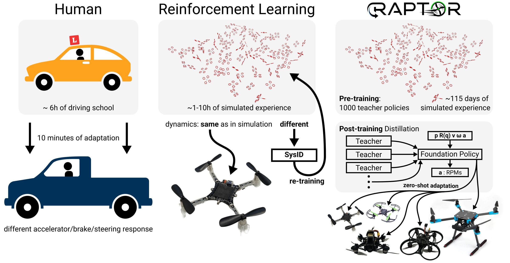
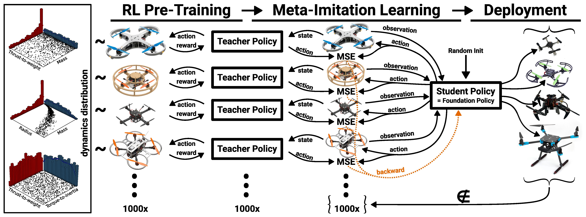

# RAPTOR: A Foundation Policy for Quadrotor Control

<Badge type="tip" text="main" /> <Badge type="warning" text="Experimental" />

::: warning
This is an experimental module.
Use at your own risk.
:::



RAPTOR is a foundation policy for end-to-end quadrotor control. It is motivated by the adaptability of humans exemplified e.g. when driving cars. Upfront humans require a couple hours of driving experience to be able to smoothly control the car and blend into traffic. But when facing a new car (e.g. rental) they do not need to re-learn driving they only need to experience a few rough breaking/acceleration/steering responses to adjust their previously learned behavior.

Reinforcement Learning (RL) is a machine learning technique that, like humans, is using trial and error to learn decision making/control behaviors. (Deep) RL is interesting for controlling robots (and particularly UAVs) because it overcomes some fundamental limitations of classic, modular control architectures (information loss at module boundaries, requirement for expert tuning, etc.). RL has, e.g., been very successful in [high-performance quadrotor flight](https://doi.org/10.1038/s41586-023-06419-4) but the aforementioned quality of adaptive transfer is not present in current RL-based methods.

RAPTOR fills this gap and demonstrates a single, tiny neural-network control policy that can control a wide variety of quadrotors (tested on real quadrotors from 32 g to 2.4 kg). For more details please refer to this video:

<lite-youtube videoid="hVzdWRFTX3k" title="RAPTOR: A Foundation Policy for Quadrotor Control"/>

The method we developed for training the RAPTOR policy is called Meta-Imitation Learning:



You can torture test the RAPTOR policy in your browser at [https://raptor.rl.tools](https://raptor.rl.tools) or in the embedded app here:

<iframe src="https://rl-tools.github.io/raptor.rl.tools?raptor=false" width="100%" height="1000" style="border: none;"></iframe>

For more information please refer to the paper at [https://arxiv.org/abs/2509.11481](https://arxiv.org/abs/2509.11481).


## Structure

The RAPTOR foundation policy is an end-to-end policy that takes position, orientation, linear velocity and angular velocity as inputs and outputs motor commands (`actuator_motors`). To integrate it into PX4 we use the external mode registration facilities in PX4 (which also works well for internal modes as demonstrated in `mc_nn_control`). Because of this architecture the `mc_raptor` module is completely decoupled from all other PX4 logic.

By default, the RAPTOR module expects setpoints via `trajectory_setpoint` messages. If no `trajectory_setpoint` messages are received or if no `trajectory_setpoint` is received within 200 ms, the current position and orientation (with zero velocity) is used as the setpoint. Since feeding setpoints reliably via telemetry is still a challenge, we also implement a simple option to generate internal reference trajectories (controlled through the `MC_RAPTOR_INTREF` parameter) for demonstration and benchmarking purposes.


## Features
- Tiny neural network (just 2084 parameters) => minimal CPU usage
- Single, simple and well-maintained dependency (RLtools)
- Loading neural network parameters from SD card
  - Minimal flash usage (for possible inclusion into default build configurations)
  - Easy development: Train new neural network and just uploaded it via Mavlink FTP without requiring to re-flash the firmware
- Tested on 10+ different real platforms (including flexible frames, brushed motors)
- Actively developed and maintained


## Usage

### SITL

Build PX4 SITL with Raptor, disable QGC requirement, and adjust the `IMU_GYRO_RATEMAX` to match the simulation IMU rate
```sh
make px4_sitl_raptor gz_x500
param set NAV_DLL_ACT 0
param set COM_DISARM_LAND -1 # When taking off in offboard the landing detector can cause mid-air disarms
param set IMU_GYRO_RATEMAX 250 # Just for SITL. Tested with IMU_GYRO_RATEMAX=400 on real FCUs
param set MC_RAPTOR_ENABLE 1 # Enable the mc_raptor module
param save
```
Upload the RAPTOR checkpoint to the "SD card": Separate terminal
```bash
mavproxy.py --master udp:127.0.0.1:14540
ftp mkdir /raptor # for the real FMU use: /fs/microsd/raptor
ftp put src/modules/mc_raptor/blob/policy.tar /raptor/policy.tar
```
restart (ctrl+c)
```sh
make px4_sitl_raptor gz_x500
commander takeoff
commander status
```

Note the external mode ID of `RAPTOR` in the status report

```sh
commander mode ext{RAPTOR_MODE_ID}
```


<iframe src="https://rl-tools.github.io/mc-raptor-trajectory-tool" width="100%" height="1700" style="border: none;"></iframe>

test
