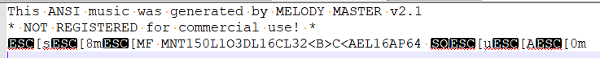

# System Notification Tunes

PX4 defines a number of [standard tones/tunes](../getting_started/tunes.md) that are used to provide audio notification for important system states and problems (e.g. system startup, arming success, battery warnings, etc.)

Tunes are specified using strings (in [ANSI Music notation](http://artscene.textfiles.com/ansimusic/information/ansimtech.txt)) and played by code using the [tunes](https://github.com/PX4/PX4-Autopilot/tree/main/src/lib/tunes) library.
The tunes library also contains the list of default system tunes - see [lib/tunes/tune_definition.desc](https://github.com/PX4/PX4-Autopilot/blob/main/src/lib/tunes/tune_definition.desc).

PX4 also has a module that can be used to play (test) the default tunes or a user defined tune.

This topic provides general guidance on how to create your own tunes and add to/replace the system notification tones/tunes.

## Creating Tunes

Tune strings are defined using [ANSI Music notation](http://artscene.textfiles.com/ansimusic/information/ansimtech.txt).

:::tip
More information about the format can be found in [QBasic PLAY statement](https://en.wikibooks.org/wiki/QBasic/Appendix#PLAY) (Wikibooks) and has been reproduced in [tune_definition.desc](https://github.com/PX4/PX4-Autopilot/blob/main/src/lib/tunes/tune_definition.desc).
:::

The easiest way to create a new tune is to use a music editor.
This allows you to edit the music and play it back on your computer, then export it to a format that can be played by PX4.

ANSI music was popular in the days of ANSI BBS systems, and so the best editing tools are DOS utilities.
On Windows, one option is to use _Melody Master_ within _Dosbox_.

The steps for using the software are:

1. Download [DosBox](http://www.dosbox.com/) and install the app
1. Download [Melody Master](ftp://archives.thebbs.org/ansi_utilities/melody21.zip) and unzip into a new directory
1. Open the _Dosbox_ console
1. Mount the melody master directory in Dosbox as shown below:

   ```sh
   mount c C:\<path_to_directory\Melody21
   ```

1. Start _Melody Master_ with the following commands

   ```sh
   c:
   start
   ```

1. You will then have the option to click through a few screens, then press **1** to display _Melody Master_:
   

   The lower half of the screen provides helpful advice on keyboard shortcuts for using the tool (arrows for moving in stave, and numbers for selecting the note length, etc.).

1. When you're ready to save the music:
   - Press **F2** to give the tune a name and save it in the _/Music_ sub folder of your Melody Master installation.
   - Press **F7**, the scroll down the list of output formats on the right to get to ANSI.
     The file will be exported to the _root_ of the Melody Master directory (with the same name and a file-type specific extension).
1. Open the file.
   The output might look like this:

   

1. The string that can be played in PX4 is the bit between `MNT` and `P64`: `150L1O3DL16CL32<B>C<AEL16A`

## Testing Tunes

When you're ready to try it out a new tune on PX4, use the [tune_control](../modules/modules_system.md#tune-control) library.
For example, to test the tune we "created" above you would enter the following command on a console or shell (e.g. the [MAVLink Shell](../debug/mavlink_shell.md)):

```sh
tune_control play -m "150L1O3DL16CL32<B>C<AEL16A"
```

::: info
Out of the box, the `tune_control` is only present on real hardware (not the simulator).
:::

## Replacing Existing Tunes

Tunes are defined within [tune_definition.desc](https://github.com/PX4/PX4-Autopilot/blob/main/src/lib/tunes/tune_definition.desc).

If you just need to replace an existing tune, then you can replace the file in your own fork, and update the tune strings defined in `PX4_DEFINE_TUNE`.

## Adding a New Tune

TBD.

<!--

1. Assumption is that you need to define a new `PX4_DEFINE_TUNE` with its own number in the file.
2. Need to look at how tunes are played. Problem for another day.

-->
