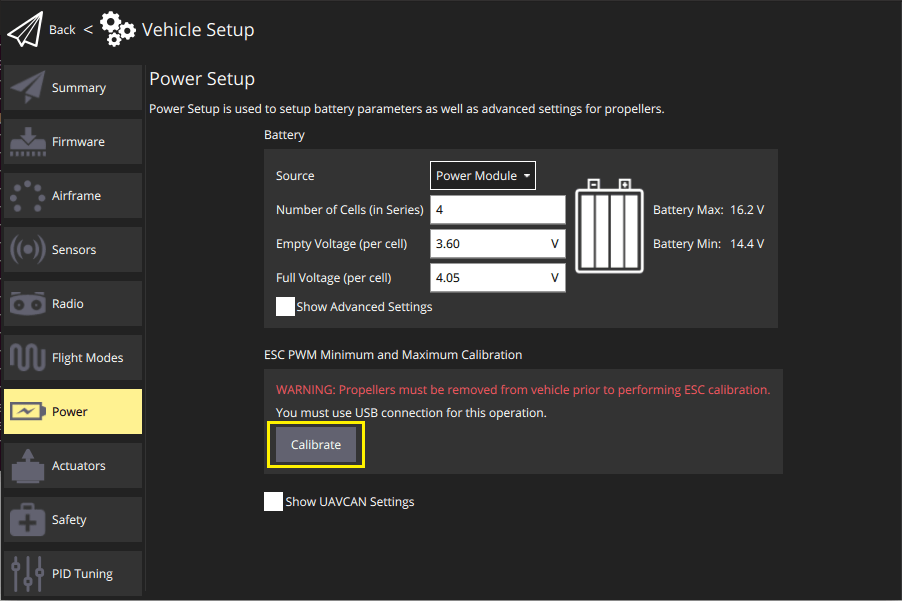
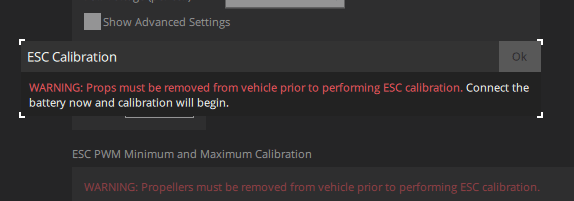
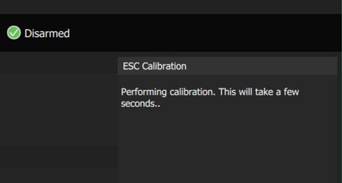
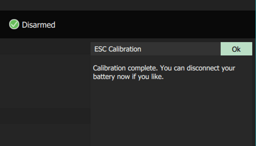

# ESC Calibration

::: info
These instructions are only relevant to [PWM ESCs](../peripherals/pwm_escs_and_servo.md) and [OneShot ESCs](../peripherals/oneshot.md).
[DShot](../peripherals/dshot.md) and [CAN](../can/index.md) ESCs ([DroneCAN](../dronecan/escs.md)/Cyphal) do not require this kind of calibration.
:::

Electronic Speed Controllers (ESCs) regulate motor speed (and direction) based on their input command from the flight controller (FC).
The range of input commands to which an ESC will respond is often configurable, and the default range can differ even between ESCs of the same model.

This calibration updates all the ESCs with a fixed maximum (2000us) and minimum (1000us) PWM input from the flight controller.
Subsequently all the ESCs/motors on the vehicle will respond to flight controller input in the same way, across the whole input range.

Calibration using this tool is recommended for all PWM/OneShot ESCs that support it.

::: info
Calibration is particularly important for low-cost ESC, as they commonly vary a lot in their response to input.

However it is also recommended for high-quality controllers.
Even though these are factory calibrated and should all respond the same way, in practice the input range can differ.
For example if a controller has been manually calibrated after leaving the factory it may no longer behave in the same way.
:::

:::warning
If you want to use an ESC that does not support this calibration, then it must be factory calibrated and respond consistently out of the box.
This should be verified using [Actuator Testing](../config/actuators.md#actuator-testing).
Jump to the [actuator configuration step (7)](#actuatorconfig_step) (which is still important).
:::

OneShot ESCs should be [configured to use OneShot](../peripherals/oneshot.md#px4-configuration) before calibration. You should calibrate the ESCs after switching, even if you have previously calibrated.

## Preconditions

The calibration sequence requires that you are able keep the flight controller powered while manually power-cyling the ESCs.

If using a Pixhawk flight controller, the recommended way to do this is to separately power the flight controller via USB, and connect/disconnect the battery to power the ESCs when needed.
Flight control systems that can't power the autopilot via USB will need a [different approach](#problem_power_module).

If the battery is connected via a power module the calibration procedure can detect the battery connection and use it to drive the calibration sequence.
If battery power can't be detected the calibration sequence is performed based on timeouts.

## Steps

To calibrate the ESCs:

1. Remove the propellers.

   :::warning
   Never attempt ESC calibration with propellers on!

   The motors _should_ not spin during ESC calibration.
   However if calibration starts when the ESC is already powered, or if the ESC doesn't properly support/detect the calibration sequence, then it will respond to the PWM input by running the motor at maximum speed.
   :::

1. Map the ESCs you're calibrating as motors in the vehicle's [Actuator Configuration](../config/actuators.md).
   Only mapped actuators get an output and only ESCs mapped as motors will be calibrated.

1. Unpower the ESCs by unplugging the battery.
   The flight controller must stay powered, for example, by keeping the USB connected to the ground station.

1. Open the _QGroundControl_ **Settings > Power**, then press the **Calibrate** button.

   

1. After starting the calibration sequence without error, directly power the ESCs (you should be prompted):

   

   The calibration will begin automatically:

   

1. During the calibration you should hear model-specific beeping from the ESC, which indicates the individual steps of the calibration.

   You will be prompted when the calibration completes.

   
   

1. Go back to the [Actuator Configuration](../config/actuators.md) section.

   Following ESC calibration all motors with the same (re)calibrated ESCs should behave in the same way for the same inputs. The default PWM settings for motor outputs in the actuator configuration should now work out of the box.

   You need to confirm that the motors do indeed work correctly.
   Since the default configuration values have been set conservatively, you may also wish to tune them for your particular ESCs.

   ::: info
   The steps below are similar to those described in [Actuator Configuration > Motor Configuration](../config/actuators.md#motor-configuration).
   :::

   Verify the following values:

   - The minimum value for a motor (default: `1100us`) should make the motor spin slowly but reliably, and also spin up reliably after it was stopped.

     You can confirm that a motor spins at minimum (still without propellers) in [Actuator Testing](../config/actuators.md#actuator-testing), by enabling the sliders, and then moving the test output slider for the motor to the first snap position from the bottom.
     The correct value should make the motor spin immediately and reliably as you move the slider from disarmed to minimum.

     To find the "optimal" minimum value, move the slider to the bottom (disarmed).
     Then increase the PWM output's `disarmed` setting in small increments (e.g. 1025us, 1050us, etc), until the motor starts to spin reliably (it is better to be a little too high than a little too low).
     Enter this value into the `minimum` setting for all the motor PWM outputs, and restore the `disarmed` output to `1100us`.

   - The maximum value for a motor (default: `1900us`) should be chosen such that increasing the value doesn't make the motor spin any faster.

     You can confirm that the motor spins quickly at the maximum setting in [Actuator Testing](../config/actuators.md#actuator-testing), by moving the associated test output slider to the top position.

     To find the "optimal" maximum value, first move the slider to the bottom (disarmed).
     Then increase the PWM output's `disarmed` setting to near the default maximum (`1900`) - the motors should spin up.
     Listen to the tone of the motor as you increase the PWM maximum value for the output in increments (e.g. 1925us, 1950us, etc).
     The optimal value is found at the point when the sound of the motors does not change as you increase the value of the output.
     Enter this value into the `maximum` setting for all the motor PWM outputs, and restore the `disarmed` output to `1100us`.

   - The disarmed value for a motor (default: `1000us`) should make the motor stop and stay stopped.

     You can confirm this in [Actuator Testing](../config/actuators.md#actuator-testing) by moving the test output slider to the snap position at the bottom of the slider and observing that the motor does not spin.

     If the ESC spins with the default value of 1000us then the ESC is not properly calibrated.
     If using an ESC that can't be calibrated, you should reduce the PWM output value for the output to below where the motor does not spin anymore (such as 950us or 900us).

   ::: info
   VTOL and fixed-wing motors do not need any special PWM configuration.
   With the default PWM configuration they will automatically stop during flight when commanded by the autopilot.
   :::

## Troubleshooting

1. Calibration can state that it has succeeded even when it has failed.

   This happens if you do not power the ESC at the right time, or the ESCs don't support calibration.
   This occurs because PX4 has no feedback from the ESC to know whether or not calibration was successful.
   You have to rely on interpreting the beeps during the calibration and subsequent motor tests to know for sure that the calibration worked.

   

1. Calibration cannot be started if you have a power module configured and connected (for safety reasons).

   Unplug power to the ESCs first.
   If you're blocked because a power module is necessary to keep your flight controller alive, but you can (un)power the ESCs separately, you can temporarily disable the detection of the power module just for the ESC calibration using the parameters [BATn_SOURCE](../advanced_config/parameter_reference.md#BAT1_SOURCE). Once the power module that's powering the autopilot is not detected as battery anymore a timing based calibration is possible.

1. PX4 will abort calibration (for safety reasons) if the system detects an increase in current consumption immediately after initiating calibration.
   This requires a power module.
