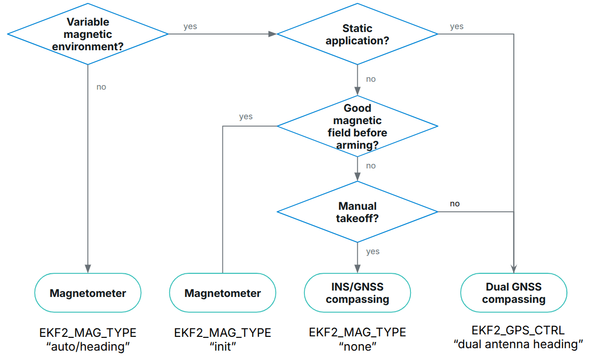
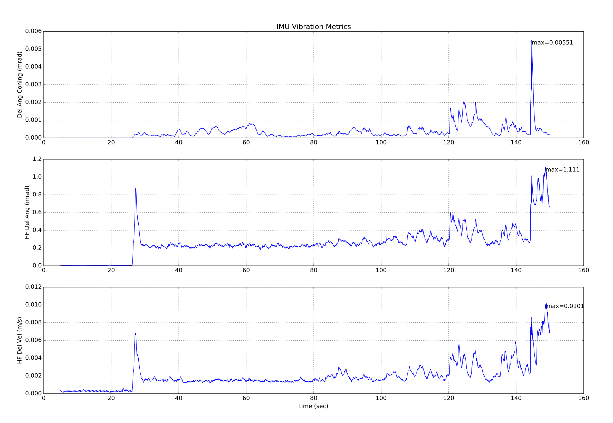

# Using PX4's Navigation Filter (EKF2)

This tutorial answers common questions about use of the EKF algorithm used for navigation.

:::tip
The [PX4 State Estimation Overview](https://youtu.be/HkYRJJoyBwQ) video from the _PX4 Developer Summit 2019_ (Dr. Paul Riseborough) provides an overview of the estimator, and additionally describes both the major changes from 2018/2019, major changes and improvements were added since then.
:::

## Overview

PX4's Navigation filter uses an Extended Kalman Filter (EKF) algorithm to process sensor measurements and provide an estimate of the following states:

- Quaternion defining the rotation from North, East, Down local navigation frame to X, Y, Z body frame
- Velocity at the IMU - North, East, Down (m/s)
- Position at the IMU - Latitude (rad), Longitude (rad), Altitude (m)
- IMU gyro bias estimates - X, Y, Z (rad/s)
- IMU accelerometer bias estimates - X, Y, Z (m/s<sup>2</sup>)
- Earth Magnetic field components - North, East, Down \(gauss\)
- Vehicle body frame magnetic field bias - X, Y, Z \(gauss\)
- Wind velocity - North, East \(m/s\)
- Terrain altitude (m)

To improve stability, an "error-state" formulation is implemented
This is especially relevant when estimating the uncertainty of a rotation which is a 3D vector (tangent space of SO(3)).

The EKF runs on a delayed 'fusion time horizon' to allow for different time delays on each measurement relative to the IMU.
Data for each sensor is FIFO buffered and retrieved from the buffer by the EKF to be used at the correct time.
The delay compensation for each sensor is controlled by the [EKF2\_\*\_DELAY](../advanced_config/parameter_reference.md#ekf2) parameters.

A complementary filter is used to propagate the states forward from the 'fusion time horizon' to current time using the buffered IMU data.
The time constant for this filter is controlled by the [EKF2_TAU_VEL](../advanced_config/parameter_reference.md#EKF2_TAU_VEL) and [EKF2_TAU_POS](../advanced_config/parameter_reference.md#EKF2_TAU_POS) parameters.

::: info
The 'fusion time horizon' delay and length of the buffers is determined by [EKF2_DELAY_MAX](../advanced_config/parameter_reference.md#EKF2_DELAY_MAX).
This value should be at least as large as the longest delay `EKF2\_\*\_DELAY`.
Reducing the 'fusion time horizon' delay reduces errors in the complementary filter used to propagate states forward to current time.
:::

The EKF uses the IMU data for state prediction only.
IMU data is not used as an observation in the EKF derivation.
The algebraic equations for the covariance prediction and measurement jacobians are derived using [SymForce](https://symforce.org/) and can be found here: [Symbolic Derivation](https://github.com/PX4/PX4-Autopilot/blob/main/src/modules/ekf2/EKF/python/ekf_derivation/derivation.py).
Covariance update is done using the [Joseph Stabilized form](https://en.wikipedia.org/wiki/Kalman_filter#Deriving_the_posteriori_estimate_covariance_matrix) to improve numerical stability and allow conditional update of independent states.

### Precisions about the position output

The position is estimated as latitude, longitude and altitude and the INS integration is performed using the WGS84 ellipsoid mode.
However, the position uncertainty is defined in the local navigation frame at the current position (i.e.: NED error in meters).

The position and velocity states are adjusted to account for the offset between the IMU and the body frame before they are output to the control loops.

The position of the IMU relative to the body frame is set by the `EKF2_IMU_POS_X,Y,Z` parameters.

In addition to the global position estimate in latitude/longitude/altitude, the filter also provides a local position estimate (NED in meters) by projecting the global position estimate using an [azimuthal_equidistant_projection](https://en.wikipedia.org/wiki/Azimuthal_equidistant_projection) centred on an arbitrary origin.
This origin is automatically set when global position measurements are fused but can also be specified manually.
If no global position information is provided, only the local position is available and the INS integration is performed on a spherical Earth.

## Running a Single EKF Instance

The _default behaviour_ is to run a single instance of the EKF.
In this case sensor selection and failover is performed before data is received by the EKF.
This provides protection against a limited number of sensor faults, such as loss of data, but does not protect against the sensor providing inaccurate data that exceeds the ability of the EKF and control loops to compensate.

The parameter settings for running a single EKF instance are:

- [EKF2_MULTI_IMU](../advanced_config/parameter_reference.md#EKF2_MULTI_IMU) = 0
- [EKF2_MULTI_MAG](../advanced_config/parameter_reference.md#EKF2_MULTI_MAG) = 0
- [SENS_IMU_MODE](../advanced_config/parameter_reference.md#SENS_IMU_MODE) = 1
- [SENS_MAG_MODE](../advanced_config/parameter_reference.md#SENS_MAG_MODE) = 1

## Running Multiple EKF Instances

Depending on the number of IMUs and magnetometers and the autopilot's CPU capacity, multiple instances of the EKF can be run.
This provides protection against a wider range of sensor errors and is achieved by each EKF instance using a different sensor combination.
By comparing the internal consistency of each EKF instance, the EKF selector is able to determine the EKF and sensor combination with the best data consistency.
This enables faults such as sudden changes in IMU bias, saturation or stuck data to be detected and isolated.

The total number of EKF instances is the product of the number of IMU's and number of magnetometers selected by [EKF2_MULTI_IMU](../advanced_config/parameter_reference.md#EKF2_MULTI_IMU) and [EKF2_MULTI_MAG](../advanced_config/parameter_reference.md#EKF2_MULTI_MAG) and is given by the following formula:

> N_instances = MAX([EKF2_MULTI_IMU](../advanced_config/parameter_reference.md#EKF2_MULTI_IMU) , 1) x MAX([EKF2_MULTI_MAG](../advanced_config/parameter_reference.md#EKF2_MULTI_MAG) , 1)

For example an autopilot with 2 IMUs and 2 magnetometers could run with EKF2_MULTI_IMU = 2 and EKF2_MULTI_MAG = 2 for a total of 4 EKF instances where each instance uses the following combination of sensors:

- EKF instance 1 : IMU 1, magnetometer 1
- EKF instance 2 : IMU 1, magnetometer 2
- EKF instance 3 : IMU 2, magnetometer 1
- EKF instance 4 : IMU 2, magnetometer 2

The maximum number of IMU or magnetometer sensors that can be handled is 4 of each for a theoretical maximum of 4 x 4 = 16 EKF instances.
In practice this is limited by available computing resources.
During development of this feature, testing with STM32F7 CPU based HW demonstrated 4 EKF instances with acceptable processing load and memory utilisation margin.

:::warning
Ground based testing to check CPU and memory utilisation should be performed before flying.
:::

If [EKF2_MULTI_IMU](../advanced_config/parameter_reference.md#EKF2_MULTI_IMU) >= 3, then the failover time for large rate gyro errors is further reduced because the EKF selector is able to apply a median select strategy for faster isolation of the faulty IMU.

The setup for multiple EKF instances is controlled by the following parameters:

- [SENS_IMU_MODE](../advanced_config/parameter_reference.md#SENS_IMU_MODE):
  Set to 0 if running multiple EKF instances with IMU sensor diversity, ie [EKF2_MULTI_IMU](../advanced_config/parameter_reference.md#EKF2_MULTI_IMU) > 1.

  When set to 1 (default for single EKF operation) the sensor module selects IMU data used by the EKF.
  This provides protection against loss of data from the sensor but does not protect against bad sensor data.
  When set to 0, the sensor module does not make a selection.

- [SENS_MAG_MODE](../advanced_config/parameter_reference.md#SENS_MAG_MODE):
  Set to 0 if running multiple EKF instances with magnetometer sensor diversity, ie [EKF2_MULTI_MAG](../advanced_config/parameter_reference.md#EKF2_MULTI_MAG) > 1.

  When set to 1 (default for single EKF operation) the sensor module selects Magnetometer data used by the EKF.
  This provides protection against loss of data from the sensor but does not protect against bad sensor data.
  When set to 0, the sensor module does not make a selection.

- [EKF2_MULTI_IMU](../advanced_config/parameter_reference.md#EKF2_MULTI_IMU):
  This parameter specifies the number of IMU sensors used by the multiple EKF's.
  If `EKF2_MULTI_IMU` <= 1, then only the first IMU sensor will be used.
  When [SENS_IMU_MODE](../advanced_config/parameter_reference.md#SENS_IMU_MODE) = 1, this will be the sensor selected by the sensor module.
  If `EKF2_MULTI_IMU` >= 2, then a separate EKF instance will run for the specified number of IMU sensors up to the lesser of 4 or the number of IMU's present.

- [EKF2_MULTI_MAG](../advanced_config/parameter_reference.md#EKF2_MULTI_MAG):
  This parameter specifies the number of magnetometer sensors used by the multiple EKF's
  If `EKF2_MULTI_MAG` <= 1, then only the first magnetometer sensor will be used.
  When [SENS_MAG_MODE](../advanced_config/parameter_reference.md#SENS_MAG_MODE) = 1, this will be the sensor selected by the sensor module.
  If `EKF2_MULTI_MAG` >= 2, then a separate EKF instance will run for the specified number of magnetometer sensors up to the lesser of 4 or the number of magnetometers present.

::: info
The recording and [EKF2 replay](../debug/system_wide_replay.md#ekf2-replay) of flight logs with multiple EKF instances is not supported.
To enable recording for EKF replay you must set the parameters to enable a [single EKF instance](#running-a-single-ekf-instance).
:::

## What sensor measurements does it use?

The EKF has different modes of operation that allow for different combinations of sensor measurements.
On start-up the filter checks for a minimum viable combination of sensors and after initial tilt, yaw and height alignment is completed, enters a mode that provides rotation, vertical velocity, vertical position, IMU delta angle bias and IMU delta velocity bias estimates.

This mode requires IMU data, a source of yaw (magnetometer or external vision) and a source of height data.
This minimum data set is required for all EKF modes of operation.
Other sensor data can then be used to estimate additional states.

### IMU

- Three axis body fixed Inertial Measurement unit delta angle and delta velocity data at a minimum rate of 100Hz.
  Note: Coning corrections should be applied to the IMU delta angle data before it is used by the EKF.

### Magnetometer

Three axis body fixed magnetometer data at a minimum rate of 5Hz is required to be considered by the estimator.

::: info

- The magnetometer **biases** are only observable while the drone is rotating
- The true heading is observable when the vehicle is accelerating (linear acceleration) while absolute position or velocity measurements are fused (e.g. GPS).
  This means that magnetometer heading measurements are optional after initialization if those conditions are met often enough to constrain the heading drift (caused by gyro bias).

:::

Magnetometer data fusion can be configured using [EKF2_MAG_TYPE](../advanced_config/parameter_reference.md#EKF2_MAG_TYPE):

0. Automatic:
   - The magnetometer readings only affect the heading estimate before arming, and the whole attitude after arming.
   - Heading and tilt errors are compensated when using this method.
   - Incorrect magnetic field measurements can degrade the tilt estimate.
   - The magnetometer biases are estimated whenever observable.
1. Magnetic heading:
   - Only the heading is corrected.
     The tilt estimate is never affected by incorrect magnetic field measurements.
   - Tilt errors that could arise when flying without velocity/position aiding are not corrected when using this method.
   - The magnetometer biases are estimated whenever observable.
2. Deprecated
3. Deprecated
4. Deprecated
5. None:
   - Magnetometer data is never used.
     This is useful when the data can never be trusted (e.g.: high current close to the sensor, external anomalies).
   - The estimator will use other sources of heading: [GPS heading](#yaw-measurements) or external vision.
   - When using GPS measurements without another source of heading, the heading can only be initialized after sufficient horizontal acceleration.
     See [Estimate yaw from vehicle movement](#yaw-from-gps-velocity) below.
6. Init only:
   - Magnetometer data is only used to initialize the heading estimate.
     This is useful when the data can be used before arming but not afterwards (e.g.: high current after the vehicle is armed).
   - After initialization, the heading is constrained using other observations.
   - Unlike mag type `None`, when combined with GPS measurements, this method allows position controlled modes to run directly during takeoff.

The following selection tree can be used to select the right option:



### Height

A source of height data - GPS, barometric pressure, range finder, external vision or a combination of those at a minimum rate of 5Hz is required.

If none of the selected measurements are present, the EKF will not start.
When these measurements have been detected, the EKF will initialise the states and complete the tilt and yaw alignment.
When tilt and yaw alignment is complete, the EKF can then transition to other modes of operation enabling use of additional sensor data:

Each height source can be enabled/disabled using its dedicated control parameter:

- [GNSS/GPS](#gnss-gps): [EKF2_GPS_CTRL](../advanced_config/parameter_reference.md#EKF2_GPS_CTRL)
- [Barometer](#barometer): [EKF2_BARO_CTRL](../advanced_config/parameter_reference.md#EKF2_BARO_CTRL)
- [Range finder](#range-finder): [EKF2_RNG_CTRL](../advanced_config/parameter_reference.md#EKF2_RNG_CTRL)
- [External vision](#external-vision-system): Enabled when [EKF2_HGT_REF](../advanced_config/parameter_reference.md#EKF2_HGT_REF) is set to "Vision"

Over the long term the height estimate follows the "reference source" of height data.
This reference is defined by the [EKF2_HGT_REF](../advanced_config/parameter_reference.md#EKF2_HGT_REF) parameter.

#### Typical configurations

|                           | [EKF2_GPS_CTRL](../advanced_config/parameter_reference.md#EKF2_GPS_CTRL) | [EKF2_BARO_CTRL](../advanced_config/parameter_reference.md#EKF2_BARO_CTRL) | [EKF2_RNG_CTRL](../advanced_config/parameter_reference.md#EKF2_RNG_CTRL) | [EKF2_HGT_REF](../advanced_config/parameter_reference.md#EKF2_HGT_REF) |
| ------------------------- | ------------------------------------------------------------------------ | -------------------------------------------------------------------------- | ------------------------------------------------------------------------ | ---------------------------------------------------------------------- |
| Outdoor (default)         | 7 (Lon/lat/alt/vel)                                                      | 1 (enabled)                                                                | 1 ([conditional](#conditional-range-aiding))                             | 1 (GNSS)                                                               |
| Indoor (non-flat terrain) | 0 (disabled)                                                             | 1 (enabled)                                                                | 1 ([conditional](#conditional-range-aiding))                             | 2 (range)                                                              |
| Indoor (flat terrain)     | 0 (disabled)                                                             | 1 (enabled)                                                                | 2 ([always enabled](#range-height-fusion))                               | 2 (range)                                                              |
| External vision           | As required                                                              | As required                                                                | As required                                                              | 3 (vision)                                                             |

### Barometer

Enable/disable using [EKF2_BARO_CTRL](../advanced_config/parameter_reference.md#EKF2_BARO_CTRL) as a source for [Height](#height) data.

Note that data from only one barometer is fused, even if multiple barometers are available.
The barometer with the highest [CAL_BAROx_PRIO](../advanced_config/parameter_reference.md#CAL_BARO0_PRIO) priority value is selected first, falling back to the next highest priority barometer if a sensor fault is detected.
If barometers have equal-highest priorities, the first detected is used.
A barometer can be completely disabled as a possible source by setting its `CAL_BAROx_PRIO` value to `0` (disabled).

See [Height](#height) more details about the configuration of height sources.

#### Correction for Static Pressure Position Error

Barometric pressure altitude is subject to errors generated by aerodynamic disturbances caused by vehicle wind relative velocity and orientation.
This is known in aeronautics as _static pressure position error_.
The EKF2 module that uses the ECL/EKF2 estimator library provides a method of compensating for these errors, provided wind speed state estimation is active.

For vehicles operating in a fixed-wing mode, wind speed state estimation requires either [Airspeed](#airspeed) and/or [Synthetic Sideslip](#synthetic-sideslip) fusion to be enabled.

For multi-rotors, fusion of [Drag Specific Forces](#mc_wind_estimation_using_drag) can be enabled and tuned to provide the required wind velocity state estimates.

The EKF2 module models the error as a body fixed ellipsoid that specifies the fraction of dynamic pressure that is added to/subtracted from the barometric pressure - before it is converted to a height estimate.

A good tuning is obtained as follows:

1. Fly once in [Position mode](../flight_modes_mc/position.md) repeatedly forwards/backwards/left/right/up/down between rest and maximum speed (best results are obtained when this testing is conducted in still conditions).
2. Extract the `.ulg` log file using, for example, [QGroundControl: Analyze > Log Download](https://docs.qgroundcontrol.com/master/en/qgc-user-guide/analyze_view/log_download.html)

   ::: info
   The same log file can be used to tune the [multirotor wind estimator](#mc_wind_estimation_using_drag).
   :::

3. Use the log with the [baro_static_pressure_compensation_tuning.py](https://github.com/PX4/PX4-Autopilot/tree/main/src/modules/ekf2/EKF/python/tuning_tools/baro_static_pressure_compensation) Python script to obtain the optimal set of parameters.

Tuning parameters:

- [EKF2_PCOEF_XP](../advanced_config/parameter_reference.md#EKF2_PCOEF_XP)
- [EKF2_PCOEF_XN](../advanced_config/parameter_reference.md#EKF2_PCOEF_XN)
- [EKF2_PCOEF_YP](../advanced_config/parameter_reference.md#EKF2_PCOEF_YP)
- [EKF2_PCOEF_YN](../advanced_config/parameter_reference.md#EKF2_PCOEF_YN)
- [EKF2_PCOEF_Z](../advanced_config/parameter_reference.md#EKF2_PCOEF_Z)

#### Barometer bias compensation

A barometer at a constant altitude is subject to drift in its measurements due to changes in the ambient pressure environment or variations of the sensor temperature.
To compensate for this measurement error, EKF2 estimates the bias using GNSS height (if available) a "non drifting" reference.
No tuning is required.

### GNSS/GPS

#### Position and Velocity Measurements

GPS measurements will be used for position and velocity if the following conditions are met:

- GPS use is enabled via setting of the [EKF2_GPS_CTRL](../advanced_config/parameter_reference.md#EKF2_GPS_CTRL) parameter.
- GPS quality checks have passed.
  These checks are controlled by the [EKF2_GPS_CHECK](../advanced_config/parameter_reference.md#EKF2_GPS_CHECK) and `EKF2_REQ_*` parameters.

For more details about the configuration of height sources, [click here](#height).

#### Yaw Measurements

Some GPS receivers such as the [Trimble MB-Two RTK GPS receiver](https://www.trimble.com/Precision-GNSS/MB-Two-Board.aspx) can be used to provide a heading measurement that replaces the use of magnetometer data.
This can be a significant advantage when operating in an environment where large magnetic anomalies are present, or at latitudes here the earth's magnetic field has a high inclination.
Use of GPS yaw measurements is enabled by setting bit position 3 to 1 (adding 8) in the [EKF2_GPS_CTRL](../advanced_config/parameter_reference.md#EKF2_GPS_CTRL) parameter.

#### Yaw From GPS Velocity

The EKF runs an additional multi-hypothesis filter internally that uses multiple 3-state Extended Kalman Filters (EKF's) whose states are NE velocity and yaw angle.
These individual yaw angle estimates are then combined using a Gaussian Sum Filter (GSF).
The individual 3-state EKF's use IMU and GPS horizontal velocity data (plus optional airspeed data) and do not rely on any prior knowledge of the yaw angle or magnetometer measurements.
This provides a backup to the yaw from the main filter and is used to reset the yaw for the main 24-state EKF when a post-takeoff loss of navigation indicates that the yaw estimate from the magnetometer is bad.
This will result in an `Emergency yaw reset - magnetometer use stopped` message information message at the GCS.

Data from this estimator is logged when ekf2 replay logging is enabled and can be viewed in the `yaw_estimator_status` message.
The individual yaw estimates from the individual 3-state EKF yaw estimators are in the `yaw` fields.
The GSF combined yaw estimate is in the `yaw_composite` field.
The variance for the GSF yaw estimate is in the `yaw_variance` field.
All angles are in radians.
Weightings applied by the GSF to the individual 3-state EKF outputs are in the`weight` fields.

This also makes it possible to operate without any magnetometer data or dual antenna GPS receiver for yaw provided some horizontal movement after takeoff can be performed to enable the yaw to become observable.
To use this feature, set [EKF2_MAG_TYPE](../advanced_config/parameter_reference.md#EKF2_MAG_TYPE) to `none` (5) to disable magnetometer use.
Once the vehicle has performed sufficient horizontal movement to make the yaw observable, the main 24-state EKF will align it's yaw to the GSF estimate and commence use of GPS.

#### Dual Receivers

Data from GPS receivers can be blended using an algorithm that weights data based on reported accuracy (this works best if both receivers output data at the same rate and use the same accuracy).
The mechanism also provides automatic failover if data from a receiver is lost (it allows, for example, a standard GPS to be used as a backup to a more accurate RTK receiver).
This is controlled by the [SENS_GPS_MASK](../advanced_config/parameter_reference.md#SENS_GPS_MASK) parameter.

The [SENS_GPS_MASK](../advanced_config/parameter_reference.md#SENS_GPS_MASK) parameter is set by default to disable blending and always use the first receiver, so it will have to be set to select which receiver accuracy metrics are used to decide how much each receiver output contributes to the blended solution.
Where different receiver models are used, it is important that the [SENS_GPS_MASK](../advanced_config/parameter_reference.md#SENS_GPS_MASK) parameter is set to a value that uses accuracy metrics that are supported by both receivers.
For example do not set bit position 0 to `true` unless the drivers for both receivers publish values in the `s_variance_m_s` field of the `vehicle_gps_position` message that are comparable.
This can be difficult with receivers from different manufacturers due to the different way that accuracy is defined, e.g. CEP vs 1-sigma, etc.

The following items should be checked during setup:

- Verify that data for the second receiver is present.
  This will be logged as `vehicle_gps_position_1` and can also be checked when connected via the _nsh console_ using the command `listener vehicle_gps_position -i 1`.
  The [GPS_2_CONFIG](../advanced_config/parameter_reference.md#GPS_2_CONFIG) parameter will need to be set correctly.
- Check the `s_variance_m_s`, `eph` and `epv` data from each receiver and decide which accuracy metrics can be used.
  If both receivers output sensible `s_variance_m_s` and `eph` data, and GPS vertical position is not being used directly for navigation, then setting [SENS_GPS_MASK](../advanced_config/parameter_reference.md#SENS_GPS_MASK) to 3 is recommended.
  Where only `eph` data is available and both receivers do not output `s_variance_m_s` data, set [SENS_GPS_MASK](../advanced_config/parameter_reference.md#SENS_GPS_MASK) to 2.
  Bit position 2 would only be set if the GPS had been selected as the reference height source with the [EKF2_HGT_REF](../advanced_config/parameter_reference.md#EKF2_HGT_REF) parameter and both receivers output sensible `epv` data.
- The output from the blended receiver data is logged as `ekf_gps_position`, and can be checked whilst connect via the nsh terminal using the command `listener ekf_gps_position`.
- Where receivers output at different rates, the blended output will be at the rate of slower receiver.
  Where possible receivers should be configured to output at the same rate.

#### GNSS Performance Requirements

For the ECL to accept GNSS data for navigation, certain minimum requirements need to be satisfied over a period of time, defined by [EKF2_REQ_GPS_H](../advanced_config/parameter_reference.md#EKF2_REQ_GPS_H) (10 seconds by default).

Minima are defined in the [EKF2*REQ*\*](../advanced_config/parameter_reference.md#EKF2_REQ_EPH) parameters and each check can be enabled/disabled using the [EKF2_GPS_CHECK](../advanced_config/parameter_reference.md#EKF2_GPS_CHECK) parameter.

The table below shows the different metrics directly reported or calculated from the GNSS data, and the minimum required values for the data to be used by ECL.
In addition, the _Average Value_ column shows typical values that might reasonably be obtained from a standard GNSS module (e.g. u-blox M8 series) - i.e. values that are considered good/acceptable.

| Metric               | Minimum required                                                                          | Average Value | Units | Notes                                                                                                                                       |
| -------------------- | ----------------------------------------------------------------------------------------- | ------------- | ----- | ------------------------------------------------------------------------------------------------------------------------------------------- |
| eph                  | <&nbsp;3 ([EKF2_REQ_EPH](../advanced_config/parameter_reference.md#EKF2_REQ_EPH))         | 0.8           | m     | Standard deviation of horizontal position error                                                                                             |
| epv                  | <&nbsp;5 ([EKF2_REQ_EPV](../advanced_config/parameter_reference.md#EKF2_REQ_EPV))         | 1.5           | m     | Standard deviation of vertical position error                                                                                               |
| Number of satellites | ≥6&nbsp;([EKF2_REQ_NSATS](../advanced_config/parameter_reference.md#EKF2_REQ_NSATS))      | 14            | -     |
| sacc                 | <&nbsp;0.5 ([EKF2_REQ_SACC](../advanced_config/parameter_reference.md#EKF2_REQ_SACC))     | 0.2           | m/s   | Standard deviation of horizontal speed error                                                                                                |
| fix type             | ≥&nbsp;3                                                                                  | 4             | -     | 0-1: no fix, 2: 2D fix, 3: 3D fix, 4: RTCM code differential, 5: Real-Time Kinematic, float, 6: Real-Time Kinematic, fixed, 8: Extrapolated |
| PDOP                 | <&nbsp;2.5 ([EKF2_REQ_PDOP](../advanced_config/parameter_reference.md#EKF2_REQ_PDOP))     | 1.0           | -     | Position dilution of precision                                                                                                              |
| hpos drift rate      | <&nbsp;0.1 ([EKF2_REQ_HDRIFT](../advanced_config/parameter_reference.md#EKF2_REQ_HDRIFT)) | 0.01          | m/s   | Drift rate calculated from reported GNSS position (when stationary).                                                                        |
| vpos drift rate      | <&nbsp;0.2 ([EKF2_REQ_VDRIFT](../advanced_config/parameter_reference.md#EKF2_REQ_VDRIFT)) | 0.02          | m/s   | Drift rate calculated from reported GNSS altitude (when stationary).                                                                        |
| hspd                 | <&nbsp;0.1 ([EKF2_REQ_HDRIFT](../advanced_config/parameter_reference.md#EKF2_REQ_HDRIFT)) | 0.01          | m/s   | Filtered magnitude of reported GNSS horizontal velocity.                                                                                    |
| vspd                 | <&nbsp;0.2 ([EKF2_REQ_VDRIFT](../advanced_config/parameter_reference.md#EKF2_REQ_VDRIFT)) | 0.02          | m/s   | Filtered magnitude of reported GNSS vertical velocity.                                                                                      |

::: info
The `hpos_drift_rate`, `vpos_drift_rate` and `hspd` are calculated over a period of 10 seconds and published in the `ekf2_gps_drift` topic.
Note that `ekf2_gps_drift` is not logged!
:::

### Range Finder

[Range finder](../sensor/rangefinders.md) distance to ground is used by a single state filter to estimate the vertical position of the terrain relative to the height datum.

The fusion modes of operation are controlled by [EKF2_RNG_CTRL](../advanced_config/parameter_reference.md#EKF2_RNG_CTRL):

1. [Conditional range aiding](#conditional-range-aiding)
1. [Range height fusion](#range-height-fusion)

For more details about the configuration of height sources, [click here](#height).

#### Conditional range aiding

Conditional range finder fusion (a.k.a. _Conditional range aid_) activates the range finder fusion for height estimation during low speed/low altitude operation (in addition to the other active height sources).
If the range finder is set as the reference height source (using [EKF2_HGT_REF](../advanced_config/parameter_reference.md#EKF2_HGT_REF)), the other active height sources such as baro and GNSS altitude will adjust their measurement to match the readings of the range finder over time.
When the conditions are not met to start range aiding, a secondary reference is automatically selected.

::: info
Switching between height references causes the absolute altitude estimate to drift over time.
This isn't an issue when flying in position mode but can be problematic if the drone is supposed to fly a mission at a specific GNSS altitude.
If the absolute altitude drift is unwanted, it is recommended to set the GNSS altitude as the height reference, even when using conditional range aid.
:::

It is primarily intended for _takeoff and landing_, in cases where the barometer setup is such that interference from rotor wash is excessive and can corrupt EKF state estimates.

Range aid may also be used to improve altitude hold when the vehicle is stationary.

:::tip
[Terrain Hold](../flying/terrain_following_holding.md#terrain_hold) is recommended over _Range Aid_ for terrain holding.
This is because terrain hold uses the normal ECL/EKF estimator for determining height, and this is generally more reliable than a distance sensor in most conditions.
:::

_Conditional range aid_ is enabled by setting [EKF2_RNG_CTRL](../advanced_config/parameter_reference.md#EKF2_RNG_CTRL) = "Enabled (conditional mode)" (1).

It is further configured using the `EKF2_RNG_A_` parameters:

- [EKF2_RNG_A_VMAX](../advanced_config/parameter_reference.md#EKF2_RNG_A_VMAX): Maximum horizontal speed, above which range aid is disabled.
- [EKF2_RNG_A_HMAX](../advanced_config/parameter_reference.md#EKF2_RNG_A_HMAX): Maximum height, above which range aid is disabled.
- [EKF2_RNG_A_IGATE](../advanced_config/parameter_reference.md#EKF2_RNG_A_IGATE): Range aid consistency checks "gate" (a measure of the error before range aid is disabled).

#### Range height fusion

PX4 allows you to continuously fuse the range finder as a source of height (in any flight mode/vehicle type).
This may be useful for applications when the vehicle is _guaranteed_ to only fly over a near-flat surface (e.g. indoors).

When using a distance sensor as a height source, fliers should be aware:

- Flying over obstacles can lead to the estimator rejecting rangefinder data (due to internal data consistency checks), which can result in poor altitude holding while the estimator is relying purely on accelerometer estimates.

  ::: info
  This scenario might occur when a vehicle ascends a slope at a near-constant height above ground, because the rangefinder altitude does not change while that estimated from the accelerometer does.
  The EKF performs innovation consistency checks that take into account the error between measurement and current state as well as the estimated variance of the state and the variance of the measurement itself.
  If the checks fail the rangefinder data will be rejected, and the altitude will be estimated from the accelerometer and the other selected height sources (GNSS, baro, vision), if enabled and available
  After 5 seconds of inconsistent data if the distance sensor is the active source oh height data, the estimator resets the height state to match the current distance sensor data.
  If one or more other sources of height are active, the range finder is declared faulty and the estimator continues to estimate its height using the other sensors.
  The measurements might also become consistent again, for example, if the vehicle descends, or if the estimated height drifts to match the measured rangefinder height.
  :::

- The local NED origin will move up and down with ground level.
- Rangefinder performance over uneven surfaces (e.g. trees) can be very poor, resulting in noisy and inconsistent data.
  This again leads to poor altitude hold.

The feature is enabled by setting [EKF2_RNG_CTRL](../advanced_config/parameter_reference.md#EKF2_RNG_CTRL) to "Enabled" (2).
To make the range finder the height reference when active, set: [EKF2_HGT_REF](../advanced_config/parameter_reference.md#EKF2_HGT_REF) to "Range sensor".

:::tip
To enable the range finder fusion only when the drone is stationary (in order to benefit from a better altitude estimate during takeoff and landing) but not fuse the range finder the rest of the time, use the [conditional mode](#conditional-range-aiding) (1) of [EKF2_RNG_CTRL](../advanced_config/parameter_reference.md#EKF2_RNG_CTRL).
:::

#### Range Finder Obstruction Detection

The EKF can detect whether the rangefinder path-to-ground is obstructed (perhaps by a payload) using a kinematic consistency check between the vertical velocity estimate and the numerical derivative of the range finder data.
If the range finder is statistically inconsistent with EKF2, the sensor is rejected for the rest of the flight unless the statistical test passes again for at least 1 second at a vertical speed of 0.5m/s or more.

The check is only enabled when the rangefinder is not used as the primary height source, and is only active while the vehicle is not moving horizontally (as it assumes a static ground height).

For effective obstruction detection, the range finder noise parameter needs to be tightly tuned using flight data.
The kinematic consistency gate parameter can then be adjusted to obtain the desired fault detection sensitivity.

Tuning parameters:

- [EKF2_RNG_NOISE](../advanced_config/parameter_reference.md#EKF2_RNG_NOISE)
- [EKF2_RNG_K_GATE](../advanced_config/parameter_reference.md#EKF2_RNG_K_GATE)

### Airspeed

Equivalent Airspeed (EAS) data can be used to estimate wind velocity and reduce drift when GPS is lost by setting [EKF2_ARSP_THR](../advanced_config/parameter_reference.md#EKF2_ARSP_THR) to a positive value.
Airspeed data will be used when it exceeds the threshold set by a positive value for [EKF2_ARSP_THR](../advanced_config/parameter_reference.md#EKF2_ARSP_THR) and the vehicle type is not rotary wing.

### Synthetic Sideslip

Fixed-wing platforms can take advantage of an assumed sideslip observation of zero to improve wind speed estimation and also enable wind speed estimation without an airspeed sensor.
This is enabled by setting the [EKF2_FUSE_BETA](../advanced_config/parameter_reference.md#EKF2_FUSE_BETA) parameter to 1.

<a id="mc_wind_estimation_using_drag"></a>

### Multicopter Wind Estimation using Drag Specific Forces

Multi-rotor platforms can take advantage of the relationship between airspeed and drag force along the X and Y body axes to estimate North/East components of wind velocity.
This can be enabled using [EKF2_DRAG_CTRL](../advanced_config/parameter_reference.md#EKF2_DRAG_CTRL).

The relationship between airspeed and specific force (IMU accelerometer measurements) along the X and Y body axes is controlled by the [EKF2_BCOEF_X](../advanced_config/parameter_reference.md#EKF2_BCOEF_X), [EKF2_BCOEF_Y](../advanced_config/parameter_reference.md#EKF2_BCOEF_Y) and [EKF2_MCOEF](../advanced_config/parameter_reference.md#EKF2_MCOEF) parameters which set the ballistic coefficients for flight in the X and Y directions, and the momentum drag produced by the propellers, respectively.
The amount of specific force observation noise is set by the [EKF2_DRAG_NOISE](../advanced_config/parameter_reference.md#EKF2_DRAG_NOISE) parameter.

A good tuning is obtained as follows:

1. Fly once in [Position mode](../flight_modes_mc/position.md) repeatedly forwards/backwards/left/right/up/down between rest and maximum speed (best results are obtained when this testing is conducted in still conditions).
2. Extract the **.ulg** log file using, for example, [QGroundControl: Analyze > Log Download](https://docs.qgroundcontrol.com/master/en/qgc-user-guide/analyze_view/log_download.html)
   ::: info
   The same **.ulg** log file can also be used to tune the [static pressure position error coefficients](#correction-for-static-pressure-position-error).
   :::
3. Use the log with the [mc_wind_estimator_tuning.py](https://github.com/PX4/PX4-Autopilot/tree/main/src/modules/ekf2/EKF/python/tuning_tools/mc_wind_estimator) Python script to obtain the optimal set of parameters.

### Optical Flow

[Optical flow](../sensor/optical_flow.md) data will be used if the following conditions are met:

- Valid range finder data is available.
- [EKF2_OF_CTRL](../advanced_config/parameter_reference.md#EKF2_OF_CTRL) is set.
- The quality metric returned by the flow sensor is greater than the minimum requirement set by the [EKF2_OF_QMIN](../advanced_config/parameter_reference.md#EKF2_OF_QMIN) parameter.

For better performance, set the location of the optical flow sensor as described [here](../sensor/optical_flow.md#ekf2).

If a stable hover can be achieved at low altitude above ground (< 10m) but slow oscillations occur at higher altitude, consider adjusting the [optical flow scale factor](../sensor/optical_flow.md#scale-factor).

### External Vision System

Position, velocity or orientation measurements from an external vision system, e.g. Vicon, can be used.

The measurements that are fused are configured by setting the appropriate bits of [EKF2_EV_CTRL](../advanced_config/parameter_reference.md#EKF2_EV_CTRL) to `true`:

- `0`: Horizontal position data
- `1`: Vertical position data.
  Height sources may additionally be configured using [EKF2_HGT_REF](../advanced_config/parameter_reference.md#EKF2_HGT_REF) (see section [Height](#height)).
- `2`: Velocity data
- `3`: Yaw data

Note that if yaw data is used (bit 3) the heading is with respect to the external vision frame; otherwise the heading is relative to North.

The EKF considers uncertainty in the visual pose estimate.
This uncertainty information can be sent via the covariance fields in the MAVLink [ODOMETRY](https://mavlink.io/en/messages/common.html#ODOMETRY) message or it can be set through the parameters [EKF2_EVP_NOISE](../advanced_config/parameter_reference.md#EKF2_EVP_NOISE), [EKF2_EVV_NOISE](../advanced_config/parameter_reference.md#EKF2_EVV_NOISE) and [EKF2_EVA_NOISE](../advanced_config/parameter_reference.md#EKF2_EVA_NOISE).
You can choose the source of the uncertainty with [EKF2_EV_NOISE_MD](../advanced_config/parameter_reference.md#EKF2_EV_NOISE_MD).

## How do I use the 'ecl' library EKF?

EKF2 is enabled by default (for more information see [Switching State Estimators](../advanced/switching_state_estimators.md) and [EKF2_EN](../advanced_config/parameter_reference.md#EKF2_EN)).

## What are the advantages and disadvantages of the ecl EKF over other estimators?

Like all estimators, much of the performance comes from the tuning to match sensor characteristics.
Tuning is a compromise between accuracy and robustness and although we have attempted to provide a tune that meets the needs of most users, there will be applications where tuning changes are required.

For this reason, no claims for accuracy relative to the legacy combination of `attitude_estimator_q` + `local_position_estimator` have been made and the best choice of estimator will depend on the application and tuning.

### Disadvantages

- The ecl EKF is a complex algorithm that requires a good understanding of extended Kalman filter theory and its application to navigation problems to tune successfully.
  It is therefore more difficult for users that are not achieving good results to know what to change.
- The ecl EKF uses more RAM and flash space.
- The ecl EKF uses more logging space.

### Advantages

- The ecl EKF is able to fuse data from sensors with different time delays and data rates in a mathematically consistent way which improves accuracy during dynamic maneuvers once time delay parameters are set correctly.
- The ecl EKF is capable of fusing a large range of different sensor types.
- The ecl EKF detects and reports statistically significant inconsistencies in sensor data, assisting with diagnosis of sensor errors.
- For fixed-wing operation, the ecl EKF estimates wind speed with or without an airspeed sensor and is able to use the estimated wind in combination with airspeed measurements and sideslip assumptions to extend the dead-reckoning time available if GPS is lost in flight.
- The ecl EKF estimates 3-axis accelerometer bias which improves accuracy for tailsitters and other vehicles that experience large attitude changes between flight phases.
- The federated architecture (combined attitude and position/velocity estimation) means that attitude estimation benefits from all sensor measurements.
  This should provide the potential for improved attitude estimation if tuned correctly.

## How do I check the EKF performance?

EKF outputs, states and status data are published to a number of uORB topics which are logged to the SD card during flight.
The following guide assumes that data has been logged using the _.ulog file format_.
The **.ulog** format data can be parsed in python by using the [PX4 pyulog library](https://github.com/PX4/pyulog).

Most of the EKF data is found in the [EstimatorInnovations](https://github.com/PX4/PX4-Autopilot/blob/main/msg/EstimatorInnovations.msg) and [EstimatorStatus](https://github.com/PX4/PX4-Autopilot/blob/main/msg/EstimatorStatus.msg) uORB messages that are logged to the .ulog file.

A python script that automatically generates analysis plots and metadata can be found [here](https://github.com/PX4/PX4-Autopilot/blob/main/Tools/ecl_ekf/process_logdata_ekf.py).
To use this script file, cd to the `Tools/ecl_ekf` directory and enter `python process_logdata_ekf.py <log_file.ulg>`.
This saves performance metadata in a csv file named **<log_file>.mdat.csv** and plots in a pdf file named `<log_file>.pdf`.

Multiple log files in a directory can be analysed using the [batch_process_logdata_ekf.py](https://github.com/PX4/PX4-Autopilot/blob/main/Tools/ecl_ekf/batch_process_logdata_ekf.py) script.
When this has been done, the performance metadata files can be processed to provide a statistical assessment of the estimator performance across the population of logs using the [batch_process_metadata_ekf.py](https://github.com/PX4/PX4-Autopilot/blob/main/Tools/ecl_ekf/batch_process_metadata_ekf.py) script.

### Output Data

- Attitude output data is found in the [VehicleAttitude](https://github.com/PX4/PX4-Autopilot/blob/main/msg/VehicleAttitude.msg) message.
- Local position output data is found in the [VehicleLocalPosition](https://github.com/PX4/PX4-Autopilot/blob/main/msg/VehicleLocalPosition.msg) message.
- Global \(WGS-84\) output data is found in the [VehicleGlobalPosition](https://github.com/PX4/PX4-Autopilot/blob/main/msg/VehicleGlobalPosition.msg) message.
- Wind velocity output data is found in the [Wind.msg](https://github.com/PX4/PX4-Autopilot/blob/main/msg/Wind.msg) message.

### States

Refer to states\[24\] in [EstimatorStates](https://github.com/PX4/PX4-Autopilot/blob/main/msg/EstimatorStates.msg).
The index map for states\[24\] is as follows:

- \[0 ... 3\] Quaternions
- \[4 ... 6\] Velocity NED \(m/s\)
- \[7 ... 9\] Position NED \(m\)
- \[10 ... 12\] IMU delta angle bias XYZ \(rad\)
- \[13 ... 15\] IMU delta velocity bias XYZ \(m/s\)
- \[16 ... 18\] Earth magnetic field NED \(gauss\)
- \[19 ... 21\] Body magnetic field XYZ \(gauss\)
- \[22 ... 23\] Wind velocity NE \(m/s\)

### State Variances

Refer to covariances\[24\] in [EstimatorStates](https://github.com/PX4/PX4-Autopilot/blob/main/msg/EstimatorStates.msg).
The index map for covariances\[24\] is as follows:

- \[0 ... 3\] Quaternions
- \[4 ... 6\] Velocity NED \(m/s\)^2
- \[7 ... 9\] Position NED \(m^2\)
- \[10 ... 12\] IMU delta angle bias XYZ \(rad^2\)
- \[13 ... 15\] IMU delta velocity bias XYZ \(m/s\)^2
- \[16 ... 18\] Earth magnetic field NED \(gauss^2\)
- \[19 ... 21\] Body magnetic field XYZ \(gauss^2\)
- \[22 ... 23\] Wind velocity NE \(m/s\)^2

### Observation Innovations & Innovation Variances

The observation `estimator_innovations`, `estimator_innovation_variances`, and `estimator_innovation_test_ratios` message fields are defined in [EstimatorInnovations.msg](https://github.com/PX4/PX4-Autopilot/blob/main/msg/EstimatorInnovations.msg).
The messages all have the same field names/types (but different units).

::: info
The messages have the same fields because they are generated from the same field definition.
The `# TOPICS` line (at the end of [the file](https://github.com/PX4/PX4-Autopilot/blob/main/msg/EstimatorInnovations.msg)) lists the names of the set of messages to be created):

```
# TOPICS estimator_innovations estimator_innovation_variances estimator_innovation_test_ratios
```

:::

Some of the observations are:

- Magnetometer XYZ (gauss, gauss^2) : `mag_field[3]`
- Yaw angle (rad, rad^2) : `heading`
- True Airspeed (m/s, (m/s)^2) : `airspeed`
- Synthetic sideslip (rad, rad^2) : `beta`
- Optical flow XY (rad/sec, (rad/s)^2) : `flow`
- Height above ground (m, m^2) : `hagl`
- Drag specific force ((m/s)^2): `drag`
- Velocity and position innovations : per sensor

In addition, each sensor has its own fields for horizontal and vertical position and/or velocity values (where appropriate).
These are largely self documenting, and are reproduced below:

```
# GPS
float32[2] gps_hvel	# horizontal GPS velocity innovation (m/sec) and innovation variance ((m/sec)**2)
float32    gps_vvel	# vertical GPS velocity innovation (m/sec) and innovation variance ((m/sec)**2)
float32[2] gps_hpos	# horizontal GPS position innovation (m) and innovation variance (m**2)
float32    gps_vpos	# vertical GPS position innovation (m) and innovation variance (m**2)

# External Vision
float32[2] ev_hvel	# horizontal external vision velocity innovation (m/sec) and innovation variance ((m/sec)**2)
float32    ev_vvel	# vertical external vision velocity innovation (m/sec) and innovation variance ((m/sec)**2)
float32[2] ev_hpos	# horizontal external vision position innovation (m) and innovation variance (m**2)
float32    ev_vpos	# vertical external vision position innovation (m) and innovation variance (m**2)

# Fake Position and Velocity
float32[2] fake_hvel	# fake horizontal velocity innovation (m/s) and innovation variance ((m/s)**2)
float32    fake_vvel	# fake vertical velocity innovation (m/s) and innovation variance ((m/s)**2)
float32[2] fake_hpos	# fake horizontal position innovation (m) and innovation variance (m**2)
float32    fake_vpos	# fake vertical position innovation (m) and innovation variance (m**2)

# Height sensors
float32 rng_vpos	# range sensor height innovation (m) and innovation variance (m**2)
float32 baro_vpos	# barometer height innovation (m) and innovation variance (m**2)

# Auxiliary velocity
float32[2] aux_hvel	# horizontal auxiliary velocity innovation from landing target measurement (m/sec) and innovation variance ((m/sec)**2)
float32    aux_vvel	# vertical auxiliary velocity innovation from landing target measurement (m/sec) and innovation variance ((m/sec)**2)
```

### Output Complementary Filter

The output complementary filter is used to propagate states forward from the fusion time horizon to current time.
To check the magnitude of the angular, velocity and position tracking errors measured at the fusion time horizon, refer to `output_tracking_error[3]` in the `ekf2_innovations` message.

The index map is as follows:

- [0] Angular tracking error magnitude (rad)
- [1] Velocity tracking error magnitude (m/s).
  The velocity tracking time constant can be adjusted using the [EKF2_TAU_VEL](../advanced_config/parameter_reference.md#EKF2_TAU_VEL) parameter.
  Reducing this parameter reduces steady state errors but increases the amount of observation noise on the NED velocity outputs.
- [2] Position tracking error magnitude \(m\).
  The position tracking time constant can be adjusted using the [EKF2_TAU_POS](../advanced_config/parameter_reference.md#EKF2_TAU_POS) parameter.
  Reducing this parameter reduces steady state errors but increases the amount of observation noise on the NED position outputs.

### EKF Errors

The EKF contains internal error checking for badly conditioned state and covariance updates.
Refer to the `filter_fault_flags` in [EstimatorStatus](https://github.com/PX4/PX4-Autopilot/blob/main/msg/EstimatorStatus.msg).

### Observation Errors

There are two categories of observation faults:

- Loss of data.
  An example of this is a range finder failing to provide a return.
- The innovation, which is the difference between the state prediction and sensor observation is excessive.
  An example of this is excessive vibration causing a large vertical position error, resulting in the barometer height measurement being rejected.

Both of these can result in observation data being rejected for long enough to cause the EKF to attempt a reset of the states using the sensor observations.
All observations have a statistical confidence checks applied to the innovations.
The number of standard deviations for the check are controlled by the `EKF2_*_GATE` parameter for each observation type.

Test levels are available in [EstimatorStatus](https://github.com/PX4/PX4-Autopilot/blob/main/msg/EstimatorStatus.msg) as follows:

- `mag_test_ratio`: ratio of the largest magnetometer innovation component to the innovation test limit
- `vel_test_ratio`: ratio of the largest velocity innovation component to the innovation test limit
- `pos_test_ratio`: ratio of the largest horizontal position innovation component to the innovation test limit
- `hgt_test_ratio`: ratio of the vertical position innovation to the innovation test limit
- `tas_test_ratio`: ratio of the true airspeed innovation to the innovation test limit
- `hagl_test_ratio`: ratio of the height above ground innovation to the innovation test limit

For a binary pass/fail summary for each sensor, refer to innovation_check_flags in [EstimatorStatus](https://github.com/PX4/PX4-Autopilot/blob/main/msg/EstimatorStatus.msg).

### GPS Quality Checks

The EKF applies a number of GPS quality checks before commencing GPS aiding.
These checks are controlled by the [EKF2_GPS_CHECK](../advanced_config/parameter_reference.md#EKF2_GPS_CHECK) and `EKF2_REQ_*` parameters.
The pass/fail status for these checks is logged in the [EstimatorStatus](https://github.com/PX4/PX4-Autopilot/blob/main/msg/EstimatorStatus.msg).gps_check_fail_flags message.
This integer will be zero when all required GPS checks have passed.
If the EKF is not commencing GPS alignment, check the value of the integer against the bitmask definition `gps_check_fail_flags` in [EstimatorStatus](https://github.com/PX4/PX4-Autopilot/blob/main/msg/EstimatorStatus.msg).

### EKF Numerical Errors

The EKF uses single precision floating point operations for all of its computations and first order approximations for derivation of the covariance prediction and update equations in order to reduce processing requirements.
This means that it is possible when re-tuning the EKF to encounter conditions where the covariance matrix operations become badly conditioned enough to cause divergence or significant errors in the state estimates.

To prevent this, every covariance and state update step contains the following error detection and correction steps:

- If the innovation variance is less than the observation variance (this requires a negative state variance which is impossible) or the covariance update will produce a negative variance for any of the states, then:
  - The state and covariance update is skipped
  - The corresponding rows and columns in the covariance matrix are reset
  - The failure is recorded in the [EstimatorStatus](https://github.com/PX4/PX4-Autopilot/blob/main/msg/EstimatorStatus.msg) `filter_fault_flags` message
- State variances (diagonals in the covariance matrix) are constrained to be non-negative.
- An upper limit is applied to state variances.
- Symmetry is forced on the covariance matrix.

After re-tuning the filter, particularly re-tuning that involve reducing the noise variables, the value of `estimator_status.gps_check_fail_flags` should be checked to ensure that it remains zero.

## What should I do if the height estimate is diverging?

The most common cause of EKF height diverging away from GPS and altimeter measurements during flight is clipping and/or aliasing of the IMU measurements caused by vibration.
If this is occurring, then the following signs should be evident in the data

- [EstimatorInnovations](https://github.com/PX4/PX4-Autopilot/blob/main/msg/EstimatorInnovations.msg).vel_pos_innov\[2\] and [EstimatorInnovations](https://github.com/PX4/PX4-Autopilot/blob/main/msg/EstimatorInnovations.msg).vel_pos_innov\[5\] will both have the same sign.
- [EstimatorStatus](https://github.com/PX4/PX4-Autopilot/blob/main/msg/EstimatorStatus.msg).hgt_test_ratio will be greater than 1.0

The recommended first step is to ensure that the autopilot is isolated from the airframe using an effective isolation mounting system.
An isolation mount has 6 degrees of freedom, and therefore 6 resonant frequencies.
As a general rule, the 6 resonant frequencies of the autopilot on the isolation mount should be above 25Hz to avoid interaction with the autopilot dynamics and below the frequency of the motors.

An isolation mount can make vibration worse if the resonant frequencies coincide with motor or propeller blade passage frequencies.

The EKF can be made more resistant to vibration induced height divergence by making the following parameter changes:

- Double the value of the innovation gate for the primary height sensor.
  If using barometric height this is [EKF2_BARO_GATE](../advanced_config/parameter_reference.md#EKF2_BARO_GATE).
- Increase the value of [EKF2_ACC_NOISE](../advanced_config/parameter_reference.md#EKF2_ACC_NOISE) to 0.5 initially.
  If divergence is still occurring, increase in further increments of 0.1 but do not go above 1.0

Note that the effect of these changes will make the EKF more sensitive to errors in GPS vertical velocity and barometric pressure.

## What should I do if the position estimate is diverging?

The most common causes of position divergence are:

- High vibration levels.
  - Fix by improving mechanical isolation of the autopilot.
  - Increasing the value of [EKF2_ACC_NOISE](../advanced_config/parameter_reference.md#EKF2_ACC_NOISE) and [EKF2_GYR_NOISE](../advanced_config/parameter_reference.md#EKF2_GYR_NOISE) can help, but does make the EKF more vulnerable to GPS glitches.
- Large gyro bias offsets.
  - Fix by re-calibrating the gyro.
    Check for excessive temperature sensitivity (&gt; 3 deg/sec bias change during warm-up from a cold start and replace the sensor if affected of insulate to slow the rate of temperature change.
- Bad yaw alignment
  - Check the magnetometer calibration and alignment.
  - Check the heading shown QGC is within 15 deg truth
- Poor GPS accuracy
  - Check for interference
  - Improve separation and shielding
  - Check flying location for GPS signal obstructions and reflectors \(nearby tall buildings\)
- Loss of GPS

Determining which of these is the primary cause requires a methodical approach to analysis of the EKF log data:

- Plot the velocity innovation test ratio - [EstimatorStatus](https://github.com/PX4/PX4-Autopilot/blob/main/msg/EstimatorStatus.msg).vel_test_ratio
- Plot the horizontal position innovation test ratio - [EstimatorStatus](https://github.com/PX4/PX4-Autopilot/blob/main/msg/EstimatorStatus.msg).pos_test_ratio
- Plot the height innovation test ratio - [EstimatorStatus](https://github.com/PX4/PX4-Autopilot/blob/main/msg/EstimatorStatus.msg).hgt_test_ratio
- Plot the magnetometer innovation test ratio - [EstimatorStatus](https://github.com/PX4/PX4-Autopilot/blob/main/msg/EstimatorStatus.msg).mag_test_ratio
- Plot the GPS receiver reported speed accuracy - [SensorGps.msg](https://github.com/PX4/PX4-Autopilot/blob/main/msg/SensorGps.msg).s_variance_m_s
- Plot the IMU delta angle state estimates - [EstimatorStatus](https://github.com/PX4/PX4-Autopilot/blob/main/msg/EstimatorStatus.msg).states\[10\], states\[11\] and states\[12\]
- Plot the EKF internal high frequency vibration metrics:
  - Delta angle coning vibration - [EstimatorStatus](https://github.com/PX4/PX4-Autopilot/blob/main/msg/EstimatorStatus.msg).vibe\[0\]
  - High frequency delta angle vibration - [EstimatorStatus](https://github.com/PX4/PX4-Autopilot/blob/main/msg/EstimatorStatus.msg).vibe\[1\]
  - High frequency delta velocity vibration - [EstimatorStatus](https://github.com/PX4/PX4-Autopilot/blob/main/msg/EstimatorStatus.msg).vibe\[2\]

During normal operation, all the test ratios should remain below 0.5 with only occasional spikes above this as shown in the example below from a successful flight:


The following plot shows the EKF vibration metrics for a multirotor with good isolation.
The landing shock and the increased vibration during takeoff and landing can be seen.
Insufficient data has been gathered with these metrics to provide specific advice on maximum thresholds.



The above vibration metrics are of limited value as the presence of vibration at a frequency close to the IMU sampling frequency (1 kHz for most boards) will cause offsets to appear in the data that do not show up in the high frequency vibration metrics.
The only way to detect aliasing errors is in their effect on inertial navigation accuracy and the rise in innovation levels.

In addition to generating large position and velocity test ratios of &gt; 1.0, the different error mechanisms affect the other test ratios in different ways:

### Determination of Excessive Vibration

High vibration levels normally affect vertical position and velocity innovations as well as the horizontal components.
Magnetometer test levels are only affected to a small extent.

\(insert example plots showing bad vibration here\)

### Determination of Excessive Gyro Bias

Large gyro bias offsets are normally characterised by a change in the value of delta angle bias greater than 5E-4 during flight (equivalent to ~3 deg/sec) and can also cause a large increase in the magnetometer test ratio if the yaw axis is affected.
Height is normally unaffected other than extreme cases.
Switch on bias value of up to 5 deg/sec can be tolerated provided the filter is given time settle before flying.
Pre-flight checks performed by the commander should prevent arming if the position is diverging.

\(insert example plots showing bad gyro bias here\)

### Determination of Poor Yaw Accuracy

Bad yaw alignment causes a velocity test ratio that increases rapidly when the vehicle starts moving due inconsistency in the direction of velocity calculated by the inertial nav and the GPS measurement.
Magnetometer innovations are slightly affected.
Height is normally unaffected.

\(insert example plots showing bad yaw alignment here\)

### Determination of Poor GPS Accuracy

Poor GPS accuracy is normally accompanied by a rise in the reported velocity error of the receiver in conjunction with a rise in innovations.
Transient errors due to multipath, obscuration and interference are more common causes.
Here is an example of a temporary loss of GPS accuracy where the multi-rotor started drifting away from its loiter location and had to be corrected using the sticks.
The rise in [EstimatorStatus](https://github.com/PX4/PX4-Autopilot/blob/main/msg/EstimatorStatus.msg).vel_test_ratio to greater than 1 indicates the GPs velocity was inconsistent with other measurements and has been rejected.


This is accompanied with rise in the GPS receivers reported velocity accuracy which indicates that it was likely a GPS error.


If we also look at the GPS horizontal velocity innovations and innovation variances, we can see the large spike in North velocity innovation that accompanies this GPS 'glitch' event.


### Determination of GPS Data Loss

Loss of GPS data will be shown by the velocity and position innovation test ratios 'flat-lining'.
If this occurs, check the other GPS status data in `vehicle_gps_position` for further information.

The following plot shows the NED GPS velocity innovations `ekf2_innovations_0.vel_pos_innov[0 ... 2]`, the GPS NE position innovations `ekf2_innovations_0.vel_pos_innov[3 ... 4]` and the Baro vertical position innovation `ekf2_innovations_0.vel_pos_innov[5]` generated from a simulated VTOL flight using SITL Gazebo.

The simulated GPS was made to lose lock at 73 seconds.
Note the NED velocity innovations and NE position innovations 'flat-line' after GPS is lost.
Note that after 10 seconds without GPS data, the EKF reverts back to a static position mode using the last known position and the NE position innovations start to change again.


### Barometer Ground Effect Compensation

If the vehicle has the tendency during landing to climb back into the air when close to the ground, the most likely cause is barometer ground effect.

This is caused when air pushed down by the propellers hits the ground and creates a high pressure zone below the drone.
The result is a lower reading of pressure altitude, leading to an unwanted climb being commanded.
The figure below shows a typical situation where the ground effect is present.
Note how the barometer signal dips at the beginning and end of the flight.


You can enable _ground effect compensation_ to fix this problem:

- From the plot estimate the magnitude of the barometer dip during takeoff or landing. In the plot above one can read a barometer dip of about 6 meters during landing.
- Then set the parameter [EKF2_GND_EFF_DZ](../advanced_config/parameter_reference.md#EKF2_GND_EFF_DZ) to that value and add a 10 percent margin. Therefore, in this case a value of 6.6 meters would be a good starting point.

If a terrain estimate is available (e.g. the vehicle is equipped with a range finder) then you can additionally specify [EKF2_GND_MAX_HGT](../advanced_config/parameter_reference.md#EKF2_GND_MAX_HGT), the above ground-level altitude below which ground effect compensation should be activated.
If no terrain estimate is available this parameter will have no effect and the system will use heuristics to determine if ground effect compensation should be activated.

## Further Information

- [PX4 State Estimation Overview](https://youtu.be/HkYRJJoyBwQ), _PX4 Developer Summit 2019_, Dr. Paul Riseborough): Overview of the estimator, and major changes from 2018/19, and the expected improvements through 2019/20.
