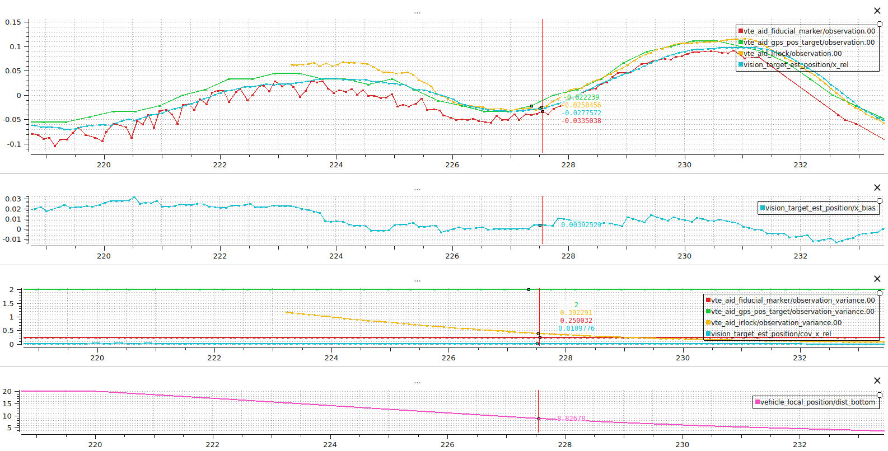
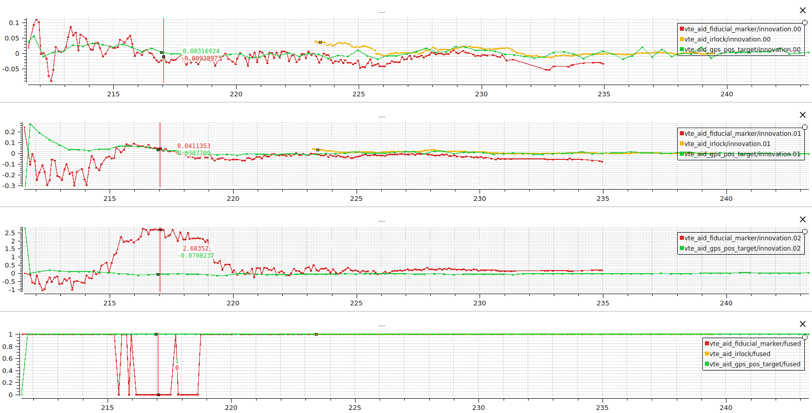
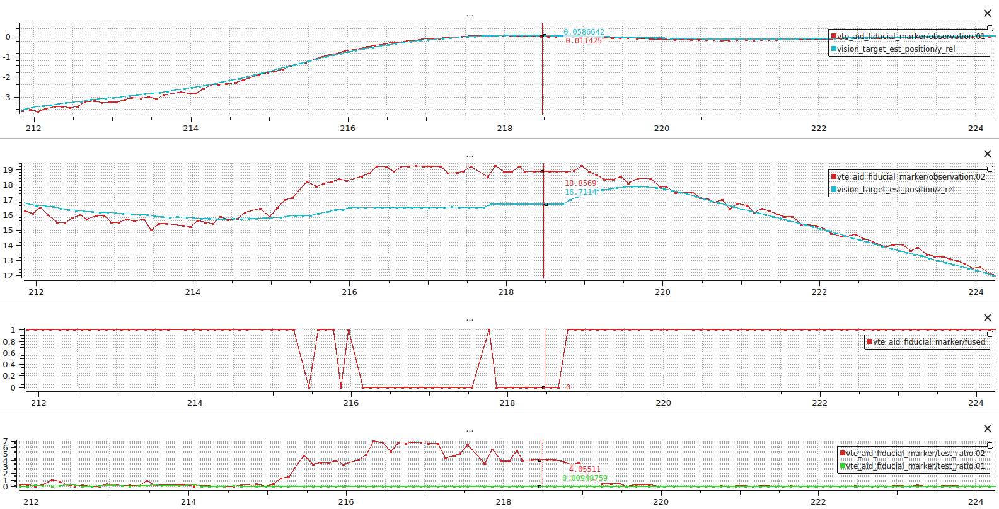
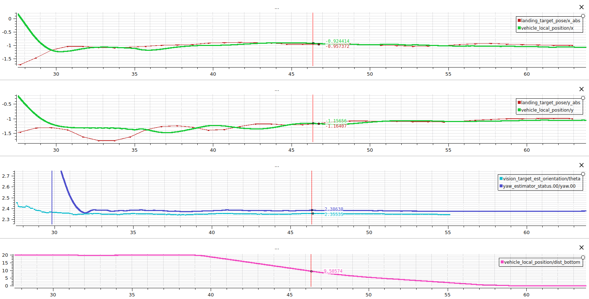
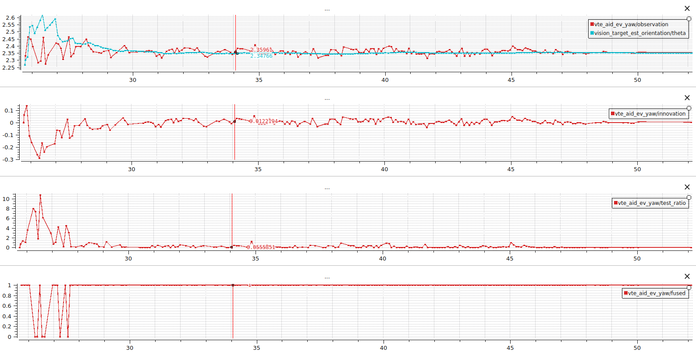

# Vision Target Estimator Deep Dive

This guide expands on the [Vision Target Estimator module overview](../advanced_features/vision_target_estimator.md) and targets advanced users who want to tune, extend, and debug the estimator in detail. It documents the system architecture of the Vision Target Estimator, and outlines workflows for log analysis and sensor integration.

**Table of Contents**
- [Vision Target Estimator Deep Dive](#vision-target-estimator-deep-dive)
  - [System architecture](#system-architecture)
  - [Log analysis and expected plots](#log-analysis-and-expected-plots)
    - [Estimator outputs](#estimator-outputs)
    - [Main input feeds](#main-input-feeds)
    - [What to look for in logs](#what-to-look-for-in-logs)
    - [Troubleshooting checklist](#troubleshooting-checklist)
    - [Plot examples](#plot-examples)
  - [Development and debugging tips](#development-and-debugging-tips)
    - [Adding new measurement sources](#adding-new-measurement-sources)
    - [Regenerating the symbolic model](#regenerating-the-symbolic-model)

## System architecture

The implementation is split across a scheduler and two independent estimators:

- `VisionTargetEst` (`src/modules/vision_target_estimator/VisionTargetEst.cpp`) owns the work-queue task. Its main handles vehicle inputs (`vehicle_attitude`, `vehicle_acceleration`, `vehicle_local_position`, range, and angular rates), downsamples acceleration, and sends the samples to the position and orientation filters at the periods defined by [`VTE_POS_RATE`](../advanced_config/parameter_reference.md#VTE_POS_RATE) and [`VTE_YAW_RATE`](../advanced_config/parameter_reference.md#VTE_YAW_RATE).
- `VTEPosition` (`Position/VTEPosition.cpp`) implements the per-axis filters, observation buffers, timeout logic, and the publication of `landing_target_pose`, `vision_target_est_position`, and every `vte_aid_*` innovation topic. Helper unions (`SensorFusionMaskU`, `ObsValidMaskU`) mirror the bit layout of [`VTE_AID_MASK`](../advanced_features/vision_target_estimator.md#sensor-fusion-selection), making it straightforward to add new observation types.
  - `Position/KF_position.cpp` encapsulates the 1D Kalman filter math described in the [position-state model](../advanced_features/vision_target_estimator.md#position-state). The prediction and covariance routines (`sym::Predictstate`, `sym::Predictcov`, `sym::Computeinnovcov`, `sym::Syncstate`) are generated by SymForce into `Position/vtest_derivation/generated/` during the build.
  - `Position/vtest_derivation/derivation.py` defines the symbolic system that SymForce expands into C++; rerun the generator via CMake whenever the model changes as detailed in [Regenerating the symbolic model](#regenerating-the-symbolic-model).
- `VTEOrientation` (`Orientation/VTEOrientation.cpp`) handles yaw fusion, using a simplified state vector but the same measurement staging helpers as the position filter.
  - `Orientation/KF_orientation.cpp` implements the constant-turn-rate Kalman filter described in the [orientation-state model](../advanced_features/vision_target_estimator.md#orientation-state). Because the yaw filter only tracks heading and yaw rate, its state-transition matrix and innovation logic remain hand-written.
- Shared utilities live in `common.h`.

## Log analysis and expected plots

This section provides an overview of the topics and fields that matter during log review: the published [estimator outputs](#estimator-outputs), the upstream [input feeds](#main-input-feeds). Then log analysis guidance is provided in [What to look for in logs](#what-to-look-for-in-logs) and the [troubleshooting checklist](#troubleshooting-checklist). The [plot examples](#plot-examples) at the end illustrate the expected convergence behaviour.

### Estimator outputs

- Full state estimations with variance and validity flags for position and orientation filters:
   - `vision_target_est_position`
   - `vision_target_est_orientation`
- `landing_target_pose`: controller-facing pose plus `rel_pos_valid`, `rel_vel_valid`, and `fused` booleans.
- `vision_target_est_input`: downsampled acceleration in NED and the quaternion fed to each prediction step. Can be used to correlate estimator behaviour with vehicle attitude changes.
- `vte_aid_*`: one topic per fused source (`vte_aid_gps_pos_target`, `vte_aid_gps_pos_mission`, `vte_aid_gps_vel_uav`, `vte_aid_gps_vel_target`, `vte_aid_fiducial_marker`, `vte_aid_ev_yaw`). Each publishes the innovation, variance, observation, observation variance, chi-squared `test_ratio`, timestamps, and the `fused` flag (true when the update passed the gate).

### Main input feeds

- Vision: `fiducial_marker_pos_report` / `fiducial_marker_yaw_report`
- GNSS on the target: `target_gnss`
- Vehicle GNSS: `sensor_gps` (used to convert absolute GNSS measurements to relative vehicle-carried NED measurements)
- Mission position: `position_setpoint_triplet`
- `vehicle_local_position` and `vehicle_attitude` (used for frame transforms and timeout checks)

### What to look for in logs

1. **Estimator output vs. observations**: In all axis directions, overlay the estimator outputs position `vision_target_est_position.x_rel`, `vision_target_est_orientation.theta` with measurement observations `vte_aid_*.observation[0]` (e.g. `vte_aid_fiducial_marker.observation[0]` or the relevant GNSS observation). The traces should converge after a short transient. Large steady offsets point to calibration errors or incorrect body-to-NED transforms.
2. **Innovation behaviour**: `vte_aid_*.innovation` (e.g. `vte_aid_fiducial_marker.innovation`) should be centred at zero and resemble white noise. Recall that the innovation is defined as the difference between the state prediction and the measurement observation of the state. It follows that the drifting innovations can come from
   - State prediction errors:
      - check the estimators state outputs which correspond to the prediction of the state when no measurements are fused
      - check `vision_target_est_input` (accelerations, attitude)
      - check the frequency of the prediction `dt`
   - State update errors:
      - errors in the measurement implementation, compare the raw sensor input (e.g. `fiducial_marker_pos_report`) with the processed observation (e.g. `vte_aid_fiducial_marker`)
      - time delays between the attitude of the drone and the observation (causing biases in the frame transform from sensor to NED)
      - Incorrect noise assumptions
3. **Measurement acceptance**: Inspect the `fused` boolean alongside `test_ratio`. If the NIS gate rejected the measurements frequently, compare the observation variance being logged with the expected sensor accuracy and update the noise parameters. Remember that gaps longer than [`VTE_TGT_TOUT`](../advanced_config/parameter_reference.md#VTE_TGT_TOUT) clear the validity flags, and exceeding [`VTE_BTOUT`](../advanced_config/parameter_reference.md#VTE_BTOUT) stops the estimator entirely until new data arrives.
4. **Time alignment**: Compare `timestamp_sample` (measurement time of validity) with `time_last_fuse` (contains the prediction time) on the same `vte_aid_*` topic. The difference should stay within a few milliseconds of the estimator loop period. Persistent offsets are a sign of delayed sensor delivery or missing time synchronisation.
5. **Coordinate transforms**: Plot the raw measurement (e.g. `fiducial_marker_pos_report.x_rel`) together with its processed observation `vte_aid_fiducial_marker.observation`. Ensure that there is no mistake in the rotation, range scaling, or offsets applied in the handler.
6. **Prediction inputs**: Use `vision_target_est_input` to track the downsampled acceleration and quaternion. Compare them to `vehicle_attitude.q` and `vehicle_acceleration` to ensure the estimator sees the expected attitude, especially when diagnosing timestamp mismatches.

### Troubleshooting checklist

Start by confirming that the estimator is running (`vision_target_estimator status`) and that the relevant `vte_aid_*` topic is present in the log. If a topic is missing, verify that the upstream sensor message is publishing and that the fusion mask bit is enabled.

>[!TIP]
> **Task activation**: Enable the debug bit in [`VTE_TASK_MASK`](../advanced_config/parameter_reference.md#VTE_TASK_MASK). When the debug bit is set the estimators always runs, making it ideal for bench testing. Enable **debug prints** (`PX4_DEBUG`).

| Symptom | Likely cause | Remedy |
| --- | --- | --- |
| Vehicle misses the pad or ignores target yaw | Mission land waypoint not set to precision mode or yaw alignment disabled | In QGroundControl set the land waypoint `Precision landing` field (or `MAV_CMD_NAV_LAND` `param2`) to Opportunistic/Required as described in [Precision landing missions](../advanced_features/precland.md#mission), and enable [`PLD_YAW_EN`](../advanced_config/parameter_reference.md#PLD_YAW_EN). In logs verify that `trajectory_setpoint.x/y` converge to `landing_target_pose.x_abs/y_abs` and that `trajectory_setpoint.yaw` follows `vision_target_est_orientation.theta`. |
| Frequent innovation rejections | Incorrect noise floors or timestamp skew | Verify sensor variances, verify the NIS threholds ([`VTE_POS_NIS_THRE`](../advanced_config/parameter_reference.md#VTE_POS_NIS_THRE) and [`VTE_YAW_NIS_THRE`](../advanced_config/parameter_reference.md#VTE_YAW_NIS_THRE)), compare timestamp_sample (measurement time of validity) with time_last_fuse (contains the prediction time) on the same vte_aid_* topic.. |
| Bias does not converge | No secondary position source | Ensure vision fusion is enabled so the filter can observe GNSS bias. |
| Orientation estimate drifts | Missing yaw measurements or low NIS gate | Enable [`VTE_YAW_EN`](../advanced_config/parameter_reference.md#VTE_YAW_EN) and ensure vision yaw data is present. Increase [`VTE_YAW_NIS_THRE`](../advanced_config/parameter_reference.md#VTE_YAW_NIS_THRE) if legitimate data is being rejected. |
| `rel_pos_valid` toggles during descent | Position measurements arriving too slowly | Increase [`VTE_TGT_TOUT`](../advanced_config/parameter_reference.md#VTE_TGT_TOUT) or improve the measurement rate so updates remain inside [`VTE_M_REC_TOUT`](../advanced_config/parameter_reference.md#VTE_M_REC_TOUT). |
| No `vte_aid_*` topics in the log | Sensor not publishing or fusion mask disabled | Use `listener` on the raw sensor topic, confirm [`VTE_AID_MASK`](../advanced_config/parameter_reference.md#VTE_AID_MASK) includes the relevant bit, and rerun the test with the debug task active. |
| Estimator never starts | Task mask disabled or mission not requesting precision landing | Set [`VTE_TASK_MASK`](../advanced_config/parameter_reference.md#VTE_TASK_MASK)=1 (or 3 for continuous debugging) and verify that new measurements arrive with valid timestamps. |

### Plot examples

The next four dashboards provide hints on how to analyse logs of the Vision Target Estimator.

>[!TIP]
> Plot Juggler (or the PX4 DevTools log viewer) is the easiest way to inspect the estimator as it allows you to group related signals into subplots that share the time axis.

**Estimator output and observation consistency**: Quick health check that the fused sensors agree with the estimated state before diving into per-axis innovations.
- **Top row (observations and state output)**: For every axis, plot all the available observations `vte_aid_*.observation[0]` (in this example: vision/IRLock and target GNSS) alongside `vision_target_est_position`. Expect a smooth state trace following the trend of the most precise observations.
- **Second row (GNSS bias estimate)**: Plot `vision_target_est_position.*_bias`. The bias should settle once both a GNSS observation and a relative observation are fused. A non-zero bias is expected; what matters is that it remains stable so the corrected GNSS still points to the pad if the relative measurement temporarily drops out.
- **Third row (sensor variances)**: Compare `vte_aid_*.observation_variance[0]` across sensors. Large gaps mean one source is trusted far more than the others. Tune [`VTE_EVP_NOISE`](../advanced_config/parameter_reference.md#VTE_EVP_NOISE) or [`VTE_GPS_P_NOISE`](../advanced_config/parameter_reference.md#VTE_GPS_P_NOISE) until variances reflect the real-world accuracy.
- **Bottom row (approach context)**: `vehicle_local_position.dist_bottom` indicates the descent phase and helps correlate changes in variance or bias with altitude.

**Innovation Consistency**: Use this view to confirm that every fused sensor produces zero-mean, white-noise innovations; large drifts reveal modelling errors, mis-scaled noise, or frame-misaligned observations.
- **Top row (x innovations)**: For every measurement available, plot all the innovations (e.g. `vte_aid_fiducial_marker.innovation[0]` and `vte_aid_gps_pos_target.innovation[0]`). The innovations should fluctuate around zero.
- **Second row (y innovations)**: The same signals for the y direction. White-noise like innovations indicate the measurements and the assumed noise matches reality.
- **Third row (z innovations)**: Index 2 is only populated by sources that provide altitude information. A persistent offset, such as the ~2 m bias from `vte_aid_fiducial_marker` in the example, shows that the camera observations are not precise at higher altitudes. The measurement variance should reflect this behaviour.
- **Bottom row (fusion decisions)**: The boolean `*.fused` arrays confirm that the Kalman update is skipped whenever the NIS exceeds the gate. If a good sensor is frequently rejected, revisit the variance floors listed earlier.

**Rejecting a Corrupted Measurement**: Demonstrates how the estimator isolates a faulty measurement dimension. The healthy axes continue to fuse while the outlier repeatedly fails the gate, making it easy to spot sensor degradations.

- **Top row (y observation)**: `vte_aid_fiducial_marker.observation[1]` tracks `vision_target_est_position.y_rel`, showing how a healthy measurement pulls the estimate.
- **Second row (z observation)**: `vte_aid_fiducial_marker.observation[2]` deviates strongly from `vision_target_est_position.z_rel`; the estimator sensibly refuses to follow it.
- **Third row (fusion flag)**: `vte_aid_fiducial_marker.fused[2]` drops to zero whenever the vertical observation disagrees with the filter prediction, confirming that the gate is working.
- **Bottom row (test ratios)**: `vte_aid_fiducial_marker.test_ratio[1]` stays near zero, while index 2 spikes above one, breaching [`VTE_POS_NIS_THRE`](../advanced_config/parameter_reference.md#VTE_POS_NIS_THRE). Investigate the vision range estimate or adjust [`VTE_EVP_NOISE`](../advanced_config/parameter_reference.md#VTE_EVP_NOISE) if this pattern occurs frequently.

**Precision Landing Alignment**: Compare the precision landing target with the vehicle position to ensure that the vehicle navigates towards the target. It can help catch misconfigurations e.g. [`PLD_YAW_EN`](../advanced_config/parameter_reference.md#PLD_YAW_EN) disabled or it can if the controller struggles to follow, review the [multicopter position tuning guide](../config_mc/pid_tuning_guide_multicopter.md). Check that the absolute position of the target remains stable.

- **Top row (north alignment)**: Compare `landing_target_pose.x_abs` with `vehicle_local_position.x`. The curves should overlay once precision landing is triggered.
- **Second row (east alignment)**: `landing_target_pose.y_abs` versus `vehicle_local_position.y` reveals lateral errors.
- **Third row (yaw alignment)**: `vision_target_est_orientation.theta` should remain steady while `trajectory_setpoint.yaw` tracks it when [`PLD_YAW_EN`](../advanced_config/parameter_reference.md#PLD_YAW_EN) is enabled.
- **Bottom row (descent context)**: `vehicle_local_position.dist_bottom` indicates when the final approach begins, providing context for any transients above.

**Orientation Filter**: Validate that yaw aiding stays smooth yet responsive; this plot highlights whether orientation noise is properly tuned and whether the gating logic keeps unreliable observations out of the state.

- **Top row (yaw observation vs. state)**: `vte_aid_ev_yaw.observation` compared with `vision_target_est_orientation.theta`. The smoothed state should stay close without mirroring the high-frequency noise; if it does, increase [`VTE_EVA_NOISE`](../advanced_config/parameter_reference.md#VTE_EVA_NOISE).
- **Second row (innovation)**: `vte_aid_ev_yaw.innovation` should resemble white noise. Long biases indicate an incorrect camera-to-vehicle rotation.
- **Third row (test ratio)**: `vte_aid_ev_yaw.test_ratio` highlights altitude-driven noise. Brief spikes near touchdown are acceptable, but sustained high ratios mean yaw gating might be too tight.
- **Bottom row (fusion flag)**: `vte_aid_ev_yaw.fused` shows when yaw measurements actually update the state. Loss of fusion at high altitude is common; ensure it returns before `dist_bottom` goes below the final approach threshold.

## Development and debugging tips

- To print `PX4_DEBUG` statements from the module, launch SITL with `PX4_LOG_LEVEL=debug` (for example, `PX4_LOG_LEVEL=debug make px4_sitl_visionTargetEst`). On hardware builds, compile with the debug configuration or enable the console log level before running tests so the additional diagnostics appear on the shell.
- Keep the estimator alive on the bench by setting [`VTE_TASK_MASK`](../advanced_config/parameter_reference.md#VTE_TASK_MASK)=3; the debug bit enables the continuous update of the position and orientation estimators (if enabled via [`VTE_YAW_EN`](../advanced_config/parameter_reference.md#VTE_YAW_EN) and [`VTE_POS_EN`](../advanced_config/parameter_reference.md#VTE_POS_EN)).
- Use shell helpers while iterating: `listener landing_target_pose`, `listener vte_aid_fiducial_marker ` (or the relevant `vte_aid_*`) to inspect innovations, `listener vision_target_est_input 5` for prediction inputs, and `vision_target_estimator status` to ensure both filters are running.

### Adding new measurement sources

To integrate a new sensor:

1. **Define a uORB message** that carries the measurement in either the vehicle body frame or NED, complete with variance estimates and timestamps.
2. **Extend the fusion mask**: add a bit to `SensorFusionMaskU` (`src/modules/vision_target_estimator/common.h`) and update the parameter comment block for [`VTE_AID_MASK`](../advanced_config/parameter_reference.md#VTE_AID_MASK) (see also [sensor fusion selection](../advanced_features/vision_target_estimator.md#sensor-fusion-selection)) in `vision_target_estimator_params.c`.
3. **Augment observation enums**: append the new entry to the relevant `ObsType` enum (`VTEPosition.h` or `VTEOrientation.h`), update `ObsValidMaskU`, and update helper functions such as `hasNewNonGpsPositionSensorData()` and `selectInitialPosition()` if the measurement can provide a a relative position.
4. **Subscribe and validate**: add a `uORB::Subscription` to the filter, check for finite values, and reject samples that are too old `isMeasUpdated` or timestamped in the future before marking the observation valid.
5. **Implement the handler** in `processObservations()`. Convert the measurement into NED coordinates, populate `TargetObs::meas_xyz`, `meas_unc_xyz`, and the observation Jacobian (`meas_h_xyz` or `meas_h_theta`), and set the fusion-mask flag only after the data passes validation.
6. **Provide tunable noise**: declare a parameter (e.g. `VTE_<SENSOR>_NOISE`) and clamp it with `kMinObservationNoise` so the estimator never believes a measurement is perfect.
7. **Log the innovations**: add a publication member and ORB topic (see `vte_aid_fiducial_marker` for reference) so that logs include the innovation, variance, and fused flag for the new sensor.
8. **Exercise SITL**: update the Gazebo (or other) simulation so that replay tests produce the new measurement. This keeps CI coverage intact and provides a reference data set for tuning.
9. **Document the workflow**: update this deep dive and any setup how-tos so users know how to enable the new bit, calibrate the sensor, and interpret its logs.

>[!IMPORTANT]
> **Timeout policy**: Every measurement must be time-aligned and checked so that stale data never reaches the update step. Reject samples older than [`VTE_M_REC_TOUT`](../advanced_config/parameter_reference.md#VTE_M_REC_TOUT) (`isMeasRecent(hrt_abstime ts)`) and double-check `timestamp_sample` vs. `time_last_fuse` in logs to confirm the new sensor fits inside the estimator deadlines. If observations are stored in cache, invalidate it inside `checkMeasurementInputs` when older than [`VTE_M_UPD_TOUT`](../advanced_config/parameter_reference.md#VTE_M_UPD_TOUT) (`isMeasUpdated(hrt_abstime ts)`).

### Regenerating the symbolic model

The generated headers (`predictState.h`, `predictCov.h`, `computeInnovCov.h`, `syncState.h`, `state.h`) are copied into the build directory and should never be edited by hand. To regenerate them:

1. Configure CMake with `-DVTEST_SYMFORCE_GEN=ON` (automatically enabled when `CONFIG_VTEST_MOVING=y`) and ensure SymForce is available in the Python environment.
2. Reconfigure (`cmake --fresh ...`) so the custom command in `src/modules/vision_target_estimator/CMakeLists.txt` runs. The outputs land under `build/<target>/src/modules/vision_target_estimator/vtest_derivation/generated/`.
3. If you need to refresh the committed defaults, set `-DVTEST_UPDATE_COMMITTED_DERIVATION=ON` and commit the regenerated files in `Position/vtest_derivation/generated*/` once vetted.

If the build fails during regeneration, inspect the CMake output for the SymForce invocation and rerun it manually inside `Position/vtest_derivation/` to catch Python errors. After regenerating, rebuild the module to ensure the Jacobians and code stay in sync.
