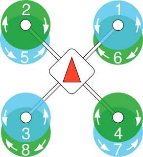

# Airframes Reference

::: info
**This list is [auto-generated](https://github.com/PX4/PX4-Autopilot/blob/main/Tools/px4airframes/markdownout.py) from the source code** using the build command: `make airframe_metadata`.
:::

This page lists all supported airframes and types including the motor assignment and numbering.
The motors in **green** rotate clockwise, the ones in **blue** counterclockwise.

**AUX** channels may not be present on some flight controllers.
If present, PWM AUX channels are commonly labelled **AUX OUT**.

## 2D Space Robot

### Space Robot

<table>
 <thead>
   <tr><th>Name</th><th></th></tr>
 </thead>
<tbody>
<tr id="2d_space_robot_space_robot_kth_space_robot">
 <td>KTH Space Robot</td>
 <td>Maintainer: DISCOWER
<code>SYS_AUTOSTART</code> = 70000
</td>
</tr>
</tbody>
</table>

## Airship

### Airship

<table>
 <thead>
   <tr><th>Common Outputs</th></tr>
 </thead>
 <tbody>
<tr>
 <td><ul><li><b>Motor1</b>: starboard thruster</li><li><b>Motor2</b>: port thruster</li><li><b>Motor3</b>: tail thruster</li><li><b>Servo1</b>: thrust tilt</li></ul></td>
</tr>
</tbody></table>

<table>
 <thead>
   <tr><th>Name</th><th></th></tr>
 </thead>
<tbody>
<tr id="airship_airship_cloudship">
 <td>Cloudship</td>
 <td>Maintainer: John Doe &lt;john@example.com&gt;
<code>SYS_AUTOSTART</code> = 2507
</td>
</tr>
</tbody>
</table>

## Autogyro

### Autogyro

<table>
 <thead>
   <tr><th>Common Outputs</th></tr>
 </thead>
 <tbody>
<tr>
 <td><ul><li><b>Motor1</b>: throttle</li><li><b>Servo1</b>: rotor_head_L</li><li><b>Servo2</b>: rotor_head_R</li></ul></td>
</tr>
</tbody></table>

<table>
 <thead>
   <tr><th>Name</th><th></th></tr>
 </thead>
<tbody>
<tr id="autogyro_autogyro_thunderfly_auto-g2">
 <td><a href="https://github.com/ThunderFly-aerospace/Auto-G2/">ThunderFly Auto-G2</a></td>
 <td>Maintainer: ThunderFly s.r.o., Roman Dvorak &lt;dvorakroman@thunderfly.cz&gt;
<code>SYS_AUTOSTART</code> = 17002
 <b>Specific Outputs:</b><ul><li><b>Servo3</b>: elevator</li><li><b>Servo4</b>: rudder</li><li><b>Servo5</b>: rudder (second, optional)</li><li><b>Servo6</b>: wheel</li></ul></td>
</tr>
<tr id="autogyro_autogyro_thunderfly_tf-g2">
 <td><a href="https://github.com/ThunderFly-aerospace/TF-G2/">ThunderFly TF-G2</a></td>
 <td>Maintainer: ThunderFly s.r.o., Roman Dvorak &lt;dvorakroman@thunderfly.cz&gt;
<code>SYS_AUTOSTART</code> = 17003
 <b>Specific Outputs:</b><ul><li><b>Servo3</b>: rudder</li></ul></td>
</tr>
</tbody>
</table>

## Balloon

### Balloon

<table>
 <thead>
   <tr><th>Name</th><th></th></tr>
 </thead>
<tbody>
<tr id="balloon_balloon_thunderfly_balloon_tf-b1">
 <td><a href="https://github.com/ThunderFly-aerospace/TF-B1/">ThunderFly balloon TF-B1</a></td>
 <td>Maintainer: ThunderFly s.r.o.
<code>SYS_AUTOSTART</code> = 18001
</td>
</tr>
</tbody>
</table>

## Copter

### Dodecarotor cox

<table>
 <thead>
   <tr><th>Name</th><th></th></tr>
 </thead>
<tbody>
<tr id="copter_dodecarotor_cox_generic_dodecarotor_cox_geometry">
 <td>Generic Dodecarotor cox geometry</td>
 <td>Maintainer: William Peale &lt;develop707@gmail.com&gt;
<code>SYS_AUTOSTART</code> = 24001
</td>
</tr>
</tbody>
</table>

### Helicopter

<table>
 <thead>
   <tr><th>Name</th><th></th></tr>
 </thead>
<tbody>
<tr id="copter_helicopter_generic_helicopter_(tail_esc)">
 <td>Generic Helicopter (Tail ESC)</td>
 <td>Maintainer: John Doe &lt;john@example.com&gt;
<code>SYS_AUTOSTART</code> = 16001
</td>
</tr>
</tbody>
</table>

### Hexarotor +

<table>
 <thead>
   <tr><th>Name</th><th></th></tr>
 </thead>
<tbody>
<tr id="copter_hexarotor_+_generic_hexarotor_+_geometry">
 <td>Generic Hexarotor + geometry</td>
 <td>Maintainer: Lorenz Meier &lt;lorenz@px4.io&gt;
<code>SYS_AUTOSTART</code> = 7001
</td>
</tr>
</tbody>
</table>

### Hexarotor Coaxial

<table>
 <thead>
   <tr><th>Common Outputs</th></tr>
 </thead>
 <tbody>
<tr>
 <td><ul><li><b>Motor1</b>: front right top, CW; angle:60; direction:CW</li><li><b>Motor2</b>: front right bottom, CCW; angle:60; direction:CCW</li><li><b>Motor3</b>: back top, CW; angle:180; direction:CW</li><li><b>Motor4</b>: back bottom, CCW; angle:180; direction:CCW</li><li><b>Motor5</b>: front left top, CW; angle:-60; direction:CW</li><li><b>Motor6</b>: front left bottom, CCW;angle:-60; direction:CCW</li></ul></td>
</tr>
</tbody></table>

<table>
 <thead>
   <tr><th>Name</th><th></th></tr>
 </thead>
<tbody>
<tr id="copter_hexarotor_coaxial_generic_hexarotor_coaxial_geometry">
 <td>Generic Hexarotor coaxial geometry</td>
 <td>Maintainer: Lorenz Meier &lt;lorenz@px4.io&gt;
<code>SYS_AUTOSTART</code> = 11001
</td>
</tr>
</tbody>
</table>

### Hexarotor x

<table>
 <thead>
   <tr><th>Name</th><th></th></tr>
 </thead>
<tbody>
<tr id="copter_hexarotor_x_generic_hexarotor_x_geometry">
 <td>Generic Hexarotor x geometry</td>
 <td>Maintainer: Lorenz Meier &lt;lorenz@px4.io&gt;
<code>SYS_AUTOSTART</code> = 6001
</td>
</tr>
<tr id="copter_hexarotor_x_uvify_draco-r">
 <td>UVify Draco-R</td>
 <td>Maintainer: Hyon Lim &lt;lim@uvify.com&gt;
<code>SYS_AUTOSTART</code> = 6002
</td>
</tr>
</tbody>
</table>

### Octorotor +

<table>
 <thead>
   <tr><th>Name</th><th></th></tr>
 </thead>
<tbody>
<tr id="copter_octorotor_+_generic_octocopter_+_geometry">
 <td>Generic Octocopter + geometry</td>
 <td>Maintainer: Lorenz Meier &lt;lorenz@px4.io&gt;
<code>SYS_AUTOSTART</code> = 9001
</td>
</tr>
</tbody>
</table>

### Octorotor Coaxial

<table>
 <thead>
   <tr><th>Common Outputs</th></tr>
 </thead>
 <tbody>
<tr>
 <td><ul><li><b>Motor1</b>: motor 1</li><li><b>Motor2</b>: motor 2</li><li><b>Motor3</b>: motor 3</li><li><b>Motor4</b>: motor 4</li><li><b>Motor5</b>: motor 5</li><li><b>Motor6</b>: motor 6</li><li><b>Motor7</b>: motor 7</li><li><b>Motor8</b>: motor 8</li></ul></td>
</tr>
</tbody></table>

<table>
 <thead>
   <tr><th>Name</th><th></th></tr>
 </thead>
<tbody>
<tr id="copter_octorotor_coaxial_generic_10__octo_coaxial_geometry">
 <td>Generic 10" Octo coaxial geometry</td>
 <td>Maintainer: Lorenz Meier &lt;lorenz@px4.io&gt;
<code>SYS_AUTOSTART</code> = 12001
</td>
</tr>
</tbody>
</table>

### Octorotor x

<table>
 <thead>
   <tr><th>Name</th><th></th></tr>
 </thead>
<tbody>
<tr id="copter_octorotor_x_generic_octocopter_x_geometry">
 <td>Generic Octocopter X geometry</td>
 <td>Maintainer: Lorenz Meier &lt;lorenz@px4.io&gt;
<code>SYS_AUTOSTART</code> = 8001
</td>
</tr>
</tbody>
</table>

### Quadrotor +

<table>
 <thead>
   <tr><th>Name</th><th></th></tr>
 </thead>
<tbody>
<tr id="copter_quadrotor_+_generic_quad_+_geometry">
 <td>Generic Quad + geometry</td>
 <td>Maintainer: John Doe &lt;john@example.com&gt;
<code>SYS_AUTOSTART</code> = 5001
</td>
</tr>
</tbody>
</table>

### Quadrotor H

<table>
 <thead>
   <tr><th>Name</th><th></th></tr>
 </thead>
<tbody>
<tr id="copter_quadrotor_h_betafpv_beta75x_2s_brushless_whoop">
 <td>BetaFPV Beta75X 2S Brushless Whoop</td>
 <td>Maintainer: Beat Kueng &lt;beat-kueng@gmx.net&gt;
<code>SYS_AUTOSTART</code> = 4041
</td>
</tr>
</tbody>
</table>

### Quadrotor x

<table>
 <thead>
   <tr><th>Name</th><th></th></tr>
 </thead>
<tbody>
<tr id="copter_quadrotor_x_generic_quadcopter">
 <td>Generic Quadcopter</td>
 <td>Maintainer: Lorenz Meier &lt;lorenz@px4.io&gt;
<code>SYS_AUTOSTART</code> = 4001
</td>
</tr>
<tr id="copter_quadrotor_x_s500_generic">
 <td>S500 Generic</td>
 <td>Maintainer: Lorenz Meier &lt;lorenz@px4.io&gt;
<code>SYS_AUTOSTART</code> = 4014
</td>
</tr>
<tr id="copter_quadrotor_x_holybro_s500">
 <td>Holybro S500</td>
 <td>Maintainer: Lorenz Meier &lt;lorenz@px4.io&gt;
<code>SYS_AUTOSTART</code> = 4015
</td>
</tr>
<tr id="copter_quadrotor_x_px4_vision_dev_kit_v1">
 <td>PX4 Vision Dev Kit v1</td>
 <td>Maintainer: John Doe &lt;john@example.com&gt;
<code>SYS_AUTOSTART</code> = 4016
</td>
</tr>
<tr id="copter_quadrotor_x_nxp_hovergames">
 <td>NXP HoverGames</td>
 <td>Maintainer: Iain Galloway &lt;iain.galloway@nxp.com&gt;
<code>SYS_AUTOSTART</code> = 4017
</td>
</tr>
<tr id="copter_quadrotor_x_holybro_x500_v2">
 <td>Holybro X500 V2</td>
 <td>Maintainer: Farhang Naderi &lt;farhang.nba@gmail.com&gt;
<code>SYS_AUTOSTART</code> = 4019
</td>
</tr>
<tr id="copter_quadrotor_x_px4_vision_dev_kit_v1.5">
 <td>PX4 Vision Dev Kit v1.5</td>
 <td>Maintainer: John Doe &lt;john@example.com&gt;
<code>SYS_AUTOSTART</code> = 4020
</td>
</tr>
<tr id="copter_quadrotor_x_generic_250_racer">
 <td>Generic 250 Racer</td>
 <td>Maintainer: Lorenz Meier &lt;lorenz@px4.io&gt;
<code>SYS_AUTOSTART</code> = 4050
</td>
</tr>
<tr id="copter_quadrotor_x_holybro_qav250">
 <td><a href="https://docs.px4.io/main/en/frames_multicopter/holybro_qav250_pixhawk4_mini.html">HolyBro QAV250</a></td>
 <td>Maintainer: Beat Kueng &lt;beat-kueng@gmx.net&gt;
<code>SYS_AUTOSTART</code> = 4052
</td>
</tr>
<tr id="copter_quadrotor_x_holybro_kopis_2">
 <td>Holybro Kopis 2</td>
 <td>Maintainer: Beat Kueng &lt;beat@px4.io&gt;
<code>SYS_AUTOSTART</code> = 4053
</td>
</tr>
<tr id="copter_quadrotor_x_advanced_technology_labs_(atl)_mantis_edu">
 <td>Advanced Technology Labs (ATL) Mantis EDU</td>
 <td>
<code>SYS_AUTOSTART</code> = 4061
</td>
</tr>
<tr id="copter_quadrotor_x_uvify_ifo">
 <td>UVify IFO</td>
 <td>Maintainer: Hyon Lim &lt;lim@uvify.com&gt;
<code>SYS_AUTOSTART</code> = 4071
</td>
</tr>
<tr id="copter_quadrotor_x_uvify_ifo">
 <td>UVify IFO</td>
 <td>Maintainer: Hyon Lim &lt;lim@uvify.com&gt;
<code>SYS_AUTOSTART</code> = 4073
</td>
</tr>
<tr id="copter_quadrotor_x_coex_clover_4">
 <td>COEX Clover 4</td>
 <td>Maintainer: Oleg Kalachev &lt;okalachev@gmail.com&gt;
<code>SYS_AUTOSTART</code> = 4500
</td>
</tr>
<tr id="copter_quadrotor_x_droneblocks_dexi_5">
 <td>Droneblocks DEXI 5</td>
 <td>Maintainer: Alex klimaj &lt;alex@arkelectron.com&gt;
<code>SYS_AUTOSTART</code> = 4601
</td>
</tr>
<tr id="copter_quadrotor_x_crazyflie_2.1">
 <td>Crazyflie 2.1</td>
 <td>Maintainer: Dennis Shtatov &lt;densht@gmail.com&gt;
<code>SYS_AUTOSTART</code> = 4901
</td>
</tr>
</tbody>
</table>

### Simulation

<table>
 <thead>
   <tr><th>Name</th><th></th></tr>
 </thead>
<tbody>
<tr id="copter_simulation_hil_quadcopter_x">
 <td>HIL Quadcopter X</td>
 <td>Maintainer: Lorenz Meier &lt;lorenz@px4.io&gt;
<code>SYS_AUTOSTART</code> = 1001
</td>
</tr>
<tr id="copter_simulation_sih_quadcopter_x">
 <td>SIH Quadcopter X</td>
 <td>Maintainer: Romain Chiappinelli &lt;romain.chiap@gmail.com&gt;
<code>SYS_AUTOSTART</code> = 1100
</td>
</tr>
</tbody>
</table>

### Tricopter Y+

<table>
 <thead>
   <tr><th>Common Outputs</th></tr>
 </thead>
 <tbody>
<tr>
 <td><ul><li><b>Motor1</b>: motor 1</li><li><b>Motor2</b>: motor 2</li><li><b>Motor3</b>: motor 3</li><li><b>Servo1</b>: yaw servo</li></ul></td>
</tr>
</tbody></table>

<table>
 <thead>
   <tr><th>Name</th><th></th></tr>
 </thead>
<tbody>
<tr id="copter_tricopter_y+_generic_multirotor_with_tilt">
 <td>Generic Multirotor with tilt</td>
 <td>Maintainer: John Doe &lt;john@example.com&gt;
<code>SYS_AUTOSTART</code> = 14001
</td>
</tr>
</tbody>
</table>

## Plane

### Flying Wing

<table>
 <thead>
   <tr><th>Name</th><th></th></tr>
 </thead>
<tbody>
<tr id="plane_flying_wing_generic_flying_wing">
 <td>Generic Flying Wing</td>
 <td>Maintainer: John Doe &lt;john@example.com&gt;
<code>SYS_AUTOSTART</code> = 3000
</td>
</tr>
</tbody>
</table>

### Plane A-Tail

<table>
 <thead>
   <tr><th>Common Outputs</th></tr>
 </thead>
 <tbody>
<tr>
 <td><ul><li><b>Motor1</b>: throttle</li><li><b>Servo1</b>: aileron right</li><li><b>Servo2</b>: aileron left</li><li><b>Servo3</b>: v-tail right</li><li><b>Servo4</b>: v-tail left</li><li><b>Servo5</b>: wheel</li><li><b>Servo6</b>: flaps right</li><li><b>Servo7</b>: flaps left</li></ul></td>
</tr>
</tbody></table>

<table>
 <thead>
   <tr><th>Name</th><th></th></tr>
 </thead>
<tbody>
<tr id="plane_plane_a-tail_applied_aeronautics_albatross">
 <td>Applied Aeronautics Albatross</td>
 <td>Maintainer: Andreas Antener &lt;andreas@uaventure.com&gt;
<code>SYS_AUTOSTART</code> = 2106
</td>
</tr>
</tbody>
</table>

### Simulation

<table>
 <thead>
   <tr><th>Name</th><th></th></tr>
 </thead>
<tbody>
<tr id="plane_simulation_sih_plane_aert">
 <td>SIH plane AERT</td>
 <td>Maintainer: Romain Chiappinelli &lt;romain.chiap@gmail.com&gt;
<code>SYS_AUTOSTART</code> = 1101
</td>
</tr>
</tbody>
</table>

### Standard Plane

<table>
 <thead>
   <tr><th>Name</th><th></th></tr>
 </thead>
<tbody>
<tr id="plane_standard_plane_generic_standard_plane">
 <td>Generic Standard Plane</td>
 <td>Maintainer: John Doe &lt;john@example.com&gt;
<code>SYS_AUTOSTART</code> = 2100
</td>
</tr>
</tbody>
</table>

## Rover

### Rover

<table>
 <thead>
   <tr><th>Name</th><th></th></tr>
 </thead>
<tbody>
<tr id="rover_rover_generic_rover_differential">
 <td>Generic Rover Differential</td>
 <td>Maintainer: John Doe &lt;john@example.com&gt;
<code>SYS_AUTOSTART</code> = 50000
</td>
</tr>
<tr id="rover_rover_aion_robotics_r1_ugv">
 <td><a href="https://www.aionrobotics.com/r1">Aion Robotics R1 UGV</a></td>
 <td>Maintainer: John Doe &lt;john@example.com&gt;
<code>SYS_AUTOSTART</code> = 50001
</td>
</tr>
<tr id="rover_rover_generic_rover_ackermann">
 <td>Generic Rover Ackermann</td>
 <td>Maintainer: John Doe &lt;john@example.com&gt;
<code>SYS_AUTOSTART</code> = 51000
</td>
</tr>
<tr id="rover_rover_axial_scx10_2_trail_honcho">
 <td><a href="https://www.axialadventure.com/product/1-10-scx10-ii-trail-honcho-4wd-rock-crawler-brushed-rtr/AXID9059.html">Axial SCX10 2 Trail Honcho</a></td>
 <td>Maintainer: John Doe &lt;john@example.com&gt;
<code>SYS_AUTOSTART</code> = 51001
</td>
</tr>
<tr id="rover_rover_generic_rover_mecanum">
 <td>Generic Rover Mecanum</td>
 <td>Maintainer: John Doe &lt;john@example.com&gt;
<code>SYS_AUTOSTART</code> = 52000
</td>
</tr>
<tr id="rover_rover_generic_ground_vehicle_(deprecated)">
 <td>Generic Ground Vehicle (Deprecated)</td>
 <td>
<code>SYS_AUTOSTART</code> = 59000
 <b>Specific Outputs:</b><ul><li><b>Motor1</b>: throttle</li><li><b>Servo1</b>: steering</li></ul></td>
</tr>
<tr id="rover_rover_nxp_cup_car:_df_robot_gpx_(deprecated)">
 <td>NXP Cup car: DF Robot GPX (Deprecated)</td>
 <td>Maintainer: Katrin Moritz
<code>SYS_AUTOSTART</code> = 59001
 <b>Specific Outputs:</b><ul><li><b>Motor1</b>: Speed of left wheels</li><li><b>Servo1</b>: Steering servo</li></ul></td>
</tr>
</tbody>
</table>

## Underwater Robot

### Underwater Robot

<table>
 <thead>
   <tr><th>Name</th><th></th></tr>
 </thead>
<tbody>
<tr id="underwater_robot_underwater_robot_generic_underwater_robot">
 <td>Generic Underwater Robot</td>
 <td>Maintainer: John Doe &lt;john@example.com&gt;
<code>SYS_AUTOSTART</code> = 60000
</td>
</tr>
<tr id="underwater_robot_underwater_robot_hippocampus_uuv_(unmanned_underwater_vehicle)">
 <td>HippoCampus UUV (Unmanned Underwater Vehicle)</td>
 <td>Maintainer: Daniel Duecker &lt;daniel.duecker@tuhh.de&gt;
<code>SYS_AUTOSTART</code> = 60001
</td>
</tr>
</tbody>
</table>

### Vectored 6 DOF UUV

<table>
 <thead>
   <tr><th>Common Outputs</th></tr>
 </thead>
 <tbody>
<tr>
 <td><ul><li><b>Motor1</b>: motor 1 CCW, bow starboard horizontal, , propeller CCW</li><li><b>Motor2</b>: motor 2 CCW, bow port horizontal, propeller CCW</li><li><b>Motor3</b>: motor 3 CCW, stern starboard horizontal, propeller CW</li><li><b>Motor4</b>: motor 4 CCW, stern port horizontal, propeller CW</li><li><b>Motor5</b>: motor 5 CCW, bow starboard vertical, propeller CCW</li><li><b>Motor6</b>: motor 6 CCW, bow port vertical, propeller CW</li><li><b>Motor7</b>: motor 7 CCW, stern starboard vertical, propeller CW</li><li><b>Motor8</b>: motor 8 CCW, stern port vertical, propeller CCW</li></ul></td>
</tr>
</tbody></table>

<table>
 <thead>
   <tr><th>Name</th><th></th></tr>
 </thead>
<tbody>
<tr id="underwater_robot_vectored_6_dof_uuv_bluerov2_(heavy_configuration)">
 <td>BlueROV2 (Heavy Configuration)</td>
 <td>Maintainer: Thies Lennart Alff &lt;thies.lennart.alff@tuhh.de&gt;
<code>SYS_AUTOSTART</code> = 60002
</td>
</tr>
</tbody>
</table>

## VTOL

### Simulation

<table>
 <thead>
   <tr><th>Name</th><th></th></tr>
 </thead>
<tbody>
<tr id="vtol_simulation_sih_tailsitter_duo">
 <td>SIH Tailsitter Duo</td>
 <td>Maintainer: Romain Chiappinelli &lt;romain.chiap@gmail.com&gt;
<code>SYS_AUTOSTART</code> = 1102
 <b>Specific Outputs:</b><ul><li><b>Motor1</b>: motor right</li><li><b>Motor2</b>: motor left</li><li><b>Servo1</b>: elevon right</li><li><b>Servo2</b>: elevon left</li></ul></td>
</tr>
<tr id="vtol_simulation_sih_standard_vtol_quadplane">
 <td>SIH Standard VTOL QuadPlane</td>
 <td>Maintainer: John Doe &lt;john@example.com&gt;
<code>SYS_AUTOSTART</code> = 1103
 <b>Specific Outputs:</b><ul><li><b>Motor1</b>: MC motor front right</li><li><b>Motor2</b>: MC motor back left</li><li><b>Motor3</b>: MC motor front left</li><li><b>Motor4</b>: MC motor back right</li><li><b>Motor5</b>: Forward thrust motor</li><li><b>Servo1</b>: Ailerons (single channel)</li><li><b>Servo2</b>: Elevator</li><li><b>Servo3</b>: Rudder</li></ul></td>
</tr>
</tbody>
</table>

### Standard VTOL

<table>
 <thead>
   <tr><th>Name</th><th></th></tr>
 </thead>
<tbody>
<tr id="vtol_standard_vtol_hil_standard_vtol_quadplane">
 <td>HIL Standard VTOL QuadPlane</td>
 <td>Maintainer: Roman Bapst &lt;roman@auterion.com&gt;
<code>SYS_AUTOSTART</code> = 1002
 <b>Specific Outputs:</b><ul><li><b>Motor1</b>: MC motor front right</li><li><b>Motor2</b>: MC motor back left</li><li><b>Motor3</b>: MC motor front left</li><li><b>Motor4</b>: MC motor back right</li><li><b>Motor5</b>: Forward thrust motor</li><li><b>Servo1</b>: Aileron</li><li><b>Servo2</b>: Elevator</li><li><b>Servo3</b>: Rudder</li></ul></td>
</tr>
<tr id="vtol_standard_vtol_generic_standard_vtol">
 <td>Generic Standard VTOL</td>
 <td>Maintainer: John Doe &lt;john@example.com&gt;
<code>SYS_AUTOSTART</code> = 13000
</td>
</tr>
</tbody>
</table>

### VTOL Tailsitter

<table>
 <thead>
   <tr><th>Name</th><th></th></tr>
 </thead>
<tbody>
<tr id="vtol_vtol_tailsitter_generic_vtol_tailsitter">
 <td>Generic VTOL Tailsitter</td>
 <td>Maintainer: John Doe &lt;john@example.com&gt;
<code>SYS_AUTOSTART</code> = 13200
</td>
</tr>
</tbody>
</table>

### VTOL Tiltrotor

<table>
 <thead>
   <tr><th>Name</th><th></th></tr>
 </thead>
<tbody>
<tr id="vtol_vtol_tiltrotor_generic_quadplane_vtol_tiltrotor">
 <td>Generic Quadplane VTOL Tiltrotor</td>
 <td>
<code>SYS_AUTOSTART</code> = 13030
</td>
</tr>
<tr id="vtol_vtol_tiltrotor_generic_tiltrotor_vtol">
 <td>Generic Tiltrotor VTOL</td>
 <td>Maintainer: John Doe &lt;john@example.com&gt;
<code>SYS_AUTOSTART</code> = 13100
</td>
</tr>
</tbody>
</table>

