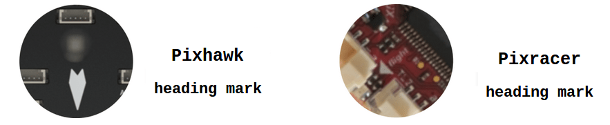

# Mounting the Flight Controller

The flight controller should be placed on the frame as close as possible to the centre-of-gravity (CoG), top-side up, and oriented so that the _heading mark arrow_ points towards the front of the vehicle.
[Vibration isolation](#vibration-isolation) is often needed, and you should follow the manufacturer recommendations.
If mounted in this way, no further PX4 configuration is required.

## Orientation

Almost all Flight Controllers have a _heading mark arrow_ (shown below).
The controller should be placed on the frame top-side up, oriented so that the arrow points towards the front of the vehicle (on all aircraft frames - airplane, multirotor, VTOL, ground vehicles etc.).

::: info
If the controller cannot be mounted in the recommended/default orientation due to physical constraints, you will need to configure the autopilot software with the orientation that you actually used: [Flight Controller Orientation](../config/flight_controller_orientation.md).
:::

## Position

The flight controller should be placed on the frame as close as possible to the centre-of-gravity.

If you can't mount the controller in this position, then you should [configure](../advanced_config/parameters.md) the following parameters to set offset relative to the CoG: [EKF2_IMU_POS_X](../advanced_config/parameter_reference.md#EKF2_IMU_POS_X), [EKF2_IMU_POS_Y](../advanced_config/parameter_reference.md#EKF2_IMU_POS_Y), [EKF2_IMU_POS_Z](../advanced_config/parameter_reference.md#EKF2_IMU_POS_Z) (for the default EKF2 estimator).

Note that if you don't set these offsets then EKF2 position/velocity estimates will be at the IMU location rather that at the CoG.
This may result in undesirable oscillations, depending on how far away the IMU is from the CoG.

::: details Explanation
To understand the impact of not setting these offsets, consider the case when the flight controller (IMU) is in front of the CoG, you're flying in position mode, and there is a forward pitching motion around the CoG.
The altitude estimate will go down, because the IMU has in fact moved down.
As a reaction, the altitude controller will give more thrust to compensate.
The amplitude depends on how far the IMU is located from the CoG.
It might be negligible, but it is still some unneeded control effort that is constantly applied.
If the offsets are specified, a pure pitch motion would not create any change in the altitude estimate so there will be less parasitic corrections.
:::

## Vibration Isolation

Flight Control boards with in-built accelerometers or gyros are sensitive to vibrations.
Some boards include in-built vibration-isolation, while others come with _mounting foam_ that you can use to isolate the controller from the vehicle.

_Vibration damping foam_

You should use the mounting strategy recommended in your flight controller documentation.

:::tip
[Log Analysis using Flight Review > Vibration](../log/flight_review.md#vibration) explains how to test whether vibration levels are acceptable, and [Vibration Isolation](../assembly/vibration_isolation.md) suggests a number of possible solutions if there is a problem.
:::
