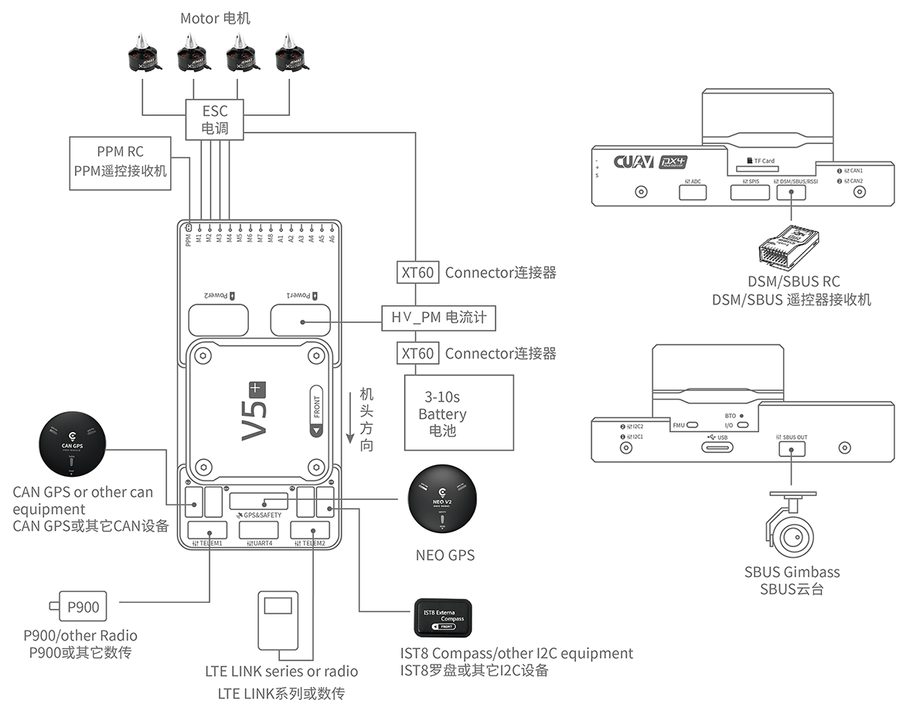
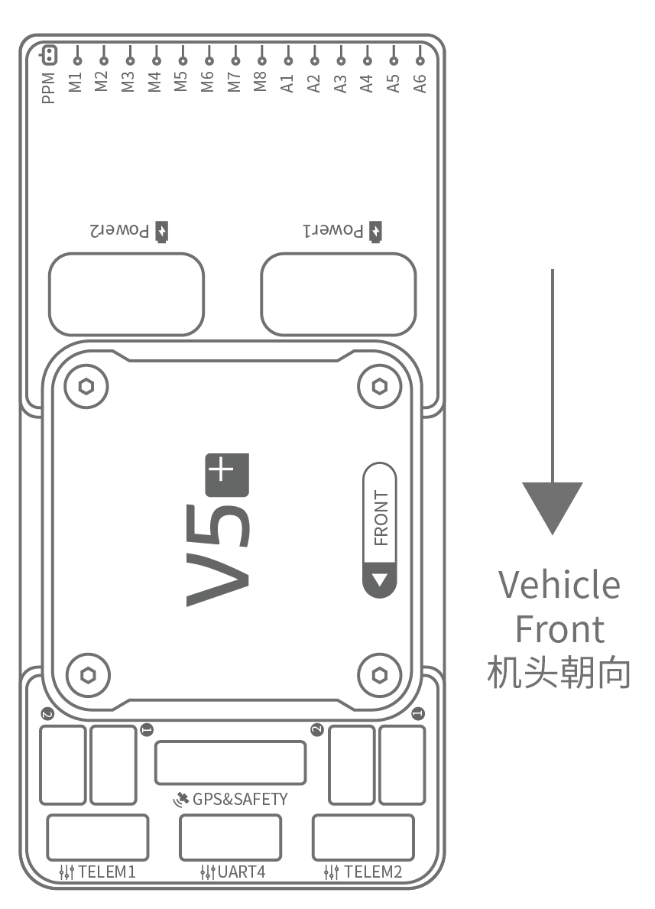
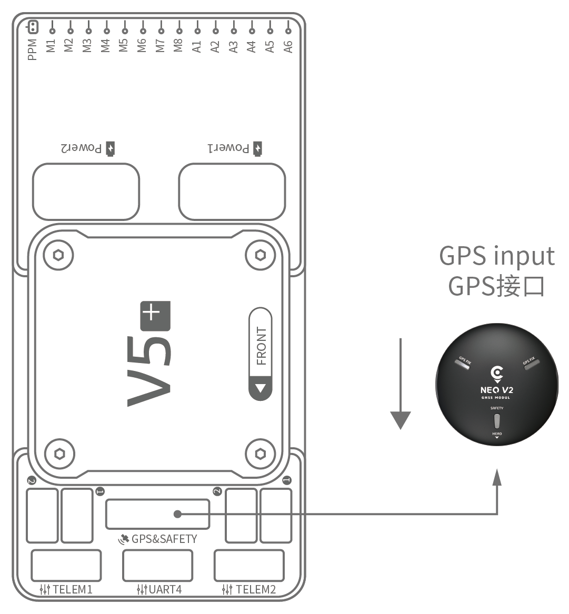
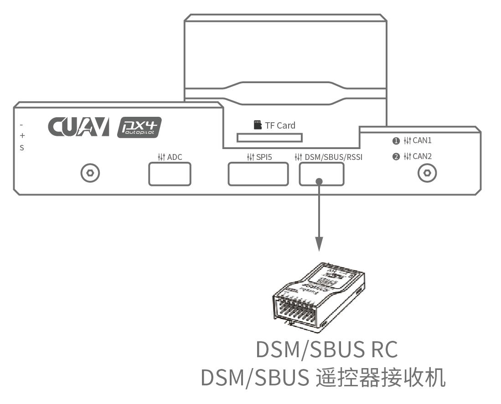
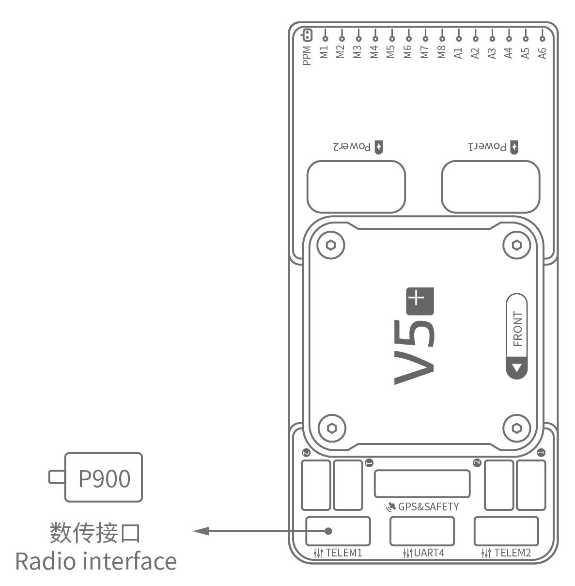
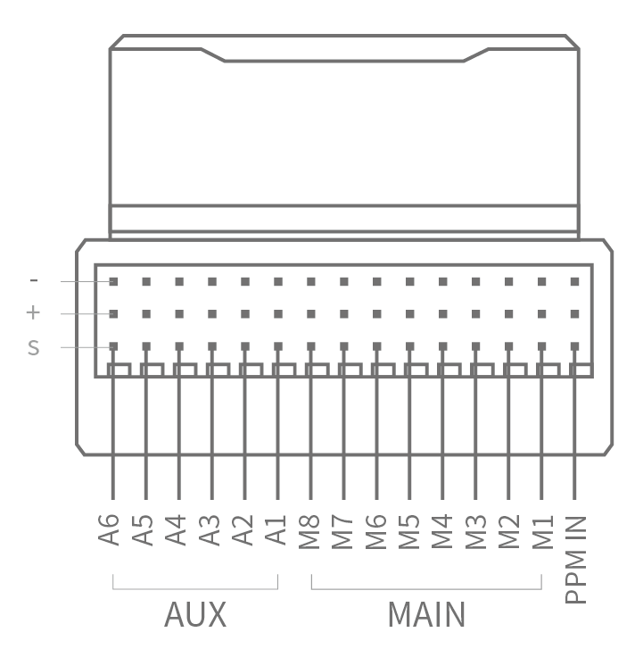

# CUAV V5+ Wiring Quick Start

:::warning
PX4 does not manufacture this (or any) autopilot.
Contact the [manufacturer](https://store.cuav.net/) for hardware support or compliance issues.
:::

This quick start guide shows how to power the [CUAV V5+](../flight_controller/cuav_v5_plus.md) flight controller and connect its most important peripherals.

## Wiring Chart Overview

The image below shows how to connect the most important sensors and peripherals (except the motor and servo outputs).
We'll go through each of these in detail in the following sections.

| Main interface | Function                                                                                                                                                                                           |
| :------------- | :------------------------------------------------------------------------------------------------------------------------------------------------------------------------------------------------- |
| Power1         | Connect power module. Power input with _analog_ voltage and current detection. Do not use a Digital PM on this connector!                                                                          |
| Power2         | Connect i2c smart battery.                                                                                                                                                                         |
| TF CARD        | SD card for log storage (card pre-inserted in factory).                                                                                                                                            |
| M1~M8          | PWM outputs. Can be used to control motors or servos.                                                                                                                                              |
| A1~A6          | PWM outputs. Can be used to control motors or servos.                                                                                                                                              |
| DSU7           | Used for FMU debug, reading debug information.                                                                                                                                                     |
| I2C1/I2C2      | Connect an I2C device such as an external compass.                                                                                                                                                 |
| CAN1/CAN2      | Connect UAVCAN devices such as CAN GPS.                                                                                                                                                            |
| TYPE-C\(USB\)  | Connect to a computer for communication between the flight controller and the computer, such as loading firmware.                                                                                  |
| SBUS OUT       | Connect SBUS devices (e.g. camera gimbals).                                                                                                                                                        |
| GPS&SAFETY     | Connect to Neo GPS, which includes GPS, safety switch, buzzer interface.                                                                                                                           |
| TELEM1/TELEM2  | Connect to the Telemetry System.                                                                                                                                                                   |
| DSM/SBUS/RSSI  | Includes DSM, SBUS, RSSI signal input interface, DSM interface can be connected to DSM satellite receiver, SBUS interface to SBUS remote control receiver, RSSI for signal strength return module. |

::: info
For more interface information, please read [V5+ Manual](http://manual.cuav.net/V5-Plus.pdf).
:::

::: info
If the controller cannot be mounted in the recommended/default orientation (e.g. due to space constraints) you will need to configure the autopilot software with the orientation that you actually used: [Flight Controller Orientation](../gps_compass/rtk_gps.md).
:::

## GPS + Compass + Safety Switch + LED

The recommended GPS module is the _Neo v2 GPS_, which contains GPS, compass, safety switch, buzzer, LED status light.

::: info
Other GPS modules may not work (see [this compatibility issue](../flight_controller/cuav_v5_nano.md#compatibility_gps)\)).
:::

The GPS/Compass module should be [mounted on the frame](../assembly/mount_gps_compass.md) as far away from other electronics as possible, with the direction marker towards the front of the vehicle (_Neo v2 GPS_ arrow is in the same direction as the flight control arrow).
Connect to the flight control GPS interface using a cable.

::: info
If you use the [NEO V2 PRO GNSS (CAN GPS)](http://doc.cuav.net/gps/neo-series-gnss/en/neo-v2-pro.html), please use the cable to connect to the flight control CAN interface.
:::

## Safety Switch

The dedicated safety switch that comes with the V5+ is only required if you are not using the recommended _Neo V2 GPS_ (which has an inbuilt safety switch).

If you are flying without the GPS you must attach the switch directly to the `GPS1` port in order to be able to arm the vehicle and fly (if you use the old 6-pin GPS, please read the definition of the bottom interface to change the line).

## Buzzer

If you do not use the recommended GPS, the buzzer may not work.

## Radio Control

A remote control (RC) radio system is required if you want to manually control your vehicle (PX4 does not require a radio system for autonomous flight modes).
You will need to select a compatible transmitter/receiver and then bind them so that they communicate (read the instructions that come with your specific transmitter/receiver).

The figure below shows how you can access your remote receiver (please find the SBUS cable in the kit).

## Spektrum Satellite Receivers

The V5+ has a dedicated DSM cable.
If using a Spektrum satellite receiver, this should be connected to the flight controller DSM/SBUS/RSSI interface.

## Power

The V5+ kit includes the _HV_PM_ module, which supports 2~14S LiPo batteries.
Connect the 6pin connector of the _HW_PM_ module to the flight control `Power1` interface.

:::warning
The supplied power module is unfused.
Power **must** be turned off while connecting peripherals.
:::

::: info
The power module is not a power source for peripherals connected to the PWM outputs.
If you're connecting servos/actuators you will need to separately power them using a BEC.
:::

## Telemetry System (Optional)

A telemetry system allows you to communicate with, monitor, and control a vehicle in flight from a ground station (for example, you can direct the UAV to a particular position, or upload a new mission).

The communication channel is via Telemetry Radios.
The vehicle-based radio should be connected to either the `TELEM1` or `TELEM2` port (if connected to these ports, no further configuration is required).
The other radio is connected to your ground station computer or mobile device (usually via USB).

## SD Card (Optional)

An [SD card](../getting_started/px4_basic_concepts.md#sd-cards-removable-memory) is inserted in the factory (you do not need to do anything).

## Motors

Motors/servos are connected to the MAIN and AUX ports in the order specified for your vehicle in the [Airframes Reference](../airframes/airframe_reference.md).

## Pinouts

Download **V5+** pinouts from [here](http://manual.cuav.net/V5-Plus.pdf).

## Further Information

- [Airframe build-log using CUAV v5+ on a DJI FlameWheel450](../frames_multicopter/dji_f450_cuav_5plus.md)
- [CUAV V5+ Manual](http://manual.cuav.net/V5-Plus.pdf) (CUAV)
- [CUAV V5+ docs](http://doc.cuav.net/flight-controller/v5-autopilot/en/v5+.html) (CUAV)
- [FMUv5 reference design pinout](https://docs.google.com/spreadsheets/d/1-n0__BYDedQrc_2NHqBenG1DNepAgnHpSGglke-QQwY/edit#gid=912976165) (CUAV)
- [CUAV Github](https://github.com/cuav) (CUAV)
- [Base board design reference](https://github.com/cuav/hardware/tree/master/V5_Autopilot/V5%2B/V5%2BBASE) (CUAV)
