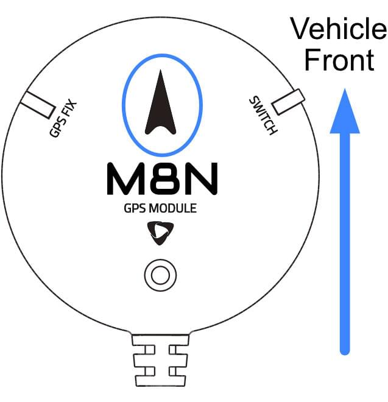
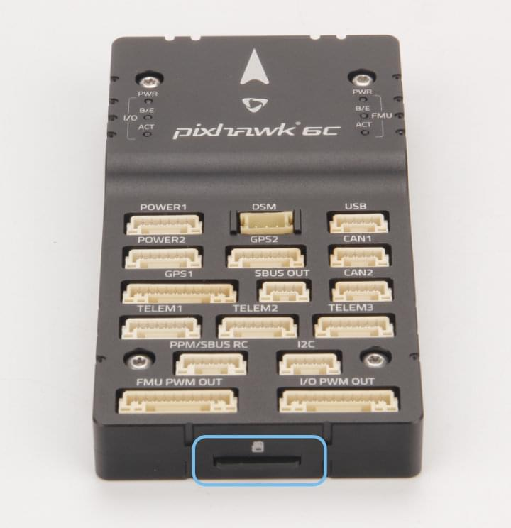

# Holybro Pixhawk 6C Wiring Quick Start

:::warning
PX4 does not manufacture this (or any) autopilot.
Contact the [manufacturer](https://holybro.com/) for hardware support or compliance issues.
:::

This quick start guide shows how to power the [Pixhawk 6C&reg;](../flight_controller/pixhawk6c.md) flight controller and connect its most important peripherals.

## Kit Contents

Pixhawk 6C + PM02 + M8N GPS.

## Mount and Orient Controller

_Pixhawk 6C_ can be mounted on the frame using double side tape included in the kit.
It should be positioned as close to your vehicle’s center of gravity as possible, oriented top-side up with the arrow pointing towards the front of the vehicle.

::: info
If the controller cannot be mounted in the recommended/default orientation (e.g. due to space constraints) you will need to configure the autopilot software with the orientation that you actually used: [Flight Controller Orientation](../config/flight_controller_orientation.md).
:::

## GPS + Compass + Buzzer + Safety Switch + LED

The _Pixhawk6C_ can be purchased with M8N or M9N GPS (10-pin connector) that should be connected to the **GPS1** port.
These GNSS modules have an integrated compass, safety switch, buzzer and LED.

A secondary [M8N or M9N GPS](https://holybro.com/collections/gps) (6-pin connector) can be purchased separately and connected to the **GPS2** port.

The GPS/Compass should be [mounted on the frame](../assembly/mount_gps_compass.md) as far away from other electronics as possible, with the direction marker towards the front of the vehicle (separating the compass from other electronics will reduce interference).

::: info
The GPS module's integrated safety switch is enabled _by default_ (when enabled, PX4 will not let you arm the vehicle).
To disable the safety press and hold the safety switch for 1 second.
You can press the safety switch again to enable safety and disarm the vehicle (this can be useful if, for whatever reason, you are unable to disarm the vehicle from your remote control or ground station).
:::

## Power

Connect the output of the power module of your selection that comes with the Standard Set to one of the **POWER** port of _Pixhawk 6C_ using the 6-wire cable.

If using a plane or rover, the **FMU PWM-OUT** will need to be separately powered in order to drive servos for rudders, elevons etc. This can be done by connecting the 8 pin power (+) rail of the **FMU PWM-OUT** to a voltage regulator (for example, a BEC equipped ESC or a standalone 5V BEC or a 2S LiPo battery).

::: info
The power rail voltage must be appropriate for the servo being used!
:::

| PIN & Connector | Function                                            |
| --------------- | --------------------------------------------------- |
| I/O PWM Out     | Connect Motor Signal and GND wires here.            |
| FMU PWM Out     | Connect Servo Signal, positive, and GND wires here. |

::: info
**MAIN** outputs in PX4 firmware map to **I/O PWM OUT** port of _Pixhawk 6C_ whereas **AUX outputs** map to **FMU PWM OUT** of _Pixhawk 6C_.
For example, **MAIN1** maps to IO_CH1 pin of **I/O PWM OUT** and **AUX1** maps to FMU_CH1 pin of **FMU PWM OUT**.
:::

The pinout of _Pixhawk 6C_’s power ports is shown below.

| Pin      | Signal  | Volt  |
| -------- | ------- | ----- |
| 1(red)   | VDD     | +5V   |
| 2(black) | VDD     | +5V   |
| 3(black) | CURRENT | +3.3V |
| 4(black) | VOLTAGE | +3.3V |
| 5(black) | GND     | GND   |
| 6(black) | GND     | GND   |

## Radio Control

A remote control (RC) radio system is required if you want to _manually_ control your vehicle (PX4 does not require a radio system for autonomous flight modes).

You will need to [select a compatible transmitter/receiver](../getting_started/rc_transmitter_receiver.md) and then _bind_ them so that they communicate (read the instructions that come with your specific transmitter/receiver).

- Spektrum/DSM receivers connect to the **DSM** input.
- PPM or SBUS receivers connect to the **PPM/SBUS** input port.

PPM and PWM receivers that have an _individual wire for each channel_ must connect to the *PPM/SBUS\*\* port *via a PPM encoder\* [like this one](http://www.getfpv.com/radios/radio-accessories/holybro-ppm-encoder-module.html) (PPM-Sum receivers use a single signal wire for all channels).

For more information about selecting a radio system, receiver compatibility, and binding your transmitter/receiver pair, see: [Remote Control Transmitters & Receivers](../getting_started/rc_transmitter_receiver.md).

## Telemetry Radios (Optional)

[Telemetry radios](../telemetry/index.md) may be used to communicate and control a vehicle in flight from a ground station (for example, you can direct the UAV to a particular position, or upload a new mission).

The vehicle-based radio should be connected to the **TELEM1** port as shown below (if connected to this port, no further configuration is required).
The other radio is connected to your ground station computer or mobile device (usually by USB).

Radios are also available for purchase on [Holybro's website](https://holybro.com/collections/telemetry-radios) .

## SD Card (Optional)

SD cards are highly recommended as they are needed to [log and analyse flight details](../getting_started/flight_reporting.md), to run missions, and to use UAVCAN-bus hardware.
Insert the card (included in Pixhawk 6C) into _Pixhawk 6C_ as shown below.

:::tip
For more information see [Basic Concepts > SD Cards (Removable Memory)](../getting_started/px4_basic_concepts.md#sd-cards-removable-memory).
:::

## Motors

Motors/servos are connected to the **I/O PWM OUT** (**MAIN**) and **FMU PWM OUT** (**AUX**) ports in the order specified for your vehicle in the [Airframe Reference](../airframes/airframe_reference.md).

::: info
This reference lists the output port to motor/servo mapping for all supported air and ground frames (if your frame is not listed in the reference then use a "generic" airframe of the correct type).
:::

:::warning
The mapping is not consistent across frames (e.g. you can't rely on the throttle being on the same output for all plane frames). Make sure to use the correct mapping for your vehicle.
:::

## Other Peripherals

The wiring and configuration of optional/less common components is covered within the topics for individual [peripherals](../peripherals/index.md).

## Pinouts

- [Holybro Pixhawk -6C Pinout](https://docs.holybro.com/autopilot/pixhawk-6c/pixhawk-6c-pinout)

## Configuration

General configuration information is covered in: [Autopilot Configuration](../config/index.md).

QuadPlane specific configuration is covered here: [QuadPlane VTOL Configuration](../config_vtol/vtol_quad_configuration.md)

<!-- Nice to have detailed wiring infographic and instructions for different vehicle types. -->

## Further information

- [Holybro Docs](https://docs.holybro.com/) (Holybro)
- [Pixhawk 6C](../flight_controller/pixhawk6c.md) (PX4 Doc Overview page)
- [PM02 Power Module](../power_module/holybro_pm02.md)
- [PM06 Power Module](../power_module/holybro_pm06_pixhawk4mini_power_module.md)
- [PM07 Power Module](../power_module/holybro_pm07_pixhawk4_power_module.md)
- [Pixhawk Autopilot Bus Standard](https://github.com/pixhawk/Pixhawk-Standards/blob/master/DS-010%20Pixhawk%20Autopilot%20Bus%20Standard.pdf).
- [Pixhawk Connector Standard](https://github.com/pixhawk/Pixhawk-Standards/blob/master/DS-009%20Pixhawk%20Connector%20Standard.pdf).
