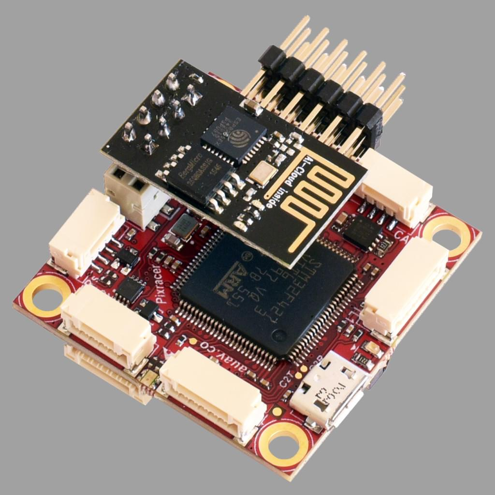
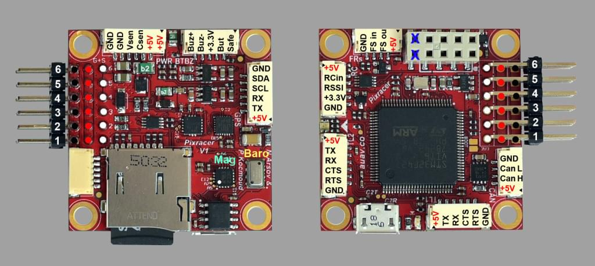
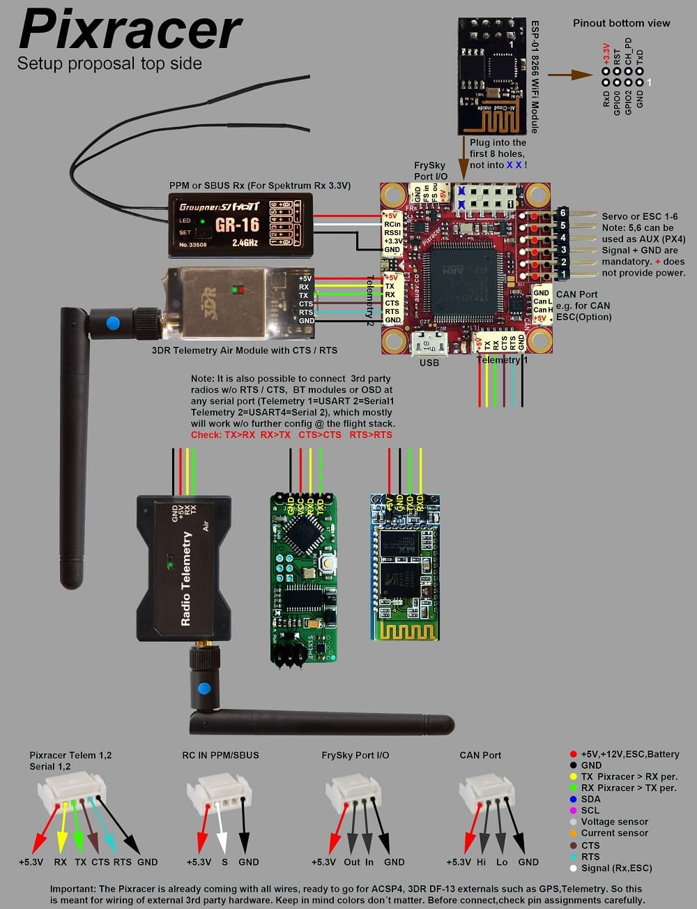
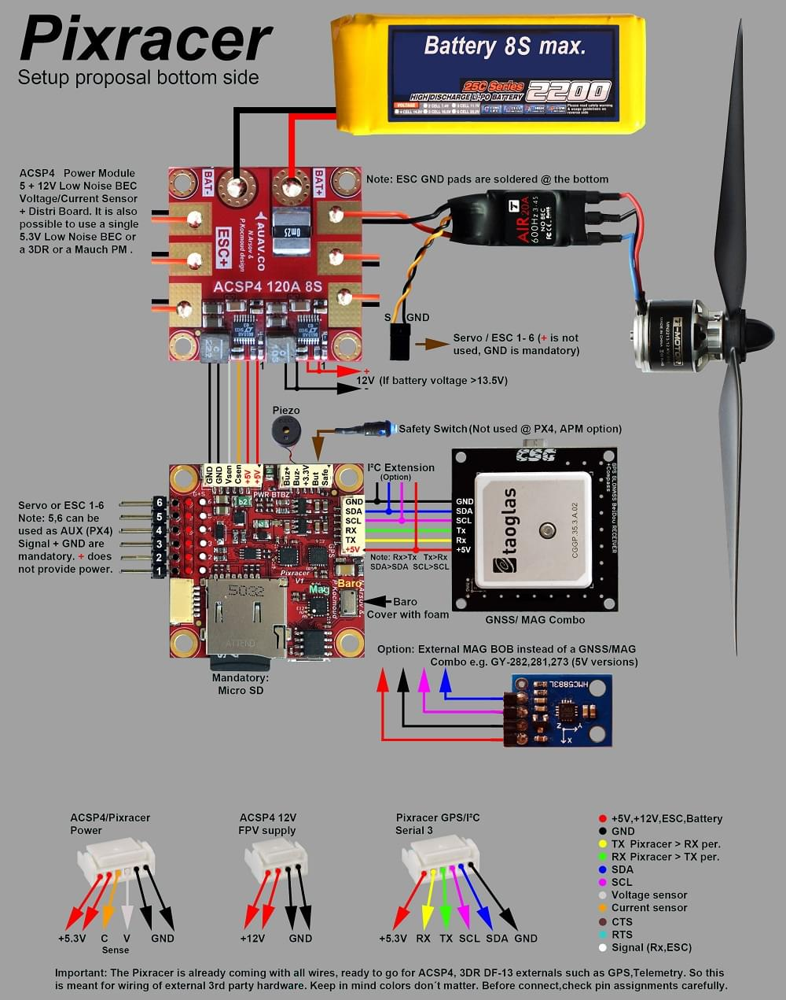
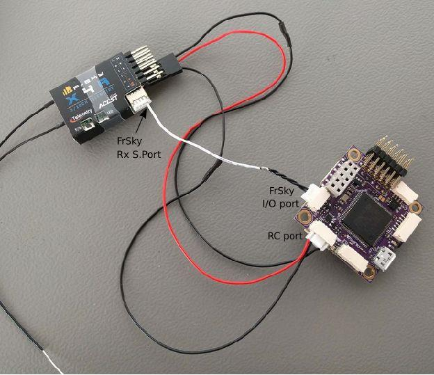
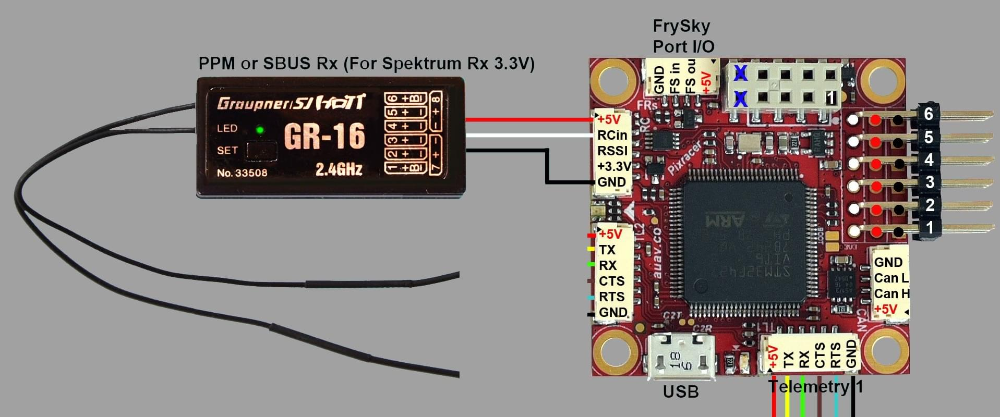
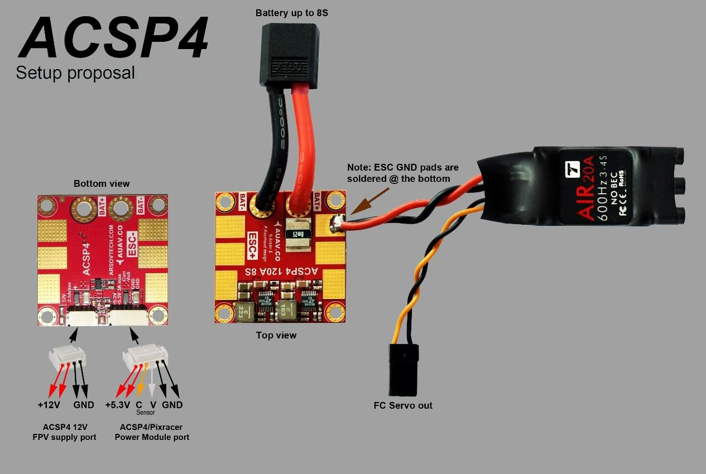
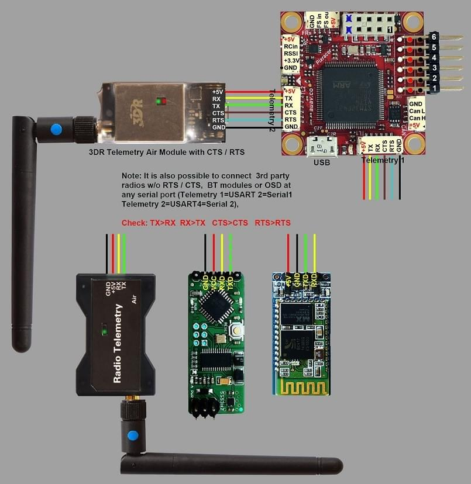

# Pixracer Wiring Quick Start

:::warning
PX4 does not manufacture this (or any) autopilot.
Contact the [manufacturer](https://store.mrobotics.io/) for hardware support or compliance issues.
:::

:::warning
Under construction
:::

This quick start guide shows how to power the [Pixracer](../flight_controller/pixracer.md) flight controller and connect its most important peripherals.

## Wiring Guides/Assembly

### Main Setup

### Radio/Remote Control

A remote control (RC) radio system is required if you want to _manually_ control your vehicle (PX4 does not require a radio system for autonomous flight modes).

You will need to [select a compatible transmitter/receiver](../getting_started/rc_transmitter_receiver.md) and then _bind_ them so that they communicate (read the instructions that come with your specific transmitter/receiver).

The instructions below show how to connect the different types of receivers:

- FrSky receivers connect via the port shown, and can use the provided I/O Connector.

  

  

- PPM-SUM and S.BUS receivers connect to the **RCIN** port.

  

- PPM and PWM receivers that have an _individual wire for each channel_ must connect to the **RCIN** port _via a PPM encoder_ [like this one](http://www.getfpv.com/radios/radio-accessories/holybro-ppm-encoder-module.html) (PPM-Sum receivers use a single signal wire for all channels).

### Power Module (ACSP4)

### External Telemetry

Pixracer has inbuilt WiFi, but also supports telemetry via external Wi-Fi or radio telemetry modules connected to the `TELEM1` or `TELEM2` ports.
This is shown in the wiring diagram below.

::: info
The `TELEM2` port must be configured as a second MAVLink instance using the [MAV_2_CONFIG](../advanced_config/parameter_reference.md#MAV_2_CONFIG) parameter.
For more information see [MAVLink Peripherals > MAVLink Instances](../peripherals/mavlink_peripherals.md#mavlink-instances) (and [Serial Port Configuration](../peripherals/serial_configuration.md)).
:::
