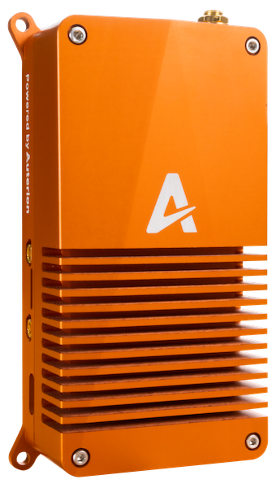

# Auterion Skynode

[Skynode](https://auterion.com/product/skynode/) is a powerful flight computer that combines a mission computer, flight controller, video streaming, networking, and cellular connection, in a single tightly integrated device.



The onboard software is Auterion OS, consisting of an enterprise-hardened version of PX4 running on the flight controller, and an operating system with advanced management software running on the mission computer.
The OS is managed by Auterion in production, with customer applications running as "add ons" in a safe sandbox within the mission computer.

Auterion OS and Skynode allow seamless integration with Auterion's other software and fleet management products.

For information about Auterion and Skynode:

- [auterion.com](https://auterion.com/)
- [Skynode](https://auterion.com/product/skynode/) (auterion.com)
- Skynode Guides:
  - [Manufacturer's Guide](https://docs.auterion.com/manufacturers/getting-started/readme)
  - [App Developer's Guide](https://docs.auterion.com/developers/getting-started/readme)

## Skynode with Vanilla PX4

Skynode comes with an Auterion-managed release of PX4.
If you would like to try a more recent PX4 flight kernel, you can install the upstream "vanilla" PX4 from [PX4/PX4-Autopilot](https://github.com/PX4/PX4-Autopilot).

Upstream PX4 will generally work, with the following caveats:

- Configuration for your exact product may not be present.
  You may lose the configuration for ESCs, batteries, sensor configuration, and so on.
- Some parameters might have different default values in the PX4 release shipped with Auterion OS.
- Features accessed by vendor-specific customisations running on the companion computer may not be present in PX4.
- Auterion supports Skynode running its own Auterion-managed version of PX4.

## Building/Uploading Firmware

PX4 `px4_fmu-v5x` binaries for Skynode are built from source using the normal [developer environment](../dev_setup/dev_env.md) and [build commands](../dev_setup/building_px4.md), and are uploaded using either `upload_skynode_usb` or `upload_skynode_wifi` upload targets.

`upload_skynode_usb` and `upload_skynode_wifi` connect to Skynode via SSH over a network interface using the default (fixed) IP addresses for [USB](https://docs.auterion.com/manufacturers/avionics/skynode/advanced-configuration/connecting-to-skynode) and [WiFi](https://docs.auterion.com/manufacturers/avionics/skynode/advanced-configuration/configuration), and upload a TAR compressed binary to the mission computer.
The mission computer then decompresses the binary and installs it to the flight controller.

::: info
SSH and TAR are needed to use these upload targets, but are expected to be present by default on Ubuntu and Ubuntu running on Windows in WSL2.
On macOS you should first install [gnu-tar](https://formulae.brew.sh/formula/gnu-tar).
:::

You will need to enter the password for the Skynode developer image password twice during the upload process.

:::: tabs

::: tab "Skynode connected via USB"

```
make px4_fmu-v5x upload_skynode_usb
```

:::

::: tab "Skynode connected via WiFi"

```
make px4_fmu-v5x upload_skynode_wifi
```

:::

::::

## Restoring the Default PX4 Firmware

To reinstall the original Skynode version of PX4 when connected via USB run the following command in the repository:

:::: tabs

::: tab "Skynode connected via USB"

```
./Tools/auterion/upload_skynode.sh --revert
```

:::

::: tab "Skynode connected via WiFi"

```
./Tools/auterion/upload_skynode.sh --revert --wifi
```

:::

::::
