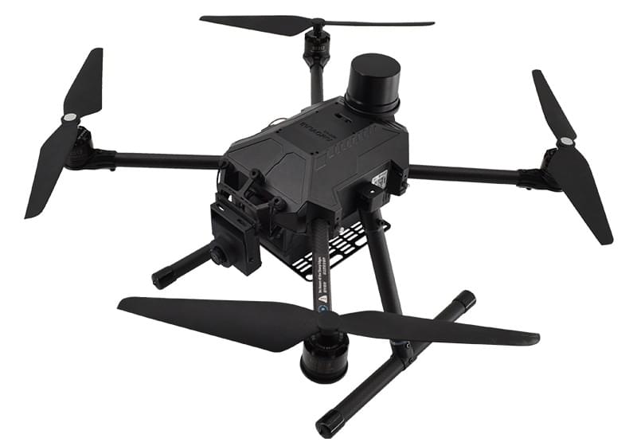

# Amovlab F410 Drone

The [Amovlab F410](https://amovlab.com/product/detail?pid=32) is a medium-small drone platform with a 410mm wheelbase, equipped with Pixhawk 6c open-source flight controller, M8N-GPS, brushless motors, customized hard-case battery, Minihomer data link, optical flow ranging module, camera and other devices.
It can be used immediately after receiving, capable of meeting indoor/outdoor stable flight and teaching development requirements.

::: info
The vehicle comes with everything needed to fly, including the battery and a remote control.
It is pre-installed with PX4 v1.15.4 at time of writing (a more recent version may be used in future).
:::

## Overview

1. Can serve as a basic flight platform, paired with Pixhawk 6C flight controller to achieve optical flow and GPS fusion positioning, enabling stable flight both indoors and outdoors.
   It is one of the most stable basic flight platforms on the market.
2. Sturdy and reliable structure, with key parts made of aluminium alloy and carbon fibre, high strength and not easily damaged.
3. High stability, providing industrial-grade stability assurance, friendly to beginners, offering simplified version of interactive PC to enhance flight experience, can be initially used for outdoor aerial photography and image collection.
4. Has rich open-source code support, and can be used with PX4, FMT, and ArduPilot.
5. Video can be streamed from the UAV webcam to QGroundControl.
6. The drone has a lot of room and support for expansion, including for adding on-board computers, range sensors, and other payloads.
   - Compatibility with many different components, providing platform for loading other user sensors, preparing for functional model development.
   - Abundant power supply making it perfect for installing additional sensors and onboard computers (including 5 external output voltages, 3 channels of 5V, 2 channels of 12V).
   - Pc-SDK support.
     This is a PC-based Python SDK Library based on MAVSDK that significantly simplifies UAV development compared to other approaches, such as using ROS or using C++. All you need is a basic understanding of Python programming and some simple coordinate system principles!
   - The [documentation](https://docs.amovlab.com/f450-v6c-wiki/#/en/) shows many of the options.
7. Quasi-smart battery. The battery has a hard housing design that makes easy to install and remove.
   It provides accurate power estimates, but does not have some more advanced "smart battery" features.

## Where to Buy

- [Amovlab F410 Drone](https://amovlab.com/product/detail?pid=32)

## Datasheet

### Specifications

|           Specification           |                         F410_V6C Flight Platform                         |
| :-------------------------------: | :----------------------------------------------------------------------: |
|           **Aircraft**            |                                                                          |
|            Dimensions             |       Length 290mm × Width 290mm × Height 240mm (Wheelbase 410mm)        |
|           Empty Weight            |                                  1056g                                   |
|        Max Takeoff Weight         |                                  2200g                                   |
|         Max Ascent Speed          |                                  1.5m/s                                  |
|         Max Descent Speed         |                                  0.7m/s                                  |
|       Max Horizontal Speed        |                                  10m/s                                   |
|         Max Hovering Time         |                                  21min                                   |
|          Max Tilt Angle           |                                   30°                                    |
|       Operating Temperature       |                                  6℃-40℃                                  |
|         Hovering Accuracy         |             M8N GPS Vertical ±0.5m M8N GPS Horizontal ±0.8m              |
|         Hovering Accuracy         |                 RTK Vertical ±0.1m RTK Horizontal ±0.15m                 |
|     **Flight Control System**     |                                                                          |
|             Processor             |                 FMU: STM32H743; IO Processor: STM32F103                  |
|           Accelerometer           |                            BMI055/ICM-42688-P                            |
|             Gyroscope             |                            BMI055/ICM-42688-P                            |
|           Magnetometer            |                                 IST8310                                  |
|             Barometer             |                                  MS5611                                  |
|              Weight               |                                  59.3g                                   |
|            Dimensions             |                Length 84.8mm × Width 44mm × Height 12.4mm                |
|          **Perception**           |                                                                          |
| Optical Flow & Rangefinder Module |                                                                          |
|              Weight               |                                   5.0g                                   |
|            Dimensions             |                 Length 29mm × Width 16.5mm × Height 15mm                 |
|         Range Measurement         |                                 0.01-8m                                  |
|            Ranging FOV            |                                    6°                                    |
|         Optical Flow FOV          |                                   42°                                    |
|         Power Consumption         |                                  500mW                                   |
|         Operating Voltage         |                                 4.0-5.5V                                 |
|   Optical Flow Working Distance   |                                  >80mm                                   |
|         Output Interface          |                                   UART                                   |
|           **Data Link**           |                                                                          |
|        Data Link Solution         |                                MINI HOMER                                |
|          Frequency Band           |                               Sub 1G Band                                |
|         Operating Voltage         |                                   12V                                    |
|        Max Effective Range        |                                  1200m                                   |
|            **Camera**             |                                                                          |
|               Model               |                                  IVG-G4                                  |
|         Video Processing          |                H.265+ Encoding, Dual Streams, AVI Format                 |
|           Video Output            | Main Stream: 2560×1440@18fps, 2304×1296@20fps；Sub Stream: 800×448@25fps |
|         Operating Voltage         |                                   12V                                    |
|            Dimensions             |                         Length 38mm × Width 38mm                         |
|            **Battery**            |                                                                          |
|               Model               |                                   FB45                                   |
|        Dimensions (L×W×H)         |                 Length 130mm × Width 65mm × Height 40mm                  |
|              Weight               |                                   470g                                   |
|       Charge Limit Voltage        |                                  16.8V                                   |
|          Nominal Voltage          |                                  14.8V                                   |
|          Rated Capacity           |                                 5000mAh                                  |
|           Rated Energy            |                                   74Wh                                   |
|           Configuration           |                                  4s 1P                                   |
|            **Charger**            |                                                                          |
|           Input Voltage           |                                DC:9V-12V                                 |
|         Max Output Power          |                                   25W                                    |
|        Max Output Current         |                                  1500mA                                  |
|         Display Accuracy          |                                  ±10mV                                   |
|            Dimensions             |                  Length 81mm × Width 50mm × Height 20mm                  |
|              Weight               |                                   76g                                    |
|       **Remote Controller**       |                                                                          |
|         Operating Voltage         |                                 4.5V-9V                                  |
|             Channels              |                                    8                                     |
|          Transmit Power           |                                 ＜ 10mW                                  |
|              Weight               |                                   310g                                   |
|        Dimensions (L×W×H)         |                 Length 179mm × Width 81mm × Height 161mm                 |

## Tutorials

- Tutorials [English](https://docs.amovlab.com/f450-v6c-wiki/#/en/)/[Chinese](https://docs.amovlab.com/f450-v6c-wiki/#/) (docs.amovlab.com/)

## Upgrading

Amovlab previously supplied this vehicle with PX4 v1.13.

In order to upgrade to PX4 v1.15, you should select the [X500 airframe](../config/airframe.md) and import [this parameter file](https://github.com/PX4/PX4-Autopilot/blob/main/docs/assets/airframes/multicopter/amovlab_f410/amovlabf410_drone_v1.15.4.params) to apply the new [actuator output configuration](../config/actuators.md) (used from PX4 v1.14).
Then retune as necessary.

Contact Amovlab for information about upgrading to other versions.

## Videos

<lite-youtube videoid="RzmI1d5093I" title="F410 Mid-Axis UAVs"/>
