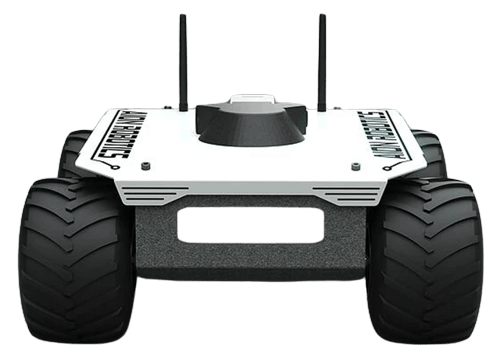
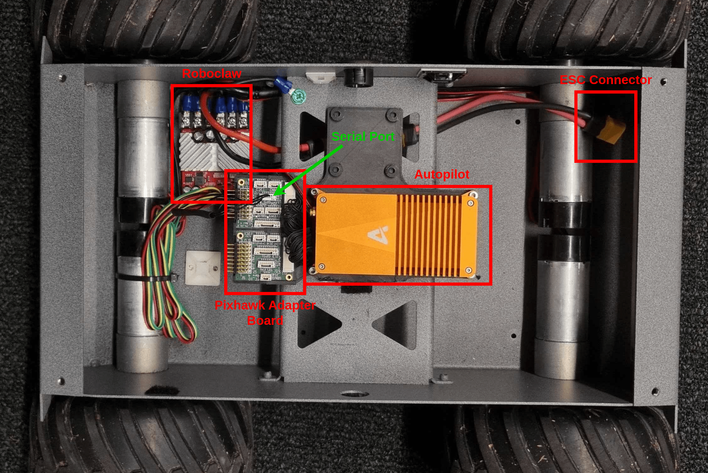
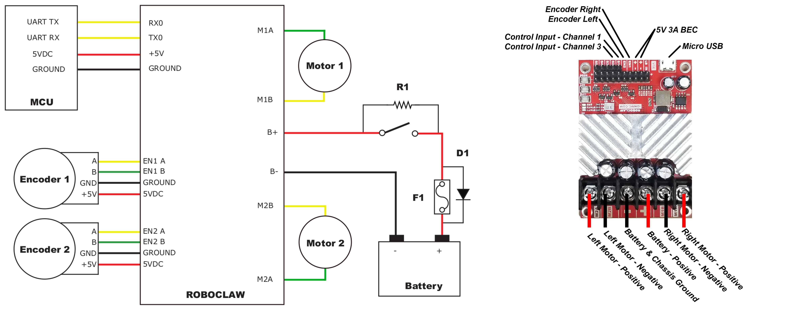
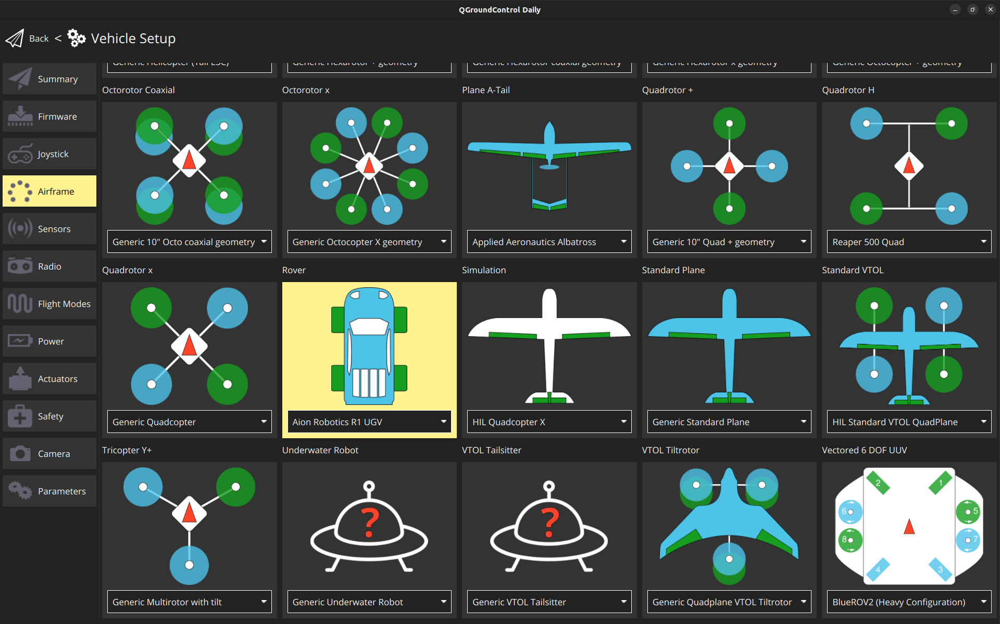
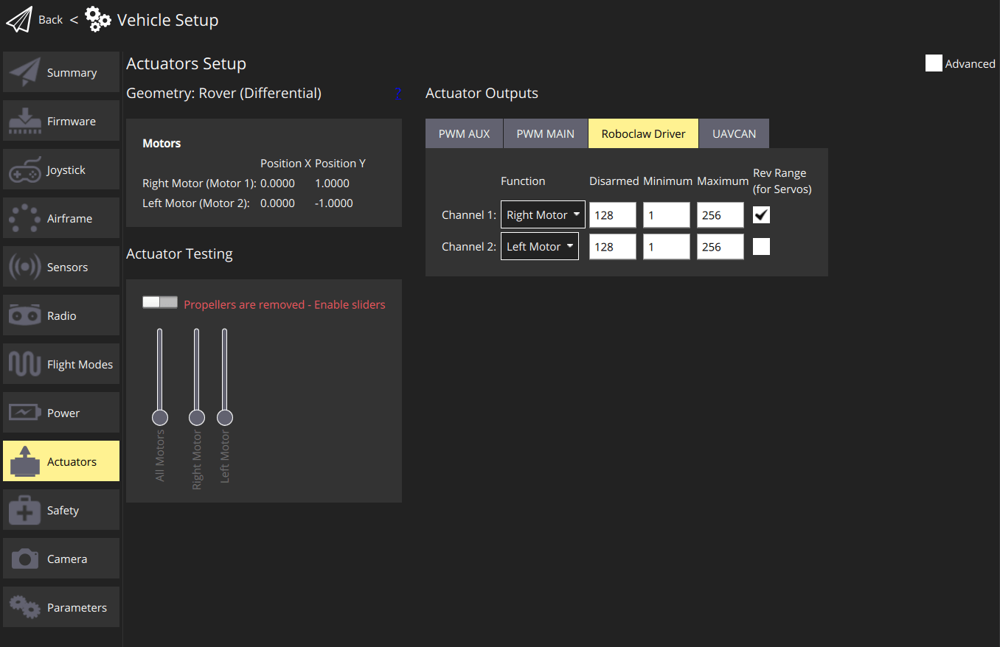

# Aion Robotics R1 UGV

<Badge type="tip" text="PX4 v1.15" />

The [Aion R1](https://www.aionrobotics.com/) vehicle was chosen to test and improve the differential drive support for PX4, and to improve driver support for Roboclaw Motor Controllers, such as the [RoboClaw 2x15A](https://www.basicmicro.com/RoboClaw-2x15A-Motor-Controller_p_10.html).

The documentation and driver information here should also make it easier to work with Roboclaw controllers on other vehicles, and to work with vehicles like the [Aion R6](https://www.aionrobotics.com/r6).

Currently, PX4 supports MANUAL mode for this setup.



## Parts List

- [Aion R1 (Discontinued)](https://www.aionrobotics.com/)
  - [Documentation](https://github-docs.readthedocs.io/en/latest/r1-ugv.html)
- [RoboClaw 2x15A](https://www.basicmicro.com/RoboClaw-2x15A-Motor-Controller_p_10.html)
  - [R1 Roboclaw specifications](https://resources.basicmicro.com/aion-robotics-r1-autonomous-robot/)
- [Auterion Skynode](../companion_computer/auterion_skynode.md)

## Assembly

The assembly consists of a 3D-printed frame on which all the autopilot parts were attached.
For this build this includes an [Auterion Skynode](../companion_computer/auterion_skynode.md), connected to a Pixhawk Adapter Board that interfaces with the RoboClaw motor controllers over serial.



::: info
If using a standard Pixhawk you could connect the RoboClaw to the Autopilot without an Adapter Board.
:::

The RoboClaw should be connected to a suitable suitable serial (UART) port on the flight controller, such as `GPS2` or `TELEM1`.
Other RoboClaw wiring is detailed in the [RoboClaw User Manual](https://downloads.basicmicro.com/docs/roboclaw_user_manual.pdf) 'Packet Serial Wiring' section and shown below (this setup has been validated for compatibility).



## PX4 Configuration

### Rover Configuration

Use _QGroundControl_ for rover configuration:

1. In the [Basic Configuration](../config/index.md) section, select the [Airframe](../config/airframe.md) tab.
1. Choose **Aion Robotics R1 UGV** under the **Rover** category.



### RoboClaw Configuration

First configure the serial connection:

1. Navigate to the [Parameters](../advanced_config/parameters.md) section in QGroundControl.

   - Set the [RBCLW_SER_CFG](../advanced_config/parameter_reference.md#RBCLW_SER_CFG) parameter to the serial port to which the RoboClaw is connected (such as `GPS2`).
   - [RBCLW_COUNTS_REV](../advanced_config/parameter_reference.md#RBCLW_COUNTS_REV) specifies the number of encoder counts required for one wheel revolution.
     This value should be left at `1200` for the tested `RoboClaw 2x15A Motor Controller`.
     Adjust the value based on your specific encoder and wheel setup.
   - RoboClaw motor controllers must be assigned a unique address on the bus.
     The default address is 128 and you should not need to change this (if you do, update the PX4 parameter [RBCLW_ADDRESS](../advanced_config/parameter_reference.md#RBCLW_ADDRESS) to match).

     ::: info
     PX4 does not support multiple RoboClaw motor controllers in the same vehicle — each controller needs a unique address on the bus, and there is only one parameter for setting the address in PX4 (`RBCLW_ADDRESS`).
     :::

Then configure the actuator configuration:

1. Navigate to [Actuators Configuration & Testing](../config/actuators.md) in QGroundControl.
1. Select the RoboClaw driver from the list of _Actuator Outputs_.

   For the channel assignments, disarm, minimum, and maximum values, please refer to the image below.

   

   For systems with more than two motors, it is possible to assign the same function to several motors.
   The reason for the unusual values, can be found in the [RoboClaw User Manual](https://downloads.basicmicro.com/docs/roboclaw_user_manual.pdf) under `Compatibility Commands` for `Packet Serial`:

   ```plain
   Drive motor forward. Valid data range is 0 - 127. A value of 127 = full speed forward, 64 =
   about half speed forward and 0 = full stop.
   ```

## See also

- [roboclaw](../modules/modules_driver.md#roboclaw) driver
- [Roboclaw User Manual](https://downloads.basicmicro.com/docs/roboclaw_user_manual.pdf)
