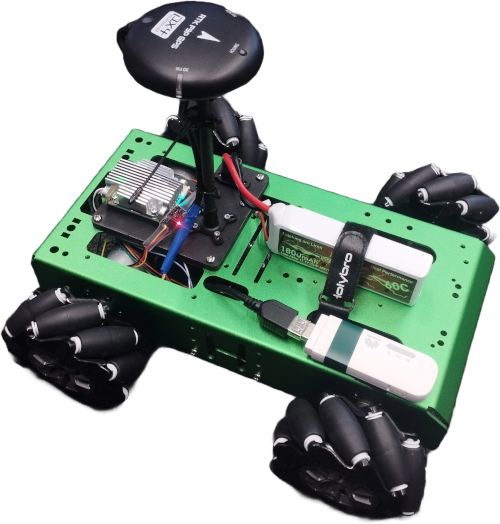
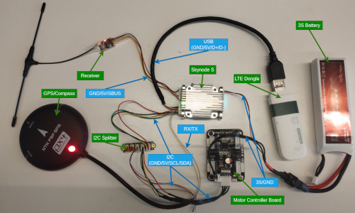
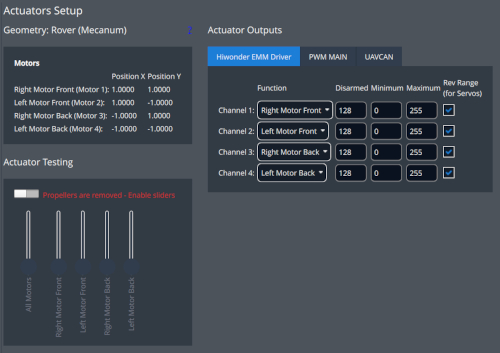

# Hiwonder Mecanum

The [Hiwonder Mecanum](https://www.hiwonder.com/products/large-metal-4wd-vehicle-chassis-green) rover is a bare-bones platform including a chassi, four [mecanum wheels](https://www.hiwonder.com/products/97mm-mecanum-wheel), four [motors with encoders](https://www.hiwonder.com/products/hall-encoder-dc-geared-motor?variant=40451123675223) and a [motor driver board](https://www.hiwonder.com/products/4-channel-encoder-motor-driver).
The chassi offers many mounting points, providing the flexibility to attach your own flight controller, sensors and other payload.



This documentation illustrates the setup of the rover and the configuration of the actuators.

## Parts List

::: info
The specific hardware used here only serves to examplify the process and can be easily replaced with what you have access to.
Ensure that the parts are compatible, including the ports available on your flight controller, and adapt the wiring to your hardware.
:::

The following parts are used in this build:
- Frame: [Hiwonder Mecanum Chassi](https://www.hiwonder.com/products/large-metal-4wd-vehicle-chassis-green)
- Flight Controller: [Auterion Skynode S](https://auterion.com/product/skynode-s/) (Alternatives: [Flight Controllers](../flight_controller/index.md)).
- Receiver: [TBS Crossfire Nano RX](https://www.team-blacksheep.com/products/prod:crossfire_nano_rx?srsltid=AfmBOopvPF1mhPRIS11amSwdKf4OFZlt2ibj7XJwu05kVWt4S_L-ZNuD) (Alternatives: [PX4-Compatible Receivers](../getting_started/rc_transmitter_receiver.md#px4-compatible-receivers-compatible_receivers)).
- Power: 3S Lipo Battery

::: info
The motor driver board requires 3S, but your flight controller might require a different voltage.
To power the flight controller with the same battery you need a Dc-to-DC converter such as the ones listed in [Power Modules & Power Distribution Boards](../power_module/index.md).
(This is not the case in this build, since the flight controller used can be directly supplied by the 3S battery).
:::

- GPS: [RTK F9P GPS](https://holybro.com/products/h-rtk-f9p-gnss-series?srsltid=AfmBOoqmsqKx8y60GRVGfWtbcMv_V2m19V4U7-ql9R4NXtrwqzcyXlcF) (Alternatives: [Supported GNSS](../gps_compass/index.md#supported-gnss)).
- I2C Splitter

::: info
This part is only necessary if your flight controller has only one I2C port (we need one for the motor driver board and one for the compass in the gps module).
Many boards will have a dedicated GPS port (which often includes an I2C port) and one or more separate I2C ports for additional peripherals.
:::

- LTE Dongle: Used to establish a data link between the vehicle and the ground control station (There are many alternative ways to achieve this such as the ones listed in [Data Links](../data_links/index.md)).

## Wiring and Assembly

The following images shows the wiring of the various components of this build. Missing are the connections from the motors to the motor controller board.



::: info
This image only serves as an example for the wiring process, with your hardware this can look very different.
Check the documentation of your parts to ensure that you connect to correct pins.
:::

To assemble your rover connect the motors to the chassi using the supplied screws, mount the wheels to the motor shafts (there are 2 different types of mecanum wheels, make sure you mount them to the correct motor!) and securely attach your hardware.

::: info
For a quick build you could use double sided tape, but for a long term solution we highly recommend 3d printing mounts that you attach to the chassi using the mounting points.
:::

## PX4 Configuration

Use _QGroundControl_ for rover configuration:

1. [Flash the rover build](../config_rover/index.md#flashing-the-rover-build) onto your flight controller with the following adjustments:

      Navigate to the `rc.board_sensors` file of your board and add the following lines (for Skynode S this would be in [boards/auterion/fmu-v6s/init/rc.board_sensors](https://github.com/PX4/PX4-Autopilot/blob/main/boards/auterion/fmu-v6s/init/rc.board_sensors)):
      ```sh
      if param compare HIWONDER_EMM_EN 1
      then
         hiwonder_emm start
      fi
      ```
      Also add the following line to the `rover.px4board` file of your board (for Skynode S this would be in [boards/auterion/fmu-v6s/rover.px4board](https://github.com/PX4/PX4-Autopilot/blob/main/boards/auterion/fmu-v6s/rover.px4board)):
      ```sh
      CONFIG_DRIVERS_HIWONDER_EMM=y
      ```
2. In the [Basic Configuration](../config/index.md) section, select the [Airframe](../config/airframe.md) tab.
3. Choose **Hiwonder Mecanum** under the **Rover** category (Alternatively you can set the parameter `SYS_AUTOSTART` to `52001`).

Then configure the actuators:

1. Navigate to [Actuators Configuration & Testing](../config/actuators.md) in QGroundControl.
1. Select the Hiwonder EMM driver from the list of _Actuator Outputs_.

   Assign the channels to the corresponding motor. The channels are noted on the motor controller board (alternatively randomly assign the channels and use the actuator testing tab to find the correct assignments).
   Now ensure that the motors are all spinning in the same direction. If that is not the case check the `Rev Range` box on the ones that are spinning in the opposite direction.

   

1. Arm the rover in [Manual Mode](../flight_modes_rover/manual.md#manual-mode) and use the trottle stick to drive forwards. If the rover drives backwards instead, invert the `Rev Range` checkboxes on **all** motors.

You have now successfully setup your rover and can start testing all [driving modes](../flight_modes_rover/index.md) PX4 has to offer!
