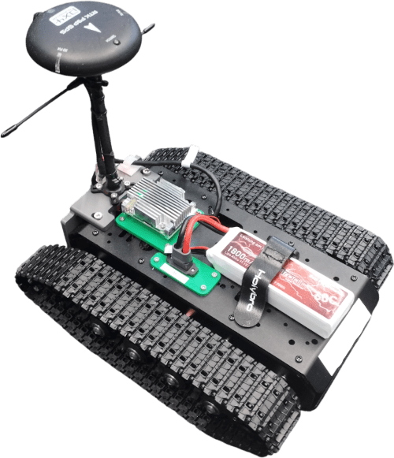
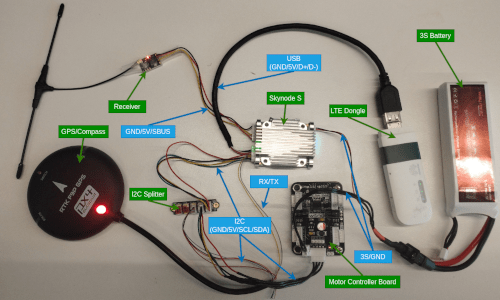
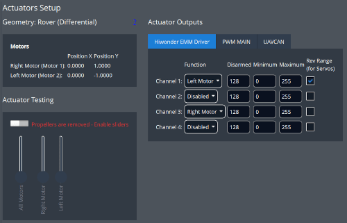

# Hiwonder Tracked

<Badge type="tip" text="PX4 v1.18" />

The [Hiwonder Tracked](https://www.hiwonder.com/products/suspended-shock-absorbing-tracked-chassis?variant=40378709835863) rover is a bare-bones platform including a chassis, two tracks, two [motors with encoders](https://www.hiwonder.com/products/hall-encoder-dc-geared-motor?variant=40451123675223) and a [motor driver board](https://www.hiwonder.com/products/4-channel-encoder-motor-driver).
The chassis offers many mounting points, providing the flexibility to attach your own flight controller, sensors and other payload.

This documentation illustrates the setup of the rover and the configuration of the actuators.



## Parts List

::: tip
The hardware below is just an example — use whatever you have available.
Make sure all parts are compatible with your flight controller's ports, and adjust the wiring as needed.
Alternatives are listed in:

- [Flight Controllers](../flight_controller/index.md)
- [PX4-Compatible Receivers](../getting_started/rc_transmitter_receiver.md#px4-compatible-receivers-compatible_receivers)
- [Data Links](../data_links/index.md)
- [Global Navigation Satellite Systems (GNSS)](../gps_compass/index.md#supported-gnss) or [RTK GNSS](../gps_compass/rtk_gps.md)

:::

The following parts are used in this build:

- Frame: [Hiwonder Tracked Chassis](https://www.hiwonder.com/products/suspended-shock-absorbing-tracked-chassis?variant=40378709835863)
- Flight Controller: [Auterion Skynode S](https://auterion.com/product/skynode-s/)

  ::: info
  The flight controller and motor driver board used in this build are both directly supplied at the same 3S battery voltage (~11V).

  Many flight controllers require a lower voltage power supply, so if you are using a different controller you may need a DC-to-DC converter to power it from the battery — see [Power Modules & Power Distribution Boards](../power_module/index.md).
  :::

- Receiver: [TBS Crossfire Nano RX](https://www.team-blacksheep.com/products/prod:crossfire_nano_rx?srsltid=AfmBOopvPF1mhPRIS11amSwdKf4OFZlt2ibj7XJwu05kVWt4S_L-ZNuD)
- Power: 3S Lipo Battery
- GNSS: [Holybro RTK F9P GPS](../gps_compass/rtk_gps_holybro_h-rtk-f9p.md)
- I2C Splitter

  ::: info
  This part is only necessary if your flight controller has only one I2C port (we need one for the motor driver board and one for the compass in the GNSS module).
  Many boards will have a dedicated GPS port (which often includes an I2C port) and one or more separate I2C ports for additional peripherals.
  :::

- LTE Dongle: Used to establish a data link between the vehicle and the ground control station.

## Wiring and Assembly

The following images shows the wiring of the various components of this build.
The connections from the motors to the motor controller board are not shown.



::: info
This image only serves as an example for the wiring process, with your hardware this can look very different.
Check the documentation of your parts to ensure that you connect to correct pins.
:::

With the wiring complete, you can now securely attach your hardware to the chassis.

::: tip
For the initial build you might attach components using double sided tape.
For a longer term solution we highly recommend 3d printing mounts that you attach to the chassis using the mounting points.
:::

## Building the Firmware

You will need to use a custom build, because the motor driver used is not present in firmware by default.

The steps are:

1. Open `rc.board_sensors` file of your board and add the following lines (for Skynode S this would be in [boards/auterion/fmu-v6s/init/rc.board_sensors](https://github.com/PX4/PX4-Autopilot/blob/main/boards/auterion/fmu-v6s/init/rc.board_sensors)):

   ```sh
   if param compare HIWONDER_EMM_EN 1
   then
      hiwonder_emm start
   fi
   ```

2. Add the following line to the `rover.px4board` file of your board (for Skynode S this would be in [boards/auterion/fmu-v6s/rover.px4board](https://github.com/PX4/PX4-Autopilot/blob/main/boards/auterion/fmu-v6s/rover.px4board)):

   ```txt
   CONFIG_DRIVERS_HIWONDER_EMM=y
   ```

3. Build the firmware for the board

## PX4 Configuration

Use _QGroundControl_ for rover configuration:

1. [Flash your custom rover build](../config_rover/index.md#flashing-the-rover-build) onto your flight controller.
2. In the [Basic Configuration](../config/index.md) section, select the [Airframe](../config/airframe.md) tab.
3. Choose **Hiwonder Tracked** under the **Rover** category (Alternatively you can set the parameter `SYS_AUTOSTART` to `50002`).

Then configure the actuators:

1. Navigate to [Actuators Configuration & Testing](../config/actuators.md) in QGroundControl.
2. Select the Hiwonder EMM driver from the list of _Actuator Outputs_.

   Assign one of the populated channels of the motor controller board to the `Left Motor` and one to the `Right Motor`. The channels are noted on the motor controller board (alternatively randomly assign the channels and use the actuator testing tab to find the correct assignments).
   Now ensure that both motors are spinning in the same direction. If that is not the case check the `Rev Range` box on one of the motors.

   

3. Arm the rover in [Manual Mode](../flight_modes_rover/manual.md#manual-mode) and use the trottle stick to drive forwards.
   If the rover drives backwards instead, invert the `Rev Range` checkboxes on **both** motors.

You have now successfully setup your rover and can start testing all [driving modes](../flight_modes_rover/index.md) PX4 has to offer!
