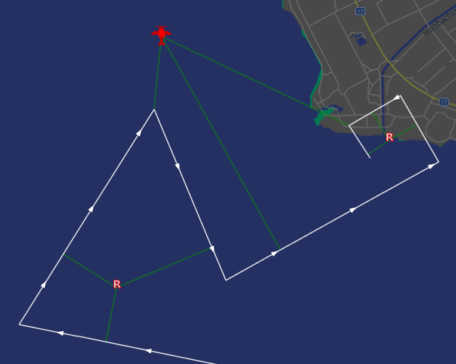
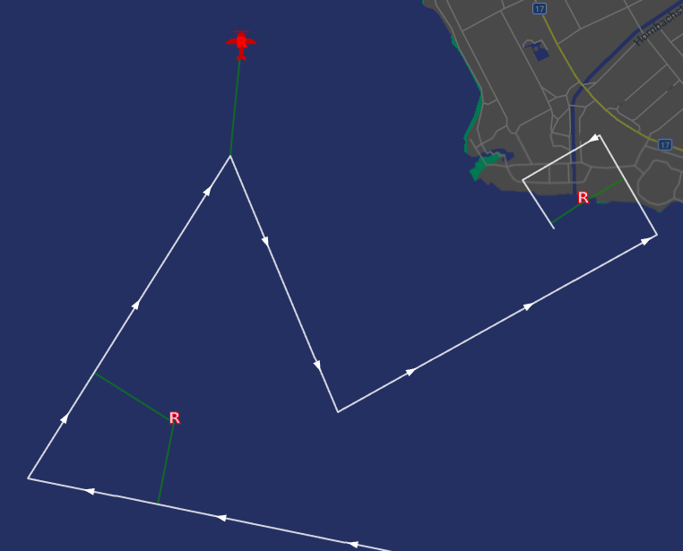
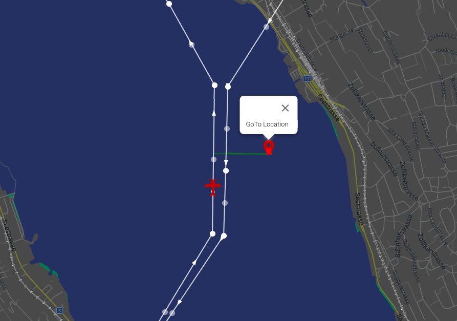
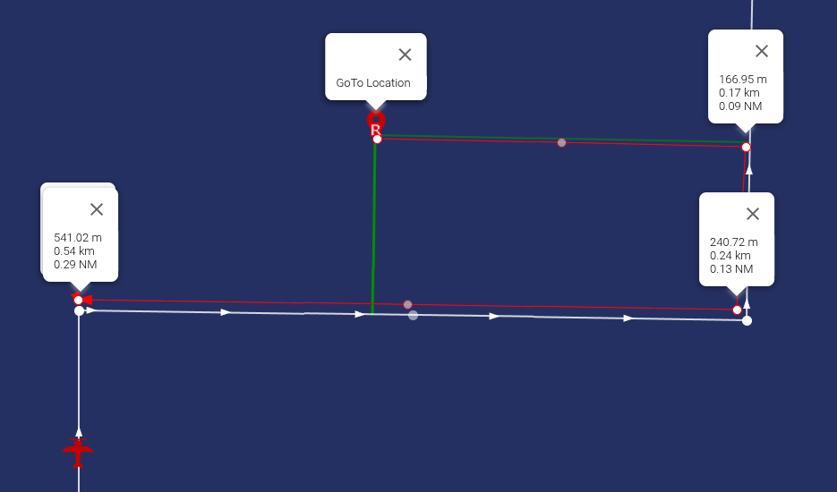
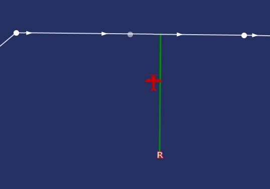
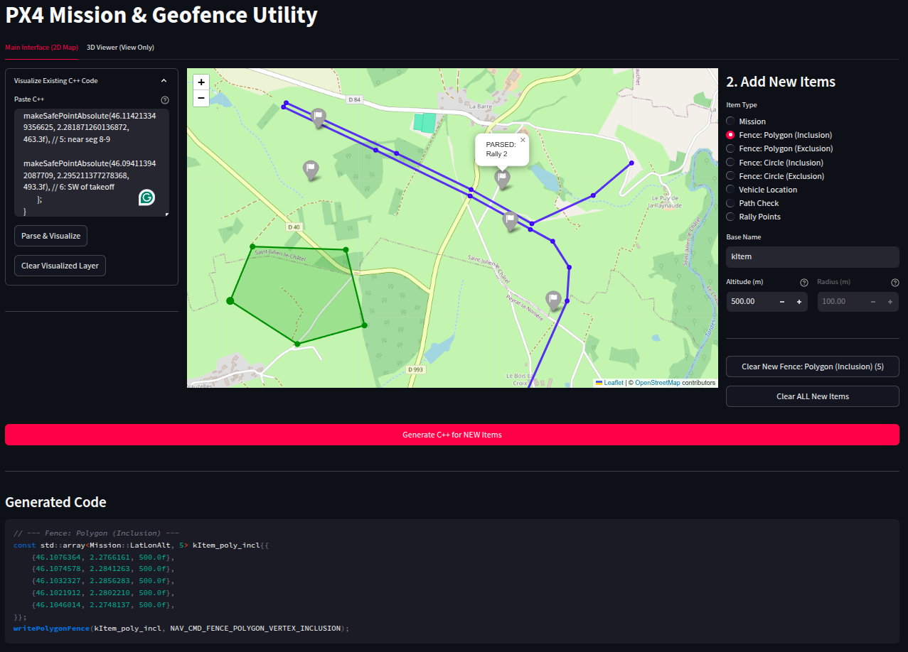

# Mission Route Planning Infrastructure

PX4 includes mission-route planning infrastructure in Navigator for intelligently joining, following, and completing a planned route.
This infrastructure might be used for:
- **[Smart mission rejoin](#smart-mission-rejoin)**: Finding the best branch-in point to rejoin a mission (for example after moving to a GoTo point).
- **[Route-following Return](#route-following-return)**: Choosing the best [safe point](../flying/plan_safety_points.md) exit point when using the mission route as a [Return mode](../flight_modes/return.md): branching off close to the selected point instead of cutting straight across terrain.

The infrastructure is included in the Navigator, and provides a non-blocking full-route cache for quick access to the whole uploaded mission.
It also includes a planner that projects the vehicle and safe-point positions perpendicularly onto each mission segment, then selects the best candidate using that projection (along with additional criteria such as the last segment flown).

The planner computes geometry and scoring only.
It does not publish setpoints, change the mission index, or decide when a flight mode should use the result.

::: info
This page documents the algorithms and features (such as mission cache) used for smart route planning.
At time of writing this infrastructure is not yet used.
:::

::: warning
The planner can only project against a mission that fits in the cache: `CONFIG_RTL_MISSION_CACHE_SIZE`.
A mission with more items than `CONFIG_RTL_MISSION_CACHE_SIZE` cannot be route-planned, and a planning pass against it fails (the consuming feature is expected to fall back to another behavior in that case).
Because the default is `0` on non-testing boards, route planning is disabled until a board explicitly sizes the cache for its RAM budget.
:::

::: warning
Rally points are scored in fixed-size batches of `CONFIG_RTL_SAFE_POINT_BATCH_SIZE` (default **1**, **64** on testing builds).
When more rally points are configured than fit in one batch the planner re-scans the full mission route once per batch, so a mission with many rally points can be walked several times per planning pass. See [Safe-Point Batching](#safe-point-batching).
:::

::: warning
At time of writing, no geofence check is applied to the projection candidates.
:::

## Planning Entry Points

The planner exposes two top-level entry points, one for each consumer feature listed above.
Both take the current vehicle state and mission index, compose the building blocks documented in the rest of this page, and return plain data for the caller to execute.

::: info
They are the public API the planned consumers will call. At time of writing, neither has a production caller yet.
:::

### Smart Mission Rejoin {#smart-mission-rejoin}

`MissionRoutePlanner::planMissionResumeJoin()` plans how to resume a mission after the vehicle has left the planned route (for example after a GoTo, a manual reposition, or branching off for a Return). It works as follows:

1. Runs [Vehicle Projection](#vehicle-projection) to find the branch-in point.
2. Solves the shortest valid path **in the nominal mission direction** toward the mission end.
3. Fills the join context (the branch-in waypoint and its altitude).

If the branch-in lands on an active [`DO_JUMP` loop segment](#vehicle-projection), the loop's repeat count is preserved:
- while repeats remain the resumed path continues to the jump target so the loop is still flown
- once repeats are exhausted, the planner picks whichever loop exit gives the shorter **total** path on to the mission end: continuing forward to the jump target, or rewinding back to the waypoint before the jump command (each including any fixed-wing U-turn penalty). The comparison is over the full path, so if the mission end lies near the loop start it may rewind most of the loop rather than finish it.

### Route-Following Return {#route-following-return}

`MissionRoutePlanner::planRouteToGoal()` plans a Return that uses the mission route as the return corridor instead of cutting straight across terrain. It works as follows:
1. Runs the [Vehicle Projection](#vehicle-projection) to find the branch-in point.
2. Runs [Safe-Point Scoring](#safe-point-scoring) against that projection and selects the lowest-cost safe point (or falls back to the closer mission endpoint when none is usable).
3. Returns the vehicle projection, the join context, and the selected goal: branch-off point, goal position, and route direction.

The vehicle is projected first; the safe points are then scored in a separate scan (or scans, see [Safe-Point Batching](#safe-point-batching)) that reuses the vehicle projection rather than recomputing it.

The planner-owned [route-skip shortcuts](#route-skip-shortcuts) are applied to the selected goal so the caller can skip route join/follow when the vehicle is already close to it.

::: warning
The mission-endpoint fallback assumes the mission **land** item is the last position item on the route: it targets the land goal using the full route length.
If the land item is not the last valid route position (for example if waypoints follow it), the returned route path and the land goal position can disagree.
:::

Here an active [`DO_JUMP` loop segment](#vehicle-projection) is used as return geometry only: the loop repeat count is forced to zero (unlike [Smart Mission Rejoin](#smart-mission-rejoin)). The planner then picks whichever loop exit gives the shorter **total** return path to the goal: continuing forward to the jump target, or rewinding back to the waypoint before the jump command (each including any fixed-wing U-turn penalty). The comparison is over the full path, so if the goal lies near the loop start the planner may rewind most of the loop instead of finishing it.

## Point Projection

This is the shared projection step used by both the [Vehicle Projection](#vehicle-projection) and the [Safe-Point Scoring](#safe-point-scoring) below.
The projected point is the vehicle in one case and a safe point (rally point) in the other.

The planner draws a perpendicular projection from the point onto every route segment and keeps up to three candidates per point.
A projection is a valid candidate only if its crosstrack distance is within a search margin of the closest candidate's crosstrack distance.
The consuming feature supplies that margin.
When more than three projections fall within the margin, only the three with the smallest crosstrack distance are kept and the rest are dropped.

The mission route planner supports [`DO_JUMP`](https://mavlink.io/en/messages/common.html#MAV_CMD_DO_JUMP) mission loop commands. The active jump segment is the segment running from the waypoint before the jump command to the first position waypoint at the jump target.
A point projects onto a loop segment using the same crosstrack and margin rule as any other segment. How that candidate is then used differs for the vehicle branch-in ([Vehicle Projection](#vehicle-projection)) and for safe-point branch-offs ([Safe-Point Scoring](#safe-point-scoring)).

::: warning
At time of writing, no geofence check is applied to the projection candidates.
:::

::: details Click here for more detail on how projections land on segments and corners

A projection is normally perpendicular to the point on a segment, but it is only kept if it is a _local minimum_ of the distance to the route.
This rule decides what happens at a waypoint, where two segments meet:

- An interior projection, one that lands part-way along a segment, is always kept.
- A projection that lands exactly on a waypoint (a corner) is kept only when the previous segment and the current segment both project onto that same shared corner.
  This happens when two consecutive segments form a V-shape and the point is closest to the apex:

```text
 A \      / C
    \    /          P projects onto corner B from both segments.
     \  /           Both projections land on B, so the shared
    B \/            corner is kept as a single candidate.

       ^
       P
```

This is why some projections in the images below land on a waypoint instead of perpendicular to a segment.
:::

The example below uses a large margin.
The mission route is drawn in white and the rally-point (`R`) projections in green.
Every rally point has three projections because the margin is large.



Here is the same route with a smaller margin.
Some projections are dropped because their crosstrack distance is greater than the closest projection's crosstrack distance plus the margin.



With a margin of zero, each rally point keeps only its single closest projection.

## Vehicle Projection

When a feature needs to rejoin the route, the first step is to project the current vehicle position onto the mission path and choose a "branch-in" point.
The vehicle may have left the route (for example with a GoTo), so the planner picks the point that best preserves mission continuity.

The branch-in point is chosen in three phases:

**Phase 1: Identifying valid candidates:**

The vehicle is projected onto the route as described in [Point Projection](#point-projection).

**Phase 2: Selecting the best branch-in point:**

The best candidate is chosen with a priority system:

- Priority 1: a candidate is selected immediately if it lies on the segment the vehicle is currently expected to be flying (the last targeted waypoint index, or the last flown `DO_JUMP` segment if the caller supplied it).
- Priority 2: if no candidate matches Priority 1, the planner scores each candidate by summing the following distances, and keeps the lowest:
  - Crosstrack distance: from the vehicle to the projection on the route.
  - Distance along the route to the last-flown segment: from the projection, following the mission path to whichever end of the last-flown segment is closer.
This selects the candidate that gets the vehicle back to where it was last flying if available, or the best match for a close in-sequence segment if it is not.


**Example 1:**

The vehicle is flying a mission, where the outbound and inbound legs are close to one another at the start.
While on the outbound leg, the vehicle deviates east to a GoTo location (e.g. due to incoming traffic).
That GoTo location is closer to the inbound leg, but both legs are close enough that the projection step returns two valid candidates: one on the outbound leg and one on the inbound leg.
The outbound segment is the one the vehicle is currently expected to fly, so it wins immediately on Priority 1.
Even without that rule it would still win on Priority 2, which measures distance _along the route_ back to the last-flown segment.
The vehicle was last flying on the outbound leg, so the outbound projection is only a short way along the route from it.
Reaching that same segment from the inbound projection would mean flying almost the entire mission back, so the inbound candidate scores far higher and loses.
The vehicle rejoins the mission and continues toward B.



**Example 2:**

The vehicle is flying north and deviates to a GoTo location that has two valid branch-in candidates.
Neither projection lies on the current segment, so each candidate is scored by summing its crosstrack distance and the distance along the route to the last-flown segment.
Take the candidate projected onto the east segment.
Its score is the crosstrack distance (166.95 m) plus the distance along the route back to the last-flown segment (the red lines).
The closer end of the last-flown segment is used, and the along-route distance is the sum of the straight lines between waypoints.
The other candidate, projected onto the south segment, wins because its total distance is smaller.



**Phase 3: Determining the branch-in altitude:**

- Linear interpolation: by default the altitude is interpolated between the start and end waypoint altitudes of the segment (for example, rejoining on segment 2-3 interpolates between waypoint 2 and waypoint 3).
- Special case (land): if the branch-in point falls on a land segment, the previous waypoint altitude is used.
- Special case (short segments): if the segment is too short to interpolate reliably (such as stacked waypoints), the segment end waypoint altitude is used.

**`DO_JUMP` loop segments:** the vehicle can also branch-in on a loop edge.
A loop edge is projected and scored like any normal segment, vehicle projection does not skip it, so it competes as an ordinary candidate. This is required because the loop edge might be the only valid candidate (e.g. after a GoTo close to the loop edge).

What the path does once it reaches that loop edge is decided later during path solving, separately for each entry point (see [Smart Mission Rejoin](#smart-mission-rejoin) and [Route-Following Return](#route-following-return)).

## Safe-Point Scoring

For a route-following return, the vehicle follows the mission route until it reaches a "branch-off" point and then flies straight to a safe point.
The planner first finds the candidate branch-off points and then selects the safe point with the lowest total return cost.

This runs in two phases:

**Phase 1: Identifying valid candidates:**

The eligible safe points are projected onto the route using the same [Point Projection](#point-projection) described above.
The vehicle was already projected by the [Vehicle Projection](#vehicle-projection) step, so its branch-in point is reused here rather than recomputed.
Safe points are projected in fixed-size batches (see [Safe-Point Batching](#safe-point-batching)), and the route is scanned once per batch.

**Phase 2: Selecting the best projection point:**

Each candidate branch-off is scored by total path cost, and the lowest wins. The cost is built from:

- Along-route distance: along the route geometry from the vehicle projection to the safe-point projection (branch-off point), using straight lines between waypoints.
- Branch-off leg: the straight-line distance from the safe-point projection to the safe point (the off-route leg flown after leaving the route).
- U-turn penalty: for fixed-wing and VTOL-in-FW, an extra distance penalty is added when the path would require an immediate U-turn, so forward-flowing paths are preferred. The U-turn is detected by comparing the vehicle's current velocity with the direction it would have to fly along the route toward the goal: if the two are more than 90° apart, the vehicle would have to turn around, and the penalty is applied. The caller supplies the penalty value (set it to 0 to disable). Multirotors and hovering VTOL are exempt, because they can turn on the spot.

As the planner gathers the safe points to consider, it filters out the ones it cannot use:

- Safe points are read from the dataman store through the provider.
- Invalid coordinates, unsupported frames, or filtered safe points are skipped.
- Every remaining safe point gets up to three projections.

Safe-point branch-off candidates on loop segments are more restricted:

- If the vehicle is not itself flying a loop, safe-point projections on loop segments are skipped.
  This prevents a return from entering a mission loop just to reach a branch-off point.
- If the vehicle and selected safe point project onto the same active loop segment, the return path may follow that loop edge to the branch-off point.
- If the selected safe point is outside the active loop, the planner first chooses how to leave the loop (shortest overall path), then follows the normal route toward the selected branch-off point or fallback endpoint.

### Route-Skip Shortcuts

After the best safe point has been chosen, a route-to-goal caller can skip the route join/follow entirely:

- **Direct-to-safe-point**: if the vehicle is already within the direct acceptance radius of the selected safe point, go straight to it.
- **Close-to-branch-leg**: if the vehicle is already close to the selected branch-off leg (both horizontally and vertically), continue straight toward the goal.

These shortcuts are applied only after selection, so they never change which safe point wins the cost comparison.

**Example:** In the image below the vehicle is already on the branch-off leg, after a GoTo or a canceled Return.
If a new Return is requested, the vehicle flies straight to the rally point (`R`) instead of flying back to the branch-in point only to branch off again.



### Safe-Point Batching {#safe-point-batching}

The planner scores eligible safe points using a single fixed-size projection batch buffer, sized by `CONFIG_RTL_SAFE_POINT_BATCH_SIZE` (default **1**, **64** on testing builds).
The batch buffer is reused for every planning pass and is allocated in static RAM, costing roughly `sizeof(ProjectionReference) * CONFIG_RTL_SAFE_POINT_BATCH_SIZE` bytes (about 370 bytes per slot).
The default of **1** keeps that cost negligible on boards that leave route planning disabled (`CONFIG_RTL_MISSION_CACHE_SIZE=0`); boards that enable route planning should raise it.


::: warning
If the number of eligible rally points exceeds `CONFIG_RTL_SAFE_POINT_BATCH_SIZE`, each planning pass loops over the full mission route multiple times (once per batch of rally points).
To keep every rally point in a single mission scan, raise `CONFIG_RTL_SAFE_POINT_BATCH_SIZE` on boards that have the RAM budget for it.
:::

`CONFIG_RTL_SAFE_POINT_BATCH_SIZE` must stay between `1` and `255` because the batch counters and indices are stored in `uint8_t`.

```ini
CONFIG_RTL_SAFE_POINT_BATCH_SIZE=64
```

## Route Cache

`MissionRouteCache` is the production data source (provider) for the planner.
Normal mission execution only keeps a small sliding window of mission items in RAM, but route planning needs random, non-blocking access to the whole mission to project points against every segment.
The cache provides that: it mirrors the full mission, the safe points, and the mission-land item into RAM, and is maintained from Navigator's work loop.

```text
MissionRouteCache
|-- full mission route cache      [0 ... CONFIG_RTL_MISSION_CACHE_SIZE - 1]
|-- safe-point cache              [all uploaded safe-point dataman items]
|-- mission-land item cache       [published mission land index]
`-- safe-point stats reader       [DM_KEY_SAFE_POINTS_STATE async state machine]
```

Planner reads use a zero wait timeout, so a cache miss returns failure instead of blocking Navigator while dataman or the SD card catches up.
The cache tracks mission identity and reloads when the mission changes; if an item is missing it schedules a retry with bounded exponential backoff.
Safe points have their own asynchronous state machine, are reloaded when their source identity changes, and are never exposed as stale data while a reload is in progress.

### Cache Size

`CONFIG_RTL_MISSION_CACHE_SIZE` sets the maximum number of mission items reserved for full-route planning.
The default is `100` for `BOARD_TESTING` builds and `0` otherwise.
A value of `0` disables the cache and reserves no entries, so boards that enable a route-planning consumer must size it for their RAM budget.
Each reserved item uses roughly 76 bytes of heap for the lifetime of Navigator.

```ini
CONFIG_RTL_MISSION_CACHE_SIZE=300
```

::: warning
The planner can only project against a mission that fits in the cache: `CONFIG_RTL_MISSION_CACHE_SIZE`.
A mission with more items than `CONFIG_RTL_MISSION_CACHE_SIZE` cannot be route-planned, and a planning pass against it fails (the consuming feature is expected to fall back to another behavior in that case).
Because the default is `0` on non-testing boards, route planning is disabled until a board explicitly sizes the cache for its RAM budget.
:::

### Cache Coherency

Navigator can hold more than one cache view of the same mission item.
`DatamanCache::updateCachedItem()` lets a caller mirror an already-written, stable value into another cache without issuing a second dataman request.
`MissionRouteCache::syncMissionItem()` uses it to keep the planner-facing caches coherent after a mission item was written through another path; it does not patch entries that are still waiting for an asynchronous read.

## Code Architecture

Each file is one unit. The planner is the entry point and drives two workers; the others are shared support:

```text
mission_route_planner.*           runs one planning pass, returns the result (start here)
 |-- mission_route_projection.*   projects the vehicle and safe points onto the route
 `-- mission_route_goal.*         scores safe points, picks the goal and route direction

mission_route_provider.*          interface for reading mission and safe-point data
mission_route_cache.*             caches the mission in RAM for non-blocking access
mission_route_types.*             shared structs, constants, and parsing helpers used by all
```

The unit tests live in `src/modules/navigator/test/` (`test_mission_route_*.cpp`, with shared fixtures under `test/support/`). They use an in-memory `VectorMissionRouteProvider`, so the geometry is exercised without dataman or SD-card access:

- `functional-test_mission_route_cache`: cache loading, oversized-mission rejection, safe-point retry/identity, and stale-data protection.
- `functional-test_mission_route_projection_candidates`: candidate-buffer ordering, pruning, validation, and local-minimum corner rules.
- `functional-test_mission_route_projection`: vehicle branch-in selection, current-segment preference, loop anchors, and edge cases.
- `functional-test_mission_route_goal`: safe-point scoring, U-turn penalty, VTOL approach eligibility, endpoint fallback, and skip policy.

Because the test geometry is defined directly in C++, it can be hard to picture. To inspect a test case visually, paste its C++ into the Streamlit helper at `Tools/navigator_mission_planner_visualizer/` (`mission_planner_tools.py`), which plots the missions, fences, rally/safe points, vehicle positions, and projections on a map. The same tool can generate C++ snippets for new test data drawn on the map. See its [README](https://github.com/PX4/PX4-Autopilot/blob/main/Tools/navigator_mission_planner_visualizer/AddAndVisualizeUnitTests.md) for the supported syntax and setup.


