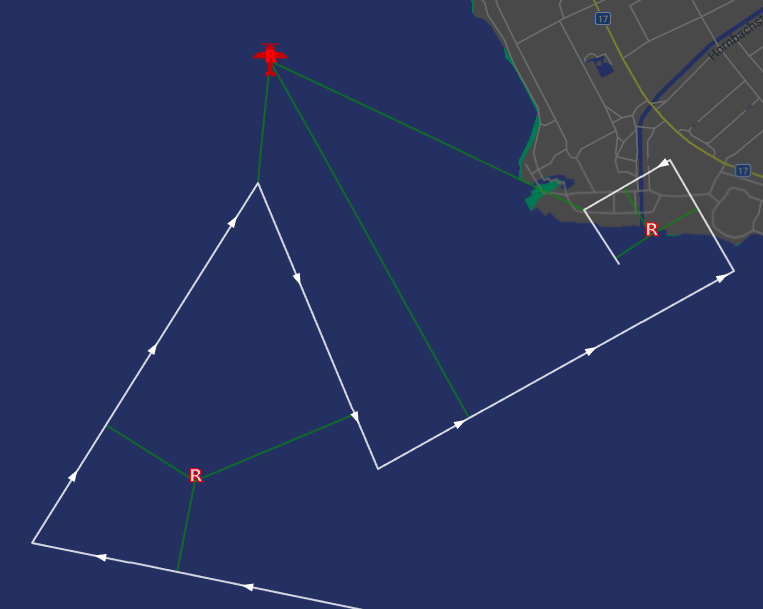
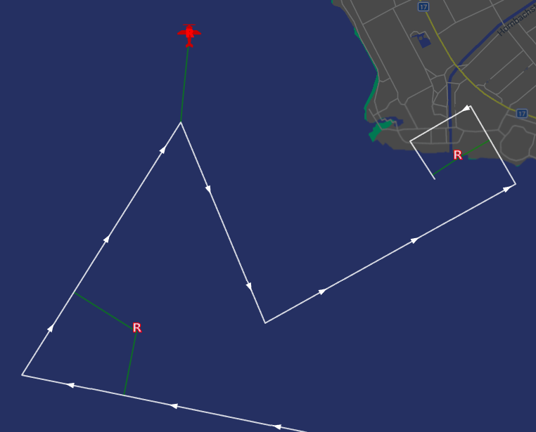
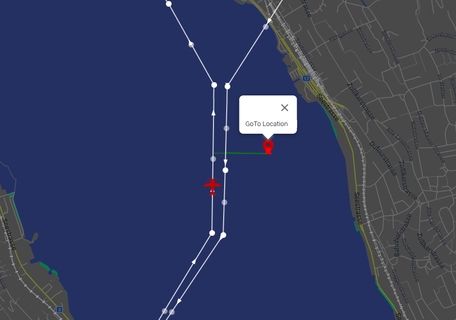
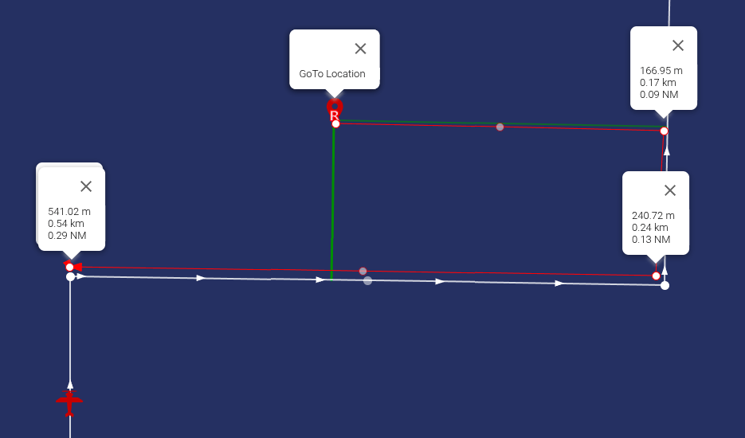
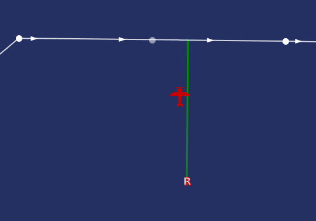
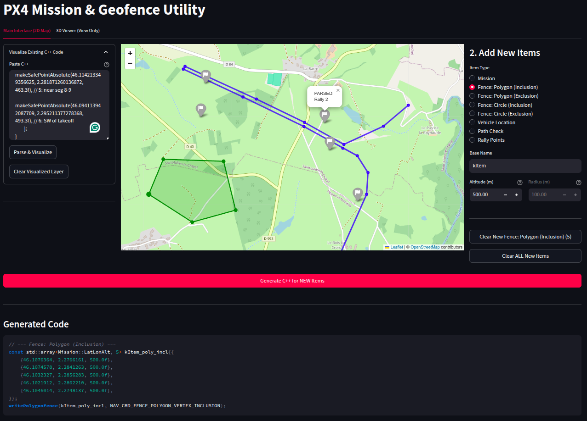

# Mission Route Planning

PX4 includes mission-route planning infrastructure in Navigator for intelligently joining, following, and leaving an uploaded mission route.
It provides:

- **[Smart route join](#smart-mission-rejoin)**: Finding a suitable branch-in point after the vehicle has left the route.
- **[Route-following Return](#route-following-return)**: Choosing the best [safe point](../flying/plan_safety_points.md) and branch-off point, then using the mission route as a [Return path](../flight_modes/return.md#rtl_type_7).

Navigator provides non-blocking access to the complete mission, safe points, and mission-land item through the [mission route cache](../advanced/mission_route_cache.md).
It also includes a planner that projects the vehicle and safe-point positions perpendicularly onto each mission segment, then selects the best candidate using that projection (along with additional criteria such as the last segment flown).

The planner computes geometry and scoring only.
Mission and Return execute the public plans returned by the planner.
The Route Safe Point Return executor joins and follows the route, branches off, and lands.

::: info
Smart rejoin has two callers.
Route Safe Point Return (`RTL_TYPE=7`) uses it for its initial route join, and Mission mode uses it on activation while airborne when [MIS_ROUTE_JOIN](../advanced_config/parameter_reference.md#MIS_ROUTE_JOIN) is enabled (off by default).
`RTL_TYPE=6` retains its existing battery-aware home/rally return behavior.
:::

::: warning
The planner requires a complete mission from the [mission route cache](../advanced/mission_route_cache.md).
If the cache or planning result is unavailable, Route Safe Point Return falls back to the direct destination selection used by `RTL_TYPE=3`.
A fallback caused by pending cache inputs is reconsidered after those inputs become ready.
Changes to the mission cache generation or rally-point source trigger reevaluation, unless the executor has already committed to landing.
:::

::: info
Route-following Return currently supports fixed-wing and multicopter vehicles.
VTOL vehicles use direct RTL fallback because front transitions are disabled in `AUTO_RTL`.
Smart Mission rejoin can execute the VTOL transition actions supplied by the planner.
:::

::: warning
Rally points are scored in fixed-size batches of `CONFIG_NAVIGATOR_SAFE_POINT_BATCH_SIZE` (default **1**, **32** on testing builds).
When more rally points are configured than fit in one batch the planner re-scans the full mission route once per batch, so a mission with many rally points can be walked several times per planning pass. See [Safe-Point Batching](#safe-point-batching).
:::

::: warning
No geofence or obstacle check is applied to a planned join, route, or branch-off leg.
:::

## Planning Entry Points

The planner exposes two entry points: one plans a Mission resume join, the other plans a route-following Return.
Both take the current vehicle state and mission index, compose the building blocks documented below, and return a plain plan for the caller to execute: where to join the route, which mission item to fly first, and in which direction.
The Return plan also carries the selected goal and, for a rally point, the branch-off point.
Consumers execute these plans without depending on the planner's internal projection or scoring types.

::: info
A consumer must first acquire a complete view of the active mission.
Route-following Return must also wait until safe-point loading is complete; a zero safe-point count alone can mean either pending or ready and empty.
See [Mission Route Cache](../advanced/mission_route_cache.md#availability).
:::

### Smart Mission Rejoin {#smart-mission-rejoin}

The mission-resume entry point plans how to resume a mission after the vehicle has left the route (for example after a GoTo or manual reposition). It works as follows:

1. Runs [Vehicle Projection](#vehicle-projection) to find the branch-in point.
2. Solves the shortest valid path **in the nominal mission direction** toward the mission end.
3. Fills the join context (the branch-in waypoint and its altitude).

If the branch-in lands on an active [`DO_JUMP` loop segment](#vehicle-projection), the loop's repeat count is preserved:

- while repeats remain the resumed path continues to the jump target so the loop is still flown
- once repeats are exhausted, the planner picks whichever loop exit gives the shorter **total** path on to the mission end: continuing forward to the jump target, or rewinding back to the waypoint before the jump command (each including any fixed-wing U-turn penalty). The comparison is over the full path, so if the mission end lies near the loop start it may rewind most of the loop rather than finish it.

Mission mode runs this entry point on activation when [MIS_ROUTE_JOIN](../advanced_config/parameter_reference.md#MIS_ROUTE_JOIN) is enabled.
The vehicle first flies to a temporary branch-in waypoint on the route, then resumes the mission from there.
The projection search margin is set by [MIS_MC_SEG_DIST](../advanced_config/parameter_reference.md#MIS_MC_SEG_DIST) (multicopter) and [MIS_FW_SEG_DIST](../advanced_config/parameter_reference.md#MIS_FW_SEG_DIST) (fixed-wing).
If planning is not possible (for example the route cache is not ready), Mission mode uses its normal mission activation behavior.
Existing camera-trigger resume behavior that returns to the previous waypoint takes precedence over route rejoin.
Selecting a mission item explicitly cancels a pending virtual join.

### Route-Following Return {#route-following-return}

The route-to-goal entry point plans a Return that uses the mission route as the return corridor instead of cutting straight across terrain. It works as follows:

1. Runs the [Vehicle Projection](#vehicle-projection) to find the branch-in point.
2. Runs [Safe-Point Scoring](#safe-point-scoring) against that projection and selects the lowest-cost safe point (or falls back to the closer mission endpoint when none is usable).
3. Returns the plan: join position, first mission item, route direction, and the selected goal with its branch-off point.

The vehicle is projected first; the safe points are then scored in a separate scan (or scans, see [Safe-Point Batching](#safe-point-batching)) that reuses the vehicle projection rather than recomputing it.

The planner-owned [route-skip shortcuts](#route-skip-shortcuts) are applied to the selected goal so the caller can skip route join/follow when the vehicle is already close to it.

Here an active [`DO_JUMP` loop segment](#vehicle-projection) is used as return geometry only: the loop repeat count is forced to zero (unlike [Smart Mission Rejoin](#smart-mission-rejoin)). The planner then picks whichever loop exit gives the shorter **total** return path to the goal: continuing forward to the jump target, or rewinding back to the waypoint before the jump command (each including any fixed-wing U-turn penalty). The comparison is over the full path, so if the goal lies near the loop start the planner may rewind most of the loop instead of finishing it.

## Point Projection

This is the shared projection step used by both the [Vehicle Projection](#vehicle-projection) and the [Safe-Point Scoring](#safe-point-scoring) below.
The projected point is the vehicle in one case and a safe point (rally point) in the other.

The planner draws a perpendicular projection from the point onto every route segment and keeps up to three candidates per point.
A projection is a valid candidate only if its crosstrack distance is within a search margin of the closest candidate's crosstrack distance.
The consuming feature supplies that margin.
When more than three projections fall within the margin, only the three with the smallest crosstrack distance are kept and the rest are dropped.

The mission route planner supports [`DO_JUMP`](https://mavlink.io/en/messages/common.html#MAV_CMD_DO_JUMP) mission loop commands. The active jump segment is the segment running from the waypoint before the jump command to the first position waypoint at the jump target.
A point projects onto a loop segment using the same crosstrack and margin rule as any other segment. How that candidate is then used differs for the vehicle branch-in ([Vehicle Projection](#vehicle-projection)) and for safe-point branch-offs ([Safe-Point Scoring](#safe-point-scoring)).

::: details Click here for more detail on how projections land on segments and corners

A projection is normally perpendicular to the point on a segment, but it is only kept if it is a _local minimum_ of the distance to the route.
This rule decides what happens at a waypoint, where two segments meet:

- An interior projection, one that lands part-way along a segment, is always kept.
- A projection that lands exactly on a waypoint (a corner) is kept only when the previous segment and the current segment both project onto that same shared corner.
  This happens when two consecutive segments form a V-shape and the point is closest to the apex:

```text
 A \      / C
    \    /          P projects onto corner B from both segments.
     \  /           Both projections land on B, so the shared
    B \/            corner is kept as a single candidate.

       ^
       P
```

This is why some projections in the images below land on a waypoint instead of perpendicular to a segment.
:::

The example below uses a large margin.
The mission route is drawn in white and the rally-point (`R`) projections in green.
Every rally point has three projections because the margin is large.



Here is the same route with a smaller margin.
Some projections are dropped because their crosstrack distance is greater than the closest projection's crosstrack distance plus the margin.



With a margin of zero, each rally point keeps only its single closest projection.

<a id="stacked-waypoints"></a>

::: details Click here to see how stacked waypoints (same latitude and longitude) are handled

Two consecutive waypoints that share latitude and longitude form a vertical segment with zero horizontal length, for example a climb waypoint directly above `TAKEOFF` or a descent waypoint directly above `LAND`.
Every point projects onto such a segment at its single horizontal location, so the segment always looks like a corner hit from both sides.
Accepting that hit at the route ends would make the endpoint a candidate for every rally point, wherever the rally point is.
With a wide enough search margin the candidate survives the cross-track window, and because the path cost adds along-route and off-route distance, a diagonal shortcut from the endpoint can score lower than following the route:

```text
Mission order: A, B, B', LAND (B, B' and LAND share latitude/longitude)

Top view:
A ----------- P ----------- B/B'/LAND    V
              |
              R

Side view at the route end:
                         B' o 75 m
                          B o 50 m
                       LAND o ground
```

`V` is the vehicle, just beyond the landing location.
`R` is a rally point 50 m back along the route and 10 m to the side, and `P` is its perpendicular projection onto A-B.
Following the route to `P` and turning toward `R` costs 50 + 10 = 60 m.
Branching straight from the landing location to `R` costs about 51 m, so the diagonal would win even though all of it is flown off the route instead of only the final 10 m.
A vertical waypoint would then change the horizontal return path.

To prevent this, vertical segments are handled as follows:

- **Rally-point projections**: a vertical segment never creates its own endpoint candidate.
  The adjacent horizontal leg decides: if `R` projects onto the interior of A-B, that interior projection is used; if `R` lies beyond `B`, the endpoint remains a candidate.
  The same rule applies at takeoff, so vertical waypoints above `TAKEOFF` do not add a branch-off point for a rally point alongside the first horizontal leg.
  Interior stacks keep the normal corner rules, and an entirely vertical mission keeps its final location as a candidate.
- **Vehicle projection**: the vertical segment is kept when it matches the current mission index and flight direction, at both `LAND` and `TAKEOFF`.
  During a landing, a small drift toward `A` must not move the vehicle's projection from B'-LAND onto A-B.
  Keeping B'-LAND lets `LAND` remain the first target, and inside its acceptance radius the join keeps the current altitude instead of climbing back to the approach altitude (see Phase 3 of [Vehicle Projection](#vehicle-projection)).
  This exception is disabled during an active `DO_JUMP`: the jump target index does not mean the vehicle is flying the nominal vertical segment.
  Rally-point projections carry no mission index, so they always use the stricter geometric rule.

For the example above the return path is therefore: follow the route back to `P`, then take the short hop to `R`.

**Limitation**: if the vehicle was targeting `LAND` and then flew a distant GoTo, the mission index still points at `LAND`, so the vertical segment stays a candidate whenever it passes the cross-track margin filter.
Mission continuity can then prefer the diagonal path over a closer horizontal leg.
Only the horizontal path is affected: the current-altitude rule requires the vehicle to be inside the endpoint's acceptance radius, so a distant vehicle flies the diagonal at the approach altitude and never bypasses the altitude requirement.
This is a rare corner case and is accepted.

:::

## Vehicle Projection

When a feature needs to rejoin the route, the first step is to project the current vehicle position onto the mission path and choose a "branch-in" point.
The vehicle may have left the route (for example with a GoTo), so the planner picks the point that best preserves mission continuity.

The branch-in point is chosen in three phases:

**Phase 1: Identifying valid candidates:**

The vehicle is projected onto the route as described in [Point Projection](#point-projection).

**Phase 2: Selecting the best branch-in point:**

The best candidate is chosen with a priority system:

- Priority 1: a candidate is selected immediately if it lies on the segment the vehicle is currently expected to be flying (the last targeted waypoint index, or the last flown `DO_JUMP` segment if the caller supplied it).
  This includes the vertical segment being flown at takeoff or landing (see [Stacked Waypoints](#stacked-waypoints)).
- Priority 2: if no candidate matches Priority 1, the planner scores each candidate by summing the following distances, and keeps the lowest:
  - Crosstrack distance: from the vehicle to the projection on the route.
  - Distance along the route to the last-flown segment: from the projection, following the mission path to whichever end of the last-flown segment is closer.
    This selects the candidate that gets the vehicle back to where it was last flying if available, or the best match for a close in-sequence segment if it is not.

**Example 1:**

The vehicle is flying a mission, where the outbound and inbound legs are close to one another at the start.
While on the outbound leg, the vehicle deviates east to a GoTo location (e.g. due to incoming traffic).
That GoTo location is closer to the inbound leg, but both legs are close enough that the projection step returns two valid candidates: one on the outbound leg and one on the inbound leg.
The outbound segment is the one the vehicle is currently expected to fly, so it wins immediately on Priority 1.
Even without that rule it would still win on Priority 2, which measures distance _along the route_ back to the last-flown segment.
The vehicle was last flying on the outbound leg, so the outbound projection is only a short way along the route from it.
Reaching that same segment from the inbound projection would mean flying almost the entire mission back, so the inbound candidate scores far higher and loses.
The vehicle rejoins the mission and continues toward B.



**Example 2:**

The vehicle is flying north and deviates to a GoTo location that has two valid branch-in candidates.
Neither projection lies on the current segment, so each candidate is scored by summing its crosstrack distance and the distance along the route to the last-flown segment.
Take the candidate projected onto the east segment.
Its score is the crosstrack distance (166.95 m) plus the distance along the route back to the last-flown segment (the red lines).
The closer end of the last-flown segment is used, and the along-route distance is the sum of the straight lines between waypoints.
The other candidate, projected onto the south segment, wins because its total distance is smaller.



**Phase 3: Determining the branch-in altitude:**

- Linear interpolation: by default the altitude is interpolated between the start and end waypoint altitudes of the segment (for example, rejoining on segment 2-3 interpolates between waypoint 2 and waypoint 3).
- Special case (land): if the branch-in point falls on a land segment, the previous waypoint altitude is used.
- Special case (short segments): if the segment is too short to interpolate reliably (such as [stacked waypoints](#stacked-waypoints)), the segment end waypoint altitude is used.
- Special case (route ends): when the first item to fly is `LAND`, or `TAKEOFF` while flying the route in reverse, and the vehicle is already inside that item's horizontal acceptance radius, the join keeps the vehicle's current altitude.
  Both items sit at ground level, and without this rule a vehicle already descending onto them would first be sent back up to the approach altitude.
  Outside the acceptance radius the rules above apply as usual: a vehicle 30 m from a stacked takeoff with a 10 m acceptance radius rejoins at the stack's end altitude.

**`DO_JUMP` loop segments:** the vehicle can also branch-in on a loop edge.
A loop edge is projected and scored like any normal segment, vehicle projection does not skip it, so it competes as an ordinary candidate. This is required because the loop edge might be the only valid candidate (e.g. after a GoTo close to the loop edge).

What the path does once it reaches that loop edge is decided later during path solving, separately for each entry point (see [Smart Mission Rejoin](#smart-mission-rejoin) and [Route-Following Return](#route-following-return)).

## Safe-Point Scoring

For a route-following return, the vehicle follows the mission route until it reaches a "branch-off" point and then flies straight to a safe point.
The planner first finds the candidate branch-off points and then selects the safe point with the lowest total return cost.

This runs in two phases:

**Phase 1: Identifying valid candidates:**

The eligible safe points are projected onto the route using the same [Point Projection](#point-projection) described above.
Vertical segments at the route ends do not add their own branch-off candidates (see [Stacked Waypoints](#stacked-waypoints)).
The vehicle was already projected by the [Vehicle Projection](#vehicle-projection) step, so its branch-in point is reused here rather than recomputed.
Safe points are projected in fixed-size batches (see [Safe-Point Batching](#safe-point-batching)), and the route is scanned once per batch.

**Phase 2: Selecting the best projection point:**

Each candidate branch-off is scored by total path cost, and the lowest wins. The cost is built from:

- Along-route distance: along the route geometry from the vehicle projection to the safe-point projection (branch-off point), using straight lines between waypoints.
- Branch-off leg: the straight-line distance from the safe-point projection to the safe point (the off-route leg flown after leaving the route).
- U-turn penalty: for fixed-wing and VTOL-in-FW, an extra distance penalty is added when the path would require an immediate U-turn, so forward-flowing paths are preferred. The U-turn is detected by comparing the vehicle's current velocity with its desired course: toward the branch-in point when far from the route, or along the selected route direction when close to it. If the two are more than 90° apart, the penalty is applied. The caller supplies the penalty value (set it to 0 to disable). Multirotors and hovering VTOL are exempt, because they can turn on the spot.

As the planner gathers the safe points to consider, it filters out the ones it cannot use:

- Safe points are read through the provider. `MissionRouteCache` serves only a fully loaded RAM generation, so planning never reads Dataman directly.
- Invalid coordinates, unsupported frames, or filtered safe points are skipped.
- Every remaining safe point gets up to three projections.

Safe-point branch-off candidates on loop segments are more restricted:

- If the vehicle is not itself flying a loop, safe-point projections on loop segments are skipped.
  This prevents a return from entering a mission loop just to reach a branch-off point.
- If the vehicle and selected safe point project onto the same active loop segment, the return path may follow that loop edge to the branch-off point.
- If the selected safe point is outside the active loop, the planner first chooses how to leave the loop (shortest overall path), then follows the normal route toward the selected branch-off point or fallback endpoint.

### Route-Skip Shortcuts

After the best safe point has been chosen, a route-to-goal caller can skip the route join/follow entirely:

- **Direct-to-safe-point**: if the vehicle is already within the direct acceptance radius of the selected safe point, go straight to it.
- **Close-to-branch-leg**: if the vehicle is already close to the selected branch-off leg (both horizontally and vertically), continue straight toward the goal.
- **Endpoint goal**: for a mission `LAND` or `TAKEOFF` goal, the route-ends rule of [Vehicle Projection](#vehicle-projection) Phase 3 applies. When that endpoint is the first item to fly and the vehicle is inside its acceptance radius, the Return skips route following and flies directly to it.

These shortcuts are applied only after selection, so they never change which goal wins the cost comparison.

**Example:** In the image below the vehicle is already on the branch-off leg, after a GoTo or a canceled Return.
If a new Return is requested, the vehicle flies straight to the rally point (`R`) instead of flying back to the branch-in point only to branch off again.



### Safe-Point Batching {#safe-point-batching}

The planner scores eligible safe points using a single fixed-size projection batch buffer, sized by `CONFIG_NAVIGATOR_SAFE_POINT_BATCH_SIZE`.
The batch buffer is reused for every planning pass and is allocated in static RAM, costing roughly `sizeof(ProjectionReference) * CONFIG_NAVIGATOR_SAFE_POINT_BATCH_SIZE` bytes (about 380 bytes per slot).
The default is **1** (**32** on `BOARD_TESTING`).
The planner and this buffer are built only when `CONFIG_NAVIGATOR_FULL_MISSION_CACHE_SIZE` is greater than zero, so disabled builds reserve no planner batch buffer.
Boards that enable route planning should choose a batch size that fits their RAM budget.

::: warning
If the number of eligible rally points exceeds `CONFIG_NAVIGATOR_SAFE_POINT_BATCH_SIZE`, each planning pass loops over the full mission route multiple times (once per batch of rally points).
To keep every rally point in a single mission scan, raise `CONFIG_NAVIGATOR_SAFE_POINT_BATCH_SIZE` on boards that have the RAM budget for it.
:::

`CONFIG_NAVIGATOR_SAFE_POINT_BATCH_SIZE` must stay between `1` and `32`: the upper bound matches `DM_KEY_SAFE_POINTS_MAX`, the maximum number of storable safe points, so larger batches could never be filled.

```ini
CONFIG_NAVIGATOR_SAFE_POINT_BATCH_SIZE=32
```

## Parameters and Build Configuration

| Setting | Purpose | Default |
| --- | --- | --- |
| `MIS_ROUTE_JOIN` | Enable route rejoin on airborne Mission activation. | `0` |
| `MIS_MC_SEG_DIST` | Extra cross-track search margin for vehicle projections in multicopter mode. | 30 m |
| `MIS_FW_SEG_DIST` | Extra cross-track search margin for vehicle projections in fixed-wing mode. | 150 m |
| `RTL_RP_SEG_DIST` | Extra cross-track search margin for rally-point projections. | 30 m |
| `RTL_FW_UTURN_PEN` | Additional distance cost for a fixed-wing reversal during route-following Return. | 4000 m |

`CONFIG_NAVIGATOR_FULL_MISSION_CACHE_SIZE` must be greater than zero and large enough for the entire uploaded mission.
SITL defaults to 500 mission items.
An oversized mission remains usable by the normal Mission implementation but is unavailable to the route planner.
See [Safe-Point Batching](#safe-point-batching) for the rally-point batch configuration and memory tradeoff.

## Code Architecture

The reusable planner library and its Navigator consumers are in `src/modules/navigator/`.
The planner entry points orchestrate projection and goal selection; consumers execute only the public plans:

```text
mission_route_planner.*           public planning entry points, path solving, and goal scoring
 `-- mission_route_projection.*   projects the vehicle and safe points onto the route

mission_route_types.*             public requests, plans, positions, and parsing helpers
mission_route_internal_types.*    internal geometry and scoring types
mission_route_provider.h          interface for reading mission and safe-point data
mission_route_land_approaches.*   shared VTOL landing-approach lookup
mission_route_cache.*             composes full-mission, safe-point, and land caches
full_mission_cache.*              optional complete-mission buffer and async loader

mission.*                        requests and executes Mission rejoin plans
rtl.*                            requests a Return plan and selects the direct fallback
rtl_route_safe_point.*           owns optional planning, source identity, and route continuity
rtl_mission_safe_point_follow.*  executes the join, route, branch-off, and landing stages
mission_base.*                   provides shared route-join and VTOL-transition handling
```

Planning runs synchronously on the Navigator task because the planner shares fixed-memory scratch storage.
The route cache provides non-blocking mission and rally-point access.
Return validates the borrowed mission view and rally-point generation before accepting a plan.
Inactive Return estimates and initial activation use nominal Mission progress; hypothetical return directions and jump anchors are not reused as current flight state.
Once route-following Return is active, the executor's progress is retained for replanning, including temporary fallback while cache inputs reload.

Navigator records the VTOL state when it first observes a mission source and retains it through mission progress and rally-point updates.
A source change captures a new state; a transition in progress counts as multicopter mode.
This observation is not persisted across reboot, and unavailable vehicle status leaves the state unknown.

The unit tests live in `src/modules/navigator/test/` (`test_mission_route_*.cpp`, with shared fixtures under `test/support/`).
The geometry tests use an in-memory `VectorMissionRouteProvider`; the cache and MissionBase tests exercise the Dataman-backed integration:

- `functional-test_mission_route_cache`: async loading and polling, oversized-mission rejection, retry/identity, synchronization, views, and stale-data protection.
- `functional-test_mission_base`: mission execution, route joins, VTOL transitions, and coherence of successful `DO_JUMP` increments and resets with the full cache.
- `functional-test_mission_route_projection`: candidate ordering and pruning, local-minimum corner rules, vehicle branch-in selection, loop anchors, and edge cases.
- `functional-test_mission_route_planner`: public Mission and Return plans, loop path solving, safe-point scoring, U-turn penalty, VTOL approach eligibility, endpoint fallback, and skip policy.
- `functional-test_RTL`: safe-point, mission-land, and VTOL-approach behavior through the combined cache facade, plus repeated inactive route estimates and activation without stale route direction.
- `functional-test_RTL_mission_safe_point_follow`: route joining and following, branch-off and endpoint handling, cache invalidation and fallback, and committed landing stages.

Because the test geometry is defined directly in C++, it can be hard to picture. To inspect a test case visually, paste its C++ into the Streamlit helper at `Tools/navigator_mission_planner_visualizer/` (`mission_planner_tools.py`), which plots the missions, fences, rally/safe points, vehicle positions, and projections on a map. The same tool can generate C++ snippets for new test data drawn on the map.
It visualizes fixture geometry; it does not execute the C++ planner or infer which candidate the planner selects. See its [README](https://github.com/PX4/PX4-Autopilot/blob/main/Tools/navigator_mission_planner_visualizer/AddAndVisualizeUnitTests.md) for the supported syntax and setup.



The screenshot includes the tool's legacy geofence generator.
Mission and safe-point snippets use the current planner test helpers; legacy geofence and `PathCheck` snippets need adaptation to the receiving fixture, as described in the tool's README.
