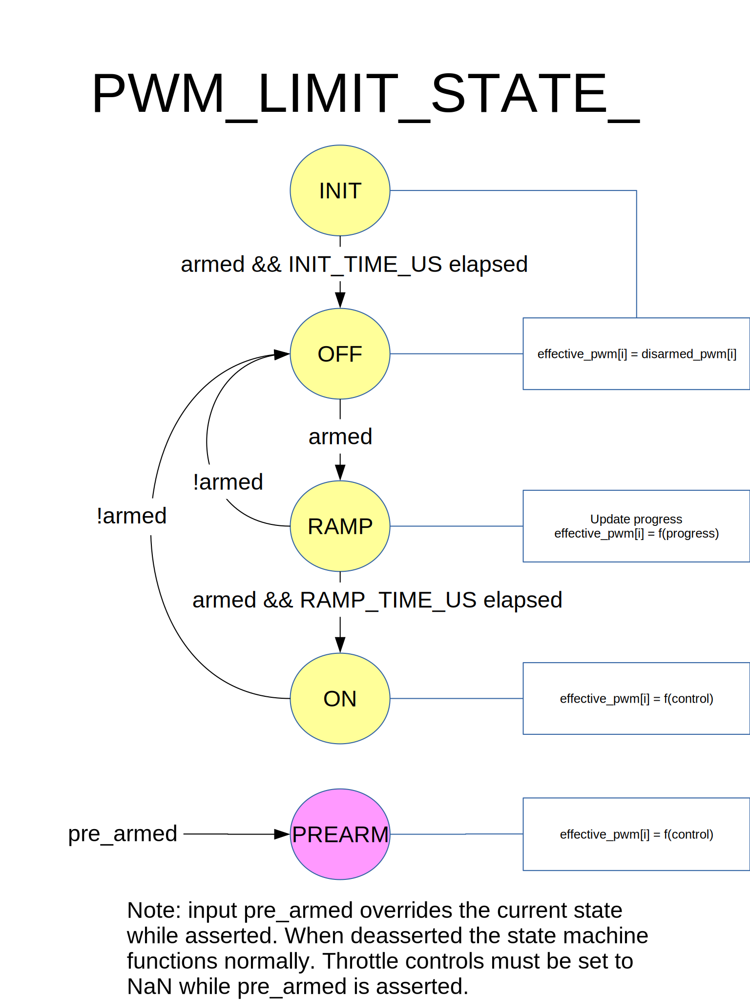

# PWM_limit State Machine

The`PWM_limit State Machine` controls PWM outputs as a function of pre-armed and armed inputs.
Provides a delay between assertion of "armed" and a ramp-up of throttle on assertion of the armed signal.

## Quick Summary

**Inputs**

- armed: asserted to enable dangerous behaviors such as spinning propellers
- pre-armed: asserted to enable benign behaviors such as moving control surfaces
- this input overrides the current state
- assertion of pre-armed immediately forces behavior of state ON, regardless of current state
- deassertion of pre-armed reverts behavior to current state

**States**

- INIT and OFF
  - pwm outputs set to disarmed values.
- RAMP
  - pwm outputs ramp from disarmed values to min values.
- ON
  - pwm outputs set according to control values.

## State Transition Diagram

