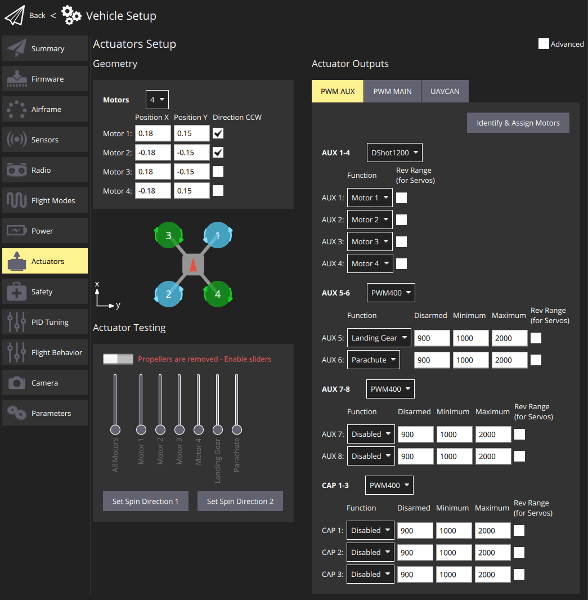
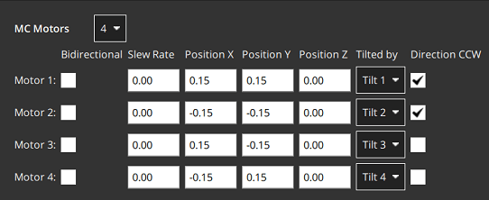
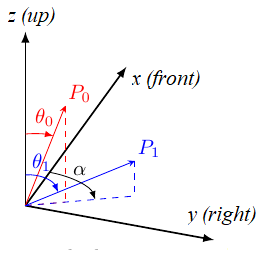
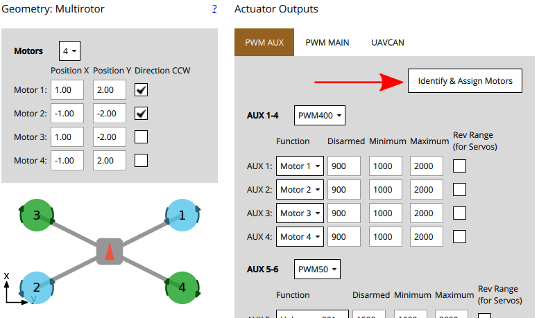
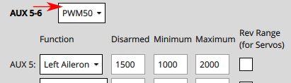
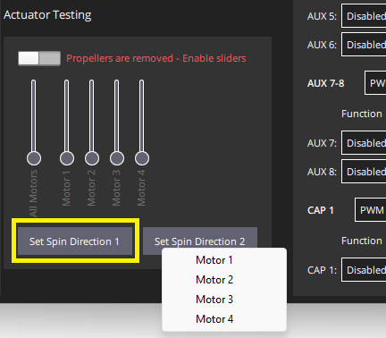

# Actuator Configuration and Testing

<Badge type="tip" text="PX4 v1.14" />

The _Actuators Setup_ view is used to customize the specific geometry of the vehicle, assign actuators and motors to flight controller outputs, and test the actuator and motor response.

## Overview

Open the view in _QGroundControl_ here: **"Q" (app menu) > Vehicle Setup > Actuators** (tab).
The displayed elements depend on the [selected frame](../config/airframe.md), with outputs mapped by default as shown in the [Airframe Reference](../airframes/airframe_reference.md).

The view has three sections:

- [Geometry](#geometry): Configure the geometry for the [selected airframe](../config/airframe.md).
  This includes number, position and properties of [motors](#motor-geometry) and also the number and properties of [control surfaces](#control-surfaces-geometry) and [motor tilt servos](#motor-tilt-servo-geometry).
- [Actuator Outputs](#actuator-outputs): Assign motors, control surfaces, and other actuators to specific output.
- [Actuator Testing](#actuator-testing): Test that motors and actuators move in the direction / speed as expected.

A quadcopter might have an setup screen similar to the one shown below.
This defines a 4-rotor copter with X-geometry.
It maps the 4 motors to the AUX1 to AUX4 outputs, and specifies that the connect to DShot1200 ESC.
It also maps PWM400 AUX outputs for controlling a parachute and landing gear.

::: info
Only the most common settings are displayed by default.
Select the **Advanced** checkbox in the top right corner to display all settings.
:::

## Geometry

The geometry section is used to set any configurable geometry-related parameters for the selected [airframe](../config/airframe.md).
This includes the number and position of [motors](#motor-geometry), and the number, function, and properties of [control surfaces](#control-surfaces-geometry).
For VTOL tiltrotor vehicles, it will also include the number and properties of [tilt servos](#motor-tilt-servo-geometry)

::: info
The UI is customised for the selected airframe:

- Only _configurable_ fields for the selected airframe type are displayed; fields that aren't configurable for the airframe are hidden.
- The motor position diagram is currently only displayed for multicopter frames.
  :::

### Motor Geometry

The motor geometry section lets you set the number of motors, the relative position, and other properties of each motor.

Most motor properties apply to all frames.
A few properties apply to specific frames.
For example, `Tilted-by` and `axis` are only relevant for [Tiltrotor VTOL](#motor-geometry-vtol-tiltrotor) and [Standard VTOL](#motor-geometry-standard-vtol) vehicles, respectively.

The geometry configuration for multicopter airframes provides a diagram showing the relative x,y positions for each of the motors.
See the [Airframe Reference](../airframes/airframe_reference.md) for an broad understanding of the motor positions for other frames.

Core geometry concepts and the configuration for a number of different frames are provided in the following sections.

#### Motor Geometry: Multicopter

The image below shows the geometry setup for a quadrotor multicopter frame with and without advanced settings.

First, the **Motors** drop-down setting lets you choose the number of motors (4 for the example above).

For each motor you can then set:

- `Position X`: [X-position](#motor-position-coordinate-system), in metres.
- `Position Y`: [Y-position](#motor-position-coordinate-system), in metres.
- `Position Z`: [Z-position](#motor-position-coordinate-system), in metres.
- (Advanced) `Direction CCW`: Checkbox to indicate motor spins counter-clockwise (uncheck for clockwise).
- (Advanced) `Bidirectional`: Checkbox to indicate motor is [bidirectional](#bidirectional-motors)
- (Advanced) `Slew Rate`: Sets minimum time that the motor output can take to reach its maximum value.
  Refer to the [Control Surfaces Geometry](#control-surfaces-geometry) section for more information

::: info
The `X`, `Y`, `Z` positions are in [FRD coordinate frame, relative to the _centre of gravity_](#motor-position-coordinate-system).
Note, this may not be the same as the position of the flight controller!
:::

#### Motor Geometry: VTOL Quadrotor Tailsitter

The motor geometry for a [VTOL Quad Tailsitter](../airframes/airframe_reference.md#vtol-tailsitter) is shown below (the approach for configuring other tailsitter VTOL vehicles will be similar).

Motors have the same configuration fields as for the [multicopter geometry](#motor-geometry-multicopter).

#### Motor Geometry: VTOL Tiltrotor

The motor geometry for a [Generic Quadplane VTOL Tiltrotor](../airframes/airframe_reference.md#vtol_vtol_tiltrotor_generic_quadplane_vtol_tiltrotor) is shown below (the approach for configuring other [VTOL tiltrotors](../airframes/airframe_reference.md#vtol_vtol_tiltrotor_generic_quadplane_vtol_tiltrotor) will be similar).

- `Tilted by`: The associated servo used for tilting the motor.
  The properties of this servo are defined in the [Motor Tilt Servo Geometry](#motor-tilt-servo-geometry).

#### Motor Geometry: Standard VTOL

The motor geometry for a [Generic Standard VTOL](../airframes/airframe_reference.md#vtol_standard_vtol_generic_standard_vtol) is shown below (the approach for configuring other "Standard VTOL" will be similar).

Motors have most of the same configuration fields as for the [multicopter geometry](#motor-geometry-multicopter).
There is an additional field to indicate the direction in which the motor moves the vehicle (for a standard VTOL, the hover motors are usually set "upwards" and the pusher motor is set to "forwards").

- `Axis`: One of `Upwards`, `Downwards`, `Forwards`, `Backwards`, `Leftwards`, `Rightwards`, `Custom`
  - If `Custom` is selected, then the UI displays three additional fields for setting the motor orientation.

#### Motor Geometry: Other Vehicles

Other vehicle types will define an appropriate motor geometry for their frame type.
Once again these motors will generally have the same kinds of properties as shown above.

For example, a fixed-wing vehicle may just have a single pusher moter, while a rover with differential steering will have a motor for throttle and for steering.

#### Motor Position Coordinate System

The coordinate system for motor positions is FRD (in body frame), where the X axis points forward, the Y axis to the right and the Z axis down.

The origin is the vehicle's **centre-of-gravity (COG)**.
This may **NOT** be the same position as the location of the autopilot.

#### Bidirectional Motors

Some vehicles may use bidirectional motors (i.e. motors that support spinning in both directions).
For example, ground vehicles that want to move forwards and backwards, or VTOL vehicles that have pusher motors that can turn in either direction.

If bidiectional motors are used, make sure to select the **Reversible** checkbox for those motors (the checkbox is displayed as an "advanced" option).

Note that you will need to also ensure that the ESC associated with bidirectional motors is configured appropriately (e.g. 3D mode enabled for DShot ESCs, which can be achieved via [DShot commands](../peripherals/dshot.md#commands)).

### Control Surfaces Geometry

The control surfaces section of the geometry panel lets you set the number and types of control surfaces that are present on the vehicle.
You may also need to set trim and slew rate values in some cases.
More advanced users can also configure the roll scale, yaw scale, and pitch scale (generally the defaults are acceptable, and this is not needed).
An "example" control surface section for a vehicle with two ailerons is shown below.
Note that ailerons only affect roll, so the pitch and yaw fields are disabled.

::: info
Only the most common settings are displayed by default.
Select the **Advanced** checkbox in the top right corner of the view to display all settings.
:::

The fields are:

- `Control Surfaces`: The number of control surfaces (set this first!)
- `Type`: The type of each control surface: `LeftAileron`, `RightAileron`, `Elevator`, `Rudder`, `Left Elevon`, `Right Elevon`, `Left V-Tail`, `Right V-Tail`, `Left Flap`, `Right Flap`, `Airbrakes`, `Custom`.
- `Roll Torque`: Effectiveness of actuator around roll axis (normalised: -1 to 1).
  [Generally you should use the default actuator value](#actuator-roll-pitch-and-yaw-scaling).
- `Pitch Torque`: Effectiveness of actuator around pitch axis (normalised: -1 to 1).
  [Generally you should use the default actuator value](#actuator-roll-pitch-and-yaw-scaling).
- `Yaw Torque`: Effectiveness of actuator around yaw axis (normalised: -1 to 1).
  [Generally you should use the default actuator value](#actuator-roll-pitch-and-yaw-scaling).
- `Trim`: An offset added to the actuator so that it is centered without input.
  This might be determined by trial and error.
- (Advanced) `Slew Rate`: Limits the minimum time in which the motor/servo signal is allowed to pass through its full output range, in seconds.
  - The setting limits the rate of change of an actuator (if not specified then no rate limit is applied).
    It is intended for actuators that may be damaged or cause flight disturbance if they move too fast — such as the tilting actuators on a tiltrotor VTOL vehicle, or fast moving flaps, respectively.
  - For example, a setting of 2.0 means that the motor/servo will not be commanded to move from 0 to 1 at a rate that completes the operation in less than 2 seconds (in case of reversible motors, the range is -1 to 1).
- (Advanced) `Flap Scale`: How much this actuator is deflected at the "full flaps configuration" [0, 1] (see [Flap Scale and Spoiler Scale Configuration](#flap-scale-and-spoiler-scale-configuration) below).
  Can be used to configure aerodynamic surface as flap or to compensate for generated torque through main flaps.
- (Advanced) `Spoiler Scale`: How much this actuator is deflected at the "full spoiler configuration" [0, 1] (see [Flap Scale and Spoiler Scale Configuration](#flap-scale-and-spoiler-scale-configuration) below).
  Can be used to configure aerodynamic surface as spoiler or to compensate for generated torque through main spoiler.
- (VTOL only) `Lock control surfaces in hover`:
  - `Enabled`: Most vehicles do not use control surfaces in hover. Use this setting to lock them so that they don't affect vehicle dynamics.
  - `Disabled`: Set this for vehicles that use control surfaces in hover, such as the duo tailsitter (which uses elevons for pitch and yaw control). It should also be set for vehicles that use control surfaces to provide additional stabilization in hover mode when moving at speed or in high winds.

#### Flap Scale and Spoiler Scale Configuration

"Flap-control" and "Spoiler-control" are aerodynamic configurations that can either be commanded manually by the pilot (using RC, say), or are set automatically by the controller.
For example, a pilot or the landing system might engage "Spoiler-control" in order to reduce the airspeed before landing.

The configurations are an _abstract_ way for the controller to tell the allocator how much it should adjust the aerodynamic properties of the wings relative to the "full flaps" or "full spoiler" configuration (between `[0,1]`, where "1" indicates the full range).
The allocator then uses any of the available control surfaces it wants in order to achieve the requested configuration: usually flaps, ailerons, and elevator.

The `flap scale` and `spoiler scale` settings in the actuator UI inform the allocator how much ailerons, elevators, flaps, spoilers, and other control surfaces, contribute to a requested "Flap-control" and/or "Spoiler-control" value.
Specifically, they indicate how much each control surface should be deflected when the controller is demanding "full flaps" or "full spoiler".

In the following example, the vehicle has two ailerons, one elevator, one rudder and two flaps as control surfaces:

- The flaps have both `Flap Scale` set to 1, meaning that they will be fully deflected with the flap-control at 1.
  They also have a [slew rate](#slew_rate) of 0.5/s, meaning that it will take 2s to fully deflect them (a slew rate on the flaps is generally recommended to reduce the disturbances their movement creates).
- The ailerons are primarily tasked to provide the commanded roll torque.
  They also have `Spoiler Scale` set to 0.5, and will additionally be deflected upwards 50% if the controller demands full spoiler configuration.
  The aileron deflection is thus the sum of the (asymmetrical) deflection for the roll torque, plus the (symmetrical) deflection for the spoiler setpoint.
- The elevator is primarily tasked to provide pitch torque.
  It also has non-zero entries in the `Flap Scale` and `Spoiler Scale` fields.
  These are the elevator deflections added to compensate for the pitching moments generated by the flaps and spoiler actuators.
  In the case here the elevator would be deflected 0.3 up when the flaps are fully deployed to counteract the pitching down moment caused by the flaps.

#### Actuator Roll, Pitch, and Yaw Scaling

::: info
For the majority of airframe setups the default values for each control surface types should not be changed.
:::

The `Roll scale`, `Pitch scale` and `Yaw scale` values indicate the normalized effectiveness of the actuator around the corresponding axis.

Tuning the values is a low/level/advanced topic, and is generally only needed when tuning coupled control surfaces (like an elevon, that controls both pitch and roll).
In this case the things you need to know are:

- The numbers that are entered are directly put into the allocation matrix, that is then inverted to get from desired moments (normalized) to control signals.
- Increasing the scale will _reduce_ the deflection of the control surfaces (as it gets inverted).

<!-- For more information see:  (PX4 Dev Summit, 2022) -->

#### Control Surface Deflection Convention

Control surfaces that move in either direction from neutral include: Ailerons, Elevons, V-Tails, A-Tails, Rudder.

In order to ensure that these control surfaces always move as expected for positive or negative inputs from the controllers, there needs to be a definition of the deflection directions that is independent of the physical servo setup.

Positive input causes positive deflection.
The diagram below shows the direction of movement for positive input:

In summary, positive inputs result in:

- **Horizontal Control Surfaces:** Upwards movement.
  Includes ailerons and elevons.
- **Vertical Control Surfaces:** Rightwards movement.
  Includes rudders.
- **Mixed Control Surfaces:** Upwards/rightwards movement.
  Includes V-Tail. A-Tail

::: tip
Control surfaces that can only deflect in one direction from the neutral point include: Airbrakes, Spoiler, and Flaps.

For these controls a positive input is always deflection from the neutral (0: no effect, 1: full effect), irrespective of the direction that the control itself moves.
They do not respond to negative input.
:::

<!-- Also see this comment: https://github.com/PX4/PX4-Autopilot/blob/96b03040491e727752751c0e0beed87f0966e6d4/src/modules/control_allocator/module.yaml#L492 -->

### Motor Tilt Servo Geometry

[VTOL tiltrotor vehicles](../frames_vtol/tiltrotor.md) can tilt their motors to transition between hover and forward flight.
This section defines the properties of the tilting servos.
These are mapped to specific motors in the motor geometry for a tiltrotor.

The example below shows the tilt servo setup for the [tiltrotor motor geometry shown above](../config/actuators.md#motor-geometry-vtol-tiltrotor).

The values that can be set are:

- `Tilt servos`: The number of servos (tiltable motors).
- `Angle at min tilt`: [Maximum tilt angle](#tilt-servo-coordinate-system) in degrees, relative to the z axis.
- `Angle at max tilt`: [Minimum tilt angle](#tilt-servo-coordinate-system) in degrees, relative to the z-axis.
- `Tilt direction`: `Towards front` (positive x direction) or `Towards right` (positive y direction).
- `Use for control`: [Tilt servo used for yaw/pitch](#tilt-servos-for-yaw-pitch-control)
  - `None`: Torque control is not used.
  - `Yaw`: Tilt servos used to control yaw.
  - `Pitch`: Tilt servos used to control pitch.
  - `Both Yaw and Pitch`: Tilt servos are used to control both yaw and pitch.

#### Tilt Servo Coordinate System

The coordinate system for tilt rotor angles is shown below.
The reference direction for tilt angles is straight upwards (0 degrees).
Tilt angles towards the front or right of the vehicle are positive, and towards the back or to the left are negative.

The `Angle at min tilt` and `Angle at max tilt` indicate the range of movement for the tilt servo.
The minimum tilt is the smaller _numerical value_ (not absolute) of the two angles.

If the max/min tilt vectors are **P0** and **P1** as shown above, both tilt angles are positive but **θ0** is smaller:

- `Angle at min tilt` = **θ0**
- `Angle at max tilt` = **θ1**

::: info
If the diagram was mirrored so that **P0** and **P1** were tilting into the -x, -y quadrant, then both the tilt angles would be negative.
Because **θ1** would more negative (smaller) than **θ0**, it would be the `Angle at min tilt`.

Similarly, a servo that moves:

- between the upright and forward positions would have `min=0` and `max=90`.
- symmetrically 45 degrees around the upright position would have `min=-45` and `max=45`
- between the upright and backward positions would have `min=-90` and `max=0`.
  :::

The `Tilt direction` indicates whether the servo tilts in the plane towards the `Front` or `Right` of the vehicle.
On the diagram this would be represented by **α** that can only take values of 0 (front) or 90 (right).

#### Tilt Servos for Yaw/Pitch Control

Tilt servos can provide torque on one or more axes, which may be used to yaw or pitch the vehicle:

- Yaw is commonly set in this way, though motors are often used instead on vehicles with four or more motors.
- Pitch is more commonly controlled using differential motors thrust.
  Control using tilt servos is useful on airframes that can't use differential thrust, such as a [Bicopter](https://www.youtube.com/watch?v=hfss7nCN40A).

Whether this feature is used is configured in the `Use for control` setting.

## Actuator Outputs

The _Actuator Outputs_ section is used to assign motors, control surface servos, and other actuators used by the particular frame to the physical outputs on the flight controller, and to set parameters for those outputs.

Separate tabs are displayed for each output bus supported by the connected flight controller: PWM MAIN (I/O Board output), PWM AUX (FMU Board output), UAVCAN.

Motors and actuators (which are referred to as "[functions](#output-functions)") can be assigned to any physical output on any of the available buses.

::: info
PWM AUX outputs are preferred over the PWM MAIN outputs for controlling motors (they have lower latency).
:::

PWM outputs are grouped based on the hardware timer groups.
Meaning all the outputs in one group must operate under the same protocol at the same rate (e.g. PWM signal at 400Hz for all the outputs in one group).
Therefore it is not possible to map Servo and a Motor in the same output group, as they usually operate at a different rate.

The PWM AUX tab has CAP outputs that are generally used as the [camera capture/trigger input](../camera/fc_connected_camera.md#trigger-configuration).
However you can map the CAP outputs to other output functions, and other AUX outputs can be used as camera capture/triggering input.

::: info
Configuring the Camera Capture / Trigger input requires a reboot to take effect
:::

You should assign functions to the outputs that match your physical wiring of motors and servos, and use the [Actuator Testing](#actuator-testing) section described below to determine appropriate output parameter values.
These steps are covered in [Output Assignment and Configuration](#output-assignment-and-configuration).

### Output Functions

Output functions are used to map the "logical functions" of an airframe, such as `Motor 1` or `Landing gear`, to physical outputs like FMU output pin 2.
This makes it easy to use a particular output pin for almost any purpose.

Some functions are only relevant to particular frames or output types, and will not be offered on others.

Functions include:

- `Disabled`: Output has no assigned function.
- `Constant_Min`: Output set to constant minimum value (-1).
- `Constant_Max`: Output is set to constant maximum value (+1).
- `Motor 1` to `Motor 12`: Output is indicated motor.
  Only motors allowed for airframe are displayed.
- `Servo 1` to `Servo 8`: Servo output.
  These are further assigned a specific meaning based on airframe, such as "tilt servo", "left aileron".
- `Peripheral via Acutator Set 1` to `Peripheral via Acutator Set 6`: [Generic Actuator Control with MAVLink](../payloads/generic_actuator_control.md#generic-actuator-control-with-mavlink).
- `Landing Gear`: Output is landing gear.
- `Parachute`: Output is parachute.
  The minimum value is sent in normal use and the maximum value is emitted when a failsafe is triggered.
- `RC Roll`: Output is passthrough roll from RC ([RC_MAP_ROLL](../advanced_config/parameter_reference.md#RC_MAP_ROLL) maps an RC channel to this output).
- `RC Pitch`: Output is passthrough pitch from RC ([RC_MAP_PITCH](../advanced_config/parameter_reference.md#RC_MAP_PITCH) maps an RC channel to this output).
- `RC Throttle`: Output is passthrough throttle from RC ([RC_MAP_THROTTLE](../advanced_config/parameter_reference.md#RC_MAP_THROTTLE) maps an RC channel to this output).
- `RC Yaw`: Output is yaw from RC ([RC_MAP_YAW](../advanced_config/parameter_reference.md#RC_MAP_YAW) maps an RC channel to this output).
- `RC Flaps`: Output is flaps from RC ([RC_MAP_FLAPS](../advanced_config/parameter_reference.md#RC_MAP_FLAPS) maps an RC channel to this output).
- `RC AUXn` to `RC AUX1`: Outputs used for [arbitrary payloads triggered by RC passthrough](../payloads/generic_actuator_control.md#generic-actuator-control-with-rc).
- `Gimbal Roll`: Output controls gimbal roll.
- `Gimbal Pitch`: Output controls Gimbal pitch.
- `Gimbal Yaw`: Output controls Gimbal yaw.
- `Gripper`<Badge type="tip" text="PX4 v1.14" />: Output controls gripper open/close.
- `Landing_Gear_Wheel`<Badge type="tip" text="PX4 v1.14" />: Output controls deployment of landing gear wheel

The following functions can only be applied to FMU outputs:

- `Camera_Trigger`: Output to trigger camera.
  Enabled when [`TRIG_MODE==0`](../advanced_config/parameter_reference.md#TRIG_MODE).
  Configured via `TRIG_*` parameters.
- `Camera_Capture`: Input to get image capture notification.
  Enabled when [CAM_CAP_FBACK==0](../advanced_config/parameter_reference.md#CAM_CAP_FBACK).
  Configured via `CAM_CAP_*` parameters.
- `PPS_Input`: Pulse-per-second input capture.
  Used for GPS synchronisation.
  Enabled when [`PPS_CAP_ENABLE==0`](../advanced_config/parameter_reference.md#PPS_CAP_ENABLE)

::: info
The functions are defined in source at [/src/lib/mixer_module/output_functions.yaml](https://github.com/PX4/PX4-Autopilot/blob/main/src/lib/mixer_module/output_functions.yaml).
This list is correct at PX4 v1.15.
:::

## Actuator Testing

The _Actuator Testing_ section in lower-right corner provides sliders that can be used to test (and determine) actuator and motor settings.
A slider is provided for each output defined in the [Actuator Outputs](#actuator-outputs) section.
The slider example below shows the section for a typical VTOL Tiltrotor airframe.

The section has an **Enable Sliders** switch that must be toggled before sliders can be used.
The sliders can power the motors/servos across their full range of motion, and "snap" to the disarmed and minimum positions.

::: info
After you toggle the **Enable sliders** switch, actuators/motors won't do anything until the corresponding slider is _moved_.
This is a safety feature to prevent sudden motor movements after switch is enabled.
:::

Sliders can be used to verify the following:

1. Actuators (Motors, Control surfaces, etc.) are assigned to the expected output.
1. Motors don't spin when at the `disarmed` PWM output value
1. Motors barely spin at the `minimum` PWM output value.
1. Motors give **positive thrust** in the expected direction
1. Control Surfaces are in the correct idle position for `disarmed` output value
1. Control Surfaces move in the direction as defined in the [Control Surface Convention](#control-surface-deflection-convention)
1. Motor Tilt Servos are in the correct idle position for `disarmed` output value
1. Motor Tilt Servos move in the direction as defined in the [Tilt Servo Convention](#tilt-servo-coordinate-system)

## Output Assignment and Configuration

Outputs are assigned to functions and configured in the [Actuator Outputs](#actuator-outputs) section, while the [Actuator Testing](#actuator-testing) sliders are commonly used to determine appropriate configuration values to enter:

- MC vehicles that have connected motors to PWM outputs can use the [Identify & Assign Motors](#multicopter-pwm-motor-assignment) button to perform motor assignment "semi-automatically".
- Output assignment of both motors and actuators can be done/checked using sliders (see [Output Assignment (Manual)](#output-assignment-manual)).
- Disarmed, minimum, and maximum settings, for all outputs can also be also determined using sliders.
  This is shown as part of [Motor Configuration](#motor-configuration), [Control Surface Setup](#control-surface-setup), [Tilt servo setup](#tilt-servo-setup)

### Multicopter PWM: Motor Assignment

You can use the **Identify & Assign Motors** button to assign motors to PWM outputs using a semi-automated process.

::: info
This is the easiest way to assign motors, but is currently only supported for motors on **multicopter vehicles** that are connected to PWM outputs (UAVCAN outputs and other frame types do not support this feature).
On other frames you can follow the instructions in [Output Assignment (Manual)](#output-assignment-manual).
:::

:::warning
Remove the propellers from motors before assigning outputs or any testing.
:::

When you click the button, QGC sends a command to a motor, causing it to spin.
To assign that motor to an output you simply select the corresponding motor displayed in the screen.
QGC will then spin the next motor for you to assign, and so on.

Instructions:

1. Setup the motor geometry to match the motors on your frame.
1. Select the PWM tab where you want to assign the motors.
1. Click the **Identify & Assign Motors** button.
1. One motor will start spinning (click **Spin Motor Again** if it stops spinning too quickly to note.)

   Select the corresponding motor in the geometry section.

   

1. After assigning all motors, the tool will set the correct motor mapping for the outputs and then exit.

### Output Assignment (Manual)

:::warning
Remove the propellers from motors before assigning outputs or any testing.
:::

Actuator outputs for both motors and servos can be _manually_ assigned using sliders in the [Actuator Testing](#actuator-testing) section.

To assign an actuator:

1. First assign functions to the outputs that you think are _likely_ to be correct in the _Actuator Outputs_ section.
1. Toggle the **Enable sliders** switch in _Actuator Testing_ section.
1. Move the slider for the actuator you want to test:
   - Motors should be moved to the minimum thrust position.
   - Servos should be moved near the middle position.
1. Check which actuator moves on the vehicle.
   This should match the actuator positions for your geometry (the [airframe reference](../airframes/airframe_reference.md) shows motor positions for a number of standard airframes).
   - If the correct actuator moves, then proceed to the next step.
   - If a wrong actuator moves, swap the output assignment over.
   - If nothing moves then increase the slider mid-way though the range, then higher if needed.
     If nothing moves after that the output might not be connected, the motor might not be powered, or the output might be misconfigured.
     You will need to troubleshoot (perhaps try other actuator outputs to see if "anything" moves).
1. Return the slider to the "disarmed" position (bottom of slider for motors, centre of slider for servos).
1. Repeat for all actuators

### Motor Configuration

::: info
If using PWM or OneShot ESCs, you should first perform [ESC Calibration](../advanced_config/esc_calibration.md) (this topic also covers PWM specific motor configuration).

[DShot](../peripherals/dshot.md) ESCs do not require configuration of the command limits but only rotation direction.
:::

:::warning
Remove propellers!
:::

The motor configuration sets output values such that motors:

- don't spin when disarmed (at the `disarmed` PWM output value).
- barely but reliably spin up at the `minimum` PWM output value.
- have the _lowest_ `maximum` PWM output value that spins the motor at its _highest_ rate.
- give **positive thrust** in the expected direction.

For each motor:

1. Pull the motor slider down so that it snaps to the bottom.
   In this position the motor is set to the outputs `disarmed` value.
   - Verify that the motor doesn't spin in this position.
   - If the motor spins, reduce the corresponding PWM `disarmed` value in the [Actuator Outputs](#actuator-outputs) section to below the level at which it still spins.
2. Slowly move the slider up until it snaps to the _minimum_ position.
   In this position the motor is set to the outputs `minimum` value.

   - Verify that the motor is spinning very slowly in this position.
   - If the motor is not spinning, or spinning too fast you will need to adjust the corresponding PWM `minimum` value in the [Actuator Outputs](#actuator-outputs) such that the motors barely spin.

     
     ::: info
     For DShot output, this is not required.
     :::

3. Increase the slider value to a level where you can verify that the motor is spinning in the correct direction and that it would give a positive thrust in the expected direction.

   - The expected thrust direction can vary by vehicle type.
     For example in multicopters the thrust should always point upwards, while in a fixed-wing vehicle the thrust will push the vehicle forwards.
   - For VTOL, thrust should point upwards when the Tilt Servo is at 0 degrees as defined the [Tilt Servo Convention](#tilt-servo-coordinate-system).
     Testing of the [Tilt Servo](#tilt-servo-setup) is covered below as well.
   - If thrust is in the wrong direction, you may need to [reverse the motors](#reversing-motors).

4. Increase the slider value to the maximum value, so the motor is spinning quickly.
   Reduce the value of the PWM output's `maximum` value just below the default.
   Listen to the tone of the motors as you increase the value in small (25us) increments.
   The "optimal" maximum value is the value at which you last hear a change in the tone.

### Control Surface Setup

First set the _frame rate_ for the servos used in each group of outputs.
This would normally be set to the maximum value supported by your servo.
Below we show how you would set it to PWM50 (the most common value).

::: info
You will almost certainly need to change the pulse rate from the default of 400Hz because support is rare (if not supported the servo will usually make an "odd" noise).
If you're using PWM servos, PWM50 is far more common.
If a high rate servo is _really_ needed, DShot offers better value.
:::

#### Control surfaces that move both directions about a neutral point

Control surfaces that move either direction around a neutral point include: ailerons, elevons, V-tails, A-tails, and rudders.

To set these up:

1. Set the `Disarmed` value so that the surfaces will stay at neutral position when disarmed.
   This is usually around `1500` for PWM servos (near the centre of the servo range).

   

2. Move the slider for the surface upwards (positive command) and verify that it moves in the direction defined in the [Control Surface Convention](#control-surface-deflection-convention).

   - Ailerons, elevons, V-Tails, A-Tails, and other horizontal surfaces should move up.
   - Rudders and other "purely vertical" surfaces should move right.

   ::: tip
   It is important that the slider movement matches the control surface convention, in order to normalize control for different servo mountings (moving the slider up may actually decrease the output value sent to the servo).
   :::

   If the control surface moves in the opposite direction, click on the `Rev Range` checkbox to reverse the range.

3. Move the slider again to the middle and check if the Control Surfaces are aligned in the neutral position of the wing.

   - If it is not aligned, you can set the **Trim** value for the control surface.

     ::: info
     This is done in the `Trim` setting of the Geometry panel, usually by "trial and error".
     
     :::

   - After setting the trim for a control surface, move its slider away from the centre, release, and then back into disarmed (middle) position.
     Confirm that surface is in the neutral position.

::: info
Another way to test without using the sliders would be to set the [`COM_PREARM_MODE`](../advanced_config/parameter_reference.md#COM_PREARM_MODE) parameter to `Always`:

- This will enable the control of servos even when the vehicle is disarmed, and will constantly be applying the Trim setting to the Control Surfaces
- You can try setting different values for the Trim and check the alignment, and then settle on the value you are happy with.

:::

#### Control surfaces that move from neutral to full deflection

Control surfaces that move only one direction from neutral include: airbrakes, spoilers, and flaps.

For these controls you should set the minimum and maximum PWM values according to the full range of the control.
The `Disarmed` value should then match the value (of maximum or minimum) that corresponds to control being in the "neutral" position.
For a flap, that is when the flap is fully retracted and flush with the wing.

One approach for setting these up is:

1. Set values `Disarmed` to `1500`, `Min` to `1200`, `Max` to `1700` so that the values are around the centre of the servo range.
2. Move the corresponding slider up and check the control moves and that it is extending (moving away from the disarmed position).
   If not, click on the `Rev Range` checkbox to reverse the range.
3. Enable slider in the disarmed position, them change the value of the `Disarmed` signal until the control is retracted/flush with wing.
   This may require that the `Disarmed` value is increased or decreased:
   - If the value was decreased towards `Min`, then set `Min` to match `Disarmed`.
   - If the value was increased towards `Max`, then set `Max` to match `Disarmed`.
4. The value that you did _not_ set to match `Disarmed` controls the maximum amount that the control surface can extend.
   Set the slider to the top of the control, then change the value (`Max` or `Min`) so that the control surface is fully extended when the slider is at top.

::: info Special note for flaps
In some vehicle builds, flaps may be configured such that both flaps are controlled from a single output.
In this case, you need to ensure that both flaps extend/deploy when raising the corresponding slider.
If this is not the case and one servo deploys correctly and one does not, you need to change the servo direction with a third party servo programmer.
Alternatively, you might move the servo that is not deflecting in the correct orientation to its own servo output channel and then reverse its direction via the `Rev range` check box.
:::

### Tilt Servo Setup

First set the _frame rate_ for the servos used in each group of outputs.
This would normally be set to the maximum value supported by your servo.
Below it is set to PWM50 (the most common value).
Note, this part of the setup is the same as for control surfaces above.

For each of the tilt servos:

1. Set the `Disarmed` value (e.g. `1000` or `2000` for PWM Servos) so that the servo will be positioned in expected direction when _disarmed_.
2. Position the slider for the servo in the lowest position, and verify that a positive value increase will point towards the `Angle at Min Tilt` (defined in the Geometry section).

   

3. Position the slider for the servo in the highest position, and verify that positive motor thrust will point towards the `Angle at Max Tilt` (as defined in the Geometry section).

### Other Notes

- If a safety button is used, it must be pressed before actuator testing is allowed.
- The kill-switch can still be used to stop motors immediately.
- Servos do not actually move until the corresponding slider is changed.
- The parameter [COM_MOT_TEST_EN](../advanced_config/parameter_reference.md#COM_MOT_TEST_EN) can be used to completely disable actuator testing.
- On the shell, [actuator_test](../modules/modules_command.md#actuator-test) can be used as well for actuator testing.
- VTOLs will automatically turn off motors pointing upwards during **fixed-wing flight**:
  - Standard VTOL : Motors defined as multicopter motors will be turned off
  - Tiltrotors : Motors that have no associated tilt servo will turn off
  - Tailsitters do not turn off any motors in fixed-wing flight

### Reversing Motors

The motors must turn in the direction defined in configured geometry ("**Direction CCW**" checkboxes).
If any motors do not turn in the correct direction they must be reversed.

There are several options:

- If the ESCs are configured as [DShot](../peripherals/dshot.md) you can permanently reverse the direction via UI.
  The **Set Spin Direction** buttons are displayed below the Actuator sliders (if DShot motors are used).
  These popup a dialog in which you select the motor for which you want to apply the direction.

  

  Note that the current direction cannot be queried, so you may need to try both options.

- Swap 2 of the 3 motor cables (it does not matter which ones).

  ::: info
  If motors are not connected via bullet-connectors, re-soldering is required (this is a reason, among others, to prefer DShot ESCs).
  :::
