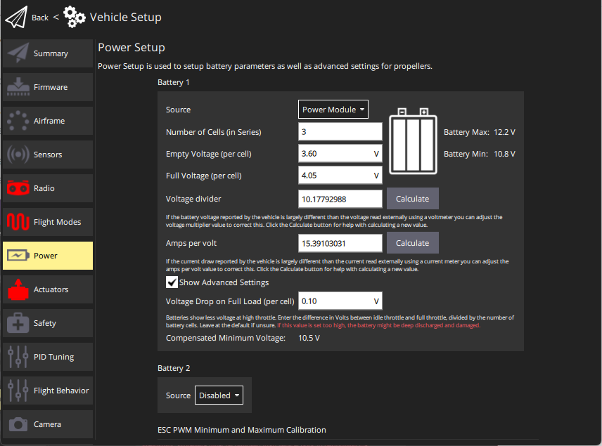

# Battery Estimation Tuning (Power Setup)

This topic explains how to configure power settings so that PX4 can estimate the available battery capacity.

::: info
These instructions require that the vehicle has a [Power Module (PM)](../power_module/index.md), or other hardware that can measure the battery voltage and (optionally) the current.
:::

::: tip
This tuning is not needed for [Smart/MAVLink Batteries](../smart_batteries/index.md): batteries that can supply a reliable indication of remaining charge.
:::

## Overview

Battery Estimation Tuning uses the measured voltage and current (if available) to estimate the remaining battery capacity.
This is important because it allows PX4 to take action when the vehicle is close to running out of power and crashing (and also to prevent battery damage due to deep-discharge).

PX4 provides a number of (progressively more effective) methods that can be used to estimate the capacity:

1. [Basic Battery Settings](#basic_settings) (default): raw measured voltage is compared to the range between "empty" and "full" voltages.
   This results in coarse estimates because measured voltage (and its corresponding capacity) will fluctuate under load.
1. [Voltage-based Estimation with Load Compensation](#load_compensation): Counteracts the effects of loading on the capacity calculation.
1. [Voltage-based Estimation with Current Integration](#current_integration): Fuses the load-compensated voltage-based estimate for the available capacity with a current-based estimate of the charge that has been consumed.
   This results in a capacity estimate that is comparable to that of a smart battery.

Later methods build on preceding methods.
The approach you use will depend on whether the vehicle's power module can measure current.

::: info
The instructions below refer to battery 1 calibration parameters: `BAT1_*`.
Other batteries use the `BATx_*` parameters, where `x` is the battery number.
All battery calibration parameters [are listed here](../advanced_config/parameter_reference.md#battery-calibration).
:::

:::tip
In addition to PX4 configuration discussed here, you should ensure that the ESC's low voltage cutoff is either disabled or set below the expected minimum voltage.
This ensures that the battery failsafe behaviour is managed by PX4, and that ESCs will not cut out while the battery still has charge (according to the "empty-battery" setting that you have chosen).
:::

:::tip
[Battery Chemistry Overview](../power_systems/battery_chemistry.md) explains the difference between the main battery types, and how that impacts the battery settings.
:::

## Basic Battery Settings (default) {#basic_settings}

The basic battery settings configure PX4 to use the default method for capacity estimate.
This method compares the measured raw battery voltage to the range between cell voltages for "empty" and "full" cells (scaled by the number of cells).

::: info
This approach results in relatively coarse estimations due to fluctuations in the estimated charge as the measured voltage changes under load.
:::

To configure the basic settings for battery 1:

1. Start _QGroundControl_ and connect the vehicle.
1. Select **"Q" icon > Vehicle Setup > Power** (sidebar) to open _Power Setup_.

You are presented with the basic settings that characterize the battery.
The sections below explain what values to set for each field.

::: info
At time of writing _QGroundControl_ only allows you to set values for battery 1 in this view.
For vehicles with multiple batteries you'll need to directly [set the parameters](../advanced_config/parameters.md) for battery 2 (`BAT2_*`), as described in the following sections.
:::

### Number of Cells (in Series)

This sets the number of cells connected in series in the battery.
Typically this will be written on the battery as a number followed by "S" (e.g "3S", "5S").

::: info
The voltage across a single galvanic battery cell is dependent on the [chemical properties of the battery type](../power_systems/battery_chemistry.md).
Lithium-Polymer (LiPo) batteries and Lithium-Ion batteries both have the same _nominal_ cell voltage of 3.7V.
In order to achieve higher voltages (which will more efficiently power a vehicle), multiple cells are connected in _series_.
The battery voltage at the terminals is then a multiple of the cell voltage.
:::

If the number of cells is not supplied you can calculate it by dividing the battery voltage by the nominal voltage for a single cell.
The table below shows the voltage-to-cell relationship for these batteries:

| Cells | LiPo (V) | LiIon (V) |
| ----- | -------- | --------- |
| 1S    | 3.7      | 3.7       |
| 2S    | 7.4      | 7.4       |
| 3S    | 11.1     | 11.1      |
| 4S    | 14.8     | 14.8      |
| 5S    | 18.5     | 18.5      |
| 6S    | 22.2     | 22.2      |

::: info
This setting corresponds to [parameters](../advanced_config/parameters.md): [BAT1_N_CELLS](../advanced_config/parameter_reference.md#BAT1_N_CELLS) and [BAT2_N_CELLS](../advanced_config/parameter_reference.md#BAT2_N_CELLS).
:::

### Full Voltage (per cell)

This sets the _nominal_ maximum voltage of each cell (the lowest voltage at which the cell will be considered "full").

The value should be set slightly lower that the nominal maximum cell voltage for the battery, but not so low that the estimated capacity is still 100% after a few minutes of flight.

Appropriate values to use are:

- **LiPo:** 4.05V (default in _QGroundControl_)
- **LiIon:** 4.05V

::: info
The voltage of a full battery may drop a small amount over time after charging.
Setting a slightly-lower than maximum value compensates for this drop.
:::

::: info
This setting corresponds to [parameters](../advanced_config/parameters.md): [BAT1_V_CHARGED](../advanced_config/parameter_reference.md#BAT1_V_CHARGED) and [BAT2_V_CHARGED](../advanced_config/parameter_reference.md#BAT2_V_CHARGED).
:::

### Empty Voltage (per cell)

This sets the nominal minimum safe voltage of each cell (using below this voltage may damage the battery).

::: info
There is no single value at which a battery is said to be empty.
If you choose a value that is too low the battery may be damaged due to deep discharge (and/or the vehicle may crash).
If you choose a value that is too high you may unnecessarily curtail your flight.
:::

A rule of thumb for minimum per-cell voltages:

| Level                                            | LiPo (V) | LiIon (V) |
| ------------------------------------------------ | -------- | --------- |
| Conservative (voltage under no-load)             | 3.7      | 3         |
| "Real" minimum (voltage under load/while flying) | 3.5      | 2.7       |
| Damage battery (voltage under load)              | 3.0      | 2.5       |

:::tip
Below the conservative range, the sooner you recharge the battery the better - it will last longer and lose capacity slower.
:::

::: info
This setting corresponds to [parameter](../advanced_config/parameters.md): [BAT1_V_EMPTY](../advanced_config/parameter_reference.md#BAT1_V_EMPTY) and [BAT2_V_EMPTY](../advanced_config/parameter_reference.md#BAT2_V_EMPTY).
:::

### Voltage Divider

If you have a vehicle that measures voltage through a power module and the ADC of the flight controller then you should calibrate the measurements once per power module.
To calibrate, the actual voltage from the battery is measured (using a multimeter) and compared to the value provided by the power module.
This is used to calculate a "voltage divider" value, which can subsequently be used to scale the power module measurement to the correct value.

The easiest way to perform this calibration is by using _QGroundControl_ and following the step-by-step guide on [Setup > Power Setup](https://docs.qgroundcontrol.com/master/en/qgc-user-guide/setup_view/power.html) (QGroundControl User Guide).

::: info
This setting corresponds to parameters: [BAT1_V_DIV](../advanced_config/parameter_reference.md#BAT1_V_DIV) and [BAT2_V_DIV](../advanced_config/parameter_reference.md#BAT2_V_DIV).
:::

### Amps per volt {#current_divider}

:::tip
This calibration is not needed if your power module does not provide current measurements.
:::

Current measurements are used (by default) for [Load Compensation](#load_compensation) and [Current Integration](#current_integration) if provided by the power module.
The amps per volt divider must be calibrated to ensure an accurate current measurement.

The easiest way to calibrate the dividers is by using _QGroundControl_ and following the step-by-step guide on [Setup > Power Setup](https://docs.qgroundcontrol.com/master/en/qgc-user-guide/setup_view/power.html) (QGroundControl User Guide).

::: info
This setting corresponds to parameter(s): [BAT1_A_PER_V](../advanced_config/parameter_reference.md#BAT1_A_PER_V) and [BAT2_A_PER_V](../advanced_config/parameter_reference.md#BAT2_A_PER_V).
:::

## Voltage-based Estimation with Load Compensation {#load_compensation}

When a current flows through a battery, the internal resistance causes a voltage drop, reducing the measured output voltage of the battery compared to its open-circuit (no-load) voltage.
When using the [basic configuration](#basic_settings), the measured output voltage is what is used to estimate the available capacity, which means that the battery level will appear to fluctuate when you fly up and down, or otherwise change the load on the battery.

_Load compensation_ uses a measured or estimated value for the internal resistance to correct for changes under load, resulting in far less variation in the estimated capacity when flying.
This is enabled by default when using a power module that provides current measurements.

To use the load compensation first set the [basic configuration](#basic_settings).
The _Empty Voltage_ ([BATn_V_EMPTY](../advanced_config/parameter_reference.md#BAT1_V_EMPTY), where `n` is the battery number) should be set higher (than without compensation) because the compensated voltage gets used for the estimation (typically set a bit below the expected rest cell voltage when empty after use).

You will then need to calibrate the [Amps per volt divider](#current_divider) in the basic settings screen (in order to get reliable current measurements).

PX4 uses current-based load compensation based on a _real-time estimate_ of the internal resistance of the battery by default (real time estimates are enabled if [BAT1_R_INTERNAL=-1](../advanced_config/parameter_reference.md#BAT1_R_INTERNAL)).
Using a real time estimate allows the compensation to adapt to changes in the internal resistance of the battery due to temperature changes during flight, as well as over time as the battery degrades.

The internal resistance can also be measured and [set manually](../advanced_config/parameters.md) in [BAT1_R_INTERNAL](../advanced_config/parameter_reference.md#BAT1_R_INTERNAL).
A positive value in this parameter will be used for the internal resistance instead of the estimated value (`0` disables load compensation altogether).

:::info
There are LiPo chargers that can measure the internal resistance of your battery.
A typical value for LiPo batteries is 5mΩ per cell but this can vary with discharge current rating, age and health of the cells.
:::

## Voltage-based Estimation Fused with Current Integration {#current_integration}

This method is the most accurate way to measure relative battery consumption.
If set up correctly with a healthy and fresh charged battery on every boot, then the estimation quality will be comparable to that from a smart battery (and theoretically allow for accurate remaining flight time estimation).

The method evaluates the remaining battery capacity by _fusing_ the voltage-based estimate for the available capacity with a current-based estimate of the charge that has been consumed.
It requires hardware that can accurately measure current.

To enable this feature:

1. First set up accurate voltage estimation using [load compensation](#load_compensation).

   :::tip
   Including calibrating the [Amps per volt divider](#current_divider) setting.
   :::

2. Set the parameter [BAT1_CAPACITY](../advanced_config/parameter_reference.md#BAT1_CAPACITY) to around 90% of the advertised battery capacity (usually printed on the battery label).

   ::: info
   Do not set this value too high as this may result in a poor estimation or sudden drops in estimated capacity.
   :::

---

**Additional information**

The estimate of the charge that has been consumed over time is produced by mathematically integrating the measured current (this approach provides very accurate energy consumption estimates).

At system startup PX4 first uses a voltage-based estimate to determine the initial battery charge. This estimate is then fused with the value from current integration to provide a combined better estimate.
The relative value placed on each estimate in the fused result depends on the battery state.
The emptier the battery gets, the more of the voltage based estimate gets fused in. This prevents deep discharge (e.g. because it was configured with the wrong capacity or the start value was wrong).

If you always start with a healthy full battery, this approach is similar to that used by a smart battery.

::: info
Current integration cannot be used on its own (without voltage-based estimation) because it has no way to determine the _initial_ capacity.
Voltage-estimation allows you to estimate the initial capacity and provides ongoing feedback of possible errors (e.g. if the battery is faulty, or if there is a mismatch between capacity calculated using different methods).
:::
