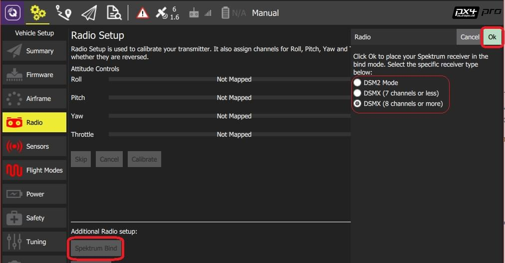

# Radio Control (RC) Setup

The _Radio Setup_ screen is used to configure the mapping of your RC controller's main attitude control sticks (roll, pitch, yaw, throttle) to channels, and to calibrate the minimum, maximum, trim and reverse settings for all other transmitter controls/RC channels.

::: info
A [Joystick](../config/joystick.md) can be used instead of RC for manual control.
The [COM_RC_IN_MODE](../advanced_config/parameter_reference.md#COM_RC_IN_MODE) parameter [can be set](../advanced_config/parameters.md) to define what kind of manual controller(s) are enabled.
:::

## Binding the Receiver

Before you can calibrate the radio system the receiver and transmitter must be connected/bound.
The process for binding a transmitter and receiver pair is hardware specific (see your RC manual for instructions).

::: info
If you are using a _Spektrum_ receiver, you can put it into bind mode using _QGroundControl_, as [shown below](#spectrum-bind).
:::

::: info
If you are using a _FrSky_ receiver, you can bind it with its transmitter, by following instructions [here](https://www.youtube.com/watch?v=1IYg5mQdLVI).
:::

## RC Loss Detection

PX4 needs to be able to detect when the signal from the RC controller has been lost in order to be able to take [appropriate safety measures](../config/safety.md#manual-control-loss-failsafe).

RC receivers have different ways of indicating signal loss:

- Output nothing (automatically detected by PX4)
- Output a low throttle value (you can configure PX4 to detect this).
- Output the last received signal (_cannot be detected by PX4_ as it looks like valid input).

If your RC receiver does not support outputting no signal on RC loss, you must configure it to set throttle low instead, and set the corresponding value in [RC_FAILS_THR](../advanced_config/parameter_reference.md#RC_FAILS_THR).

The way to do this is to set the RC controller trim and throttle stick as low as possible, and use the resulting output PWM value in both PX4 and the receiver (read your receiver manual to determine how to set the RC loss value).
Then reset the throttle stick trim back to its normal position.
This process ensures that the RC loss value is below the minimum value output by the receiver in normal operation.

::: info
Do not use a receiver that cannot support one of the two supported RC loss detection methods!
:::

## Performing the Calibration

The calibration process is straightforward - you will be asked to move the sticks in a specific pattern that is shown on the transmitter diagram on the top right of the screen.

To calibrate the radio:

1. Turn on your RC transmitter.
1. Start _QGroundControl_ and connect the vehicle.
1. Select the **Gear** icon (Vehicle Setup) in the top toolbar and then **Radio** in the sidebar.
1. Press **OK** to start the calibration.

   

1. Set the [transmitter mode](../getting_started/rc_transmitter_receiver.md#transmitter_modes) radio button that matches your transmitter (this ensures that _QGroundControl_ displays the correct stick positions for you to follow during calibration).

   

1. Move the sticks to the positions indicated in the text (and on the transmitter image). Press **Next** when the sticks are in position. Repeat for all positions.
1. When prompted, move all other switches and dials through their full range (you will be able to observe them moving on the _Channel Monitor_).

1. Press **Next** to save the settings.

Radio calibration is demonstrated in the [autopilot setup video here](https://youtu.be/91VGmdSlbo4?t=4m30s) (youtube).

## Additional Radio Setup

As well as calibrating your control sticks and other transmitter controls, there are a number of additional radio setup options that you may find useful on this screen.

### Spectrum Bind

Before you can calibrate the radio system the receiver and transmitter must be connected/bound. If you have a _Spektrum_ receiver you can put it in _bind mode_ using _QGroundControl_ as shown below (this can be particularly useful if you don't have easy physical access to the receiver on your vehicle).

To bind a Spektrum transmitter/receiver:

1. Select the **Spektrum Bind** button
1. Select the radio button for your receiver
1. Press **OK**

   

1. Power on your Spektrum transmitter while holding down the bind button.

### Copy Trims

This setting is used to copy the manual trim settings from your radio transmitter so that they can be applied automatically within the autopilot. After this is done you will need to remove the manually set trims.

::: info
Trim settings are used to adjust the roll, pitch, yaw such that when you center the sticks on your remote control, you get stable or level flight (in Stabilized flight mode).
Some RC controllers provide trim knobs that allow you to provide an offset to the value sent by the RC controller for each stick position.
The **Copy Trims** setting here moves the offsets into the autopilot.
:::

To copy the trims:

1. Select **Copy Trims**.
1. Center your sticks and move throttle all the way down.
1. Press **Ok**.

   

1. Reset the trims on your transmitter back to zero.

### AUX Passthrough Channels

AUX passthrough channels allow you to control arbitrary optional hardware from your transmitter (for example, a gripper).

To use the AUX passthrough channels:

1. Map up to 2 transmitter controls to separate channels.
1. Specify these channels to map to the AUX1 and AUX2 ports respectively, as shown below.
   Values are saved to the vehicle as soon as they are set.

   

The flight controller will pass through the unmodified values from the specified channels out of AUX1/AUX2 to the connected servos/relays that drive your hardware.

### Param Tuning Channels

Tuning channels allow you to map a transmitter tuning knob to a parameter (so that you can dynamically modify a parameter from your transmitter).

:::tip
This feature is provided to enable manual in-flight tuning: [Multicopter PID Tuning Guide](../config_mc/pid_tuning_guide_multicopter.md), [Fixed-wing PID Tuning Guide](../config_fw/pid_tuning_guide_fixedwing.md).
:::

The channels used for parameter tuning are assigned in the _Radio_ setup (here!), while the mapping from each tuning channel to its associated parameter is defined in the _Parameter editor_.

To set up tuning channels:

1. Map up to 3 transmitter controls (dials or sliders) to separate channels.
1. Select the mapping of _PARAM Tuning Id_ to radio channels, using the selection lists.
   Values are saved to the vehicle as soon as they are set.

   

To map a PARAM tuning channel to a parameter:

1. Open the **Parameters** sidebar.
1. Select the parameter to map to your transmitter (this will open the _Parameter Editor_).
1. Check the **Advanced Settings** checkbox.
1. Click the **Set RC to Param...** button (this will pop-up the foreground dialog displayed below)

   

1. Select the tuning channel to map (1, 2 or 3) from the _Parameter Tuning ID_ selection list.
1. Press **OK** to close the dialog.
1. Press **Save** to save all changes and close the _Parameter Editor_.

:::tip
You can clear all parameter/tuning channel mappings by selecting menu **Tools > Clear RC to Param** at the top right of the _Parameters_ screen.
:::

## Further Information

- [QGroundControl > Radio Control](https://docs.qgroundcontrol.com/master/en/qgc-user-guide/setup_view/radio.html)
- [PX4 Setup Video - @4m30s](https://youtu.be/91VGmdSlbo4?t=4m30s) (Youtube)
- [RC System Selection](../getting_started/rc_transmitter_receiver.md) - Choose a compatible RC system.
