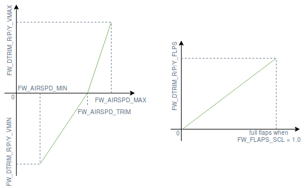

# Fixed-Wing Trimming Guide

Trims are used to calibrate the control surfaces at trim conditions (relative airspeed, air density, angle of attack, aircraft configuration, etc.).
A properly trimmed aircraft flying at trim conditions will keep its attitude without requiring any control inputs from the pilot or the stabilizing computer.

General aviation, commercial and large unmanned planes trim their control surfaces using [trim tabs](https://en.wikipedia.org/wiki/Trim_tab) while small UAVs simply add an offset to the actuator of the control surface.

The [Basic trimming](#basic-trimming) section explains the purpose of each trim parameter and how to find the correct value.
The [Advanced Trimming](#advanced-trimming) section introduces parameters that can be set to automatically adjust the trims based on the measured airspeed and flap position.

## Basic Trimming

There are several parameters an operator might want to use in order to properly trim a fixed-wing aircraft.
An overview of those parameters and their use case is shown below:

- [RCx_TRIM](../advanced_config/parameter_reference.md#RC1_TRIM) applies trim to the signal received from the RC transmitter.
  These parameters are set automatically during [RC calibration](../config/radio.md).
- [CA_SV_CSx_TRIM](../advanced_config/parameter_reference.md#CA_SV_CS0_TRIM) applies trim to a control surfaces channel.
  These are used to finely align the control surfaces to default angles before flying.
- [FW_PSP_OFF](../advanced_config/parameter_reference.md#FW_PSP_OFF) is the pitch angle at which your aircraft flies level at trim airspeed.
  See [Level-Flight Pitch](#level-flight-pitch) for how PX4 defines and uses it.
- [FW_AIRSPD_TRIM](../advanced_config/parameter_reference.md#FW_AIRSPD_TRIM) is used by the rate controllers to scale their output depending on the measured airspeed.
  See [Airspeed Scaling](../flight_stack/controller_diagrams.md#airspeed-scaling) for more details.
- [TRIM_ROLL](../advanced_config/parameter_reference.md#TRIM_ROLL), [TRIM_PITCH](../advanced_config/parameter_reference.md#TRIM_PITCH) and [TRIM_YAW](../advanced_config/parameter_reference.md#TRIM_YAW) apply trim to the control signals _before_ mixing.
  For example, if you have two servos for the elevator, `TRIM_PITCH` applies trim to both of them.
  These are used when your control surfaces are aligned but the aircraft pitches/rolls/yaws up/down/left/right during manual (not stabilized) flight or if the control signal has a constant offset during stabilized flight.

The correct order to set the above parameters is:

1. Trim the servos by physically adjusting the linkages lengths if possible and fine tune by trimming the PWM channels (use `PWM_MAIN/AUX_TRIMx`) on the bench to properly set the control surfaces to their theoretical position.
1. Fly in stabilized mode at cruise speed and set `FW_PSP_OFF` to the pitch angle that the airplane needs to fly at in order to keep constant altitude during wing-leveled flight.
   If you are using an airspeed sensor, also set the correct cruise airspeed (`FW_AIRSPD_TRIM`).
1. Look at the actuator controls in the log file (upload it to [Flight Review](https://logs.px4.io) and check the _Actuator Controls_ plot for example) and set the pitch trim (`TRIM_PITCH`).
   Set that value to the average offset of the pitch signal during wing-leveled flight.

Step 3 can be performed before step 2 if you don't want to have to look at the log, or if you feel comfortable flying in manual mode.
You can then trim your remote (with the trim switches) and report the values to `TRIM_PITCH` (and remove the trims from your transmitter) or update `TRIM_PITCH` directly during flight via telemetry and QGC.

## Level-Flight Pitch

PX4 measures the fixed-wing pitch angle θ between the body x-axis and the horizon.
The body frame is fixed to the vehicle: x points forward through the nose, y along the right wing and z down.
Its orientation follows the mounting of the flight controller (see [Flight Controller Orientation](../config/flight_controller_orientation.md)), not the wing chord.
For tailsitters, the fixed-wing body frame is the multicopter body frame rotated by 90° in pitch.

[FW_PSP_OFF](../advanced_config/parameter_reference.md#FW_PSP_OFF) is θ in level flight at trim airspeed ([FW_AIRSPD_TRIM](../advanced_config/parameter_reference.md#FW_AIRSPD_TRIM)).
In level flight the velocity is horizontal, so this is also the angle of attack measured from the body x-axis.
It differs from the angle of attack of the wing by the angle between the wing chord and the body x-axis.

Pitch setpoints and pitch limits in PX4 are absolute pitch angles θ, and `FW_PSP_OFF` is not added to them.
This applies for example to [FW_P_LIM_MIN](../advanced_config/parameter_reference.md#FW_P_LIM_MIN), [FW_P_LIM_MAX](../advanced_config/parameter_reference.md#FW_P_LIM_MAX), [FW_TKO_PITCH_MIN](../advanced_config/parameter_reference.md#FW_TKO_PITCH_MIN), [FW_LND_FL_PMIN](../advanced_config/parameter_reference.md#FW_LND_FL_PMIN), [FW_LND_FL_PMAX](../advanced_config/parameter_reference.md#FW_LND_FL_PMAX) and [RWTO_PSP](../advanced_config/parameter_reference.md#RWTO_PSP).

`FW_PSP_OFF` itself is used in these places:

- The altitude and airspeed controller (TECS) uses `FW_PSP_OFF` as the pitch at zero climb angle: its pitch setpoint is `FW_PSP_OFF` plus the commanded climb angle plus an integrator correction.
  The logged TECS pitch setpoint (`tecs_status.pitch_sp_rad`) is absolute, while the logged pitch integrator (`tecs_status.pitch_integ`) is a correction added to it rather than a pitch angle.
- In [Stabilized mode](../flight_modes_fw/stabilized.md), the centred pitch stick commands `FW_PSP_OFF`.
- During the front transition, standard VTOLs ramp their pitch setpoint to `FW_PSP_OFF`, and tailsitters end their pitch-down rotation at it.
- The first principle check of the [airspeed validation](../advanced_config/airspeed_validation.md) considers the vehicle to be pitching down when θ is below `FW_PSP_OFF`.

## Advanced Trimming

Given that the downward pitch moment induced by an asymmetric airfoil increases with airspeed and when the flaps are deployed, the aircraft needs to be re-trimmed according to the current measured airspeed and flaps position.
For this purpose, a bilinear curve function of airspeed and a pitch trim increment function of the flaps state (see figure below) can be defined using the following parameters:

- [FW_DTRIM\_\[R/P/Y\]\_\[VMIN/VMAX\]](../advanced_config/parameter_reference.md#FW_DTRIM_R_VMIN) are the roll/pitch/yaw trim value added to `TRIM_ROLL/PITCH/YAW` at min/max airspeed (defined by [FW_AIRSPD_MIN](../advanced_config/parameter_reference.md#FW_AIRSPD_MIN) and [FW_AIRSPD_MAX](../advanced_config/parameter_reference.md#FW_AIRSPD_MAX)).
- [CA_SV_CSx_FLAP](../advanced_config/parameter_reference.md#CA_SV_CS0_FLAP) and [CA_SV_CSx_SPOIL](../advanced_config/parameter_reference.md#CA_SV_CS0_SPOIL) are the trimming values that are applied to these control surfaces if the flaps or the spoilers are fully deployed, respectively.

<!-- The drawing is on draw.io: https://drive.google.com/file/d/15AbscUF1kRdWMh8ONcCRu6QBwGbqVGfl/view?usp=sharing
Request access from dev team. -->

A perfectly symmetrical airframe would only require pitch trim increments, but since a real airframe is never perfectly symmetrical, roll and yaw trims increments are also sometimes required.
