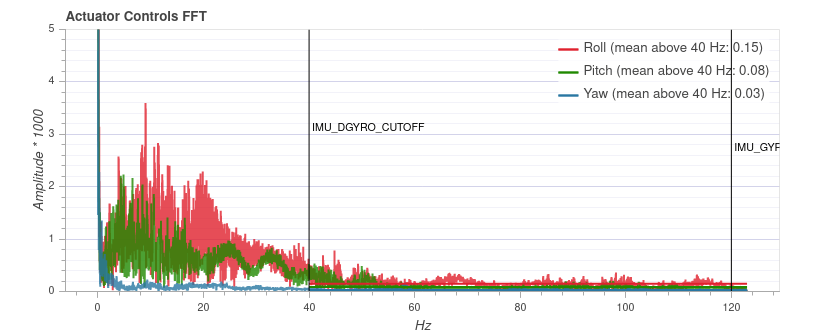

# MC Filter Tuning & Control Latency

Filters can be used to trade off [control latency](#control-latency), which affects flight performance, and noise filtering, which impacts both flight performance and motor health.

This topic provides an overview of control latency and PX4 filter tuning.

::: info
Before filter tuning you should do a first pass at [Basic MC PID tuning](../config_mc/pid_tuning_guide_multicopter_basic.md).
The vehicle needs to be undertuned (the **P** and **D** gains should be set too low), such that there are no oscillations from the controller that could be interpreted as noise (the default gains might be good enough).
:::

## Control Latency

The _control latency_ is the delay from a physical disturbance of the vehicle until the motors react to the change.

:::tip
Lowering latency allows you to increase the rate **P** gains, which results in better flight performance.
Even one millisecond difference in the latency can have a significant impact.
:::

The following factors affect control latency:

- A soft airframe or soft vibration mounting increases latency (they act as a filter).
- Low-pass filters in software and on the sensor chip trade off increased latency for improved noise filtering.
- PX4 software internals: the sensor signals need to be read in the driver and then pass through the controller to the output driver.
- The maximum gyro publication rate (configured with [IMU_GYRO_RATEMAX](../advanced_config/parameter_reference.md#IMU_GYRO_RATEMAX)).
  A higher rate reduces latency but is computationally intensive/can starve other processes.
  4 kHz or higher is only recommended for controllers with STM32H7 processor or newer (2 kHz value is near the limit for less capable processors).
- The IO chip (MAIN pins) adds about 5.4 ms latency compared to using the AUX pins (this does not apply to a _Pixracer_ or _Omnibus F4_, but does apply to a Pixhawk).
  To avoid the IO delay attach the motors to the AUX pins instead.
- PWM output signal: enable [Dshot](../peripherals/dshot.md) by preference to reduce latency (or One-Shot if DShot is not supported).
  The protocol is selected for a group of outputs during [Actuator Configuration](../config/actuators.md).

Below we look at the impact of the low pass filters.

## Filters

The filtering pipeline for the controllers in PX4 is described below.

::: info
Sampling and filtering is always performed at the full raw sensor rate (commonly 8kHz, depending on the IMU).
:::

### On-chip DLPF for the Gyro Sensor

This is disabled on all chips where it can be disabled (if not, cutoff frequency is set to the highest level of the chip).

### Notch Filters

Setups that have a significant lower-frequency noise spike (e.g. due to harmonics at the rotor blade pass frequency) can benefit from using the notch filter to clean the signal before it is passed to the low pass filter (these harmonics have a similar detrimental impact on motors as other sources of noise).

Without the notch filter you'd have to set the low pass filter cutoff much lower (increasing the phase lag) in order to avoid passing this noise to the motors.

#### Static Notch Filters

One or two static notch filters on the gyro sensor data that are used to filter out narrow band noise, for example a bending mode of the airframe.

The static notch filters can be configured using:

- First notch filter: [IMU_GYRO_NF0_BW](../advanced_config/parameter_reference.md#IMU_GYRO_NF0_BW) and [IMU_GYRO_NF0_FRQ](../advanced_config/parameter_reference.md#IMU_GYRO_NF0_FRQ).
- Second notch filter: [IMU_GYRO_NF1_BW](../advanced_config/parameter_reference.md#IMU_GYRO_NF1_BW) and [IMU_GYRO_NF1_FRQ](../advanced_config/parameter_reference.md#IMU_GYRO_NF1_FRQ).

::: info
Only two notch filters are provided.
Airframes with more than two frequency noise spikes typically clean the first two spikes with the notch filters, and subsequent spikes using the low pass filter.
:::

#### Dynamic Notch Filters

Dynamic notch filters use ESC RPM feedback and/or the onboard FFT analysis.
The ESC RPM feedback is used to track the rotor blade pass frequency and its harmonics, while the FFT analysis can be used to track a frequency of another vibration source, such as a fuel engine.

ESC RPM feedback requires ESCs capable of providing RPM feedback such as [DShot](../peripherals/esc_motors.md#dshot) with telemetry connected, a bidirectional DShot set up ([work in progress](https://github.com/PX4/PX4-Autopilot/pull/23863)), or [UAVCAN/DroneCAN ESCs](../dronecan/escs.md).
Before enabling, make sure that the ESC RPM is correct.
You might have to adjust the [pole count of the motors](../advanced_config/parameter_reference.md#MOT_POLE_COUNT).

The following parameters should be set to enable and configure dynamic notch filters:

| Parameter                                                                                                     | Description                                                              |
| ------------------------------------------------------------------------------------------------------------- | ------------------------------------------------------------------------ |
| [IMU_GYRO_DNF_EN](../advanced_config/parameter_reference.md#IMU_GYRO_DNF_EN)    | Enable IMU gyro dynamic notch filtering. `0`: ESC RPM, `1`: Onboard FFT. |
| [IMU_GYRO_FFT_EN](../advanced_config/parameter_reference.md#IMU_GYRO_FFT_EN)    | Enable onboard FFT (required if `IMU_GYRO_DNF_EN` is set to `1`).        |
| [IMU_GYRO_DNF_MIN](../advanced_config/parameter_reference.md#IMU_GYRO_DNF_MIN) | Minimum dynamic notch frequency in Hz.                                   |
| [IMU_GYRO_DNF_BW](../advanced_config/parameter_reference.md#IMU_GYRO_DNF_BW)    | Bandwidth for each notch filter in Hz.                                   |
| [IMU_GYRO_DNF_HMC](../advanced_config/parameter_reference.md#IMU_GYRO_NF0_BW)  | Number of harmonics to filter.                                           |

### Low-pass Filter

A low pass filter on the gyro data can be configured with the [IMU_GYRO_CUTOFF](../advanced_config/parameter_reference.md#IMU_GYRO_CUTOFF) parameter.

To reduce the control latency, we want to increase the cutoff frequency for the low-pass filters.
The effect on latency of increasing `IMU_GYRO_CUTOFF` is approximated below.

| Cutoff (Hz) | Delay approx. (ms) |
| ------------ | ------------------ |
| 30           | 8                  |
| 60           | 3.8                |
| 120          | 1.9                |

However this is a trade-off as increasing `IMU_GYRO_CUTOFF` will also increase the noise of the signal that is fed to the motors.
Noise on the motors has the following consequences:

- Motors and ESCs can get hot, to the point where they get damaged.
- Reduced flight time because the motors continuously change their speed.
- Visible random small twitches.

### Low-pass Filter on D-term

The D-term is most susceptible to noise while slightly increased latency does not negatively affect performance.
For this reason the D-term has a separately-configurable low-pass filter, [IMU_DGYRO_CUTOFF](../advanced_config/parameter_reference.md#IMU_DGYRO_CUTOFF).

### Slew-rate Filter on Motor Outputs

An optional slew-rate filter on the motor outputs.
This rate may be configured as part of the [Multicopter Geometry](../config/actuators.md#motor-geometry-multicopter) when configuring actuators (which in turn modifies the [CA_Rn_SLEW](../advanced_config/parameter_reference.md#CA_R0_SLEW) parameters for each motor `n`).

## Filter Tuning

::: info
The best filter settings depend on the vehicle.
The defaults are set conservatively — such that they work on lower-quality setups as well.
:::

First make sure to have the high-rate logging profile activated ([SDLOG_PROFILE](../advanced_config/parameter_reference.md#SDLOG_PROFILE) parameter).
[Flight Review](../getting_started/flight_reporting.md) will then show an FFT plot for the roll, pitch and yaw controls.

:::warning

- Do not try to fix a vehicle that suffers from high vibrations with filter tuning!
  Instead fix the vehicle hardware setup.
- Confirm that PID gains, in particular D, are not set too high as this can show up as vibrations.

:::

Filter tuning is best done by reviewing flight logs.
You can do multiple flights right after each other with different parameters and then inspect all logs, but make sure to disarm in between so that separate log files are created.

The performed flight manoeuvre can simply be hovering in [Stabilized mode](../flight_modes_mc/manual_stabilized.md) with some rolling and pitching to all directions and some increased throttle periods.
The total duration does not need to be more than 30 seconds.
In order to better compare, the manoeuvre should be similar in all tests.

First tune the gyro filter [IMU_GYRO_CUTOFF](../advanced_config/parameter_reference.md#IMU_GYRO_CUTOFF) by increasing it in steps of 10 Hz while using a low D-term filter value ([IMU_DGYRO_CUTOFF](../advanced_config/parameter_reference.md#IMU_DGYRO_CUTOFF) = 30).
Upload the logs to [Flight Review](https://logs.px4.io) and compare the _Actuator Controls FFT_ plot.
Set the cutoff frequency to a value before the noise starts to increase noticeably (for frequencies around and above 60 Hz).

Then tune the D-term filter (`IMU_DGYRO_CUTOFF`) in the same way.
Note that there can be negative impacts on performance if `IMU_GYRO_CUTOFF` and `IMU_DGYRO_CUTOFF` are set too far apart (the differences have to be significant though - e.g. D=15, gyro=80).

Below is an example for three different `IMU_DGYRO_CUTOFF` filter values (40Hz, 70Hz, 90Hz).
At 90 Hz the general noise level starts to increase (especially for roll), and thus a cutoff frequency of 70 Hz is a safe setting.

::: info
The plot cannot be compared between different vehicles, as the y axis scale can be different.
On the same vehicle it is consistent and independent of the flight duration.
:::

If the flight plots shows significant low frequency spikes, like the one shown in the diagram below, you can remove it using a notch filter.
In this case you might use the settings: [IMU_GYRO_NF0_FRQ=32](../advanced_config/parameter_reference.md#IMU_GYRO_NF0_FRQ) and [IMU_GYRO_NF0_BW=5](../advanced_config/parameter_reference.md#IMU_GYRO_NF0_BW) (note, this spike is narrower than usual).
The low pass filters and the notch filter can be tuned independently (i.e. you don't need to set the notch filter before collecting the data for tuning the low pass filter).

## Additional Tips

1. Acceptable latency depends on vehicle size and expectations.
   FPV racers typically tune for the absolute minimal latency (as a ballpark `IMU_GYRO_CUTOFF` around 120, `IMU_DGYRO_CUTOFF` of 50 to 80).
   For bigger vehicles latency is less critical and `IMU_GYRO_CUTOFF` of around 80 might be acceptable.

1. You can start tuning at higher `IMU_GYRO_CUTOFF` values (e.g. 100Hz), which might be desirable because the default tuning of `IMU_GYRO_CUTOFF` is set very low (30Hz).
   The only caveat is that you must be aware of the risks:
   - Don't fly for more than 20-30 seconds
   - Check that the motors are not getting to hot
   - Listen for odd sounds and symptoms of excessive noise, as discussed above.
