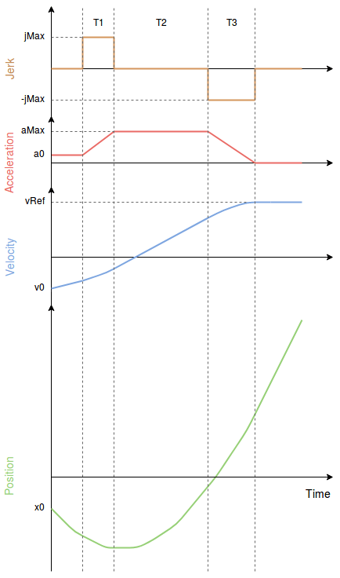

# Jerk-limited Type Trajectory for Multicopters

The Jerk-limited trajectory type provides smooth motion in response to user stick input or mission changes (e.g.: for filming, mapping, cargo).
It generates symmetric smooth S-curves where the jerk and acceleration limits are always guaranteed.

This trajectory type is always enabled in [Mission mode](../flight_modes_mc/mission.md).
To enable it in [Position mode](../flight_modes_mc/position.md) set the parameter [MPC_POS_MODE](../advanced_config/parameter_reference.md#MPC_POS_MODE) to `Smoothed velocity`.

::: info
The jerk-limited type is not used _by default_ in position mode.
It may not be suitable for vehicles/use-cases that require a faster response - e.g. racer quads.
:::

## Trajectory Generator

The graph below shows a typical jerk-limited profile with the following constraints:

- `jMax`: maximum jerk
- `a0`: initial acceleration
- `aMax`: maximum acceleration
- `a3`: final acceleration (always 0)
- `v0`: initial velocity
- `vRef`: desired velocity

The constraints `jMax`, `aMax` are configurable by the user via parameters and can be different in manual position control and auto mode.

The resulting velocity profile is often called "S-Curve".

## Manual Mode

In manual position mode, the sticks are mapped to velocity where a full XY-stick deflection corresponds to [MPC_VEL_MANUAL](../advanced_config/parameter_reference.md#MPC_VEL_MANUAL) and a full Z-stick deflection corresponds to [MPC_Z_VEL_MAX_UP](../advanced_config/parameter_reference.md#MPC_Z_VEL_MAX_UP) (upward motion) or [MPC_Z_VEL_MAX_DN](../advanced_config/parameter_reference.md#MPC_Z_VEL_MAX_DN) (downward motion).

### Constraints

XY-plane:

- `jMax`: [MPC_JERK_MAX](../advanced_config/parameter_reference.md#MPC_JERK_MAX)
- `aMax`: [MPC_ACC_HOR_MAX](../advanced_config/parameter_reference.md#MPC_ACC_HOR_MAX)

Z-axis:

- `jMax`: [MPC_JERK_MAX](../advanced_config/parameter_reference.md#MPC_JERK_MAX)
- `aMax` (upward motion): [MPC_ACC_UP_MAX](../advanced_config/parameter_reference.md#MPC_ACC_UP_MAX)
- `aMax` (downward motion): [MPC_ACC_DOWN_MAX](../advanced_config/parameter_reference.md#MPC_ACC_DOWN_MAX)

## Auto Mode

In auto mode, the desired velocity is [MPC_XY_CRUISE](../advanced_config/parameter_reference.md#MPC_XY_CRUISE) but this value is automatically adjusted depending on the distance to the next waypoint, the maximum possible velocity in the waypoint and the maximum desired acceleration and jerk.
The vertical speed is defined by [MPC_Z_V_AUTO_UP](../advanced_config/parameter_reference.md#MPC_Z_V_AUTO_UP) (upward motion) and [MPC_Z_V_AUTO_DN](../advanced_config/parameter_reference.md#MPC_Z_V_AUTO_DN) (downward motion).

### Constraints

XY-plane:

- `jMax`: [MPC_JERK_AUTO](../advanced_config/parameter_reference.md#MPC_JERK_AUTO)
- `aMax`: [MPC_ACC_HOR](../advanced_config/parameter_reference.md#MPC_ACC_HOR)

Z-axis:

- `jMax`: [MPC_JERK_AUTO](../advanced_config/parameter_reference.md#MPC_JERK_AUTO)
- `aMax` (upward motion): [MPC_ACC_UP_MAX](../advanced_config/parameter_reference.md#MPC_ACC_UP_MAX)
- `aMax` (downward motion): [MPC_ACC_DOWN_MAX](../advanced_config/parameter_reference.md#MPC_ACC_DOWN_MAX)

Distance to velocity gains when close to a waypoint:

- [MPC_XY_TRAJ_P](../advanced_config/parameter_reference.md#MPC_XY_TRAJ_P)

### Related Parameters

- [MPC_XY_VEL_MAX](../advanced_config/parameter_reference.md#MPC_XY_VEL_MAX)
- [MPC_Z_VEL_MAX_UP](../advanced_config/parameter_reference.md#MPC_Z_VEL_MAX_UP)
- [MPC_Z_VEL_MAX_DN](../advanced_config/parameter_reference.md#MPC_Z_VEL_MAX_DN)
- [MPC_TKO_SPEED](../advanced_config/parameter_reference.md#MPC_TKO_SPEED)
- [MPC_LAND_SPEED](../advanced_config/parameter_reference.md#MPC_LAND_SPEED)
- [MPC_LAND_ALT1](../advanced_config/parameter_reference.md#MPC_LAND_ALT1)
- [MPC_LAND_ALT2](../advanced_config/parameter_reference.md#MPC_LAND_ALT2)
