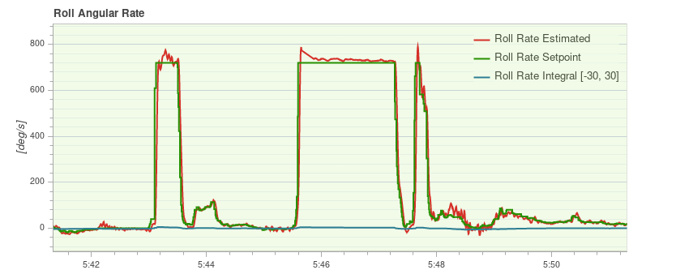

# Multicopter PID Tuning Guide (Manual/Advanced)

This topic provides detailed information about PX4 controllers, and how they are tuned.

:::tip
[Autotune](../config/autotune_mc.md) is recommended for tuning the vehicles _around the hover thrust point_, as the approach described is intuitive, easy, and fast.
This is all that is required for many vehicles.
:::

Use this topic when tuning around the hover thrust point is not sufficient (e.g. on vehicles where there are non-linearities and oscillations at higher thrusts).
It is also useful for a deeper understanding of how the basic tuning works, and to understand how to use the [airmode](#airmode-mixer-saturation) setting.

## Tuning Steps

::: info
For safety reasons, the default gains are set to low values.
You must increase the gains before you can expect good control responses.
:::

Here are some general points to follow when tuning:

- All gains should be increased very slowly as large gains may cause dangerous oscillations!
  Typically increase gains by 20-30% per iteration, reducing to 5-10% for final fine tuning.
- Land before changing a parameter.
  Slowly increase the throttle and check for oscillations.
- Tune the vehicle around the hovering thrust point, and use the [thrust curve parameter](#thrust-curve) to account for thrust non-linearities or high-thrust oscillations.
- Optionally enable the high-rate logging profile with the [SDLOG_PROFILE](../advanced_config/parameter_reference.md#SDLOG_PROFILE) parameter so you can use the log to evaluate the rate and attitude tracking performance (the option can be disabled afterwards).

:::warning
Always disable [MC_AIRMODE](../advanced_config/parameter_reference.md#MC_AIRMODE) when tuning a vehicle.
:::

### Rate Controller

The rate controller is the inner-most loop with three independent PID controllers to control the body rates (roll, pitch, yaw).

::: info
A well-tuned rate controller is very important as it affects _all_ flight modes.
A badly tuned rate controller will be visible in [Position mode](../flight_modes_mc/position.md), for example, as "twitches" or oscillations (the vehicle will not hold perfectly still in the air).
:::

#### Rate Controller Architecture/Form

PX4 supports two (mathematically equivalent) forms of the PID rate controller in a single "mixed" implementation: [Parallel](#parallel-form) and [Standard](#standard-form).

Users can select the form that is used by setting the proportional gain for the other form to "1" (i.e. in the diagram below set **K** to 1 for the parallel form, or **P** to 1 for the standard form - this will replace either the K or P blocks with a line).

<!-- The drawing is on draw.io: https://drive.google.com/file/d/1hXnAJVRyqNAdcreqNa5W4PQFkYnzwgOO/view?usp=sharing -->

- _G(s)_ represents the angular rates dynamics of a vehicle
- _r_ is the rate setpoint
- _y_ is the body angular rate (measured by a gyro)
- _e_ is the error between the rate setpoint and the measured rate
- _u_ is the output of the PID controller

The two forms are described below.

::: info
The derivative term (**D**) is on the feedback path in order to avoid an effect known as the [derivative kick](http://brettbeauregard.com/blog/2011/04/improving-the-beginner%E2%80%99s-pid-derivative-kick/).
:::

:::tip
For more information see:

- [Not all PID controllers are the same](https://www.controleng.com/articles/not-all-pid-controllers-are-the-same/) (www.controleng.com)
- [PID controller > Standard versus parallel (ideal) PID form](<https://en.wikipedia.org/wiki/PID_controller#Standard_versus_parallel_(ideal)_form>) (Wikipedia)

:::

##### Parallel Form

The _parallel form_ is the simplest form, and is (hence) commonly used in textbooks.
In this case the output of the controller is simply the sum of the proportional, integral and derivative actions.

##### Standard Form

This form is mathematically equivalent to the parallel form, but the main advantage is that (even if it seems counter intuitive) it decouples the proportional gain tuning from the integral and derivative gains.
This means that a new platform can easily be tuned by taking the gains of a drone with similar size/inertia and simply adjust the K gain to have it flying properly.

#### Rate PID Tuning

The related parameters for the tuning of the PID rate controllers are:

- Roll rate control ([MC_ROLLRATE_P](../advanced_config/parameter_reference.md#MC_ROLLRATE_P), [MC_ROLLRATE_I](../advanced_config/parameter_reference.md#MC_ROLLRATE_I), [MC_ROLLRATE_D](../advanced_config/parameter_reference.md#MC_ROLLRATE_D), [MC_ROLLRATE_K](../advanced_config/parameter_reference.md#MC_ROLLRATE_K))
- Pitch rate control ([MC_PITCHRATE_P](../advanced_config/parameter_reference.md#MC_PITCHRATE_P), [MC_PITCHRATE_I](../advanced_config/parameter_reference.md#MC_PITCHRATE_I), [MC_PITCHRATE_D](../advanced_config/parameter_reference.md#MC_PITCHRATE_D), [MC_PITCHRATE_K](../advanced_config/parameter_reference.md#MC_PITCHRATE_K))
- Yaw rate control ([MC_YAWRATE_P](../advanced_config/parameter_reference.md#MC_YAWRATE_P), [MC_YAWRATE_I](../advanced_config/parameter_reference.md#MC_YAWRATE_I), [MC_YAWRATE_D](../advanced_config/parameter_reference.md#MC_YAWRATE_D), [MC_YAWRATE_K](../advanced_config/parameter_reference.md#MC_YAWRATE_K))

The rate controller can be tuned in [Acro mode](../flight_modes_mc/acro.md) or [Stabilized mode](../flight_modes_mc/manual_stabilized.md):

- _Acro mode_ is preferred because it allows for isolated rate control testing.
  However it is significantly harder to pilot.

  ::: warning
  If you choose this mode, you must [disable all stick expo and have reasonable maximum rates for all axes](../flight_modes_mc/acro.md#stick-input-mapping):
  - `MC_ACRO_EXPO` = 0, `MC_ACRO_EXPO_Y` = 0, `MC_ACRO_SUPEXPO` = 0,
    `MC_ACRO_SUPEXPOY` = 0
  - `MC_ACRO_P_MAX` = 200, `MC_ACRO_R_MAX` = 200
  - `MC_ACRO_Y_MAX` = 100

  For PX4 v1.15 and later the defaults are set for this purpose to a maximum rate of 100°/s linear mapping for all axes.
  :::

- _Stabilized mode_ is simpler to fly, but it is also much more difficult to distinguish if attitude or rate controller causes a certain behavior.

If the vehicle does not fly at all:

- If there are strong oscillations when first trying to takeoff (to the point where it does not fly), decrease all **P** and **D** gains until it takes off.
- If the reaction to RC movement is minimal, increase the **P** gains.

The actual tuning is roughly the same in _Manual mode_ or _Acro mode_:
You iteratively tune the **P** and **D** gains for roll and pitch, and then the **I** gain.
Initially you can use the same values for roll and pitch, and once you have good values,
you can fine-tune them by looking at roll and pitch response separately (if your vehicle is symmetric, this is not needed).
For yaw it is very similar, except that **D** can be left at 0.

##### Proportional Gain (P/K)

The proportional gain is used to minimize the tracking error (below we use **P** to refer to both **P** or **K**).
It is responsible for a quick response and thus should be set as high as possible, but without introducing oscillations.

- If the **P** gain is too high: you will see high-frequency oscillations.
- If the **P** gain is too low:
  - the vehicle will react slowly to input changes.
  - In _Acro mode_ the vehicle will drift, and you will constantly need to correct to keep it level.

##### Derivative Gain (D)

The **D** (derivative) gain is used for rate damping.
It is required but should be set only as high as needed to avoid overshoots.

- If the **D** gain is too high: the motors become twitchy (and maybe hot), because the **D** term amplifies noise.
- If the **D** gain is too low: you see overshoots after a step-input.

Typical values are:

- standard form (**P** = 1): between 0.01 (4" racer) and 0.04 (500 size), for any value of **K**
- parallel form (**K** = 1): between 0.0004 and 0.005, depending on the value of **P**

##### Integral Gain (I)

The **I** (integral) gain keeps a memory of the error. The **I** term increases when the desired rate is not reached over some time.
It is important (especially when flying _Acro mode_), but it should not be set too high.

- If the I gain is too high: you will see slow oscillations.
- If the I gain is too low: this is best tested in _Acro mode_, by tilting the vehicle to one side about 45 degrees, and keeping it like that.
  It should keep the same angle.
  If it drifts back, increase the **I** gain.
  A low **I** gain is also visible in a log, when there is an offset between the desired and the actual rate over a longer time.

Typical values are:

- standard form (**P** = 1): between 0.5 (VTOL plane), 1 (500 size) and 8 (4" racer), for any value of **K**
- parallel form (**K** = 1): between 0.3 and 0.5 if **P** is around 0.15
  The pitch gain usually needs to be a bit higher than the roll gain.

#### Testing Procedure

To test the current gains, provide a fast **step-input** when hovering and observe how the vehicle reacts.
It should immediately follow the command, and neither oscillate, nor overshoot (it feels 'locked-in').

You can create a step-input for example for roll, by quickly pushing the roll stick to one side, and then let it go back quickly (be aware that the stick will oscillate too if you just let go of it, because it is spring-loaded — a well-tuned vehicle will follow these oscillations).

::: info
A well-tuned vehicle in _Acro mode_ will not tilt randomly towards one side, but keeps the attitude for tens of seconds even without any corrections.
:::

#### Logs

Looking at a log helps to evaluate tracking performance as well.
Here is an example for good roll and yaw rate tracking:

And here is a good example for the roll rate tracking with several flips, which create an extreme step-input.
You can see that the vehicle overshoots only by a very small amount:

### Attitude Controller

This controls the orientation and outputs desired body rates with the following tuning parameters:

- Roll control ([MC_ROLL_P](../advanced_config/parameter_reference.md#MC_ROLL_P))
- Pitch control ([MC_PITCH_P](../advanced_config/parameter_reference.md#MC_PITCH_P))
- Yaw control ([MC_YAW_P](../advanced_config/parameter_reference.md#MC_YAW_P))

The attitude controller is much easier to tune.
In fact, most of the time the defaults do not need to be changed at all.

To tune the attitude controller, fly in _Stabilized mode_ and increase the **P** gains gradually.
If you start to see oscillations or overshoots, the gains are too high.

The following parameters can also be adjusted. These determine the maximum rotation rates around all three axes:

- Maximum roll rate ([MC_ROLLRATE_MAX](../advanced_config/parameter_reference.md#MC_ROLLRATE_MAX))
- Maximum pitch rate ([MC_PITCHRATE_MAX](../advanced_config/parameter_reference.md#MC_PITCHRATE_MAX))
- Maximum yaw rate ([MC_YAWRATE_MAX](../advanced_config/parameter_reference.md#MC_YAWRATE_MAX))

### Thrust Curve

The tuning above optimises performance around the hover throttle.
But you may start to see oscillations when going towards full throttle.

To counteract that, adjust the **thrust curve** with the [THR_MDL_FAC](../advanced_config/parameter_reference.md#THR_MDL_FAC) parameter.

::: info
The rate controller might need to be re-tuned if you change this parameter.
:::

The mapping from motor control signals (e.g. PWM) to expected thrust is linear by default — setting `THR_MDL_FAC` to 1 makes it quadratic.
Values in between use a linear interpolation of the two. Typical values are between 0.3 and 0.5.

If you have a [thrust stand](https://www.tytorobotics.com/pages/series-1580-1585) <!-- RCbenchmark Series 1580/1585 Test Stand --> (or can otherwise _measure_ thrust and motor commands simultaneously), you can determine the relationship between the motor control signal and the motor's actual thrust, and fit a function to the data.
The motor command in PX4 called `actuator_output` can be PWM, Dshot, UAVCAN commands for the respective ESCs in use.
[This Notebook][THR_MDL_FAC_Calculation] shows one way for how the thrust model factor `THR_MDL_FAC` may be calculated from previously measured thrust and PWM data.
The curves shown in this plot are parametrized by both &alpha; and k, and also show thrust and PWM in real units (kgf and &mu;s).
In order to simplify the curve fit problem, you can normalize the data between 0 and 1 to find `k` without having to estimate &alpha; (&alpha; = 1, when the data is normalized).

] <!-- removed link to THR_MDL_FAC_Calculation as causes problems for link checker -->

::: info
The mapping between PWM and static thrust depends highly on the battery voltage.
:::

An alternative way of performing this experiment is to make a scatter plot of the normalized motor command and thrust values, and iteratively tune the thrust curve by experimenting with the `THR_MDL_FAC` parameter.
An example of that graph is shown here:

If raw motor command and thrust data is collected throughout the full-scale range in the experiment, you can normalize the data using the equation:

_normalized_value = ( raw_value - min (raw_value) ) / ( max ( raw_value ) - min ( raw_value ) )_

After you have a scatter plot of the normalized values, you can try and make the curve match by plotting the equation

_rel_thrust = ( `THR_MDL_FAC` ) _ rel*signal^2 + ( 1 - `THR_MDL_FAC` ) * rel*signal*

over a linear range of normalized motor command values between 0 and 1.
Note that this is the equation that is used in the firmware to map thrust and motor command, as shown in the [THR_MDL_FAC](../advanced_config/parameter_reference.md#THR_MDL_FAC) parameter reference.
Here, _rel_thrust_ is the normalized thrust value between 0 and 1, and _rel_signal_ is the normalized motor command signal value between 0 and 1.

In this example above, the curve seemed to fit best when `THR_MDL_FAC` was set to 0.7.

[THR_MDL_FAC_Calculation]: https://github.com/PX4/PX4-user_guide/blob/main/assets/config/mc/ThrustCurve.ipynb

If you don't have access to a thrust stand, you can also tune the modeling factor empirically.
Start off with 0.3 and increase it by 0.1 at a time.
If it is too high, you will start to notice oscillations at lower throttle values.
If it is too low you'll notice oscillations at higher throttle values.

### Airmode & Mixer Saturation

The rate controller outputs torque commands for all three axis (roll, pitch and yaw) and a scalar thrust value, which need to be converted into individual motor thrust commands.
This step is called mixing.

It can happen that one of the motor commands becomes negative, for example for a low thrust and large roll command (and similarly it can go above 100%).
This is a mixer saturation.
It is physically impossible for the vehicle to execute these commands (except for reversible motors).
PX4 has two modes to resolve this:

- Either by reducing the commanded torque for roll such that none of the motor commands is below zero (Airmode disabled).
  In the extreme case where the commanded thrust is zero, it means that no attitude correction is possible anymore, which is why a minimum thrust is always required for this mode.
- Or by increasing (boosting) the commanded thrust, such that none of the motor commands is negative (Airmode enabled).
  This has the big advantage that the attitude/rates can be tracked correctly even at low or zero throttle.
  It generally improves the flight performance.

  However it increases the total thrust which can lead to situations where the vehicle continues to ascend even though the throttle is reduced to zero.
  For a well-tuned, correctly functioning vehicle it is not the case, but for example it can happen when the vehicle strongly oscillates due to too high P tuning gains.

Both modes are shown below with a 2D illustration for two motors and a torque command for roll r.
On the left motor r is added to the commanded thrust, while on the right motor it is subtracted from it.
The motor thrusts are in green.
With Airmode enabled, the commanded thrust is increased by b.
When it is disabled, r is reduced.

<!-- The drawing is on draw.io: https://drive.google.com/file/d/1N0qjbiJX6JuEk2I1-xFvigLEPKJRIjBP/view?usp=sharing
     On the first Tab
-->

If mixing becomes saturated towards the upper bound the commanded thrust is reduced to ensure that no motor is commanded to deliver more than 100% thrust.
This behaviour is similar to the Airmode logic, and is applied whether Airmode is enabled or disabled.

Once your vehicle flies well you can enable Airmode via the [MC_AIRMODE](../advanced_config/parameter_reference.md#MC_AIRMODE) parameter.
