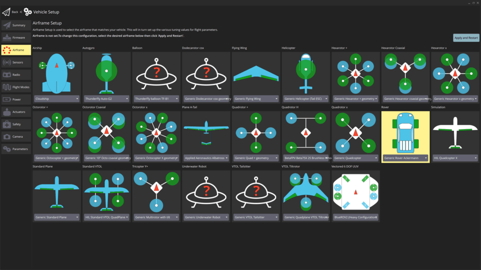

# Basic Setup

## Configure the rover frame and outputs

1. Enable Rover support by flashing the [PX4 rover build](../config_rover/index.md#flashing-the-rover-build) onto your flight controller.
   Note that this is a special build that contains rover-specific modules.

2. In the [Airframe](../config/airframe.md) configuration select the your rover type: _Generic Rover Ackermann_/_Generic Rover Differential_/_Generic Rover Mecanum_:

   

   Select the **Apply and Restart** button.

   ::: info
   If this airframe is not displayed and you have checked that you are using rover firmware (not the default), you can alternatively enable this frame by setting the [SYS_AUTOSTART](../advanced_config/parameter_reference.md#SYS_AUTOSTART) parameter directly to the following value:

   | Rover Type   | Value   |
   | ------------ | ------- |
   | Ackermann    | `51000` |
   | Differential | `50000` |
   | Mecanum      | `52000` |

   :::

3. Open the [Actuators Configuration & Testing](../config/actuators.md) to map the motor/servo functions to flight controller outputs.

That is the minimum setup to use the rover in [Manual mode](../flight_modes_rover/manual.md#manual-mode).

::: info
The rest of the tuning on this page is not mandatory for [Manual mode](../flight_modes_rover/manual.md#manual-mode), but it will have an effect on the behaviour of the rover.
:::

::: warning
Do not skip the rest of this setup if you intend to use more sophisticated modes!
All parameters will be mandatory for all subsequent modes, except those tagged as `(Optional)`.
:::

## Geometric Parameters

First, we set up the geometric parameters of the rover:

Navigate to [Parameters](../advanced_config/parameters.md) in QGroundControl and set the parameters in the group for your frame type.

### Ackermann

1. [RA_WHEEL_BASE](#RA_WHEEL_BASE) [m]: Measure the distance from the back to the front wheels.
2. [RA_MAX_STR_ANG](#RA_MAX_STR_ANG) [deg]: Measure the maximum steering angle.
3. (Optional) [RA_STR_RATE_LIM](#RA_STR_RATE_LIM) [deg/s]: Maximum steering rate you want to allow for your rover.

   ::: tip
   This value depends on your rover and use case.
   For bigger rovers there might be a mechanical limit that is easy to identify by steering the rover at a standstill and increasing
   [RA_STR_RATE_LIM](#RA_STR_RATE_LIM) until you observe the steering rate to no longer be limited by the parameter.
   For smaller rovers you might observe the steering to be too aggressive. Set [RA_STR_RATE_LIM](#RA_STR_RATE_LIM) to a low value and steer the rover at a standstill.
   Increase the parameter until you reach the maximum steering rate you are comfortable with.
   :::

   ::: warning
   A low maximum steering rate makes the rover worse at tracking steering setpoints, which can lead to a poor performance in the subsequent modes.
   :::

### Differential

1. [RD_WHEEL_TRACK](#RD_WHEEL_TRACK) [m]: Measure the distance from the centre of the right wheel to the centre of the left wheel.

### Mecanum

1. [RM_WHEEL_TRACK](#RM_WHEEL_TRACK) [m]: Measure the distance from the centre of the right wheel to the centre of the left wheel.

## Speed Parameters

1. [RO_MAX_THR_SPEED](#RO_MAX_THR_SPEED) [m/s]: Drive the rover at full throttle and set this parameter to the observed value of the ground speed.

   :::info
   This parameter is also used for the feed-forward term of the closed loop speed control.
   It will be further adjusted in the [velocity tuning](velocity_tuning.md) step.
   :::

2. (Optional) [RO_ACCEL_LIM](#RO_ACCEL_LIM) [m/s^2]: Maximum acceleration you want to allow for your rover.

   

   :::tip
   Your rover has a maximum possible acceleration which is determined by the maximum torque the motor can supply.
   This may or may not be appropriate for your vehicle and use case.

   One approach to determine an appropriate value is:
   1. From a standstill, give the rover full throttle until it reaches the maximum speed.
   2. Disarm the rover and plot the `measured_speed_body_x` from [RoverVelocityStatus](../msg_docs/RoverVelocityStatus.md).
   3. Divide the maximum speed by the time it took to reach it and set this as the value for [RO_ACCEL_LIM](#RO_ACCEL_LIM).

   Some RC rovers have enough torque to lift up if the maximum acceleration is not limited.
   If that is the case:
   1. Set [RO_ACCEL_LIM](#RO_ACCEL_LIM) to a low value, give the rover full throttle from a standstill and observe its behaviour.
   2. Increase [RO_ACCEL_LIM](#RO_ACCEL_LIM) until the rover starts to lift up during the acceleration.
   3. Set [RO_ACCEL_LIM](#RO_ACCEL_LIM) to the highest value that does not cause the rover to lift up.
      :::

3. (Optional) [RO_DECEL_LIM](#RO_DECEL_LIM) [m/s^2]: Maximum deceleration you want to allow for your rover.

   :::tip
   The same [considerations](#RO_ACCEL_LIM_CONSIDERATIONS) as in the configuration of [RO_ACCEL_LIM](#RO_ACCEL_LIM) apply.
   :::

   :::info
   This parameter is also used for the calculation of the speed setpoint in modes that are [position controlled](position_tuning.md).
   :::

## (Optional) Stick Input Mapping

Input shaping can be used to adjust the default linear mapping from stick inputs $\in [-1, 1]$ to normalized setpoints $\in [-1, 1]$. Applying this specifically to the steering input, can provide a smoother driving experience, by enabling the user to make small adjustments when the stick is close to the center, but still send large inputs when moving them to the edges.
We provide this input shaping through the super exponential function:

$$
\delta = \frac{(f \cdot x^3 + x(1-f)) \cdot (1-g)}{1-g \cdot |x|}
$$

with:

- $\delta \in [-1, 1]=$ Normalized steering setpoint.
- $x \in [-1, 1]=$ Normalized stick input.
- $f=$ [RO_YAW_EXPO](#RO_YAW_EXPO): `0` Purely linear input curve, `1` Purely cubic input curve.
- $g=$ [RO_YAW_SUPEXPO](#RO_YAW_SUPEXPO): `0` Pure Expo function, `0.7` reasonable shape enhancement for intuitive stick feel, `0.95` very strong bent input curve only near maxima have effect.

In [Manual mode](../flight_modes_rover/manual.md#manual-mode) we can additionally scale $\delta$ with an additional parameter $r$:

- Differential Rover: $r=$ [RD_YAW_STK_GAIN](#RD_YAW_STK_GAIN), which enables adjusting the slope of the input mapping. This leads to a normalized steering input $\hat{\delta} = \delta \cdot r \in$ [-[RD_YAW_STK_GAIN](#RD_YAW_STK_GAIN), [RD_YAW_STK_GAIN](#RD_YAW_STK_GAIN)].
- Mecanum Rover: $r=$ [RM_YAW_STK_GAIN](#RM_YAW_STK_GAIN), which enables adjusting the slope of the input mapping. This leads to a normalized steering input $\hat{\delta} = \delta \cdot r \in$ [-[RM_YAW_STK_GAIN](#RM_YAW_STK_GAIN), [RM_YAW_STK_GAIN](#RM_YAW_STK_GAIN)].

This scaling is useful to limit the normalized steering setpoint, if it is too aggresive for your rover in manual mode.

You can experiment with the relationships graphically using the [PX4 SuperExpo Rover calculator](https://www.desmos.com/calculator/gwm8lrlanx).

::: info
In [Acro](../flight_modes_rover/manual.md#acro-mode), [Stabilized](../flight_modes_rover/manual.md#stabilized-mode) and [Position](../flight_modes_rover/manual.md#position-mode) Mode, $\delta$ is instead scaled by $r=$ [RO_YAW_RATE_LIM](../advanced_config/parameter_reference.md#RO_MAX_THR_SPEED) for all rovers. This leads to a yaw rate setpoint $\dot{\psi} = \delta \cdot r \in$ [-[RO_YAW_RATE_LIM](../advanced_config/parameter_reference.md#RO_MAX_THR_SPEED), [RO_YAW_RATE_LIM](../advanced_config/parameter_reference.md#RO_MAX_THR_SPEED)]. This parameter is setup during [rate tuning](rate_tuning.md).
:::

::: info
The input shaping through [RO_YAW_EXPO](#RO_YAW_EXPO) and [RO_YAW_SUPEXPO](#RO_YAW_SUPEXPO) applies for all manual modes, while [RD_YAW_STK_GAIN](#RD_YAW_STK_GAIN)/[RM_YAW_STK_GAIN](#RM_YAW_STK_GAIN) only affects full manual mode.
:::

You can now continue the configuration process with [rate tuning](rate_tuning.md).

## Parameter Overview

| Parameter                                                                                                   | Description                                | Unit    |
| ----------------------------------------------------------------------------------------------------------- | ------------------------------------------ | ------- |
| [RO_MAX_THR_SPEED](../advanced_config/parameter_reference.md#RO_MAX_THR_SPEED) | Speed the rover drives at maximum throttle | $m/s$   |
| [RO_ACCEL_LIM](../advanced_config/parameter_reference.md#RO_ACCEL_LIM)             | (Optional) Maximum allowed acceleration    | $m/s^2$ |
| [RO_DECEL_LIM](../advanced_config/parameter_reference.md#RO_DECEL_LIM)             | (Optional) Maximum allowed deceleration    | $m/s^2$ |
| [RO_YAW_EXPO](../advanced_config/parameter_reference.md#RO_YAW_EXPO)                | (Optional) Yaw rate expo factor            | $-$     |
| [RO_YAW_SUPEXPO](../advanced_config/parameter_reference.md#RO_YAW_SUPEXPO)       | (Optional) Yaw rate super expo factor      | $-$     |

### Ackermann Specific

| Parameter                                                                                                | Description                              | Unit  |
| -------------------------------------------------------------------------------------------------------- | ---------------------------------------- | ----- |
| [RA_WHEEL_BASE](../advanced_config/parameter_reference.md#RA_WHEEL_BASE)       | Wheel base                               | $m$   |
| [RA_MAX_STR_ANG](../advanced_config/parameter_reference.md#RA_MAX_STR_ANG)    | Maximum steering angle                   | $deg$ |
| [RA_STR_RATE_LIM](../advanced_config/parameter_reference.md#RA_STR_RATE_LIM) | (Optional) Maximum allowed steering rate | deg/s |

### Differential Specific

| Parameter                                                                                                | Description                               | Unit |
| -------------------------------------------------------------------------------------------------------- | ----------------------------------------- | ---- |
| [RD_WHEEL_TRACK](../advanced_config/parameter_reference.md#RD_WHEEL_TRACK)    | Wheel track                               | $m$  |
| [RD_YAW_STK_GAIN](../advanced_config/parameter_reference.md#RD_YAW_STK_GAIN) | (Optional) Yaw stick gain for Manual mode | $-$  |

### Mecanum Specific

| Parameter                                                                                                | Description                               | Unit |
| -------------------------------------------------------------------------------------------------------- | ----------------------------------------- | ---- |
| [RM_WHEEL_TRACK](../advanced_config/parameter_reference.md#RM_WHEEL_TRACK)    | Wheel track                               | $m$  |
| [RM_YAW_STK_GAIN](../advanced_config/parameter_reference.md#RM_YAW_STK_GAIN) | (Optional) Yaw stick gain for Manual mode | $-$  |
