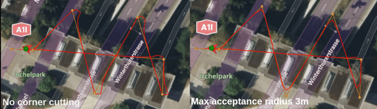
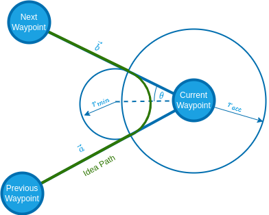
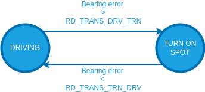
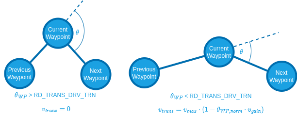
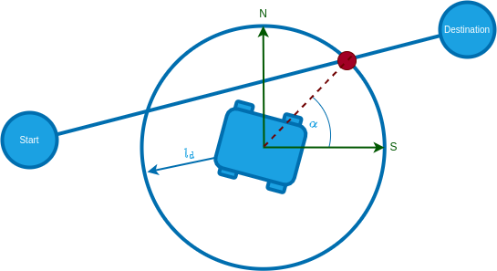
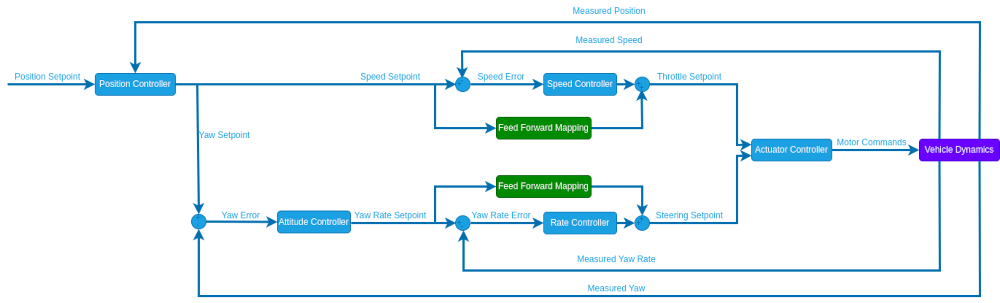

# Position Tuning

Position tuning is required in order to use [Auto modes](../flight_modes_rover/auto.md).

:::warning
The [velocity tuning](velocity_tuning.md) must've already been completed before this step!
:::

The position controller is responsible for autonomously guiding the vehicle to a position setpoint.
These position setpoints are automatically generated by the internal PX4 auto modes (Mission, Return, GoTo, ...) or can directly be sent to the rover through the `RoverPositionSetpoint.msg` (External Modes).
A path is generated for the rover to reach its destination, which tracked through a path following algorithm called [pure pursuit](#pure-pursuit-guidance-logic-info-only).

To tune the position controller configure the [parameters](../advanced_config/parameters.md) in the following sections (using QGroundControl).

## Speed

1. (Optional) [RO_SPEED_RED](#RO_SPEED_RED): Tuning parameter for the speed reduction based on the course error.
   This can be used to limit the maximum allowed speed based on the difference between the current course and the bearing setpoint:
   $v*{max} = v*{full throttle} \cdot (1 - \theta\_{normalized} \cdot k) $

   with

   - $v_{max}:$ Maximum speed
   - $v_{full throttle}:$ Speed at maximum throttle [RO_MAX_THR_SPEED](../advanced_config/parameter_reference.md#RO_MAX_THR_SPEED).
   - $\theta_{normalized}:$ Course error (Course - bearing setpoint) normalized from $[0\degree, 180\degree]$ to $[0, 1]$
   - $k:$ Tuning parameter [RO_SPEED_RED](#RO_SPEED_RED)

   ::: info
   This parameter is used to calculate the speed at which the vehicle arrives at a waypoint based on the upcoming corner.
   Set to -1 to disable course error based speed reduction.
   :::

2. (Optional) [RO_DECEL_LIM](../advanced_config/parameter_reference.md#RO_DECEL_LIM) [m/s^2] and [RO_JERK_LIM](../advanced_config/parameter_reference.md#RO_JERK_LIM) [m/s^3] are used to calculate a speed trajectory such that the rover reaches the next waypoint with the calculated cornering speed.

   ::: tip
   Plan a mission for the rover to drive a square and observe how it slows down when approaching a waypoint:

   - If the rover decelerates too quickly decrease the [RO_DECEL_LIM](../advanced_config/parameter_reference.md#RO_DECEL_LIM) parameter, if it starts slowing down too early increase the parameter.
   - If you observe a jerking motion as the rover slows down, decrease the [RO_JERK_LIM](../advanced_config/parameter_reference.md#RO_JERK_LIM) parameter otherwise increase it as much as possible as it can interfere with the tuning of [RO_DECEL_LIM](../advanced_config/parameter_reference.md#RO_DECEL_LIM).

   These two parameters have to be tuned as a pair, repeat until you are satisfied with the behaviour.
   :::

3. Plot the `adjusted_speed_body_x_setpoint` and `measured_speed_body_x` from the [RoverVelocityStatus](../msg_docs/RoverVelocityStatus.md) message over each other.
   If the tracking of these setpoints is not satisfactory adjust the values for [RO_SPEED_P](../advanced_config/parameter_reference.md#RO_SPEED_P) and [RO_SPEED_I](../advanced_config/parameter_reference.md#RO_SPEED_I).

## Path Following

The [pure pursuit](#pure-pursuit-guidance-logic-info-only) algorithm is used to calculate a bearing setpoint for the vehicle that is then close loop controlled.

The following parameters are used to tune the algorithm:

1. [PP_LOOKAHD_GAIN](#PP_LOOKAHD_GAIN): When driving in a straight line (right stick centered) position mode leverages the same path following algorithm used in [auto modes](../flight_modes_rover/auto.md) called [pure pursuit](#pure-pursuit-guidance-logic-info-only) to achieve the best possible straight line driving behaviour.
   This parameter determines how aggressive the controller will steer towards the path.

   ::: tip
   Decreasing the parameter makes it more aggressive but can lead to oscillations.

   To tune this:

   1. Start with a value of 1 for [PP_LOOKAHD_GAIN](#PP_LOOKAHD_GAIN)
   2. Put the rover in [Position mode](../flight_modes_rover/manual.md#position-mode) and while driving a straight line at approximately half the maximum speed observe its behaviour.
   3. If the rover does not drive in a straight line, reduce the value of the parameter, if it oscillates around the path increase the value.
   4. Repeat until you are satisfied with the behaviour.

   :::

2. [PP_LOOKAHD_MIN](#PP_LOOKAHD_MIN): Minimum threshold for the lookahead distance used by the [pure pursuit algorithm](#pure-pursuit-guidance-logic-info-only).

   ::: tip
   Put the rover in [Position mode](../flight_modes_rover/manual.md#position-mode) and drive at very low speeds, if the rover starts to oscillate even though the tuning of [PP_LOOKAHD_GAIN](#PP_LOOKAHD_GAIN) was good for medium speeds, then increase the value of [PP_LOOKAHD_MIN](#PP_LOOKAHD_MIN).
   :::

3. [PP_LOOKAHD_MAX](#PP_LOOKAHD_MAX): Maximum threshold for the lookahead distance used by [pure pursuit](#pure-pursuit-guidance-logic-info-only).

   ::: tip
   Put the rover in [Position mode](../flight_modes_rover/manual.md#position-mode) and drive at very high speeds, if the rover does not drive in a straight line even though the tuning of [PP_LOOKAHD_GAIN](#PP_LOOKAHD_GAIN) was good for medium speeds, then decrease the value of [PP_LOOKAHD_MAX](#PP_LOOKAHD_MAX).
   :::

During any auto navigation task observe the behaviour of the rover and if you are unsatisfied with the path following, there are 2 steps to take:

1. Check if all the setpoints ([rate](rate_tuning.md), [attitude](attitude_tuning.md) and [velocity](velocity_tuning.md)) are properly tracked.
2. Further tune the [path following algorithm](#path-following).

## Ackermann Rover Only

Ackermann rovers employ a special cornering logic causing the rover to "cut corners" to achieve a smooth trajectory.
This is done by scaling the acceptance radius based on the corner the rover has to drive (for geometric explanation see [Cornering logic](#corner-cutting-logic-info-only)).

The degree to which corner cutting is allowed can be tuned, or disabled, with the following parameters:

::: info
The corner cutting effect is a tradeoff between how close you get to the waypoint and the smoothness of the trajectory.
:::

1. [NAV_ACC_RAD](../advanced_config/parameter_reference.md#NAV_ACC_RAD) [m]: Default acceptance radius
   This is also used as a lower bound for the acceptance radius scaling.
2. [RA_ACC_RAD_MAX](#RA_ACC_RAD_MAX) [m]: The maximum the acceptance radius can be scaled to.
   Set equal to [NAV_ACC_RAD](../advanced_config/parameter_reference.md#NAV_ACC_RAD) to disable the corner cutting effect.
3. [RA_ACC_RAD_GAIN](#RA_ACC_RAD_GAIN) [-]: This tuning parameter is a multiplicand on the [calculated ideal acceptance radius](#corner-cutting-logic-info-only) to account for dynamic effects.

   :::tip
   Initially set this parameter to `1`.
   If you observe the rover overshooting the corner, increase this parameter until you are satisfied with the behaviour.
   Note that the scaling of the acceptance radius is limited by [RA_ACC_RAD_MAX](#RA_ACC_RAD_MAX).
   :::

### Corner Cutting Logic (Info only)

To enable a smooth trajectory, the acceptance radius of waypoints is scaled based on the angle between a line segment from the current-to-previous and current-to-next waypoints.
The ideal trajectory would be to arrive at the next line segment with the heading pointing towards the next waypoint.
For this purpose the minimum turning circle of the rover is inscribed tangentially to both line segments.

The acceptance radius of the waypoint is set to the distance from the waypoint to the tangential points between the circle and the line segments:

$$
\begin{align*}
r_{min} &= \frac{L}{\sin\left( \delta_{max}\right) } \\
\theta  &= \frac{1}{2}\arccos\left( \frac{\vec{a}*\vec{b}}{|\vec{a}||\vec{b}|}\right) \\
r_{acc} &= \frac{r_{min}}{\tan\left( \theta\right) }
\end{align*}
$$

| Symbol         | Description                        | Unit |
| -------------- | ---------------------------------- | ---- |
| $\vec{a}$      | Vector from current to previous WP | m    |
| $\vec{b}$      | Vector from current to next WP     | m    |
| $r_{min}$      | Minimum turn radius                | m    |
| $\delta_{max}$ | Maximum steer angle                | m    |
| $r_{acc}$      | Acceptance radius                  | m    |

## Differential Rover Only

Differential rovers employ the following state machine to make full use of a differential rovers ability to turn on the spot:

These transition thresholds can be set with [RD_TRANS_DRV_TRN](#RD_TRANS_DRV_TRN) and [RD_TRANS_TRN_DRV](#RD_TRANS_TRN_DRV).

In mission modes [RD_TRANS_DRV_TRN](#RD_TRANS_DRV_TRN) is also used to slow down the rover to a standstill, if the transition angle between the waypoints exceeds this threshold:

## Pure Pursuit Guidance Logic (Info Only)

The desired bearing setpoints are generated using the pure pursuit algorithm.

The controller takes the intersection point between a circle around the vehicle and a line segment.
When targeting a position setpoint this line is constructed from the current position to the destination or when executing a mission it is usually constructed by connecting the previous and current waypoint.

The radius of the circle around the vehicle is used to tune the controller and is often referred to as look-ahead distance.

The look-ahead distance sets how aggressive the controller behaves and is defined as $l_d = v \cdot k$.
It depends on the velocity $v$ of the rover and a tuning parameter $k$ that can be set with the parameter [PP_LOOKAHD_GAIN](#PP_LOOKAHD_GAIN).

::: info
A lower value of [PP_LOOKAHD_GAIN](#PP_LOOKAHD_GAIN) makes the controller more aggressive but can lead to oscillations!
:::

The lookahead is constrained between [PP_LOOKAHD_MAX](#PP_LOOKAHD_MAX) and [PP_LOOKAHD_MIN](#PP_LOOKAHD_MIN).

If the distance from the path to the rover is bigger than the lookahead distance, the rover will target the point on the path that is closest to the rover.

## Position Controller Structure (Info Only)

This section provides additional information for developers and people with experience in control system design.

The position controller uses the following structure:

## Parameter Overview

| Parameter                                                                                                | Description                                                                   | Unit |
| -------------------------------------------------------------------------------------------------------- | ----------------------------------------------------------------------------- | ---- |
| [RO_SPEED_RED](../advanced_config/parameter_reference.md#RO_SPEED_RED)          | (Optional) Tuning parameter for the speed reduction based on the course error | -    |
| [PP_LOOKAHD_GAIN](../advanced_config/parameter_reference.md#PP_LOOKAHD_GAIN) | Pure pursuit: Main tuning parameter                                           | -    |
| [PP_LOOKAHD_MAX](../advanced_config/parameter_reference.md#PP_LOOKAHD_MAX)    | Pure pursuit: Maximum value for the look ahead radius                         | m    |
| [PP_LOOKAHD_MIN](../advanced_config/parameter_reference.md#PP_LOOKAHD_MIN)    | Pure pursuit: Minimum value for the look ahead radius                         | m    |

## Ackermann Specific

| Parameter                                                                                                | Description                                                      | Unit |
| -------------------------------------------------------------------------------------------------------- | ---------------------------------------------------------------- | ---- |
| [RA_ACC_RAD_MAX](../advanced_config/parameter_reference.md#RA_ACC_RAD_MAX)    | (Optional) Maximum radius the acceptance radius can be scaled to | m    |
| [RA_ACC_RAD_GAIN](../advanced_config/parameter_reference.md#RA_ACC_RAD_GAIN) | (Optional) Tuning parameter for the acceptance radius scaling    | -    |

## Differential Specific

| Parameter                                                                                                   | Description                                                    | Unit |
| ----------------------------------------------------------------------------------------------------------- | -------------------------------------------------------------- | ---- |
| [RD_TRANS_DRV_TRN](../advanced_config/parameter_reference.md#RD_TRANS_DRV_TRN) | Heading error threshold to switch from driving to spot turning | deg  |
| [RD_TRANS_TRN_DRV](../advanced_config/parameter_reference.md#RD_TRANS_TRN_DRV) | Heading error threshold to switch from spot turning to driving | deg  |
