# Debugging with Eclipse and J-Link

This topic explains how to setup and use [MCU Eclipse](https://gnu-mcu-eclipse.github.io/) with a _Segger Jlink adapter_ to debug PX4 running on NuttX (e.g. Pixhawk series boards).

## Required Hardware

- [J-Link EDU Mini](https://www.segger.com/products/debug-probes/j-link/models/j-link-edu-mini/)
- Adapter to connect Segger JLink to Flight Controller [SWD Debug Port](../debug/swd_debug.md) (debug port).
- Micro USB cable

## Installation

### PX4

Setup PX4 by following the normal guidelines:

- [Setup the PX4 Developer Environment/Toolchain](../dev_setup/dev_env.md) for your platform (e.g. for Linux see: [Development Environment on Ubuntu LTS / Debian Linux](../dev_setup/dev_env_linux_ubuntu.md)).
- [Download PX4](../dev_setup/building_px4.md) and optionally build it on the command line.

### Eclipse

To install _Eclipse_:

1. Download [Eclipse CDT for C/C++ Developers](https://github.com/gnu-mcu-eclipse/org.eclipse.epp.packages/releases/) (MCU GitHub).
1. Extract the Eclipse folder and copy it anywhere (there is no need to run any install scripts).
1. Run _Eclipse_ and choose a location for your initial workbench.

### Segger Jlink Tools

To install the _Segger Jlink_ tools:

1. Download and run the [J-Link Software and Documentation Pack](https://www.segger.com/downloads/jlink/#J-LinkSoftwareAndDocumentationPack) for your OS (Windows and Linux packages available).
   - On Linux the tools are installed in **/usr/bin**.

For more information, see: [https://gnu-mcu-eclipse.github.io/debug/jlink/install/](https://gnu-mcu-eclipse.github.io/debug/jlink/install/).

## First Use

1. Connect the _Segger JLink_ to the host computer and the [flight controller debug port](../debug/swd_debug.md) (via an adapter).
1. Power the flight controller.
1. Run _Eclipse_.
1. Add a source by choosing **File > Import > C/C++ > Existing Code as Makefile Project** and click **Next**.
1. Point it to the **PX4-Autopilot** folder and give it a name, then select _ARM Cross GCC_ in the _Toolchain for Indexer Settings_ and click **Finish**.
   Import takes a while, wait for it to complete.
1. Set the MCU settings: right-click on the top-level project in the Project Explorer, select _Properties_ then under MCU choose _SEGGER J-Link Path_.
   Set it as shown in the screenshot below.
   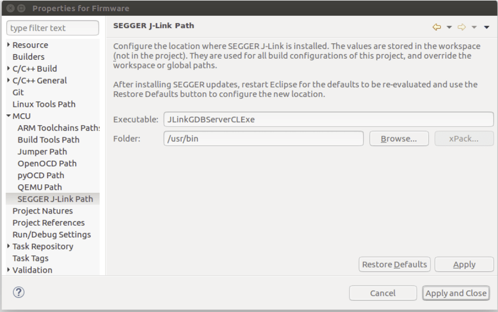
1. Update packs:

   - Click the small icon on the top right called _Open Perspective_ and open the _Packs_ perspective.
     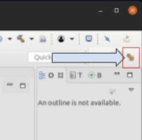
   - Click the **update all** button.

     :::tip
     This takes a VERY LONG TIME (10 minutes).
     Ignore all the errors about missing packages that pop up.
     :::

     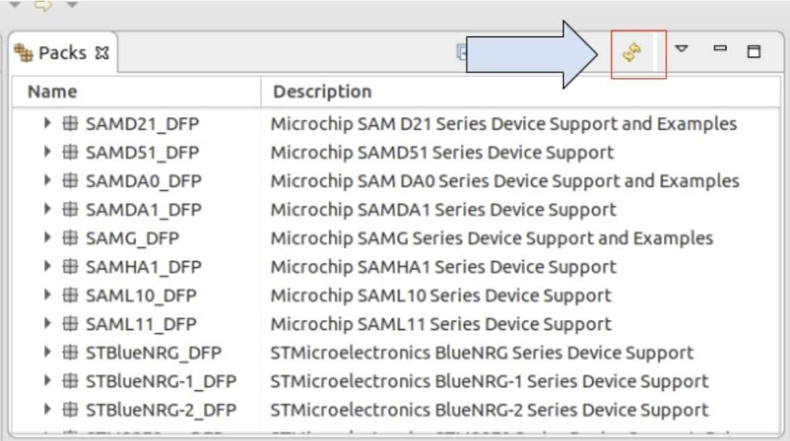

   - The STM32Fxx devices are found in the Keil folder, install by right-clicking and then selecting **install** on the according device for F4 and F7.

1. Setup debug configuration for target:

   - Right click project and open the _Settings_ (menu: **C/C++ Build > Settings**)
   - Choose the _Devices_ Tab, _Devices_ section (Not _Boards_).
   - Find the FMU chip you wish to debug.

   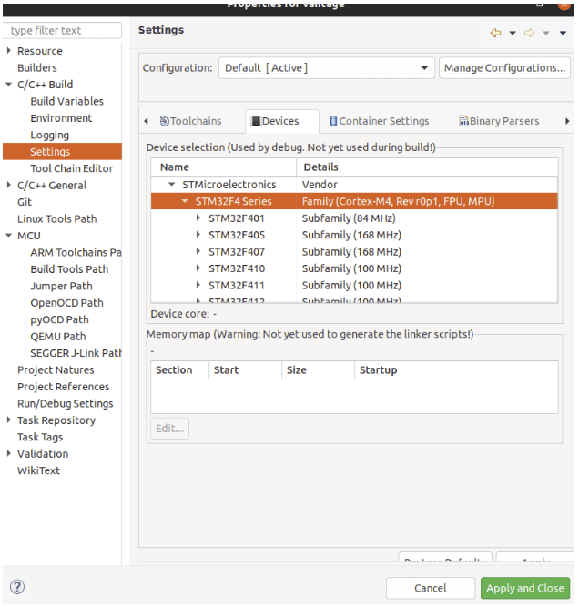

1. Select debug configurations with the small drop-down next to the bug symbol:
   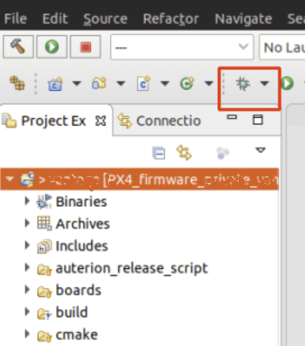
1. Then select _GDB SEGGER J-Link Debugging_ and then the **New config** button on the top left.
   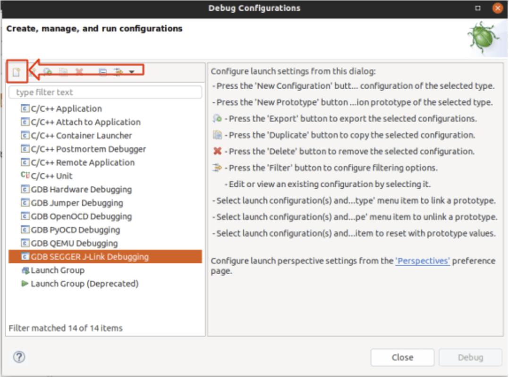
1. Setup build config:

   - Give it a name and set the _C/C++ Application_ to the corresponding **.elf** file.
   - Choose _Disable Auto build_

     ::: info
     Remember that you must build the target from the command line before starting a debug session.
     :::

   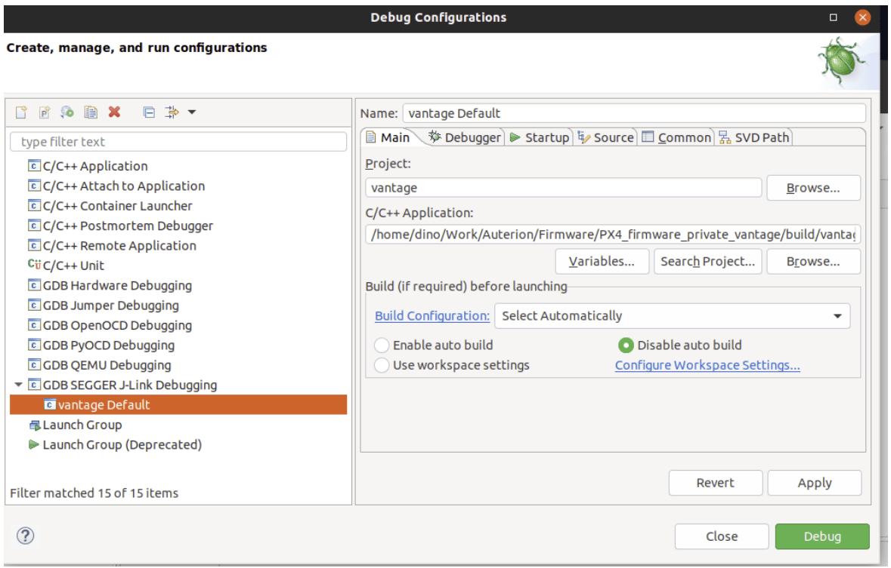

1. The _Debugger_ and _Startup_ tabs shouldn’t need any modifications (just verify your settings with the screenshots below)

   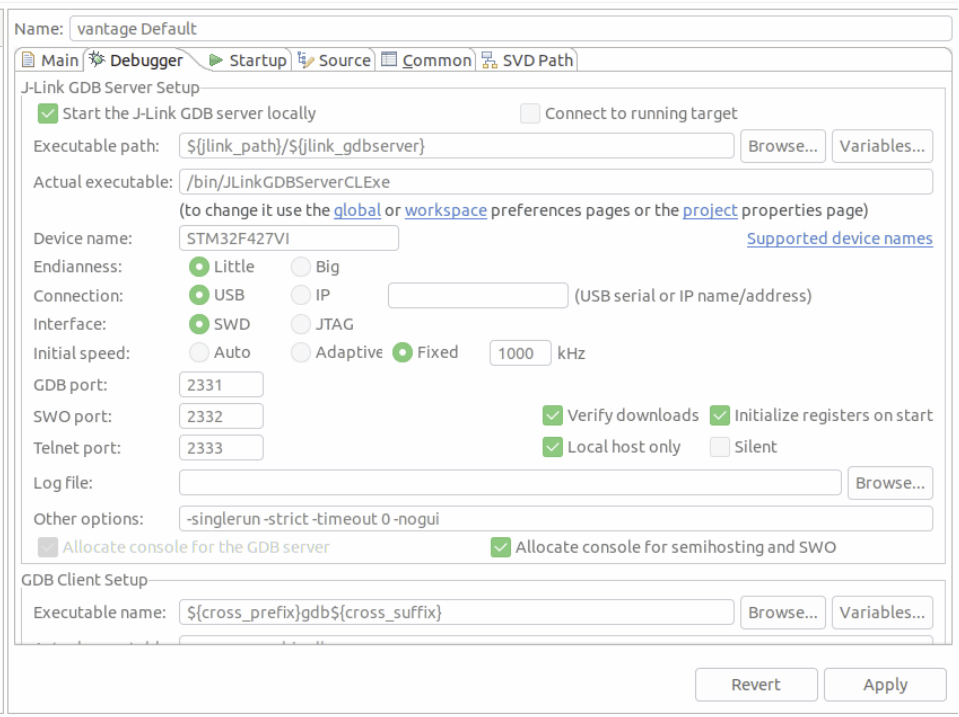
   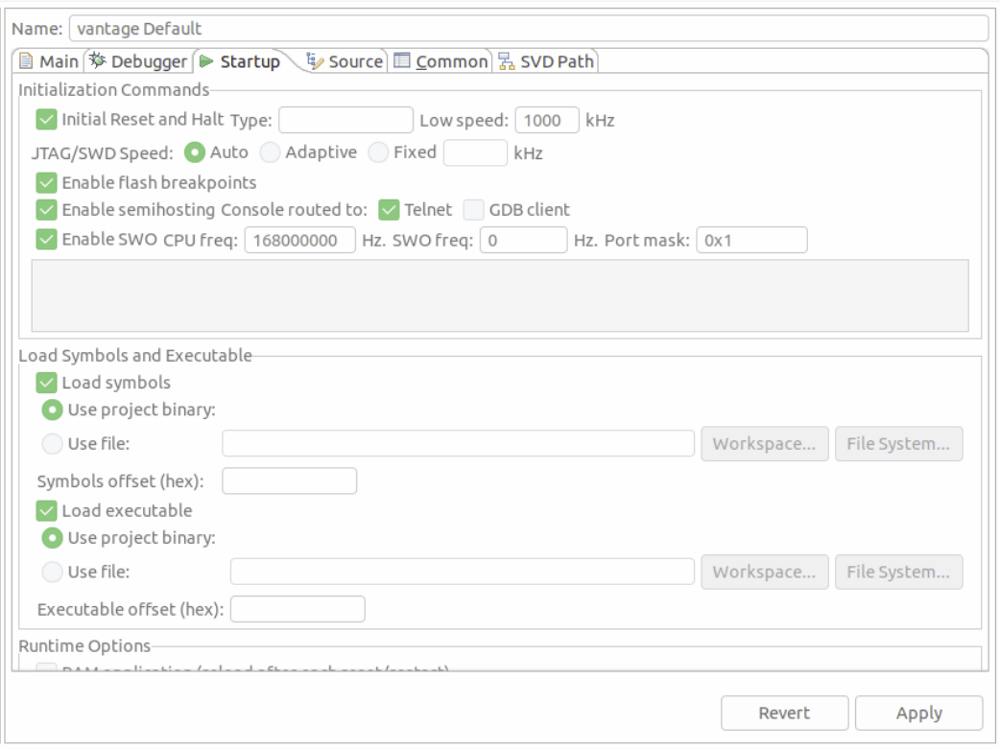

## SEGGER Task-aware debugging

Task-aware debugging (also known as [thread-aware debugging](https://www.segger.com/products/debug-probes/j-link/tools/j-link-gdb-server/thread-aware-debugging/)) allows you to show the context of all running threads/tasks instead of just the stack current task.
This is quite useful since PX4 tends to run many different tasks.

To enable this feature for use in Eclipse:

1. You first need to enable `CONFIG_DEBUG_TCBINFO` in the NuttX configuration for your build (to expose the TCB offsets).

   - Open a terminal in the root of your PX4-Autopilot source code
   - In the terminal, open `menuconfig` using the appropriate make target for the build.
     This will be something like:

     ```sh
     make px4_fmu-v5_default boardguiconfig
     ```

     (See [PX4 Menuconfig Setup](../hardware/porting_guide_config.md#px4-menuconfig-setup) for more information) on using the config tools).

   - Ensure that the _Enable TCBinfo struct for debug_ is selected as shown:
     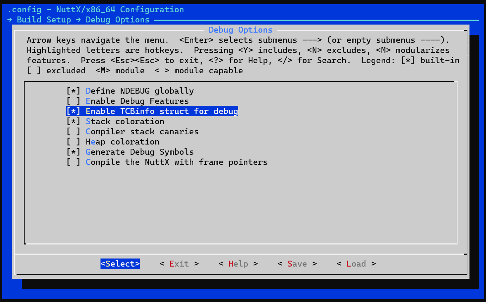

1. Compile the **jlink-nuttx.so** library in the terminal by running the following command in the terminal: `make jlink-nuttx`
1. Modify Eclipse to use this libary.
   In the _J-Link GDB Server Setup_ configuration, update **Other options** to include `-rtos /home/<PX4 path>/Tools/jlink-nuttx.so`, as shown in the image below.

   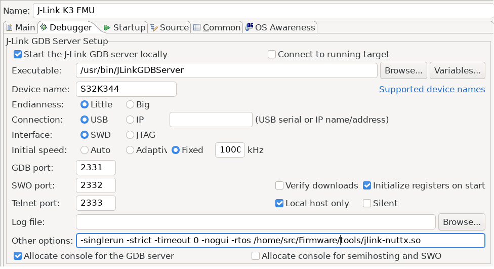

1. When running the debugger you should see now multiple threads instead of just one:

   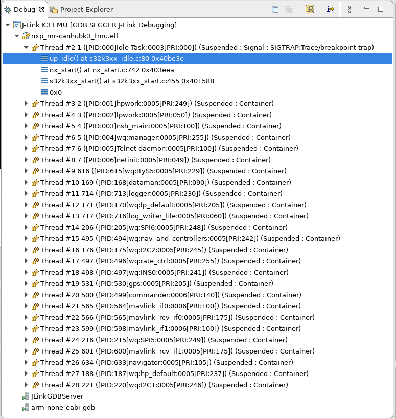

## Troubleshooting

### Target CPU not in Package Manager

If the target CPU does not appear in the package manager you may need these steps to get the register view working.

:::tip
This should not generally happen (but anecdotally has been reported when connecting to an STM F7 controller).
:::

Adding missing SVD files for the _Peripheral View_:

1. Find out where MCU Eclipse stores its packages (**Preferences > C/C++ > MCU Packages**):

   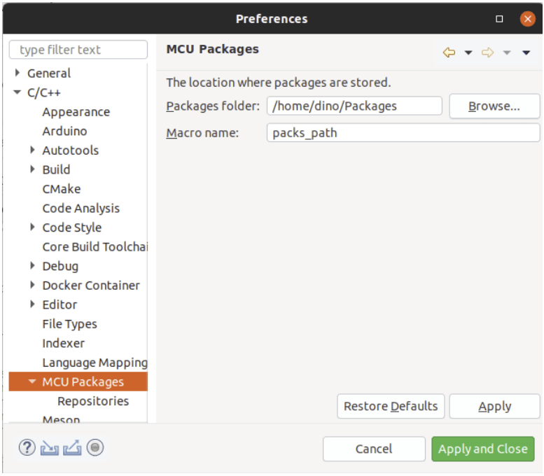

2. Download missing packages from: http://www.keil.com/dd2/Pack/
3. Open downloaded pack with a decompression tool, and extract the **.SVD** files from: **/CMSIS/SVD**.
4. Select desired **.SVD** file in: **Debug Options > GDB SEGGER JLink Debugging > SVD Path**

   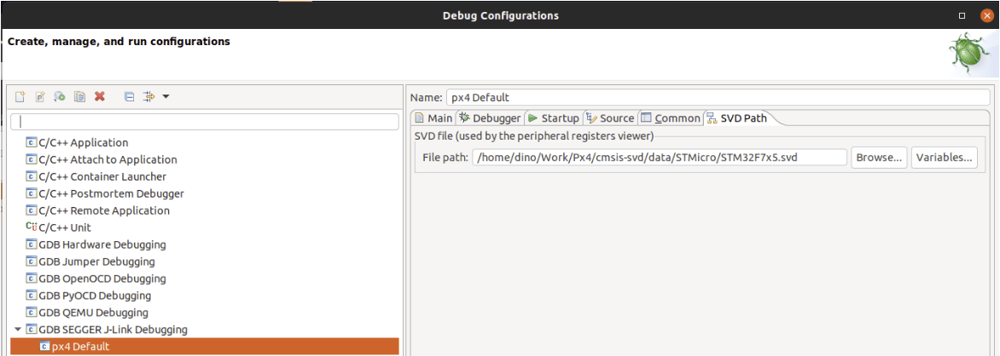
