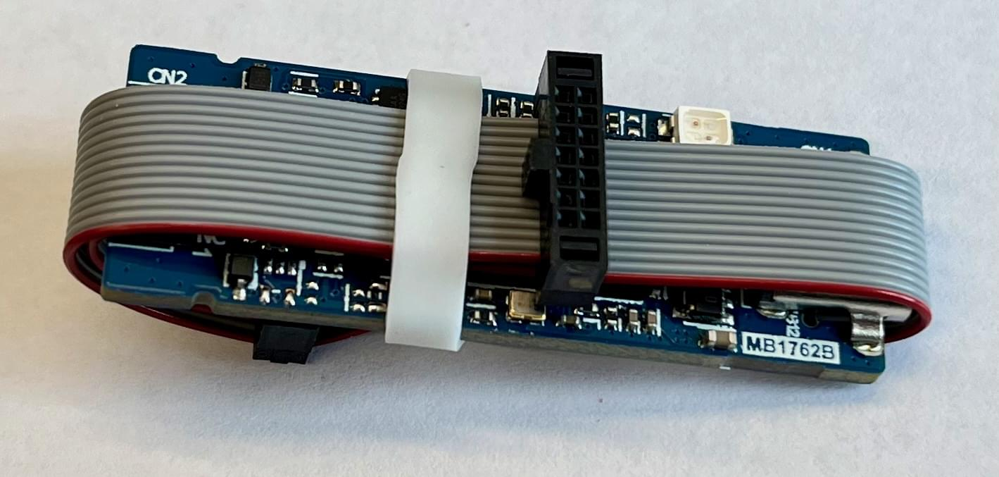
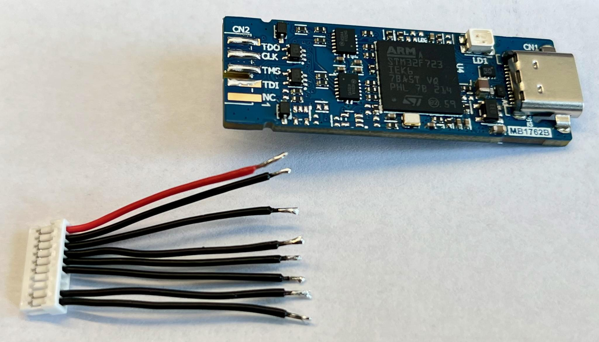
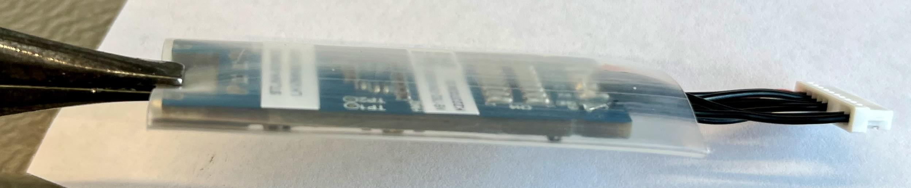
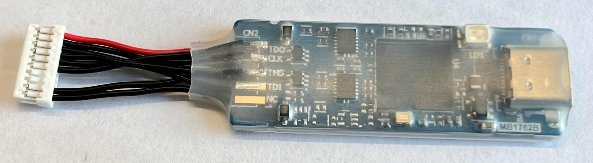
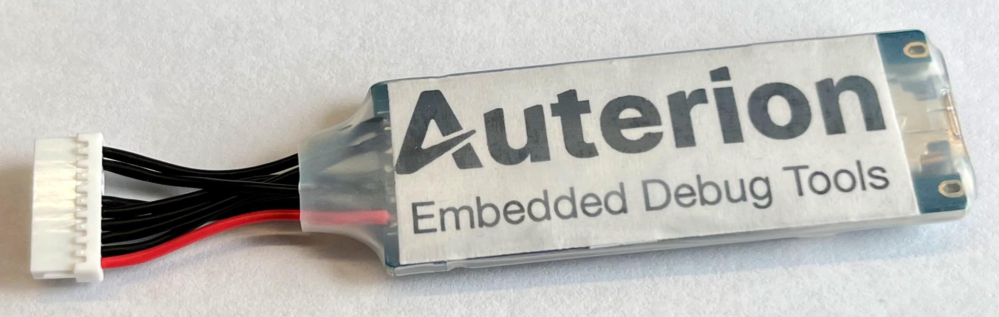

# STLink Debug Probe

The [STLinkv3-MINIE](https://www.st.com/en/development-tools/stlink-v3minie.html) is a cheap, fast and highly capable debug probe that can serve as a stand-alone debug and console communicator for a PX4 developer:

- Just one single USB-C connection for Reset, SWD, SWO, and serial in a very small package!
- Up to 24MHz SWD and SWO connection.
  Up to 16 MBaud serial. 1.65V to 3.6V target voltage.
  USB2 high-speed 480 Mbps connection.
- Driven by STLink or OpenOCD software with wide device support.
- Much cheaper (<15€) than a Pixhawk Debug Adapter (~20€) with a JLink EDU mini (~55€) or JLink BASE (~400€) while having better hardware specs.

The STLink Debug Probe does not come with an adapter for working with Pixhawk flight controllers.
The [Pixhawk Debug Port Adapter](#pixhawk-debug-port-adapter) section below explains how you can create your own (some soldering required).

::: info
The [CUAV C-ADB Pixhawk Debugging Adapter](../debug/swd_debug.md#cuav-c-adb-pixhawk-debug-adapter) (~65€) comes with an STLinkv3-MINIE!
This has a connector for the [Pixhawk Debug Full](../debug/swd_debug.md#pixhawk-debug-full) 10-pin SH port (but not the [Pixhawk Debug Mini](../debug/swd_debug.md#pixhawk-debug-mini)).
:::

## Debugging Configuration

The STLink provides the [GDB server via OpenOCD](https://openocd.org/doc-release/html/index.html):

```sh
# Ubuntu
sudo apt install openocd
# macOS
brew install open-ocd
```

You can launch the GDB server in a new terminal shell:

```sh
openocd -f interface/stlink.cfg -f target/stm32f7x.cfg
```

The config file needs to be:

- FMUv2-v4: `-f target/stm32f4x.cfg`
- FMUv5: `-f target/stm32f7x.cfg`
- FMUv6: `-f target/stm32h7x.cfg`

You can then connect to port 3333 via GDB:

```sh
arm-none-eabi-gdb build/px4_fmu-v5x_default/px4_fmu-v5x_default.elf -ex "target extended-remote :3333"
```

See the [Embedded Debug Tools][emdbg] for more advanced debug options.

## Pixhawk Debug Port Adapter

To connect to the Pixhawk Debug Port, you need to solder an adapter (unless using the [CUAV Debug Adaptor](../debug/swd_debug.md#cuav-c-adb-pixhawk-debug-adapter)).

For this solder guide you need:

- 1x [STLinkv3-MINIE](https://www.st.com/en/development-tools/stlink-v3minie.html).
- 1x cable connector for mating with [JST SM10B (Full)](https://www.digikey.com/products/en?keywords=A10SR10SR30K203A) or [JST SM06B (Mini)](https://www.digikey.com/products/en?keywords=A06SR06SR30K152A).

  We recommend buying fully assembled cables with two connectors on either side.

- 1x soldering iron and solder.
- Some tongs, cutting pliers, and tweezers.

The [Pixhawk Debug Port is standardized in DS-009](https://github.com/pixhawk/Pixhawk-Standards/blob/master/DS-009%20Pixhawk%20Connector%20Standard.pdf) and needs to be connected to the STLinkv3-MINIE Board-To-Board (BTB) card edge connector CN2.
The pinout mapping is described here:

| #Full | #Mini | Pixhawk Debug    | STLinkv3 | #BTB |
| ----: | ----: | :--------------- | :------- | ---: |
|     1 |     1 | **VREF**         | VCC      |   10 |
|     2 |     2 | Console TX (out) | TX (in)  |    8 |
|     3 |     3 | Console RX (in)  | RX (out) |    7 |
|     4 |     4 | **SWDIO**        | TMS      |    3 |
|     5 |     5 | **SWCLK**        | CLK      |    4 |
|     6 |       | SWO              | TDO      |    5 |
|     7 |       | GPIO1            |          |      |
|     8 |       | GPIO2            |          |      |
|     9 |       | nRST             | RST      |    9 |
|    10 |     6 | **GND**          | GND      |    6 |

The GPIO1/2 pins are not supported by the STLinkv3, and we recommend using digital ITM profiling over SWO which is much more flexible and supports cycle accurate timestamping.

You can choose to solder a short or long cable to the BTB connector.
The short cable is better for high-speed communication, but is more difficult to solder.
We recommend soldering the long cable first and testing how fast you can communicate with your target.

::: info
This guide is written for the full 10-pin debug port.
If you want to solder the mini 6-pin version, just leave out the signals you don't have.
The STLink supports any SWD/JTAG-based debug interface, so you can adapt this guide for any other connector you may have.
The debug probes are so cheap, you can just have one per connector instead of using adapters.
:::

This is how the STLinkv3-MINIE is delivered.



Unwrap the PCB and check it for any damage.
Plug it in and see if it powers on correctly.


### Short Cable

The short cable requires a wire cutter and stripper and requires a little more soldering skill.
However, it makes the entire debug probe even smaller.

Assemble a 10-pin connector without GPIO1/2. If you already have an assembled cable, carefully remove the two GPIO1/2 cables with a tweezer by lifting the pegs that keep the cables secured.
Cut the cables to a short ~2cm (~1in) length and strip the wires.


Tin both the BTB connector on the STLink and the cables.



First solder the GND and VCC signals to align the connector in parallel to the edge.
Then solder the TX and RX pins. Solder the RST connection last.


Turn the STLink over and solder the remaining three wires.
Start with SWDIO->TMS, then SWCLK->CLK, and finally SWO->TDO.


### Long Cable

The long cable is particularly useful if you use pre-assembled cables as it removes the need to cut wires or strip them.

Carefully remove the two GPIO1/2 cables from one connector of the cable.
Then remove all cables from the other connector.
You are left with a eight crimped connectors at the end of the wires.


Tin the crimped cable connectors and BTB connector and solder the crimped connectors directly to the STLinkv3.
Be careful to not create shorts between the cables, as the crimped connectors are quite large.


### Testing

You should now test your debug probe to ensure you do not have any electrical shorts.

1. Plug the probe into your target via the Pixhawk Debug Port.
2. Test the serial port with a program of your choice.
3. Test the SWD and RST connection via [OpenOCD][https://openocd.org] or [STLink](https://www.st.com/en/development-tools/stsw-link004.html) software.
4. Test the SWO connection via [Orbuculum][https://github.com/orbcode/orbuculum].

See the [Embedded Debug Tools][emdbg] for more information about software support for the PX4 FMUv5 and FMUv6 flight controllers.

### Make it Smaller

This step removes the 14-pin debug interface on the back of the STLinkv3-MINIE and adds shrink tubing around the entire device to improve handling and prevent shorting the STLink against metal parts or PCBs.
This step is strictly optional and requires:

- 1x 20mm shrink tubing about 5cm long.
- 1x flat tongs to hold the STLinkv3 by the USB-C port.
- 1x fine cutting pliers or soldering iron.
- 1x heat gun.

Use the pliers to gently pull off the plastic part of the STDC14 connector.
This leaves you with only the connector pins.


Using the fine pliers, cut off the connector pins being very careful not to damage the PCB or any components on the PCB.
Alternatively, you can solder these connector pin off the PCB, but it can take longer.


Rotate the STLinkv3 to cut off the other row, again being very careful to not damage it.


Cut a ~5cm (~2in) long piece of shrink tube.
It should be flush with the USB-C connector and extend a little beyond the end.


Hold both the PCB and the shrink tube with the flat tongs by the **bottom** metal part of the USB-C connector.
Be careful not to accidentally squeeze the middle plastic part of the USB-C connector!



Use the heat gun to shrink the tubing all around the debug probe.
Make sure the tubing is equally shrunk and protects the whole PCB.



Optionally, you may add a logo of your choice printed on paper and cut to size.
Be aware that the heat can make the ink flow a little, so you may need to experiment with what settings work with your printer.



[emdbg]: https://pypi.org/project/emdbg/

## See also

- [STLINK-V3MINIE debugger/programmer tiny probe for STM32 microcontrollers](https://www.st.com/resource/en/user_manual/um2910-stlinkv3minie-debuggerprogrammer-tiny-probe-for-stm32-microcontrollers-stmicroelectronics.pdf) (User Manual)
