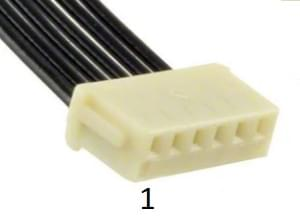
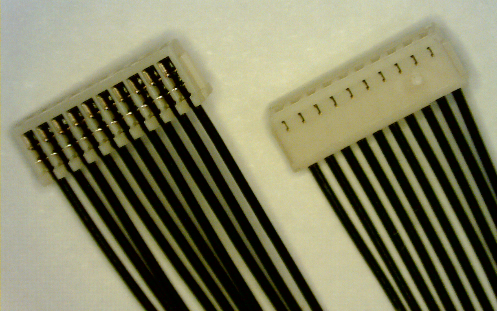
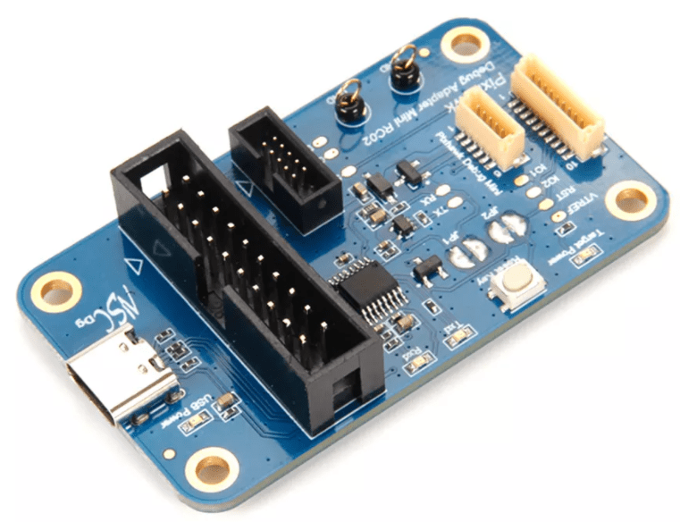
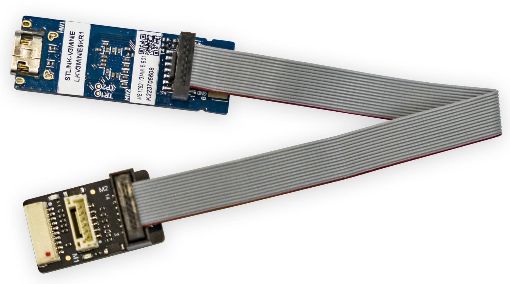
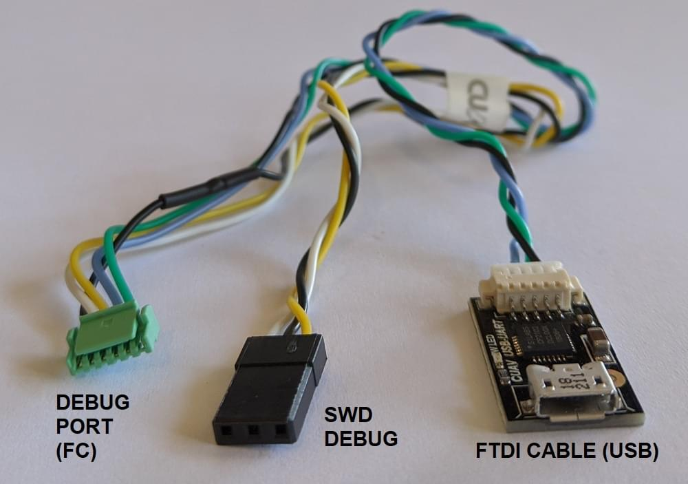

# SWD Debug Port

PX4 runs on ARM Cortex-M microcontrollers, which contain dedicated hardware for interactive debugging via the [_Serial Wire Debug (SWD)_][swd] interface and non-invasive profiling and high-bandwidth tracing via the [_Serial Wire Ouput (SWO)_][itm] and [_TRACE_ pins][etm].

The SWD debug interface allows direct, low-level, hardware access to the microcontroller's processor and peripherals, so it does not depend on any software on the device.
Therefore it can be used to debug bootloaders and operating systems such as NuttX.

## Debug Signals

Four signals are required for debugging (in bold) while the rest is recommended.

| Name        | Type   | Description                                                                               |
| :---------- | :----- | :---------------------------------------------------------------------------------------- |
| **GND**     | Power  | Shared potential, common ground.                                                          |
| **VREF**    | Power  | The target reference voltage allows the debug probe to use level shifters on the signals. |
| **SWDIO**   | I/O    | Serial Wire Debug data pin.                                                               |
| **SWCLK**   | Input  | Serial Wire Debug clock pin.                                                              |
| nRST        | Input  | The reset pin is optional (n = active low).                                               |
| SWO         | Output | Single wire trace asynchronous data out can output ITM and DWT data.                      |
| TRACECK     | Output | Trace clock for parallel bus.                                                             |
| TRACED[0-3] | Output | Trace synchronous data bus with 1, 2, or 4 bits.                                          |

The hardware reset pin is optional, as most devices can also be reset via the SWD lines. However, quickly resetting the device via a button can be great for development.

The SWO pin can emit low-overhead, real-time profiling data with nanosecond timestamping and is therefore strongly recommended to have accessible for debugging.

The TRACE pins require specialized debug probes to deal with the high bandwidth and subsequent datastream decoding.
They are usually not accessible and are typically only used to debug very specific timing issues.

## Autopilot Debug Ports

Flight controllers commonly provide a single debug port that exposes both the [SWD Interface](#debug-signals) and [System Console](system_console).

The [Pixhawk Connector Standards](#pixhawk-standard-debug-ports) formalize the port that must be used in each FMU version.
However there are still many boards that use different pinouts or connectors, so we recommend you check the [documentation for your autopilot](../flight_controller/index.md) to confirm port location and pinout.

The debug port location and pinouts for a subset of autopilots are linked below:

| Autopilot                                                                           | Debug Port                                                                                                                                                        |
| :---------------------------------------------------------------------------------- | :---------------------------------------------------------------------------------------------------------------------------------------------------------------- |
| Holybro Pixhawk 6X-RT (FMUv6X-RT)                                                   | [Pixhawk Debug Full](#pixhawk-debug-full)                                                                                                                         |
| Holybro Pixhawk 6X (FMUv6x)                                                         | [Pixhawk Debug Full](#pixhawk-debug-full)                                                                                                                         |
| Holybro Pixhawk 5X (FMUv5x)                                                         | [Pixhawk Debug Full](#pixhawk-debug-full)                                                                                                                         |
| [Holybro Durandal](../flight_controller/durandal.md#debug-port)                     | [Pixhawk Debug Mini](#pixhawk-debug-mini)                                                                                                                         |
| [Holybro Kakute F7](../flight_controller/kakutef7.md#debug-port)                    | Solder pads                                                                                                                                                       |
| [Holybro Pixhawk 4 Mini](../flight_controller/pixhawk4_mini.md#debug-port) (FMUv5)  | [Pixhawk Debug Mini](#pixhawk-debug-mini)                                                                                                                         |
| [Holybro Pixhawk 4](../flight_controller/pixhawk4.md#debug_port) (FMUv5)            | [Pixhawk Debug Mini](#pixhawk-debug-mini)                                                                                                                         |
| [Drotek Pixhawk 3 Pro](../flight_controller/pixhawk3_pro.md#debug-port) (FMU-v4pro) | [Pixhawk Debug Mini](#pixhawk-debug-mini)                                                                                                                         |
| [CUAV V5+](../flight_controller/cuav_v5_plus.md#debug-port)                         | 6-pin JST GH Digikey: [BM06B-GHS-TBT(LF)(SN)(N)][bm06b-ghs-tbt(lf)(sn)(n)] (vertical mount), [SM06B-GHS-TBT(LF)(SN)(N)][sm06b-ghs-tbt(lf)(sn)(n)] (side mount) |
| [CUAV V5nano](../flight_controller/cuav_v5_nano.md#debug_port)                      | 6-pin JST GH Digikey: [BM06B-GHS-TBT(LF)(SN)(N)][bm06b-ghs-tbt(lf)(sn)(n)] (vertical mount), [SM06B-GHS-TBT(LF)(SN)(N)][sm06b-ghs-tbt(lf)(sn)(n)] (side mount) |
| [3DR Pixhawk](../flight_controller/pixhawk.md#swd-port)                             | ARM 10-pin JTAG Connector (also used for FMUv2 boards including: _mRo Pixhawk_, _HobbyKing HKPilot32_).                                                           |

## Pixhawk Connector Standard Debug Ports

The Pixhawk project has defines a standard pinout and connector type for different Pixhawk FMU releases:

:::tip
Check your [specific board](#port-information) to confirm the port used.
:::

| FMU Version | Pixhawk Version                                                 | Debug Port                                |
| :---------- | :-------------------------------------------------------------- | :---------------------------------------- |
| FMUv2       | [Pixhawk / Pixhawk 1](../flight_controller/pixhawk.md#swd-port) | 10 pin ARM Debug                          |
| FMUv3       | Pixhawk 2                                                       | 6 pin SUR Debug                           |
| FMUv4       | Pixhawk 3                                                       | [Pixhawk Debug Mini](#pixhawk-debug-mini) |
| FMUv5       | Pixhawk 4 FMUv5                                                 | [Pixhawk Debug Mini](#pixhawk-debug-mini) |
| FMUv5X      | Pixhawk 5X                                                      | [Pixhawk Debug Full](#pixhawk-debug-full) |
| FMUv6       | Pixhawk 6                                                       | [Pixhawk Debug Full](#pixhawk-debug-full) |
| FMUv6X      | Pixhawk 6X                                                      | [Pixhawk Debug Full](#pixhawk-debug-full) |
| FMUv6X-RT   | Pixhawk 6X-RT                                                   | [Pixhawk Debug Full](#pixhawk-debug-full) |

::: info
There FMU and Pixhawk versions are (only) consistent after FMUv5X.
:::

### Pixhawk Debug Mini

The [Pixhawk Connector Standard](https://github.com/pixhawk/Pixhawk-Standards/blob/master/DS-009%20Pixhawk%20Connector%20Standard.pdf) defines the _Pixhawk Debug Mini_, a _6-Pin SH Debug Port_ that provides access to both SWD pins and the [System Console](system_console).

This is used in FMUv4 and FMUv5.

The pinout is as shown below (pins required for debugging are bold):

| Pin | Signal     |
| --: | :--------- |
|   1 | **VREF**   |
|   2 | Console TX |
|   3 | Console RX |
|   4 | **SWDIO**  |
|   5 | **SWDCLK** |
|   6 | **GND**    |

The debug port definition includes the following solder pads (on board next to connector):

| Pad | Signal | Voltage |
| --: | :----- | :------ |
|   1 | nRST   | +3.3V   |
|   2 | GPIO1  | +3.3V   |
|   3 | GPIO2  | +3.3V   |

The socket is a _6-pin JST SH_ - Digikey number: [BM06B-SRSS-TBT(LF)(SN)](https://www.digikey.com/products/en?keywords=455-2875-1-ND) (vertical mount), [SM06B-SRSS-TBT(LF)(SN)](https://www.digikey.com/products/en?keywords=455-1806-1-ND)(side mount).

You can connect to the debug port using a [cable like this one](https://www.digikey.com/products/en?keywords=A06SR06SR30K152A).

### Pixhawk Debug Full

The [Pixhawk Connector Standard](https://github.com/pixhawk/Pixhawk-Standards/blob/master/DS-009%20Pixhawk%20Connector%20Standard.pdf) defines _Pixhawk Debug Full_, a _10-Pin SH Debug Port_ that provides access to both SWD pins and the [System Console](system_console).
This essentially moves the solder pads from beside the [Pixhawk Debug Mini](#pixhawk-debug-mini) into the connector, and also adds an SWO pin.

This port is specified for use in FMUv5x, FMUv6, FMUv6x.

The pinout is as shown below (pins required for debugging are bold):

| Pin | Signal     |
| --: | :--------- |
|   1 | **VREF**   |
|   2 | Console TX |
|   3 | Console RX |
|   4 | **SWDIO**  |
|   5 | **SWDCLK** |
|   6 | SWO        |
|   7 | GPIO1      |
|   8 | GPIO2      |
|   9 | nRST       |
|  10 | **GND**    |

The GPIO1/2 pins are free pins that can be used to generate signals in software for timing analysis with a logic analyzer.

The socket is a _10-pin JST SH_ - Digikey number: [BM10B-SRSS-TB(LF)(SN)](https://www.digikey.com/products/en?keywords=455-1796-2-ND) (vertical mount) or [SM10B-SRSS-TB(LF)(SN)](https://www.digikey.com/products/en?keywords=455-1810-2-ND) (side mount).

You can connect to the debug port using a [cable like this one](https://www.digikey.com/products/en?keywords=A10SR10SR30K203A).

<!-- FIXME: better to have image showing proper connections for SWD+SWO -->

## Debug Probes for PX4 Hardware

Flight controllers commonly provide a [single debug port](#autopilot-debug-ports) that exposes both the [SWD Interface](#debug-signals) and [System Console](system_console).

There are several debug probes that are tested and supported for connecting to one or both of these interfaces:

- [SEGGER J-Link](../debug/probe_jlink.md): commercial probe, no built-in serial console, requires adapter.
- [Black Magic Probe](../debug/probe_bmp.md): integrated GDB server and serial console, requires adapter.
- [STLink](../debug/probe_stlink): best value, integrated serial console, adapter must be soldered.
- [MCU-Link](../debug/probe_mculink): best value, integrated serial console, requires adapter.

An adapter to connect to the debug port may come with your flight controller or debug probe.
Other options are given below.

## Debug Adapters

### Holybro Pixhawk Debug Adapter

The [Holybro Pixhawk Debug Adapter](https://holybro.com/products/pixhawk-debug-adapter) is _highly recommended_ when debugging controllers that use one of the Pixhawk-standard debug connectors.

It is the easiest way to connect:

- Flight controllers that use either the [Pixhawk Debug Full](#pixhawk-debug-full) (10-pin SH) or [Pixhawk Debug Mini](#pixhawk-debug-mini) (6-pin SH) debug port.
- SWD debug probes that support the 10-pin ARM compatible interface standard used by the [Segger JLink EDU mini](../debug/probe_jlink.md) or 20-pin compatible with the Segger JLink or STLink.

### CUAV C-ADB Pixhawk Debug Adapter

The [CUAV C-ADB Secondary Development Pixhawk Flight Controller Debug Adapter](https://store.cuav.net/shop/cuav-c-adb/) comes with an [STLinkv3-MINIE Debug Probe](../debug/probe_stlink.md).

This has a ports for connecting to the [Pixhawk Debug Full](#pixhawk-debug-full) (10-pin SH) and CUAV-standard DSU interface (but not the [Pixhawk Debug Mini](../debug/swd_debug.md#pixhawk-debug-mini) (6-pin SH)).

The M2 connector on the adaptor is 14-pin CN4 STDC14 (see the [STLinkv3-MINIE User Manual](https://www.st.com/resource/en/user_manual/um2910-stlinkv3minie-debuggerprogrammer-tiny-probe-for-stm32-microcontrollers-stmicroelectronics.pdf) for more information).
The cable used to connect the M2 and the STLinkv3-MINIE comes with the adaptor.

### Debug Probe Adapters

Some SWD [debug probes](#debug-probes) come with adapters/cables for connecting to common Pixhawk [debug ports](#debug-ports).
Probes that are known to come with connectors are listed below:

- [DroneCode Probe](../debug/probe_bmp.md#dronecode-probe): comes with a connector for attaching to the [Pixhawk Debug Mini](#pixhawk-debug-mini)

### Board-specific Adapters

Some manufacturers provide cables to make it easy to connect the SWD interface and [System Console](../debug/system_console).

- [CUAV V5nano](../flight_controller/cuav_v5_nano.md#debug_port) and [CUAV V5+](../flight_controller/cuav_v5_plus.md#debug-port) include this debug cable:

### Custom Cables

You can also create custom cables for connecting to different boards or probes:

- Connect `SWDIO`, `SWCLK` and `GND` pins on the debug probe to the corresponding pins on the debug port.
- Connect the VREF pin, if supported by the debug probe.
- Connect the remaining pins, if present.

See the [STLinkv3-MINIE](probe_stlink) for a guide on how to solder a custom cable.

:::tip
Where possible, we highly recommend that you create or obtain an adapter board rather than custom cables for connecting to SWD/JTAG debuggers and computers.
This reduces the risk or poor wiring contributing to debugging problems, and has the benefit that adapters usually provide a common interface for connecting to multiple popular flight controller boards.
:::

<!-- Reference links used above -->

[swd]: https://developer.arm.com/documentation/ihi0031/a/The-Serial-Wire-Debug-Port--SW-DP-
[itm]: https://developer.arm.com/documentation/ddi0403/d/Appendices/Debug-ITM-and-DWT-Packet-Protocol?lang=en
[etm]: https://developer.arm.com/documentation/ihi0064/latest/
[bm06b-ghs-tbt(lf)(sn)(n)]: https://www.digikey.com/products/en?keywords=455-1582-1-ND
[sm06b-ghs-tbt(lf)(sn)(n)]: https://www.digikey.com/products/en?keywords=455-1568-1-ND
