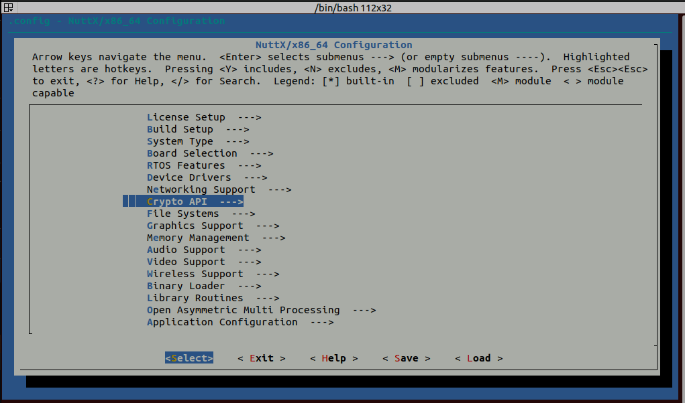
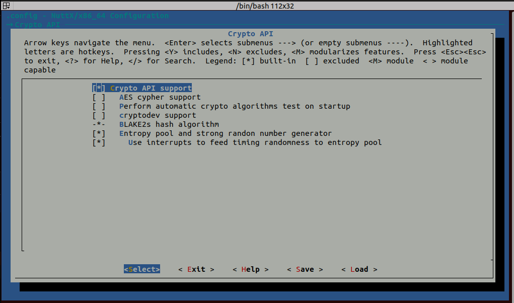

# Log Encryption

<Badge type="tip" text="PX4 v1.13" />

The [System Logger](../modules/modules_system.md#logger) can be used to create encrypted logs, which may then be decrypted manually before analysis.

The default encryption algorithm is XChaCha20, and the default wrapping algorithm is RSA2048-OAEP.

::: warning
Log encryption is not enabled by default in PX4 firmware builds.
To use it you will need to build firmware with this feature enabled and then upload it to the flight controller (see instructions below).
:::

::: tip
Log encryption was has been improved in PX4 main (v1.16+) to generate a single encrypted log file that contains both encrypted log data, and an encrypted symmetric key that you can use to decrypt it (provided you can decrypt the symmetric key).

In earlier versions the encrypted symmetric key was stored in a separate file.
For more information see the [Log Encryption (PX4 v1.15)](https://docs.px4.io/v1.15/en/dev_log/log_encryption.html).
:::

## How ULog Encryption Works

::: info
The encryption algorithm used is set in [SDLOG_ALGORITHM](../advanced_config/parameter_reference.md#SDLOG_ALGORITHM).
At time of writing, only `XChaCha20` is supported (AES can be selected, but there is no implementation).

If another algorithm is supported in future, the process is _likely_ to remain the same as documented here.
:::

The encryption process for each new ULog is:

1. A XChaCha20 symmetric key is generated and encrypted using an RSA2048 public key.
   This wrapped (encrypted) key is stored on the SD card in the beginning of a file that has the suffix `.ulge` ("ulog encrypted").
2. When a log is captured, the ULog data is encrypted with the unwrapped symmetric key and the resulting data is appended into the end of the `.ulge` file immediately after the wrapped key data.

After the flight, the `.ulge` file containing both the wrapped symmetric key and the encrypted log data can be found on the SD card.

In order to extract the log file, a user must first decrypt the wrapped symmetric key, which can then be used to decrypt the log.
Decrypting the wrapped symmetric key file is only possible if the user has the corresponding RSA private key for the public key that was used to wrap it.

This process is covered in more detail in [Download & Decrypt Log Files](#download-decrypt-log-files) below.

## File Structure

Encrypted `.ulge` file contains following sections:

```plain
-------------------------
| Header                |
-------------------------
| Wrapped symmetric key |
-------------------------
| Encrypted ulog data   |
-------------------------

```

Header section (22 bytes) contains following fields:

| Bytes  | Field                 |
| ------ | --------------------- |
| 0..6   | File magic identifier |
| 7      | Header version        |
| 8..15  | Timestamp             |
| 16     | exchange algorithm    |
| 17     | exchange key index    |
| 18..19 | key size              |
| 20..21 | nonce size            |

The header part begins with magic string: `"ULogEnc"`, which identifies this is encrypted ulog file.
The file offset of the symmetric key section is `22` and the file offset of the log data section is `22 + key_size + nonce_size` (`key_size` and `nonce_size` are taken from the header section).

## Custom PX4 Firmware with Log Encryption

You will need to build custom firmware that contains your own public RSA key and the required Crypto API modules to support log encryption.
This section shows how to do this using the `px4-fmu-v5` board as an example.

::: tip
We show you how to generate your own keys in the [Generate RSA Public & Private Keys](#generate-rsa-public-private-keys) section below.
:::

::: info
The modules in a PX4 build are defined in configuration files, which may be modified either manually or using the `menuconfig` tool.
For more information see: [PX4 Board Configuration (Kconfig)](../hardware/porting_guide_config.md).
:::

### Cryptotest Make Target

Crypto uses large amounts of flash memory, and is therefore not included in the default PX4 make targets for each board (such as `make px4-fmu-v5`).
The easiest way to add support for encrypted logs is to define a custom `make` target that includes the required modules and your public RSA keys.

::: warning
Many builds are close to their maximum capacity.
If you run into a build error telling you that you have gone above the maximum flash memory, you will need to disable other features in the `.px4board` file you are working on, or in the `default.px4board` file.
Be careful not to disable something you need.

For example, if you found you were running out of memory on FMUv4 boards you could disable SIH mode by setting `CONFIG_MODULES_SIMULATION_SIMULATOR_SIH=n` in [boards/px4/fmu-v4/default.px4board](https://github.com/PX4/PX4-Autopilot/blob/main/boards/px4/fmu-v4/default.px4board#L76), which may free up enough flash memory to allow crypto to be added.
:::

#### Pixhawk FMUv5 boards

The FMUv5 board already has a custom make target `px4-fmu-v5_cryptotest` that you can use to build custom firmware with the required modules and "test" RSA keys.
The configuration file that enables the above make target is [`cryptotest.px4board`](https://github.com/PX4/PX4-Autopilot/blob/main/boards/px4/fmu-v5/cryptotest.px4board) file in `boards/px4/fmu-v5`.
The relevant keys in that file are reproduced below:

```plain
CONFIG_BOARD_CRYPTO=y
CONFIG_DRIVERS_STUB_KEYSTORE=y
CONFIG_DRIVERS_SW_CRYPTO=y
CONFIG_PUBLIC_KEY1="../../../Tools/test_keys/rsa2048.pub"
```

::: info
The file also sets `CONFIG_PUBLIC_KEY0` to a key named `key0.pub`.
This is not used in the current PX4 implementation and can be ignored.
:::

::: details Overview of crypto-relevant keys

| Argument                     | Description                                                                                           |
| ---------------------------- | ----------------------------------------------------------------------------------------------------- |
| CONFIG_BOARD_CRYPTO          | Include crypto module in firmware.<br>= `y`: Enable log encryption.<br>= `n`: Disable log encryption. |
| CONFIG_DRIVERS_SW_CRYPTO     | Include the PX4 crypto backend library (used by above library).<br>= `y`: Enable<br>= `n`: Disable    |
| CONFIG_DRIVERS_STUB_KEYSTORE | Includes the PX4 stub keystore driver.<br>= `y`: Enable<br>= `n`: Disable                             |
| CONFIG_PUBLIC_KEY0           | Location of public key for keystore index 0.                                                          |
| CONFIG_PUBLIC_KEY1           | Location of public key for keystore index 1.<br>= `{path to key1}`                                    |
| CONFIG_PUBLIC_KEY2           | Location of public key for keystore index 2.<br>= `{path to key2}`                                    |
| CONFIG_PUBLIC_KEY3           | Location of public key for keystore index 3.<br>= `{path to key3}`                                    |

The stub keystore is a keystore implementation that can store up to four keys.
The initial values of these keys are set in the locations defined by `CONFIG_PUBLIC_KEY0` to `CONFIG_PUBLIC_KEY3`.
The keys can be used for different cryptographic purposes, which are determined by parameters.

The _exchange key_, which is the public key used for encrypting the symmetric key stored in the beginning of the `.ulge` file, is specified using [SDLOG_EXCH_KEY](../advanced_config/parameter_reference.md#SDLOG_EXCH_KEY) as an index value into the key store.
The value is `1` by default, which maps to the key defined in `CONFIG_PUBLIC_KEY1`.

The _logging key_ is the unencrypted symmetric key.
This is specified using [SDLOG_KEY](../advanced_config/parameter_reference.md#SDLOG_KEY) as an index value into the key store, and default to `2`.
Note that the value is generated fresh for each log, and any value specified in `CONFIG_PUBLIC_KEY2` would be overwritten.

You can use choose different locations for your keys as long as they aren't used by anything else.
:::

The key in `CONFIG_PUBLIC_KEY1` is the public key used to wrap the symmetric key in the the beginning of `.ulge` file (by default: see [SDLOG_EXCH_KEY](../advanced_config/parameter_reference.md#SDLOG_EXCH_KEY)).
You can use the `rsa2048.pub` key for testing, or replace it with the path to your own public key in the file (see [Generate RSA Public & Private Keys](#generate-rsa-public-private-keys)).

Build the firmware like this:

```sh
make px4-fmu-v5_cryptotest
```

#### Other Boards

For other boards you will need to first copy `cryptotest.px4board` into the root of the target board directory.
For example, for FMUv6 you would copy the board to [/boards/px4/fmu-v6x](https://github.com/PX4/PX4-Autopilot/tree/main/boards/px4/fmu-v6x).

Then you will need to add a few more configuration settings that are present in FMUv5 default configuration but not in the other boards.
We do add these using the `menuconfig` tool.

To use `menuconfig` you will need to add these dependencies:

```sh
sudo apt-get install libncurses-dev flex bison openssl libssl-dev dkms libelf-dev libudev-dev libpci-dev libiberty-dev autoconf
```

Now, in PX4, run the normal `make` command you would use to build the board you are targeting, but add "menuconfig" at the end of it.
Here we use `px4_fmu-v5_cryptotest` as an example, because that already has the settings that we want to copy:

```sh
make px4_fmu-v5_cryptotest menuconfig
```

Navigate to `Crypto API` and use the **Y** key to select it.



This will open the menu below.
Enable the settings: `Blake2s hash algorithm`, `Entropy pool and strong random number generator`, and `Use interrupts to feed timing randomness to entropy pool`.



::: tip
Some of these options can be tweaked if desired.
:::

After enabling encryption settings, exit `menuconfig`.
You can now build and test.

## Download & Decrypt Log Files

Before you can analyse your logs they must first be downloaded and decrypted.
PX4 includes Python scripts in [Tools/log_encryption](https://github.com/PX4/PX4-Autopilot/blob/main/Tools/) that make this process easier:

- [download_logs.py](https://github.com/PX4/PX4-Autopilot/blob/main/Tools/log_encryption/download_logs.py): Downloads the logs to `/logs/encrypted`.
- [decrypt_logs.py](https://github.com/PX4/PX4-Autopilot/blob/main/Tools/log_encryption/decrypt_logs.py): Decrypts encrypted logs in `/logs/encrypted` to `/logs/decrypted` using a specified (or default) key.

The following sections show how these are used.

### Download Log Files

The easiest way to download the files is to use [download_logs.py](https://github.com/PX4/PX4-Autopilot/blob/main/Tools/log_encryption/download_logs.py).
This takes a single argument that sets the serial or UDP MAVLink connection to the device as shown below (adjust parameters as needed):

- UDP connection

  ```sh
  cd PX4-Autopilot/Tools/log_encryption
  python3 download_logs.py udp:0.0.0.0:14550
  ```

- USB serial port on Linux

  ```sh
  cd PX4-Autopilot/Tools/log_encryption
  python3 download_logs.py serial:/dev/ttyACM0:57600
  ```

The files are downloaded to `/logs/encrypted`, which is the location expected by the decryption script.

::: info
Encrypted log files can also be downloaded manually using the QGroundControl [Log Download](https://docs.qgroundcontrol.com/master/en/qgc-user-guide/analyze_view/log_download.html) view (**Analyze Tools > Log Download**) just like ordinary log files.

Note that in this case you will need to copy the files to `/logs/encrypted` and rename them to the `.ulge` suffix (they are downloaded with the `.ulg` suffix)
:::

### Decrypt ULogs

The [decrypt_logs.py](https://github.com/PX4/PX4-Autopilot/blob/main/Tools/log_encryption/decrypt_logs.py) script can be used to decrypt encrypted logs in `/logs/encrypted`, creating the unencrypted logs in `/logs/decrypted`.

The script needs access to the private key corresponds to the public key used to encrypt the logs on the device.
By default it uses the private key in `keys/private/private_key.pem`, but you can also pass the full path of a key as a command line argument.

The expected folder structure showing the location of encrypted logs, decrypted logs and the default private key is shown below:

```sh
PX4-Autopilot/
│
├── logs/ # Main directory for logs
│ ├── encrypted/ # Stores encrypted logs (.ulge)
│ │ ├── log-YYYY-MM-DD_HH-MM-SS_ID.ulge # Encrypted logs
│ │
│ ├── decrypted/
│ │ ├── log-YYYY-MM-DD_HH-MM-SS_ID.ulg # Regular PX4 logs
|
├── keys/ # Main directory for keys
  ├── private/ # Stores private keys
    ├── private_key.pem # RSA private key (2048-bit)
```

Run the tool as shown below (assuming the default key location):

```sh
cd PX4-Autopilot/Tools/log_encryption
python3 decrypt_logs.py
```

On success the decrypted logs can be found in the decrypted folder.

## Generate RSA Public & Private Keys

To generate your keys you can use the following script:

```sh
PX4-Autopilot/
│
├── Tools/log_encryption # PX4 Tools directory (script location)
│ ├── generate_keys.py # This script generates the key structure
```

```sh
cd PX4-Autopilot/Tools/log_encryption
python3 generate_keys.py
```

As a result a private key and a public key will be generated in a new folder structure.

```sh
PX4-Autopilot/
│
├── keys/ # Main directory for keys
│ ├── private/ # Stores private keys
│ │ ├── private_key.pem # RSA private key (2048-bit)
│ │
│ ├── public/ # Stores public keys
│ │ ├── public_key.der # Public key in DER format
│ │ ├── public_key.pub # Public key in hex format
```

The script does not overwrite the existing keys and also would work with already existing private key.

Otherwise you could generate the keys with the way below, in that case please copy the key files to the corresponding repositories respectively, to be able to use the provided scripts in the sections above.

To generate a RSA2048 private and public key, you can use OpenSSL:

```sh
openssl genpkey -algorithm RSA -out private_key.pem -pkeyopt rsa_keygen_bits:2048
```

Then you can create a public key from this private key:

```sh
# Convert private_key.pem to a DER file
openssl rsa -pubout -in private_key.pem -outform DER -out public_key.der
# From the DER file, generate a public key in hex format, separated by commas
xxd -p public_key.der | tr -d '\n' | sed 's/\(..\)/0x\1, /g' > public_key.pub
```

To use this key you would modify your `.px4board` file to point `CONFIG_PUBLIC_KEY1` to the file location of `public_key.pub`.

```sh
CONFIG_PUBLIC_KEY1="../../../keys/public/public_key.pub"
```

The private key generated should be stored safely and used when you need to decrypt log files.
