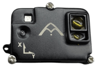

# Agam Flo Range Sensor

## Introduction

Agam Flo Range Sensor is a high-performance DroneCAN optical flow and laser rangefinder designed for PX4 and ArduPilot compatible autonomous vehicles. The sensor integrates a Broadcom Time-of-Flight (ToF) laser rangefinder, a PixArt optical flow sensor, and an industrial-grade TDK InvenSense ICM-42688-P IMU to provide accurate altitude estimation, terrain following, precision landing, and GPS-denied navigation.

Designed around the DroneCAN protocol, Agam Flo Range Sensor provides plug-and-play integration with Pixhawk-compatible flight controllers while delivering reliable operation in demanding indoor and outdoor environments.

The sensor is fully supported by PX4 and is suitable for multirotors, fixed-wing aircraft, VTOLs, rovers, boats, underwater vehicles, and other autonomous robotic platforms.

The standard package includes:

- Agam Flo Range Sensor
- DroneCAN Cable
- Mounting Hardware
- Quick Start Guide

For enterprise, OEM, and bulk orders, contact Agam Robotics directly through their sales channel.

## Hardware Specifications

### Processor

- STM32F412RET6
- ARM Cortex-M4
- Up to 100 MHz

### Sensors

- Broadcom AFBR-S50LV85D Time-of-Flight Laser Rangefinder
- PixArt Optical Flow Sensor
- TDK InvenSense ICM-42688-P 6-axis IMU

### Interfaces

- DroneCAN
- CAN
- SPI
- SWD Debug Interface
- Status LEDs

### Distance Performance

- Long-range laser distance measurement
- High update rate
- High ambient light immunity
- Indoor and outdoor operation

### Dimensions

Sensor Module

- Compact UAV form factor

Weight

- Lightweight design suitable for small and medium UAV platforms

## Support (Compatible Devices)

Agam Flo Range Sensor supports PX4 v1.15 and later as well as DroneCAN-compatible autopilots.

Supported platforms include:

- Agam Autopilot 6X-RT
- Pixhawk FMUv5
- Pixhawk FMUv6X
- Pixhawk FMUv6X-RT
- PX4 Flight Controllers
- ArduPilot Flight Controllers

Supported applications include:

- Terrain Following
- Precision Landing
- Optical Flow Navigation
- Position Hold
- GPS-denied Navigation
- Autonomous Landing
- Low-altitude Flight
- Indoor Navigation

## Electrical Specification

| Parameter             | Specification              |
| --------------------- | -------------------------- |
| MCU                   | STM32F412RET6              |
| Distance Sensor       | Broadcom AFBR-S50LV85D     |
| Optical Flow Sensor   | PixArt Optical Flow Sensor |
| IMU                   | ICM-42688-P                |
| Communication         | DroneCAN                   |
| Operating Voltage     | 5 V                        |
| Programming Interface | SWD                        |

Additional hardware protection includes:

- Reverse polarity protection
- Over-voltage protection
- EMI filtering
- ESD protection
- Brown-out protection
- Hardware watchdog support

## Hardware Setup

A typical hardware setup consists of:

1. Mount the sensor securely on the underside of the airframe with an unobstructed downward field of view.
2. Connect the DroneCAN cable to the flight controller.
3. Supply power through the DroneCAN connector.
4. Verify the status LED indicates normal operation.
5. Configure the sensor in PX4 or ArduPilot.
6. Verify optical flow and rangefinder data.
7. Perform sensor calibration if required.
8. Conduct a low-altitude hover test before normal operation.

Refer to the wiring guide for connector-specific wiring diagrams.

## PX4 Configuration

Agam Flo Range Sensor supports **PX4 firmware version 1.15 or later**.

Typical setup workflow:

1. Install QGroundControl.
2. Connect the DroneCAN network.
3. Enable DroneCAN peripherals.
4. Verify that the sensor is detected.
5. Configure the rangefinder.
6. Configure the optical flow sensor.
7. Verify IMU data.
8. Perform sensor calibration if required.
9. Perform preflight safety checks.

The sensor follows the standard DroneCAN peripheral architecture and integrates with the PX4 DroneCAN framework.

## Connectors

The sensor provides the following interfaces:

- DroneCAN
- SWD Debug Interface

Connector pinouts and wiring diagrams are available in the dedicated hardware documentation.

## Features

- STM32F412 ARM Cortex-M4 MCU
- Broadcom AFBR-S50LV85D Time-of-Flight Laser Rangefinder
- PixArt Optical Flow Sensor
- TDK InvenSense ICM-42688-P IMU
- DroneCAN communication
- PX4 supported
- ArduPilot compatible
- Industrial-grade EMI and ESD protection
- Low-latency sensor processing
- High ambient light immunity
- Compact and lightweight design
- Designed and manufactured by Agam Robotics

## Applications

Agam Flo Range Sensor is designed for professional autonomous systems including:

- Precision Agriculture
- Surveying
- Mapping
- Infrastructure Inspection
- Warehouse Automation
- Indoor Navigation
- GPS-denied Flight
- Autonomous Landing
- Terrain Following
- Drone Delivery
- Search and Rescue
- Ground Robots (UGVs)
- Surface Vehicles (USVs)
- Research Platforms

## Where to Buy

https://www.agamrobotics.com/product-page/agam-florange-sensor

## See Also

https://agamrobotics.gitbook.io/docs/sensors/agam-florange-sensor
