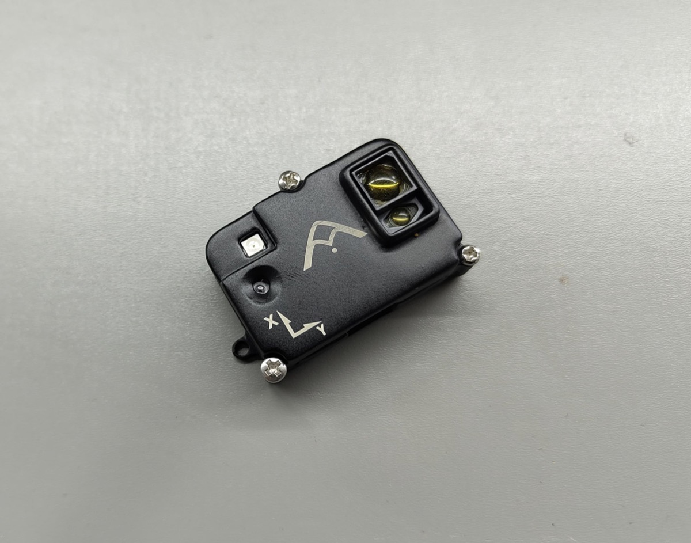

# Agam FloRange

::: warning
PX4 does not manufacture this (or any) autopilot component.
Contact the [manufacturer](https://www.agamrobotics.com/) for hardware support or compliance issues.
:::

Agam FloRange is [Agam Robotics'](https://www.agamrobotics.com/) [DroneCAN](index.md) [optical flow](../sensor/optical_flow.md), [distance sensor](../sensor/rangefinders.md), and IMU module. Its primary use is to provide local positioning in the absence of global positioning devices such as GNSS modules, as well as to improve stability.

## Where to Buy

Order this module from:

- [Agam Robotics](https://www.agamrobotics.com/product-page/agam-florange-sensor)

## Hardware Specifications

- Sensors
  - PixArt PAA3905E1 Optical Flow Sensor
    - Wide working distance from 80mm to infinity, no calibration required
    - Supports synchronized multi-chip operation and automatic mode switching
  - Broadcom AFBR-S50LV85D Time-of-Flight Distance Sensor
    - Integrated 850 nm laser light source, Laser Class 1 eye safe
    - Field-of-View (FoV) of 12.4° x 6.2° with 32 pixels, 1.55° x 1.55° each
    - 2° x 2° transmitter beam
    - Typical distance range up to 30m, unambiguous range up to 100m in dual frequency mode
    - Measurement rates of up to 3 kHz
    - Operation of up to 200k Lux ambient light
    - Single 5V supply, typically 33mA
  - InvenSense ICM-42688-P 6-Axis IMU
  - IR LED for low-light operation
- Pixhawk Standard CAN Connector (4 Pin JST GH)
- Pixhawk Standard Debug Connector (6 Pin JST SH)
- Small Form Factor: 44.95mm x 29.4mm x 15.59mm
- Weight: 9.38g (including enclosure)
- Designed and manufactured in India

## Hardware Setup

### Wiring

Connect Agam FloRange to the autopilot's CAN bus.
For more information, refer to the [CAN Wiring](../can/index.md#wiring) instructions.

| Pin | Signal    | Wire  |
| --- | --------- | ----- |
| 1   | VCC (+5V) | Red   |
| 2   | CAN_P     | Black |
| 3   | CAN_N     | Black |
| 4   | GND       | Black |

Twist the four CAN wires together to reduce electromagnetic interference and crosstalk.

## Firmware Setup

Agam FloRange runs the [PX4 DroneCAN Firmware](px4_cannode_fw.md).
It supports firmware updates over the CAN bus and [dynamic node allocation](index.md#node-id-allocation). Firmware can also be flashed over SWD using the [Pixhawk Debug Mini](../debug/swd_debug.md#pixhawk-debug-mini) connector, which additionally provides the [System Console](../debug/system_console.md).

- Firmware target: `agam_florange_default`
- Bootloader target: `agam_florange_canbootloader`

## Flight Controller Setup

### Enable DroneCAN

The steps are:

- In _QGroundControl_ set the parameter [UAVCAN_ENABLE](../advanced_config/parameter_reference.md#UAVCAN_ENABLE) to `2` for dynamic node allocation (or `3` if also using [DroneCAN ESCs](../dronecan/escs.md)) and reboot (see [Finding/Updating Parameters](../advanced_config/parameters.md)).
- Connect Agam FloRange's CAN to the autopilot's CAN bus.

Once enabled, the module will be detected on boot.

DroneCAN configuration in PX4 is explained in more detail in [DroneCAN > Enabling DroneCAN](index.md#enabling-dronecan).

### PX4 Configuration

Set the following parameters in _QGroundControl_, depending on which functions of the module you use:

- Enable optical flow fusion by setting [EKF2_OF_CTRL](../advanced_config/parameter_reference.md#EKF2_OF_CTRL).
- To optionally disable GPS aiding, set [EKF2_GPS_CTRL](../advanced_config/parameter_reference.md#EKF2_GPS_CTRL) to `0`.
- Enable [UAVCAN_SUB_FLOW](../advanced_config/parameter_reference.md#UAVCAN_SUB_FLOW).
- Enable [UAVCAN_SUB_RNG](../advanced_config/parameter_reference.md#UAVCAN_SUB_RNG).
- Set [UAVCAN_RNG_MIN](../advanced_config/parameter_reference.md#UAVCAN_RNG_MIN) to `0.08` and [UAVCAN_RNG_MAX](../advanced_config/parameter_reference.md#UAVCAN_RNG_MAX) to `30`, the sensor's valid range.
- If using the distance sensor for height aiding, enable [EKF2_RNG_CTRL](../advanced_config/parameter_reference.md#EKF2_RNG_CTRL) and set [EKF2_RNG_A_HMAX](../advanced_config/parameter_reference.md#EKF2_RNG_A_HMAX) to `10` and [EKF2_RNG_QLTY_T](../advanced_config/parameter_reference.md#EKF2_RNG_QLTY_T) to `0.2`.
- Set [SENS_FLOW_MINHGT](../advanced_config/parameter_reference.md#SENS_FLOW_MINHGT) to `0.08` and [SENS_FLOW_MAXHGT](../advanced_config/parameter_reference.md#SENS_FLOW_MAXHGT) to `30`, the minimum and maximum height of the flow sensor.
- Set [SENS_FLOW_MAXR](../advanced_config/parameter_reference.md#SENS_FLOW_MAXR) to `7.4` to match the PAA3905 maximum angular flow rate.
- The parameters [EKF2_OF_POS_X](../advanced_config/parameter_reference.md#EKF2_OF_POS_X), [EKF2_OF_POS_Y](../advanced_config/parameter_reference.md#EKF2_OF_POS_Y), [EKF2_OF_POS_Z](../advanced_config/parameter_reference.md#EKF2_OF_POS_Z) and [EKF2_RNG_POS_X](../advanced_config/parameter_reference.md#EKF2_RNG_POS_X), [EKF2_RNG_POS_Y](../advanced_config/parameter_reference.md#EKF2_RNG_POS_Y), [EKF2_RNG_POS_Z](../advanced_config/parameter_reference.md#EKF2_RNG_POS_Z) can be set to account for the offset of the module from the vehicle centre of gravity.

When optical flow is the only source of horizontal position/velocity, lowering the gain for controller response to horizontal position error [MPC_XY_P](../advanced_config/parameter_reference.md#MPC_XY_P) (e.g. to 0.5) is recommended to reduce oscillations.

## Agam FloRange Configuration

On the module, you may need to configure the following parameters:

| Parameter                                                                                                 | Description                                                                                                                           |
| ---------------------------------------------------------------------------------------------------------- | --------------------------------------------------------------------------------------------------------------------------------------- |
| [CANNODE_NODE_ID](../advanced_config/parameter_reference.md#CANNODE_NODE_ID)   | CAN node ID (0 for dynamic allocation). If set to 0 (default), dynamic node allocation is used. Set to 1-125 to use a static node ID. |
| [CANNODE_TERM](../advanced_config/parameter_reference.md#CANNODE_TERM)            | CAN built-in bus termination.                                                                                                          |

## LED Meanings

- Solid blue is normal operation
- Rapid blinking blue and red is firmware update

If you see a solid red LED there is an error and you should check the following:

- Make sure the flight controller has an SD card installed.
- Make sure the Agam FloRange has `agam_florange_canbootloader` installed prior to flashing `agam_florange_default`.
- Remove binaries from the root and ufw directories of the SD card and try to build and flash again.

## See Also

- [DroneCAN > Node ID Allocation](index.md#node-id-allocation)
- [PX4 DroneCAN Firmware](px4_cannode_fw.md)
