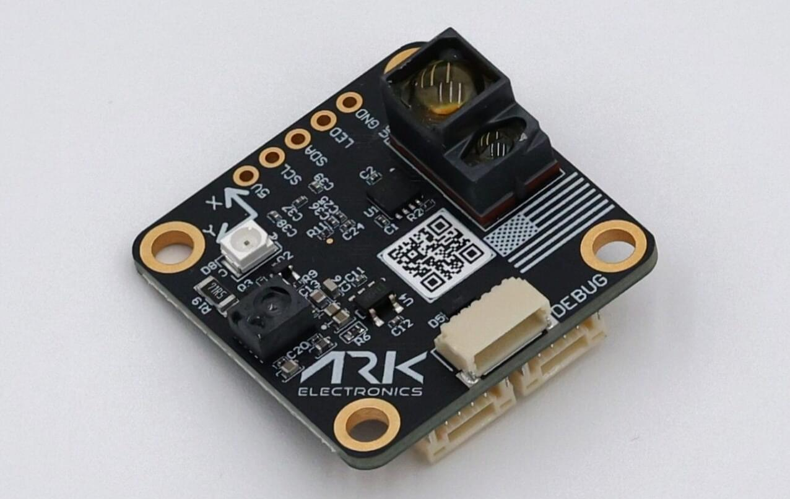
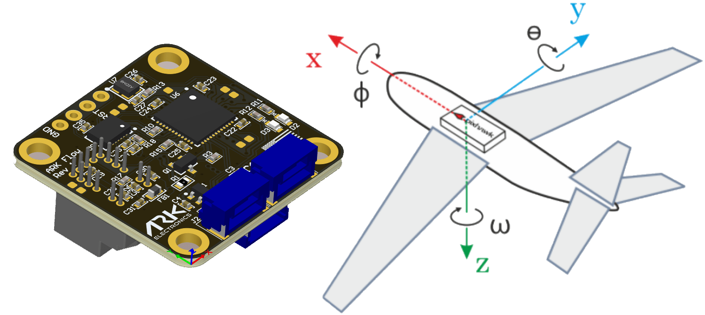

# ARK Flow MR

ARK Flow MR ("Mid Range") is an open source [DroneCAN](index.md) [optical flow](../sensor/optical_flow.md), [distance sensor](../sensor/rangefinders.md), and IMU module. 
It is the next generation of the [Ark Flow](ark_flow.md), designed for mid-range applications.

## Where to Buy

Order this module from:

- [ARK Electronics](https://arkelectron.com/product/ark-flow-mr/) (US)

## Hardware Specifications

- [Open Source Schematic and BOM](https://github.com/ARK-Electronics/ARK_Flow_MR)
- Sensors
  - PixArt PAA3905 Optical Flow Sensor
    - Auto detection of challenging conditions, such as checker boards, stripes, glossy surface and yawing
    - Wide working range from 80mm up to infinity
    - Automatic switching of Operation Mode
    - 40mW IR LED built onto board for improved low light operation
  - Broadcom AFBR-S50LX85D Time-of-Flight Distance Sensor
    - Laser Opening Angle of 2° x 2°
    - Typical distance range up to 50m
    - Operation in up to 200 kilolux ambient light
    - Works well on all surface conditions
- Invensense IIM-42653 6-Axis IMU
- Two Pixhawk Standard CAN Connectors (4 Pin JST GH)
- Pixhawk Standard Debug Connector (6 Pin JST SH)
- Software controlled built-in CAN termination resistor via node parameter (CANNODE_TERM)  
- Small Form Factor
  - 3cm x 3cm x 1.4cm
- LED Indicators
- USA Built

## Hardware Setup

### Wiring

The ARK Flow MR is connected to the CAN bus using a Pixhawk standard 4 pin JST GH cable.
For more information, refer to the [CAN Wiring](../can/index.md#wiring) instructions.

### Mounting

The recommended mounting orientation is with the connectors on the board pointing towards **back of vehicle**, as shown in the following picture.

This corresponds to the default value (`0`) of the parameter [SENS_FLOW_ROT](../advanced_config/parameter_reference.md#SENS_FLOW_ROT).
Change the parameter appropriately if using a different orientation.

The sensor can be mounted anywhere on the frame, but you will need to specify the focal point position, relative to vehicle centre of gravity, during [PX4 configuration](#px4-configuration).

## Firmware Setup

ARK Flow MR runs the [PX4 DroneCAN Firmware](px4_cannode_fw.md).
As such, it supports firmware update over the CAN bus and [dynamic node allocation](index.md#node-id-allocation).

ARK Flow MR boards ship with recent firmware pre-installed, but if you want to build and flash the latest firmware yourself see [PX4 DroneCAN Firmware > Building the Firmware](px4_cannode_fw.md#building-the-firmware).

- Firmware target: `ark_can-flow-mr_default`
- Bootloader target: `ark_can-flow-mr_canbootloader`

## Flight Controller Setup

::: info
The Ark Flow MR will not boot if there is no SD card in the flight controller when powered on.
:::

### Enable DroneCAN

The steps are:

- In _QGroundControl_ set the parameter [UAVCAN_ENABLE](../advanced_config/parameter_reference.md#UAVCAN_ENABLE) to `2` for dynamic node allocation (or `3` if using [DroneCAN ESCs](../dronecan/escs.md)) and reboot (see [Finding/Updating Parameters](../advanced_config/parameters.md)).
- Connect ARK Flow MR CAN to the Pixhawk CAN.

Once enabled, the module will be detected on boot.
Flow data should arrive at 100Hz.
Distance sensor data should arrive at 40Hz.

DroneCAN configuration in PX4 is explained in more detail in [DroneCAN > Enabling DroneCAN](../dronecan/index.md#enabling-dronecan).

### PX4 Configuration

You need to set the EKF optical flow parameters to enable fusing optical flow measurements for velocity calculation, set necessary [DroneCAN](index.md) parameters, and define offsets if the sensor is not centred within the vehicle.

Set the following parameters in _QGroundControl_:

- Enable optical flow fusion by setting [EKF2_OF_CTRL](../advanced_config/parameter_reference.md#EKF2_OF_CTRL).
- To optionally disable GPS aiding, set [EKF2_GPS_CTRL](../advanced_config/parameter_reference.md#EKF2_GPS_CTRL) to `0`.
- Enable [UAVCAN_SUB_FLOW](../advanced_config/parameter_reference.md#UAVCAN_SUB_FLOW).
- Enable [UAVCAN_SUB_RNG](../advanced_config/parameter_reference.md#UAVCAN_SUB_RNG).
- Set [EKF2_RNG_A_HMAX](../advanced_config/parameter_reference.md#EKF2_RNG_A_HMAX) to `10`.
- Set [EKF2_RNG_QLTY_T](../advanced_config/parameter_reference.md#EKF2_RNG_QLTY_T) to `0.2`.
- Set [UAVCAN_RNG_MIN](../advanced_config/parameter_reference.md#UAVCAN_RNG_MIN) to `0.08`.
- Set [UAVCAN_RNG_MAX](../advanced_config/parameter_reference.md#UAVCAN_RNG_MAX) to `50`.
- Set [SENS_FLOW_MINHGT](../advanced_config/parameter_reference.md#SENS_FLOW_MINHGT) to `0.08`.
- Set [SENS_FLOW_MAXHGT](../advanced_config/parameter_reference.md#SENS_FLOW_MAXHGT) to `25`.
- Set [SENS_FLOW_MAXR](../advanced_config/parameter_reference.md#SENS_FLOW_MAXR) to `7.4` to match the PAW3902 maximum angular flow rate.
- The parameters [EKF2_OF_POS_X](../advanced_config/parameter_reference.md#EKF2_OF_POS_X), [EKF2_OF_POS_Y](../advanced_config/parameter_reference.md#EKF2_OF_POS_Y) and [EKF2_OF_POS_Z](../advanced_config/parameter_reference.md#EKF2_OF_POS_Z) can be set to account for the offset of the Ark Flow MR from the vehicle centre of gravity.

## Ark Flow MR Configuration

You may need to [configure the following parameters](../dronecan/index.md#qgc-cannode-parameter-configuration) on the ARK Flow MR itself:

| Parameter                                                                                       | Description                   |
| ----------------------------------------------------------------------------------------------- | ----------------------------- |
| [CANNODE_TERM](../advanced_config/parameter_reference.md#CANNODE_TERM) | CAN built-in bus termination. |

## LED Meanings

You will see both red and blue LEDs on the ARK Flow MR when it is being flashed, and a solid blue LED if it is running properly.

If you see a solid red LED there is an error and you should check the following:

- Make sure the flight controller has an SD card installed.
- Make sure the Ark Flow MR has `ark_can-flow-mr_canbootloader` installed prior to flashing `ark_can-flow-mr_default`.
- Remove binaries from the root and ufw directories of the SD card and try to build and flash again.

## Video

<lite-youtube videoid="SAbRe1fi7bU" params="list=PLUepQApgwSozmwhOo-dXnN33i2nBEl1c0" title="ARK Flow Indoor Position Hold x64"/>

<!-- ARK Flow MR with PX4 Optical Flow Position Hold: 20210605 -->

_PX4 holding position using the ARK Flow MR sensor for velocity estimation (in [Position Mode](../flight_modes_mc/position.md))._

## See Also

- [ARK Flow MR](https://arkelectron.gitbook.io/ark-documentation/sensors/ark-flow-mr) (ARK Docs)
