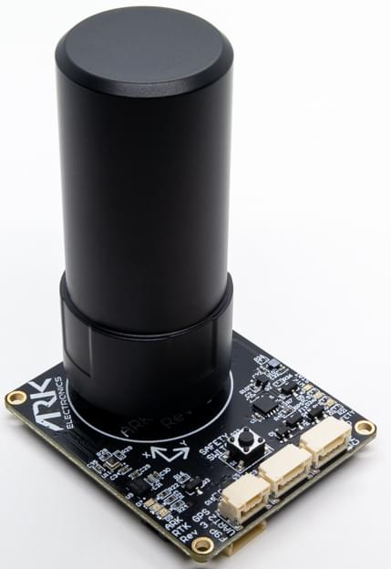
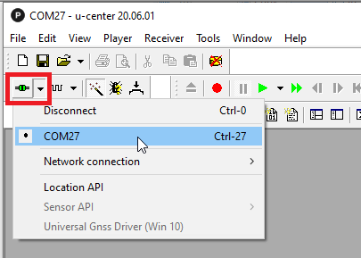
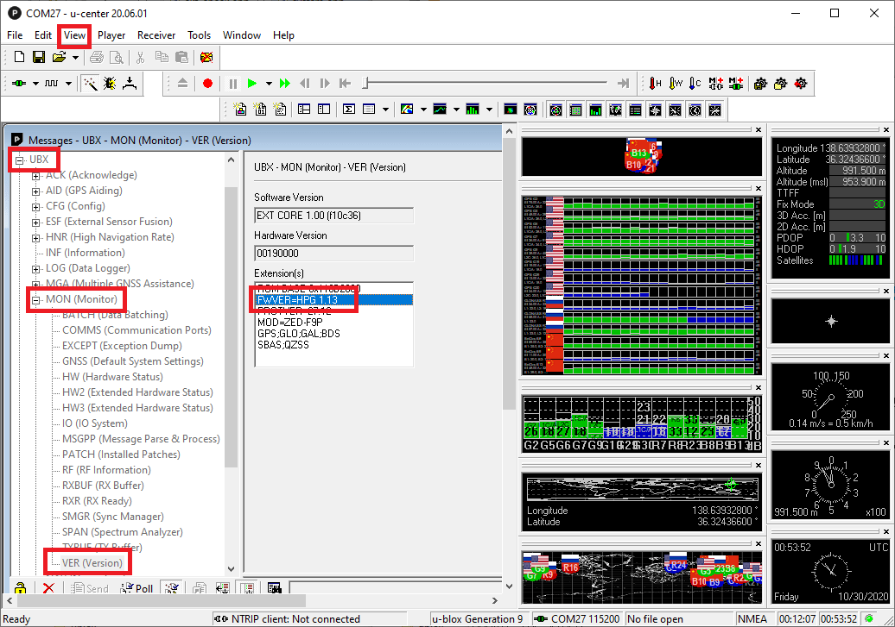
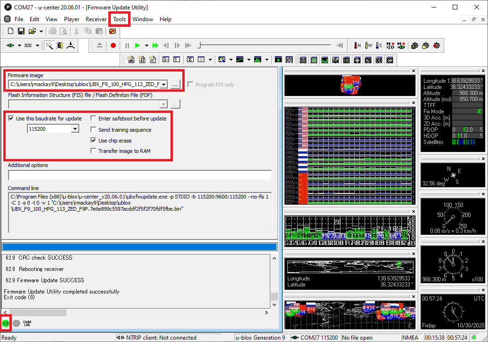

# ARK RTK GPS

[ARK RTK GPS](https://arkelectron.gitbook.io/ark-documentation/sensors/ark-rtk-gps) is an open source [DroneCAN](index.md) [RTK GPS](../gps_compass/rtk_gps.md), [u-blox F9P](https://www.u-blox.com/en/product/zed-f9p-module), magnetometer, barometer, IMU, buzzer, and safety switch module.

## Where to Buy

Order this module from:

- [ARK Electronics](https://arkelectron.com/product/ark-rtk-gps/) (US)

## Hardware Specifications

- [Open Source Schematic and BOM](https://github.com/ARK-Electronics/ARK_RTK_GPS)
- Sensors
  - Ublox F9P GPS
    - Multi-band GNSS receiver delivers centimetre level accuracy in seconds
    - Concurrent reception of GPS, GLONASS, Galileo and BeiDou
    - Multi-band RTK with fast convergence times and reliable performance
    - High update rate for highly dynamic applications
    - Centimetre accuracy in a small and energy efficient module
  - Bosch BMM150 Magnetometer
  - Bosch BMP388 Barometer
  - Invensense ICM-42688-P 6-Axis IMU
- STM32F412CEU6 MCU
- Safety Button
- Buzzer
- Two Pixhawk Standard CAN Connectors (4 Pin JST GH)
- F9P “UART 2” Connector
  - 3 Pin JST GH
  - TX, RX, GND
- Pixhawk Standard Debug Connector (6 Pin JST SH)
- LED Indicators
  - Safety LED
  - GPS Fix
  - RTK Status
  - RGB system status
- USA Built
- Power Requirements
  - 5V
  - 170mA Average
  - 180mA Max

## Hardware Setup

### Wiring

The ARK RTK GPS is connected to the CAN bus using a Pixhawk standard 4 pin JST GH cable. For more information, refer to the [CAN Wiring](../can/index.md#wiring) instructions.

### Mounting

The recommended mounting orientation is with the connectors on the board pointing towards the **back of vehicle**.

The sensor can be mounted anywhere on the frame, but you will need to specify its position, relative to vehicle centre of gravity, during [PX4 configuration](#px4-configuration).

## Firmware Setup

ARK RTK GPS runs the [PX4 cannode firmware](px4_cannode_fw.md). As such, it supports firmware update over the CAN bus and [dynamic node allocation](index.md#node-id-allocation).

ARK RTK GPS boards ship with recent firmware pre-installed, but if you want to build and flash the latest firmware yourself, refer to the [cannode firmware build instructions](px4_cannode_fw.md#building-the-firmware).

Firmware target: `ark_can-rtk-gps_default`
Bootloader target: `ark_can-rtk-gps_canbootloader`

## Flight Controller Setup

### Enabling DroneCAN

In order to use the ARK RTK GPS, connect it to the Pixhawk CAN bus and enable the DroneCAN driver by setting parameter [UAVCAN_ENABLE](../advanced_config/parameter_reference.md#UAVCAN_ENABLE) to `2` for dynamic node allocation (or `3` if using [DroneCAN ESCs](../dronecan/escs.md)).

The steps are:

- In _QGroundControl_ set the parameter [UAVCAN_ENABLE](../advanced_config/parameter_reference.md#UAVCAN_ENABLE) to `2` or `3` and reboot (see [Finding/Updating Parameters](../advanced_config/parameters.md)).
- Connect ARK RTK GPS CAN to the Pixhawk CAN.

Once enabled, the module will be detected on boot.
GPS data should arrive at 10Hz.

### PX4 Configuration

You need to set necessary [DroneCAN](index.md) parameters and define offsets if the sensor is not centred within the vehicle:

- Enable GPS yaw fusion by setting bit 3 of [EKF2_GPS_CTRL](../advanced_config/parameter_reference.md#EKF2_GPS_CTRL) to true.
- Enable GPS blending to ensure the heading is always published by setting [SENS_GPS_MASK](../advanced_config/parameter_reference.md#SENS_GPS_MASK) to 7 (all three bits checked).
- Enable [UAVCAN_SUB_GPS](../advanced_config/parameter_reference.md#UAVCAN_SUB_GPS), [UAVCAN_SUB_MAG](../advanced_config/parameter_reference.md#UAVCAN_SUB_MAG), and [UAVCAN_SUB_BARO](../advanced_config/parameter_reference.md#UAVCAN_SUB_BARO).
- The parameters [EKF2_GPS_POS_X](../advanced_config/parameter_reference.md#EKF2_GPS_POS_X), [EKF2_GPS_POS_Y](../advanced_config/parameter_reference.md#EKF2_GPS_POS_Y) and [EKF2_GPS_POS_Z](../advanced_config/parameter_reference.md#EKF2_GPS_POS_Z) can be set to account for the offset of the ARK RTK GPS from the vehicles centre of gravity.
- Set [CANNODE_TERM](../advanced_config/parameter_reference.md#CANNODE_TERM) to `1` on the GPS if this it that last node on the CAN bus.

### Setting Up Moving Baseline & GPS Heading

The simplest way to set up moving baseline and GPS heading with two ARK RTK GPS modules is via CAN, though it can be done via UART to reduce traffic on the CAN bus if desired.

Note that a heading is only output if the Rover is in RTX Fixed mode. It will not output a heading in RTK Float.

Setup via CAN:

- Ensure the ARK RTK GPS modules are connected to the Pixhawk via CAN (one can connect to another's secondary CAN port). The two ARK RTK GPS must be connected to the same CAN bus for corrections to be sent.
- Choose one ARK RTK GPS to be the _Rover_ and one to be the _Moving Base_.
- Reopen QGroundControl, go to parameters, and select `Standard` to hide that dropdown and select `Component ##` to view each of your ARK RTK GPS's CAN node parameters
  ::: info
  `Component ##` won't be visible unless the ARK RTK GPS is connected to the Pixhawk prior to opening QGroundControl.
  :::
- On the _Rover_, set the following:
  - [GPS_UBX_MODE](../advanced_config/parameter_reference.md#GPS_UBX_MODE) to `3`
  - [GPS_YAW_OFFSET](../advanced_config/parameter_reference.md#GPS_YAW_OFFSET) to `0` if your _Rover_ is in front of your _Moving Base_, `90` if _Rover_ is right of _Moving Base_, `180` if _Rover_ is behind _Moving Base_, or `270` if _Rover_ is left of _Moving Base_.
  - [CANNODE_SUB_MBD](../advanced_config/parameter_reference.md#CANNODE_SUB_MBD) to `1`.
- On the _Moving Base_, set the following:
  - [GPS_UBX_MODE](../advanced_config/parameter_reference.md#GPS_UBX_MODE) to `4`.
  - [CANNODE_PUB_MBD](../advanced_config/parameter_reference.md#CANNODE_PUB_MBD) to `1`.

Setup via UART:

- Ensure the ARK RTK GPS modules are connected to the Pixhawk via CAN.
- Ensure the ARK RTK GPS modules are connected to each other via their UART2 port (UART2 pinout shown below).
  Note that TX of one module needs to connect with RX of the other.

| Pin | Name |
| --- | ---- |
| 1   | TX   |
| 2   | RX   |
| 3   | GND  |

- On the _Rover_, set the following:
  - [GPS_UBX_MODE](../advanced_config/parameter_reference.md#GPS_UBX_MODE) to `1`
  - [GPS_YAW_OFFSET](../advanced_config/parameter_reference.md#GPS_YAW_OFFSET) to `0` if your _Rover_ is in front of your _Moving Base_, `90` if _Rover_ is right of _Moving Base_, `180` if _Rover_ is behind _Moving Base_, or `270` if _Rover_ is left of _Moving Base_.
- On the _Moving Base_, set the following:
  - [GPS_UBX_MODE](../advanced_config/parameter_reference.md#GPS_UBX_MODE) to `2`.

## LED Meanings

- The GPS status lights are located to the right of the connectors

  - Blinking green is GPS fix
  - Blinking blue is received corrections and RTK Float
  - Solid blue is RTK Fixed

- The CAN status lights are located top the left of the connectors
  - Slow blinking green is waiting for CAN connection
  - Fast blinking green is normal operation
  - Slow blinking green and blue is CAN enumeration
  - Slow blinking green, blue, and red is firmware update in progress
  - Blinking red is error
    - If you see a red LED there is an error and you should check the following
      - Make sure the flight controller has an SD card installed
      - Make sure the ARK RTK GPS has `ark_can-rtk-gps_canbootloader` installed prior to flashing `ark_can-rtk-gps_default`
      - Remove binaries from the root and ufw directories of the SD card and try to build and flash again

### Updating Ublox F9P Module

ARK RTK GPS comes with the Ublox F9P module up to date with version 1.13 or newer. However, you can check the version and update the firmware if desired.

The steps are:

- [Download u-center from u-blox.com](https://www.u-blox.com/en/product/u-center) and install on your PC (Windows only)
- Open the [u-blox ZED-F9P website](https://www.u-blox.com/en/product/zed-f9p-module#tab-documentation-resources)
- Scroll down and click on the "Show Legacy Documents" box
- Scroll down again to Firmware Update and download your desired firmware (at least version 1.13 is needed)
- While holding down the safety switch on the ARK RTK GPS, connect it to power via one of its CAN ports and hold until all 3 LEDs blink rapidly
- Connect the ARK RTK GPS to your PC via its debug port with a cable such as the Black Magic Probe or an FTDI
- Open u-center, select the COM port for the ARK RTK GPS and connect
  
- Check the current firmware version by selecting View, Messages View, UBX, MON, VER
  
- To update the firmware:
  - Select Tools, Firmware Update
  - The Firmware image field should be the .bin file downloaded from the u-blox ZED-F9P website
  - Check the "Use this baudrate for update" checkbox and select 115200 from the drop-down
  - Ensure the other checkboxes are as shown below
  - Push the green GO button on the bottom left
  - "Firmware Update SUCCESS" should be displayed if it updated successfully
    

## See Also

- [ARK RTK GPS Documentation](https://arkelectron.gitbook.io/ark-documentation/sensors/ark-rtk-gps) (ARK Docs)
