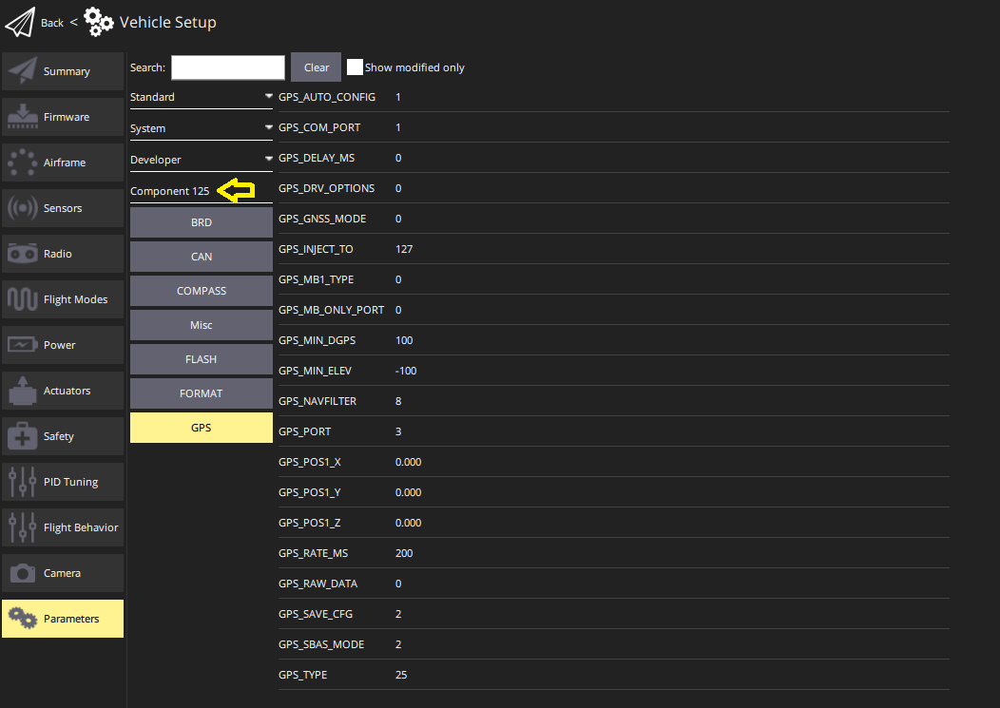

# DroneCAN

[DroneCAN](https://dronecan.github.io/) is a open software communication protocol for flight controllers and other [CAN](../can/index.md) devices on a vehicle to communicate with each other.

:::warning

- DroneCAN is not enabled by default, and nor are specific sensors and features that use it.
  For setup information see [PX4 Configuration](#px4-configuration).
- PX4 requires an SD card to enable dynamic node allocation and for firmware update.
  The SD card is not used in flight.

:::

::: info
DroneCAN was previously known as UAVCAN v0 (or just UAVCAN).
The name was changed in 2022.
:::

## Benefits of DroneCAN

Connecting peripherals over DroneCAN has many benefits:

- Many different sensors and actuators are already supported.
- CAN has been specifically designed to deliver robust and reliable connectivity over relatively large distances.
  It enables safe use of ESCs on bigger vehicles and communication redundancy.
- The bus is bi-directional, enabling health monitoring, diagnostics, and RPM telemetry.
- Wiring is less complicated as you can have a single bus for connecting all your ESCs and other DroneCAN peripherals.
- Setup is easier as you configure ESC numbering by manually spinning each motor.
- It allows users to configure and update the firmware of all CAN-connected devices centrally through PX4.

## Supported Hardware

Most common types of peripherals (sensors, ESCs, and servos) that are DroneCAN/UAVCAN v0 compliant are supported.

Supported hardware includes (this is not an exhaustive list):

- [ESC/Motor controllers](../dronecan/escs.md)
- Airspeed sensors
  - [Holybro High Precision DroneCAN Airspeed Sensor - DLVR](https://holybro.com/collections/sensors/products/high-precision-dronecan-airspeed-sensor-dlvr)
  - [RaccoonLab airspeed sensor](https://docs.raccoonlab.co/guide/airspeed)
  - [Thiemar airspeed sensor](https://github.com/thiemar/airspeed)
- GNSS receivers for GNSS (GPS, GLONASS, BeiDou, and so on)
  - [ARK GPS](../dronecan/ark_gps.md)
  - [ARK RTK GPS](../dronecan/ark_rtk_gps.md)
  - [CubePilot Here3](https://www.cubepilot.org/#/here/here3)
  - [CUAV NEO v2 Pro GNSS](https://doc.cuav.net/gps/neo-series-gnss/en/neo-v2-pro.html)
  - [CUAV NEO 3 Pro GPS](../gps_compass/gps_cuav_neo_3pro.md)
  - [CUAV NEO 3X GPS](../gps_compass/gps_cuav_neo_3x.md)
  - [CUAV C-RTK2 PPK/RTK GNSS](../gps_compass/rtk_gps_cuav_c-rtk2.md)
  - [Holybro H-RTK ZED-F9P (DroneCAN variant)](../dronecan/holybro_h_rtk_zed_f9p_gps.md)
  - [Holybro DroneCAN M8N GPS](../dronecan/holybro_m8n_gps.md)
  - [Holybro DroneCAN M9N GPS](https://holybro.com/products/dronecan-m9n-gps)
  - [Holybro DroneCAN H-RTK F9P Rover](https://holybro.com/products/dronecan-h-rtk-f9p-rover)
  - [Holybro DroneCAN H-RTK F9P Helical](https://holybro.com/products/dronecan-h-rtk-f9p-helical)
  - [RaccoonLab GNSS Modules](https://docs.raccoonlab.co/guide/gps_mag_baro/)
  - [Zubax GNSS](https://zubax.com/products/gnss_2)
- Power monitors
  - [Pomegranate Systems Power Module](../dronecan/pomegranate_systems_pm.md)
  - [CUAV CAN PMU Power Module](../dronecan/cuav_can_pmu.md)
  - [RaccoonLab CAN Power Connectors and Management Units](../dronecan/raccoonlab_power.md)
- Compass
  - [Holybro RM3100 Professional Grade Compass](https://holybro.com/products/dronecan-rm3100-compass)
  - [RaccoonLab RM3100 Magnetometer](https://docs.raccoonlab.co/guide/gps_mag_baro/mag_rm3100.html)
- Distance sensors
  - [ARK Flow](ark_flow.md)
  - [Ark Flow MR](ark_flow_mr.md)
  - [Avionics Anonymous Laser Altimeter UAVCAN Interface](../dronecan/avanon_laser_interface.md)
  - [RaccoonLab uRangefidner and Rangefinders Adapter](https://docs.raccoonlab.co/guide/rangefinder)
- Optical Flow
  - [Ark Flow](ark_flow.md)
  - [Ark Flow MR](ark_flow_mr.md)

- Generic CAN Node (enables use of I2C, SPI, UART sensors on the CAN bus).
  - [ARK CANnode](../dronecan/ark_cannode.md)
  - [RaccoonLab Nodes](../dronecan/raccoonlab_nodes.md)

## Hardware Setup

DroneCAN operates over a CAN network.
DroneCAN hardware should be connected as described in [CAN > Wiring](../can/index.md#wiring).

## Node ID Allocation

Every DroneCAN device must be configured with a _node id_ that is unique on the vehicle.

Most devices support _Dynamic Node Allocation (DNA)_, which allows PX4 to automatically configure the node ID of each detected peripheral on system startup.
Consult the manufacturer documentation for details on whether your device supports DNA and how to enable it.
Many devices will automatically switch to DNA if the node id is set to 0.
PX4 will enable the built in allocation server if the [UAVCAN_ENABLE](../advanced_config/parameter_reference.md#UAVCAN_ENABLE) parameter is > 1 (set to 2 or 3).

Some devices don't support DNA.
Additionally, in certain mission-critical scenarios, you might prefer to manually configure node IDs beforehand instead of relying on the dynamic allocation server.
If you wish to disable the DNA completely, set `UAVCAN_ENABLE` to `1` and manually set each node ID to a unique value.
If the DNA is still running and certain devices need to be manually configured, give these devices a value greater than the total number of DroneCAN devices to avoid clashes.

::: info
The PX4 node ID can be configured using the [UAVCAN_NODE_ID](../advanced_config/parameter_reference.md#UAVCAN_NODE_ID) parameter.
The parameter is set to 1 by default.
:::

:::warning
At time of writing, PX4 does not run the node allocation server on the CAN2 port.
This means that if you have a device that is _only_ connected to CAN2 (not redundantly to CAN1 and CAN2), you will need to manually configure its node ID.
:::

## PX4 Configuration

DroneCAN is configured on PX4 by [setting specific PX4 parameters](../advanced_config/parameters.md) in QGroundControl.
You will need to enable DroneCAN itself, along with subscriptions and publications for any features that you use.

::: info
In some cases you may need to also configure parameters on the connected CAN devices (these can also be [set using QGC](#qgc-cannode-parameter-configuration)).
:::

### Enabling DroneCAN

To enable the PX4 DroneCAN driver, set the [UAVCAN_ENABLE](../advanced_config/parameter_reference.md#UAVCAN_ENABLE) parameter:

- `0`: DroneCAN driver disabled
- `1`: DroneCAN driver enabled for sensors, [DNA server](#node-id-allocation) disabled
- `2`: DroneCAN driver enabled for sensors, DNA server enabled
- `3`: DroneCAN driver enabled for sensors and ESCs, DNA server enabled

`2` or `3` are recommended, if DNA is supported.

### DroneCan Subscriptions & Publications

PX4 does not publish or subscribe to DroneCAN messages that _might_ be needed by default, in order to avoid spamming the CAN bus.
Instead you must enable publication or subscription to the messages associated with a particular feature by setting the associated [UAVCAN parameter](../advanced_config/parameter_reference.md#uavcan).

::: info
Sensor parameters may not exist (be visible in QGC) until you have enabled the associated DroneCAN [sensor subscription](#sensors)!

For example, [SENS_FLOW_MINHGT](../advanced_config/parameter_reference.md#SENS_FLOW_MINHGT) does not exist until [UAVCAN_SUB_FLOW](../advanced_config/parameter_reference.md#UAVCAN_SUB_FLOW) is enabled.
:::

For example, to use a connected DroneCAN smart battery you would enable the [UAVCAN_SUB_BAT](../advanced_config/parameter_reference.md#UAVCAN_SUB_BAT) parameter, which would subscribe PX4 to receive [BatteryInfo](https://dronecan.github.io/Specification/7._List_of_standard_data_types/#batteryinfo) DroneCAN messages.
If using a peripheral that needs to know if PX4 is armed, you would need to set the [UAVCAN_PUB_ARM](../advanced_config/parameter_reference.md#UAVCAN_PUB_ARM) parameter so that PX4 starts publishing [ArmingStatus](https://dronecan.github.io/Specification/7._List_of_standard_data_types/#armingstatus) messages.

The parameter names are prefixed with `UAVCAN_SUB_` and `UAVCAN_PUB_` to indicate whether they enable PX4 subscribing or publishing.
The remainder of the name indicates the specific message/feature being set.

DroneCAN peripherals connected to PX4 can also be [configured using parameters via QGC](#qgc-cannode-parameter-configuration).
By convention, parameters named with the prefix [CANNODE\_](../advanced_config/parameter_reference.md#CANNODE_BITRATE) have prefined meaning, and may be documented in the parameter reference.
`CANNODE_` parameters prefixed with `CANNODE_PUB_` and `CANNODE_SUB_` enable the peripheral to publish or subscribe the associated DroneCAN message.
These allow DroneCAN peripherals to be configured to only subscribe and publish messages that they actually need (in the same way that PX4 uses the corresponding `UAVCAN_PUB_`/`UAVCAN_SUB_` parameters).
Note that a peripheral might might not use `CANNODE_` parameters, in which case it may have to publish/subscribe to particular messages whether or not they are needed.

The following sections provide additional detail on the PX4 and DroneCAN peripheral parameters used to enable particular features.

#### Sensors

The DroneCAN sensor parameters/subscriptions that you can enable are (in PX4 v1.14):

- [UAVCAN_SUB_ASPD](../advanced_config/parameter_reference.md#UAVCAN_SUB_ASPD): Airspeed
- [UAVCAN_SUB_BARO](../advanced_config/parameter_reference.md#UAVCAN_SUB_BARO): Barometer
- [UAVCAN_SUB_BAT](../advanced_config/parameter_reference.md#UAVCAN_SUB_BAT): Battery monitor/Power module
- [UAVCAN_SUB_BTN](../advanced_config/parameter_reference.md#UAVCAN_SUB_BTN): Button
- [UAVCAN_SUB_DPRES](../advanced_config/parameter_reference.md#UAVCAN_SUB_DPRES): Differential pressure
- [UAVCAN_SUB_FLOW](../advanced_config/parameter_reference.md#UAVCAN_SUB_FLOW): Optical flow
- [UAVCAN_SUB_GPS](../advanced_config/parameter_reference.md#UAVCAN_SUB_GPS): GPS
- [UAVCAN_SUB_GPS_R](../advanced_config/parameter_reference.md#UAVCAN_SUB_GPS_R)<Badge type="tip" text="PX4 v1.15" />: Subscribes to GNSS relative message ([RelPosHeading](https://dronecan.github.io/Specification/7._List_of_standard_data_types/#relposheading)).
  Only used for logging in PX4 v1.15.
- [UAVCAN_SUB_HYGRO](../advanced_config/parameter_reference.md#UAVCAN_SUB_HYGRO): Hygrometer
- [UAVCAN_SUB_ICE](../advanced_config/parameter_reference.md#UAVCAN_SUB_ICE): Internal combustion engine (ICE).
- [UAVCAN_SUB_IMU](../advanced_config/parameter_reference.md#UAVCAN_SUB_IMU): IMU
- [UAVCAN_SUB_MAG](../advanced_config/parameter_reference.md#UAVCAN_SUB_MAG): Magnetometer (compass)
- [UAVCAN_SUB_RNG](../advanced_config/parameter_reference.md#UAVCAN_SUB_RNG): Range finder (distance sensor).

#### GPS

PX4 DroneCAN parameters:

- Enable [UAVCAN_SUB_GPS](../advanced_config/parameter_reference.md#UAVCAN_SUB_GPS).
- Enable [UAVCAN_SUB_MAG](../advanced_config/parameter_reference.md#UAVCAN_SUB_MAG) if the GPS module has an inbuilt compass.

GPS CANNODE parameter ([set using QGC](#qgc-cannode-parameter-configuration)):

- Set [CANNODE_TERM](../advanced_config/parameter_reference.md#CANNODE_TERM) to `1` for the last node on the CAN bus.

Other PX4 Parameters:

- If the GPS is not positioned at the vehicle centre of gravity you can account for the offset using [EKF2_GPS_POS_X](../advanced_config/parameter_reference.md#EKF2_GPS_POS_X), [EKF2_GPS_POS_Y](../advanced_config/parameter_reference.md#EKF2_GPS_POS_Y) and [EKF2_GPS_POS_Z](../advanced_config/parameter_reference.md#EKF2_GPS_POS_Z).
- If the GPS module provides yaw information, you can enable GPS yaw fusion by setting bit 3 of [EKF2_GPS_CTRL](../advanced_config/parameter_reference.md#EKF2_GPS_CTRL) to true.

#### RTK GPS

Set the same parameters as for [GPS](#gps) above.
In addition, you may also need to set the following parameters depending on whether your RTK setup is Rover and Fixed Base, or Rover and Moving Base, or both.

##### Rover and Fixed Base

Position of rover is established using RTCM messages from the RTK base module (the base module is connected to QGC, which sends the RTCM information to PX4 via MAVLink).

PX4 DroneCAN parameters:

- [UAVCAN_PUB_RTCM](../advanced_config/parameter_reference.md#UAVCAN_PUB_RTCM):
  - Makes PX4 publish RTCM messages ([RTCMStream](https://dronecan.github.io/Specification/7._List_of_standard_data_types/#rtcmstream)) to the bus (which it gets from the RTK base module via QGC).

Rover module parameters (also [set using QGC](#qgc-cannode-parameter-configuration)):

- [CANNODE_SUB_RTCM](../advanced_config/parameter_reference.md#CANNODE_SUB_RTCM) tells the rover that it should subscribe to [RTCMStream](https://dronecan.github.io/Specification/7._List_of_standard_data_types/#rtcmstream) RTCM messages on the bus (from the moving base).

::: info
You could instead use [UAVCAN_PUB_MBD](../advanced_config/parameter_reference.md#UAVCAN_PUB_MBD) and [CANNODE_SUB_MBD](../advanced_config/parameter_reference.md#CANNODE_SUB_MBD), which also publish RTCM messages (these are newer).
Using the [RTCMStream](https://dronecan.github.io/Specification/7._List_of_standard_data_types/#rtcmstream) message means that you can implement moving base (see below) at the same time.
:::

##### Rover and Moving Base

As discussed in [RTK GPS Heading with Dual u-blox F9P](../gps_compass/u-blox_f9p_heading.md) a vehicle can have two RTK modules in order to calculate yaw from GPS.
In this setup the vehicle has a _moving base_ RTK GPS and a _rover_ RTK GPS.

These parameters can be [set on moving base and rover RTK CAN nodes](#qgc-cannode-parameter-configuration), respectively:

- [CANNODE_PUB_MBD](../advanced_config/parameter_reference.md#CANNODE_PUB_MBD) causes a moving base GPS unit to publish [MovingBaselineData](https://dronecan.github.io/Specification/7._List_of_standard_data_types/#movingbaselinedata)RTCM messages onto the bus (for the rover)
- [CANNODE_SUB_MBD](../advanced_config/parameter_reference.md#CANNODE_SUB_MBD) tells the rover that it should subscribe to [MovingBaselineData](https://dronecan.github.io/Specification/7._List_of_standard_data_types/#movingbaselinedata) RTCM messages on the bus (from the moving base).

For PX4 you will also need to set [GPS_YAW_OFFSET](../advanced_config/parameter_reference.md#GPS_YAW_OFFSET) to indicate the relative position of the moving base and rover: 0 if your Rover is in front of your Moving Base, 90 if Rover is right of Moving Base, 180 if Rover is behind Moving Base, or 270 if Rover is left of Moving Base.

#### Barometer

PX4 DroneCAN parameters:

- Enable [UAVCAN_SUB_BARO](../advanced_config/parameter_reference.md#UAVCAN_SUB_BARO).

#### Compass

PX4 DroneCAN parameters:

- Enable [UAVCAN_SUB_MAG](../advanced_config/parameter_reference.md#UAVCAN_SUB_MAG).

#### Distance Sensor/Range Finder

PX4 DroneCAN parameters:

- Enable [UAVCAN_SUB_RNG](../advanced_config/parameter_reference.md#UAVCAN_SUB_RNG).
- Set [UAVCAN_RNG_MIN](../advanced_config/parameter_reference.md#UAVCAN_RNG_MIN) and [UAVCAN_RNG_MAX](../advanced_config/parameter_reference.md#UAVCAN_RNG_MAX), the minimum and maximum range of the distance sensor.

Other PX4 parameters:

- If the rangefinder is not positioned at the vehicle centre of gravity you can account for the offset using [EKF2_RNG_POS_X](../advanced_config/parameter_reference.md#EKF2_RNG_POS_X), [EKF2_RNG_POS_Y](../advanced_config/parameter_reference.md#EKF2_RNG_POS_Y) and [EKF2_RNG_POS_Z](../advanced_config/parameter_reference.md#EKF2_RNG_POS_Z).
- Other `EKF2_RNG_*` parameters may be relevant, in which case they should be documented with the specific rangefinder.

#### Optical Flow Sensor

PX4 DroneCAN parameters:

- Enable [UAVCAN_SUB_FLOW](../advanced_config/parameter_reference.md#UAVCAN_SUB_FLOW).

Other PX4 parameters:

- Set [SENS_FLOW_MINHGT](../advanced_config/parameter_reference.md#SENS_FLOW_MINHGT) and [SENS_FLOW_MAXHGT](../advanced_config/parameter_reference.md#SENS_FLOW_MAXHGT), the minimum and maximum height of the flow sensor.
- Set [SENS_FLOW_MAXR](../advanced_config/parameter_reference.md#SENS_FLOW_MAXR) the maximum angular flow rate of the sensor.
- Enable optical flow fusion by setting [EKF2_OF_CTRL](../advanced_config/parameter_reference.md#EKF2_OF_CTRL).
- To disable GPS aiding (optional), set [EKF2_GPS_CTRL](../advanced_config/parameter_reference.md#EKF2_GPS_CTRL) to `0`.
- If the optical flow unit is not positioned at the vehicle centre of gravity you can account for the offset using [EKF2_OF_POS_X](../advanced_config/parameter_reference.md#EKF2_OF_POS_X), [EKF2_OF_POS_Y](../advanced_config/parameter_reference.md#EKF2_OF_POS_Y) and [EKF2_OF_POS_Z](../advanced_config/parameter_reference.md#EKF2_OF_POS_Z).

Optical flow sensors require rangefinder data.
However the rangefinder need not be part of the same module, and if not, may not be connected via DroneCAN.
If the rangefinder is connected via DroneCAN (whether inbuilt or separate), you will also need to enable it as described in the [rangefinder section](#distance-sensor-range-finder) (above).

#### Arming Peripherals

PX4 DroneCAN parameters:

- [UAVCAN_PUB_ARM](../advanced_config/parameter_reference.md#UAVCAN_PUB_ARM) ([Arming Status](https://dronecan.github.io/Specification/7._List_of_standard_data_types/#armingstatus)): Publish when using DroneCAN components that require the PX4 arming status as a precondition for use.

### ESC & Servos

[DroneCAN ESCs and servos](../dronecan/escs.md) require the [motor order and servo outputs](../config/actuators.md) to be configured.

## QGC CANNODE Parameter Configuration

QGroundControl can inspect and modify parameters belonging to CAN devices attached to the flight controller, provided the device are connected to the flight controller before QGC is started.

CAN nodes are displayed separate sections in [Vehicle Settings > Parameters](../advanced_config/parameters.md) named _Component X_, where X is the node ID.
For example, the screenshot below shows the parameters for a CAN GPS with node id 125 (after the _Standard_, _System_, and _Developer_ parameter groupings).

## Device Specific Setup

Most DroneCAN nodes require no further setup, unless specifically noted in their device-specific documentation.

## Firmware Update

PX4 can upgrade device firmware over DroneCAN.
To upgrade the device, all you need to do is copy the firmware binary into the root directory of the flight controller's SD card and reboot.

Upon boot the flight controller will automatically transfer the firmware onto the device and upgrade it.
If successful, the firmware binary will be removed from the root directory and there will be a file named **XX.bin** in the **/ufw** directory of the SD card.

## Troubleshooting

**Q**: My DroneCAN devices aren't working.

**A**: Check that the `UAVCAN_ENABLE` parameter is set correctly. To see a list of devices/nodes that PX4 has detected on the CAN bus, open NSH (i.e. go to the QGroundControl MAVLink Console) and type `uavcan status`.

---

**Q**: The DNA server isn't giving out node IDs.

**A**: PX4 requires an SD card to perform dynamic node allocation. Make sure you have (a working) one inserted and reboot.

---

**Q**: The motors aren't spinning when armed.

**A**: Make sure `UAVCAN_ENABLE` is set to `3` to enable DroneCAN ESC output.

---

**Q**: The motors don't spin until throttle is increased.

**A**: Use [Acutator > Actuator Testing](../config/actuators.md#actuator-testing) to confirm that the motor outputs are set to the correct minimum values.

## Useful Links

- [Home Page](https://dronecan.github.io) (dronecan.github.io)
- [Protocol Specification](https://dronecan.github.io/Specification) (dronecan.github.io)
- [Implementations](https://dronecan.github.io/Implementations/) (dronecan.github.io)
- [Cyphal/CAN Device Interconnection](https://kb.zubax.com/pages/viewpage.action?pageId=2195476) (kb.zubax.com)
