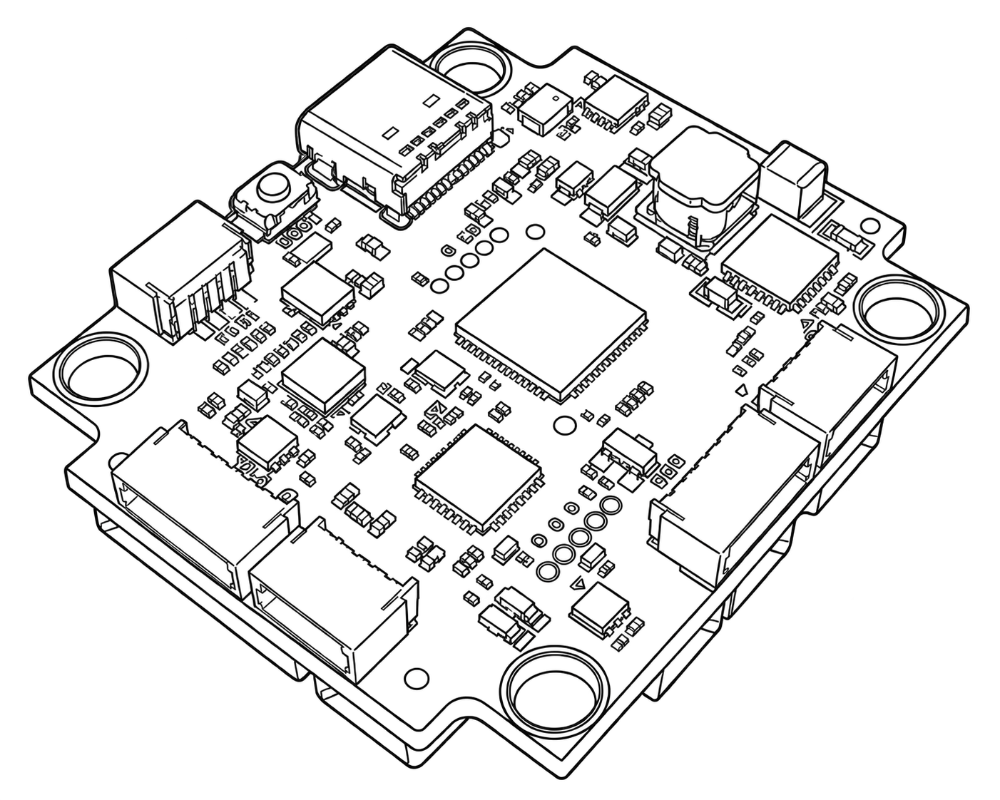
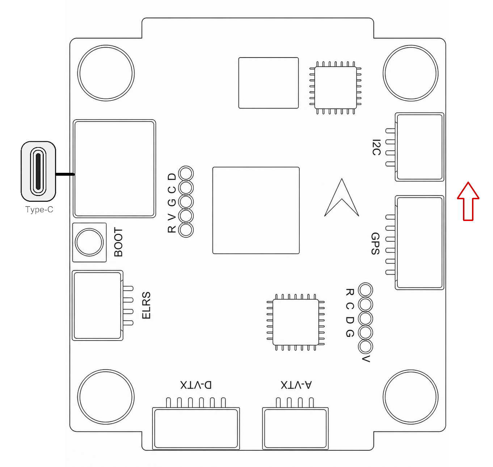
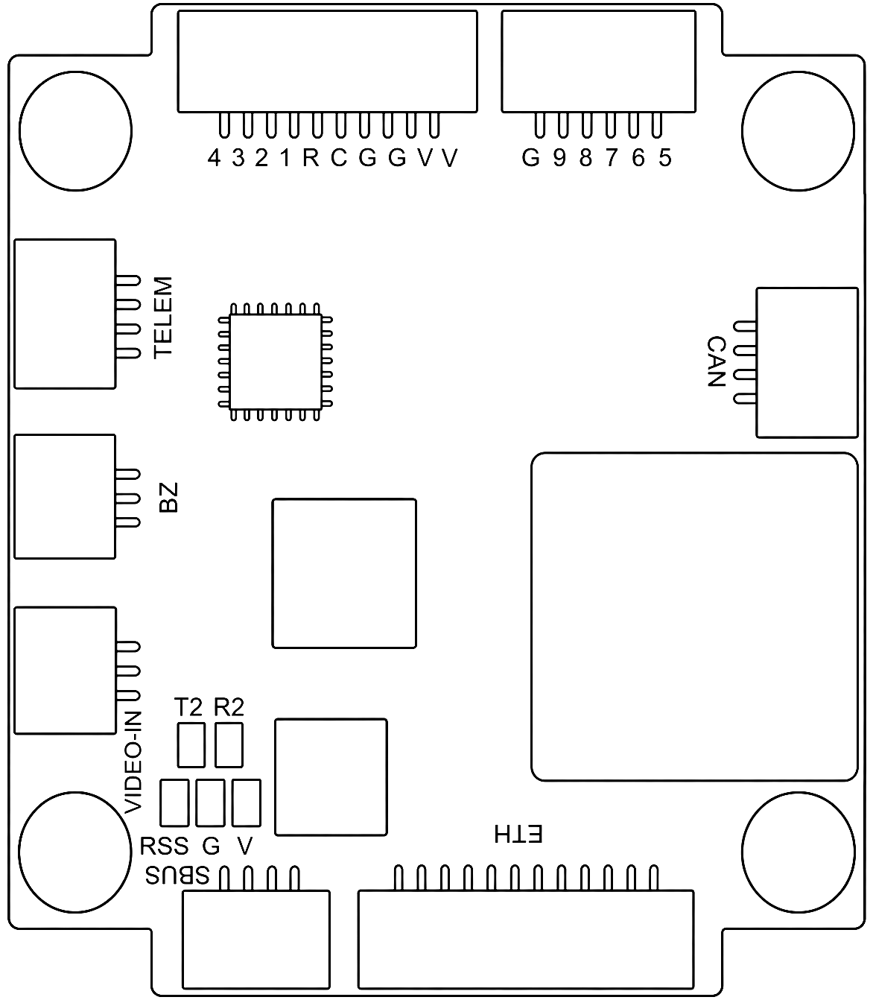
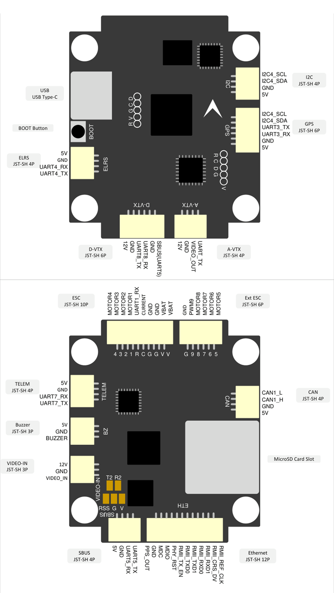
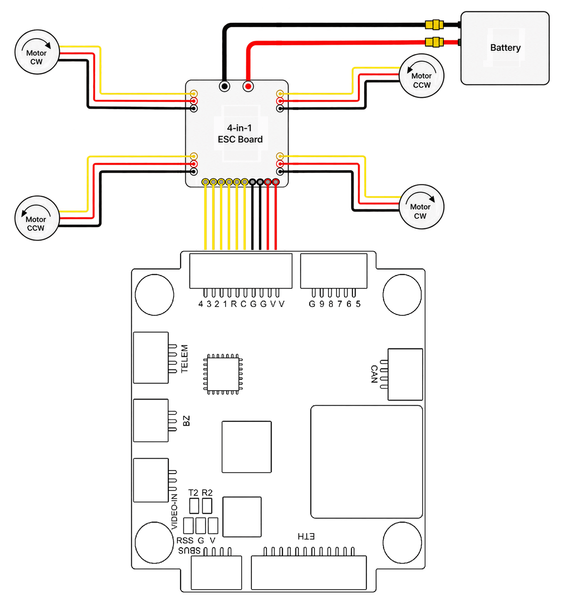
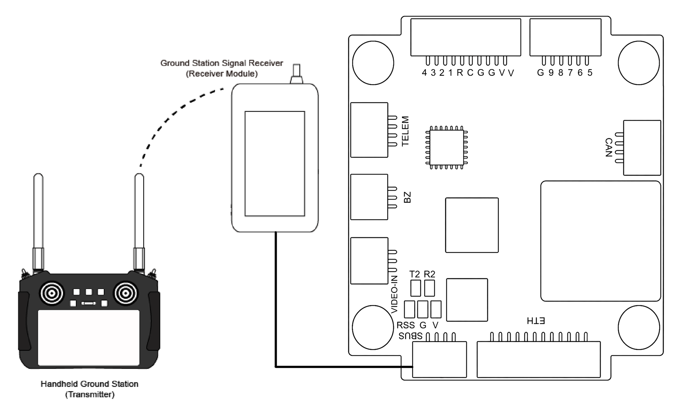
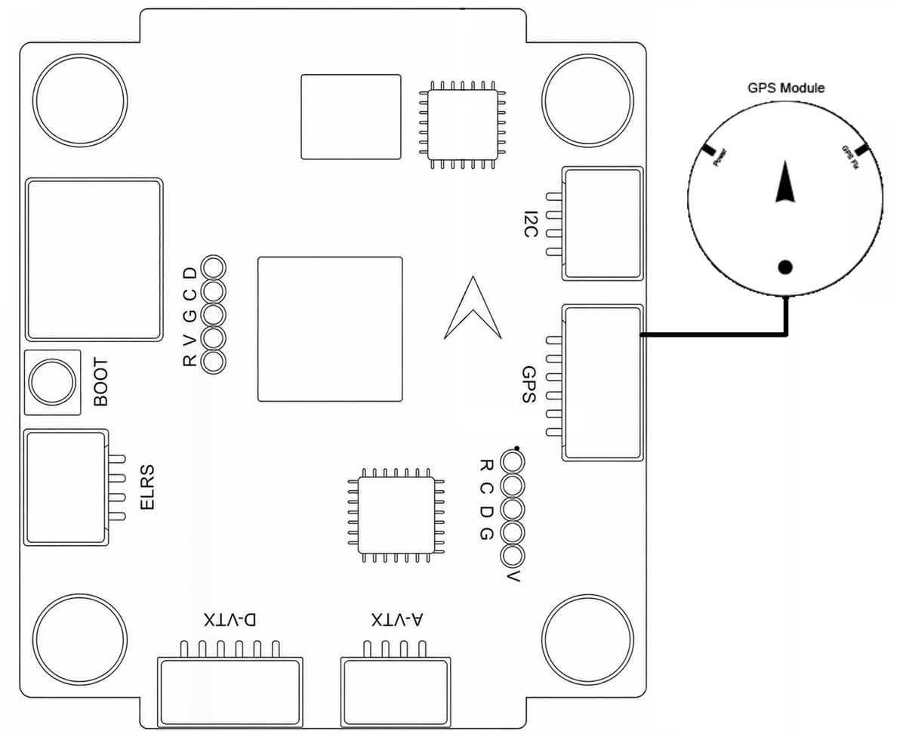
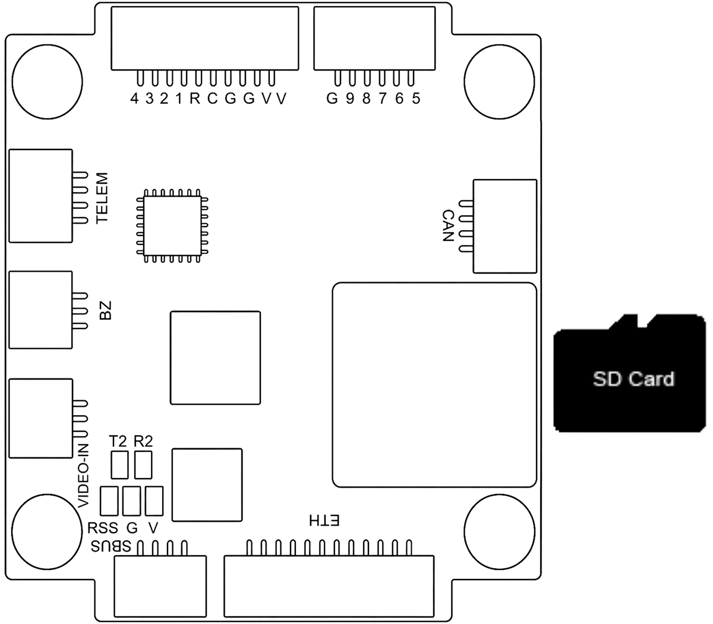

# Accton Godwit GFH7

<Badge type="tip" text="main (PX4 v2.0)" />

::: warning
PX4 does not manufacture this (or any) autopilot.
Contact the [manufacturer](https://www.accton-iot.com/godwit/) for hardware support or compliance issues.
:::

The [Godwit GFH7](https://www.accton-iot.com/godwit/g-fh7.html) is a compact flight controller from Accton, designed for fixed-wing, UAV, and VTOL applications.
It adopts an STM32H753 flight-management processor, dual IMUs, an integrated barometer and compass, and solder-free connectors for flexible system integration.
The board supports PX4, ArduPilot, Betaflight, and iNAV flight-control software.







::: info
This flight controller is [manufacturer supported](../flight_controller/autopilot_manufacturer_supported.md).
:::

## Specifications {#specifications}

### Processor

- **Main FMU processor:** [STM32H753VIH6](https://www.st.com/en/microcontrollers-microprocessors/stm32h753vi.html) (Arm® Cortex®-M7 at 480 MHz, 2 MB flash, 1 MB RAM)

### Sensors

- **IMU:** [TDK InvenSense ICM-42688-P](https://invensense.tdk.com/products/motion-tracking/6-axis/icm-42688-p/) (SPI4), [STMicroelectronics LSM6DSK320X](https://www.st.com/en/mems-and-sensors/lsm6dsk320x.html) (SPI2)
- **Barometer:** [Infineon DPS368](https://www.infineon.com/cms/en/product/sensor/pressure-sensors/pressure-sensors-for-iot/dps368/) (I2C1)
- **Magnetometer:** iSentek IST8310 (I2C1)

### Electrical Data

- **Input voltage:** up to 12S LiPo
- **Current draw:** 110 mA at 5 V (static)
- **BEC output:** 5 V/3 A and 12 V/3 A (supports power-saving mode)
- **Power monitoring:** one analog input (battery voltage and current)

### Interfaces

- **PWM outputs:** 8 (plus `PWM9` for a NeoPixel LED strip)
- **Serial ports:** 7 (6 on connectors, 1 on solder pads)
- **I2C buses:** 2 (1 external, 1 internal)
- **CAN buses:** 1
- **Ethernet:** RMII and PPS on a connector (reserved for future use; not enabled in PX4)
- **USB:** USB Type-C, with DFU button
- **RC input:** Yes (serial, on the `SBUS` and `ELRS` connectors)
- **Parameter storage:** processor flash
- **SD card:** microSD slot
- **ADC inputs:** 3 (battery voltage, battery current, and analog RSSI)
- **OSD:** analog (AT7456-compatible)
- **Other:** 2 LED indicators, buzzer, video input, and video output

### Mechanical Data

- **Dimensions:** 36 x 42 x 8.63 mm
- **Weight:** 10.6 g
- **Mounting hole spacing:** 30.5 x 30.5 mm, M4

## Where to Buy {#store}

Product information and availability are provided on the [Accton-IoT Godwit GFH7 product page](https://www.accton-iot.com/godwit/g-fh7.html).

## Pinouts {#pinouts}

Refer to the [Godwit GFH7 product page](https://www.accton-iot.com/godwit/g-fh7.html) and the [Godwit GFH7 datasheet](https://www.accton-iot.com/godwit/assets/doc/DS-Godwit%20FPV%20G-FH7.pdf) for the latest board information and interface definition.



## Power {#power}

The board is powered from the battery through the `VBAT` pins on the `ESC` connector, which also carries the ESC's battery current signal (`CURRENT` pin).
Onboard BECs supply 5 V/3 A and 12 V/3 A to peripherals.

Battery voltage monitoring is configured by default ([BAT1_V_DIV](../advanced_config/parameter_reference.md#BAT1_V_DIV) is set to `17.0`).
Current monitoring depends on the ESC's current sensor, so you must set [BAT1_A_PER_V](../advanced_config/parameter_reference.md#BAT1_A_PER_V) as described in [Battery and Power Module Setup](../config/battery.md).

## Interface Summary {#interface_summary}

| Interface         | Function                                           |
| ----------------- | -------------------------------------------------- |
| `ESC` / `Ext ESC` | Connect the ESC and motor system.                  |
| `GPS`             | Connect a GPS module.                              |
| `SBUS` / `ELRS`   | Connect an RC receiver.                            |
| `TELEM`           | Connect a telemetry radio or MAVLink device.       |
| `CAN`             | Connect CAN peripherals.                           |
| `I2C`             | Connect external I2C sensors.                      |
| `VIDEO-IN`        | Connect the analog video input.                    |
| `A-VTX` / `D-VTX` | Connect the supported video transmitter interface. |

## Assembly {#assembly}

### Wiring Diagram {#wiring_diagram}

Refer to the [Godwit GFH7 product page](https://www.accton-iot.com/godwit/g-fh7.html) and the [Godwit GFH7 datasheet](https://www.accton-iot.com/godwit/assets/doc/DS-Godwit%20FPV%20G-FH7.pdf) for the latest wiring and connector information.

")

")

The diagram below shows how to connect the ESC and motors to the `ESC` and `Ext ESC` connectors.



### Radio Control {#radio_control}

A remote control (RC) radio system is required if you want to manually control your vehicle (PX4 does not require a radio system for autonomous flight modes).
See [Radio Control Systems](../getting_started/rc_transmitter_receiver.md) for how to select a transmitter/receiver.

The board has two receiver connectors (JST-SH 4P), both wired to FMU UARTs:

- `SBUS` (UART5): S.BUS is enabled on this port by default.
- `ELRS` (UART4, the PX4 `RC` port): for CRSF/ExpressLRS receivers. Set [RC_CRSF_PRT_CFG](../advanced_config/parameter_reference.md#RC_CRSF_PRT_CFG) to `Radio Controller` to enable it.

Other protocols are enabled by setting [RC_DSM_PRT_CFG](../advanced_config/parameter_reference.md#RC_DSM_PRT_CFG) or [RC_GHST_PRT_CFG](../advanced_config/parameter_reference.md#RC_GHST_PRT_CFG) to the port the receiver is connected to.
Only one protocol can be active on a port.
PPM receivers are not supported.



### GPS & Compass {#gps_compass}

Connect a [GPS/compass module](../gps_compass/index.md) to the `GPS` connector (JST-SH 6P), which carries USART3 (PX4 port `GPS1`) and the external I2C bus (I2C4) for the compass.
See [Mounting the GPS/Compass](../assembly/mount_gps_compass.md) for placement.

An external compass (usually built into the GPS module) is recommended over the onboard IST8310, because it can be mounted away from motors and power wiring.



### CAN {#can}

The `CAN` connector (JST-SH 4P) is used for [DroneCAN](../dronecan/index.md) peripherals such as GPS modules, ESCs and sensors.
DroneCAN is disabled by default: enable it by setting [UAVCAN_ENABLE](../advanced_config/parameter_reference.md#UAVCAN_ENABLE).

### OSD {#osd}

The board has an [analog OSD](../peripherals/osd.md#atxxxx-analog-osd) chip (AT7456-compatible), which is enabled by default in NTSC mode.
Connect the camera to `VIDEO-IN` and the analog video transmitter to `A-VTX`.
Set [OSD_ATXXXX_CFG](../advanced_config/parameter_reference.md#OSD_ATXXXX_CFG) to `2` for PAL, or `0` to disable it.

For a digital video transmitter on the `D-VTX` connector, set [MSP_OSD_CONFIG](../advanced_config/parameter_reference.md#MSP_OSD_CONFIG) to `TELEM 3` to enable [MSP OSD](../peripherals/osd.md#msp-osd).

## PWM Outputs {#pwm_outputs}

The board has 8 PWM outputs, on the `MOTOR1`-`MOTOR8` pins of the `ESC` and `Ext ESC` connectors.
All 8 outputs support [DShot](../peripherals/dshot.md) and [bidirectional DShot](../peripherals/dshot.md#bidirectional-dshot-telemetry).

The outputs are in 2 groups:

- Outputs 1-4 in group 1 (Timer1)
- Outputs 5-8 in group 2 (Timer8)

All outputs within the same group must use the same output protocol and rate.

The `PWM9` pin on the `Ext ESC` connector drives a NeoPixel (WS2812-compatible) LED strip of up to 8 LEDs, and can't be used as an actuator output.

## SD Card (Optional) {#sd_card}

The board has a microSD card slot, which PX4 uses for flight logs and other data.
See [SD Cards](../getting_started/px4_basic_concepts.md#sd-cards-removable-memory) for more information.



## Serial Port Mapping {#serial_port_mapping}

| UART   | Device     | Port   | Connector                                   |
| ------ | ---------- | ------ | ------------------------------------------- |
| USART1 | /dev/ttyS0 | EXT2   | `ESC` (ESC telemetry, RX only)              |
| USART2 | /dev/ttyS1 | TELEM2 | `T2`/`R2` solder pads                       |
| USART3 | /dev/ttyS2 | GPS1   | `GPS`                                       |
| UART4  | /dev/ttyS3 | RC     | `ELRS`                                      |
| UART5  | /dev/ttyS4 | TELEM4 | `SBUS` (RX, S.BUS by default), `A-VTX` (TX) |
| UART7  | /dev/ttyS5 | —      | `TELEM`                                     |
| UART8  | /dev/ttyS6 | TELEM3 | `D-VTX`                                     |

No ports have flow control.

## Building Firmware {#building_firmware}

::: tip
Most users will not need to build this firmware (from PX4 v2.0).
It is pre-built and automatically installed by _QGroundControl_ when appropriate hardware is connected.
:::

To [build PX4](../dev_setup/building_px4.md) for this target from source:

```sh
make accton-godwit_gfh7_default
```

## Debug Port {#debug_port}

The default firmware does not provide a serial [System Console](../debug/system_console.md).
Use the [MAVLink Shell](../debug/mavlink_shell.md) over USB or a telemetry link instead.

The debug build enables the system console on UART4 (the `ELRS` connector), which is then not available for an RC receiver:

```sh
make accton-godwit_gfh7_debug
```

## Further Information {#further_information}

- [Accton-IoT Godwit GFH7](https://www.accton-iot.com/godwit/g-fh7.html) (product page)
- [Godwit GFH7 documentation](https://www.accton-iot.com/godwitdoc/g-fh7doc.html)
- [Godwit GFH7 datasheet](https://www.accton-iot.com/godwit/assets/doc/DS-Godwit%20FPV%20G-FH7.pdf)
- Sales: [sales@accton-iot.com](mailto:sales@accton-iot.com)
- Support: [support@accton-iot.com](mailto:support@accton-iot.com)
