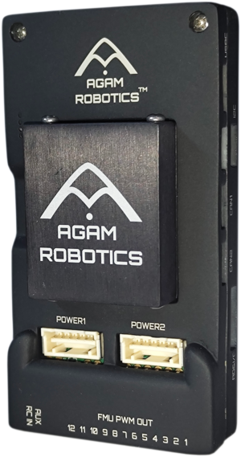

# Agam Autopilot 6X-RT

## Introduction

Agam Autopilot 6X-RT is a high-performance, FMUv6X-RT standard flight controller designed for professional UAV and autonomous robotics applications. Built around the powerful NXP i.MX RT1176 dual-core processor, it delivers exceptional processing capability for advanced autonomous navigation, perception, and control algorithms.

The flight controller is designed around the Pixhawk Autopilot Bus Standard, enabling compatibility with a wide range of PX4-supported peripherals while providing enterprise-grade reliability through redundant sensors, temperature-controlled IMU architecture, Ethernet connectivity, and industrial-grade protection circuitry.

The controller is fully supported by PX4 and is suitable for multirotors, fixed-wing aircraft, VTOLs, rovers, boats, underwater vehicles, and other autonomous robotic platforms.

The standard package includes:

* Agam Autopilot 6X-RT Flight Controller
* Carrier Board
* External IMU Board
* Digital Power Module
* Cable Set
* microSD Card (depending on package)

For enterprise, OEM, and bulk orders, contact Agam Robotics directly through their sales channel.

# Hardware Specifications

## Processor

* NXP i.MX RT1176
* Cortex-M7 @ 1 GHz
* Cortex-M4 @ 400 MHz

## Memory

* 2 MB SRAM
* 512 KB TCM (M7)
* 256 KB TCM (M4)
* 64 MB Octal SPI Flash
* 256 KB FRAM
* microSD Card Slot

## Sensors

* Triple Redundant IMUs
* Dual Redundant Barometers
* Magnetometer
* Shock-mounted external IMU module
* Temperature-controlled sensor board

## Interfaces

* 3 × CAN-FD
* 8 × UART
* 4 × I²C
* Multiple SPI interfaces
* 12 PWM Outputs
* USB
* RC Input (SBUS / PPM)
* RMII 100 Mbps Ethernet

## Dimensions

Flight Controller Module

* 39 × 32 × 16 mm

Carrier Board

* 95 × 50 × 19 mm

Weight

* Approximately 82–90 g depending on configuration.

# Support (Compatible Devices)

Agam Autopilot 6X-RT follows the Pixhawk Autopilot Bus Standard and supports peripherals compatible with PX4 v1.15 and later.

Supported devices include:

* GPS/GNSS receivers
* DroneCAN devices
* Digital airspeed sensors
* Rangefinders
* Optical flow sensors
* RTK GPS systems
* RC receivers (SBUS/PPM)
* Telemetry radios
* Companion computers
* Cameras
* ESCs (PWM and DShot)
* Power Modules
* External magnetometers
* I²C, UART, SPI peripherals

Since the hardware follows the Pixhawk connector standard, standard JST-based PX4 peripherals can be connected directly.

# Electrical Specification

| Parameter    | Specification              |
| ------------ | -------------------------- |
| MCU          | NXP i.MX RT1176            |
| Flash Memory | 64 MB Octal SPI Flash      |
| SRAM         | 2 MB                       |
| FRAM         | 256 KB                     |
| Power Input  | Dual redundant power ports |
| Ethernet     | 100BASE-T1                 |
| CAN          | 3 × CAN-FD                 |
| UART         | 8                          |
| PWM Outputs  | 12                         |
| USB          | USB 2.0                    |
| RC Input     | SBUS / PPM                 |
| Storage      | microSD Card               |

Additional hardware protection includes:

* Over-voltage protection
* Over-current protection
* EMI filtering
* ESD protection
* Secure boot support
* NXP EdgeLock secure element support

# Hardware Setup

A typical hardware setup consists of:

1. Mount the flight controller securely on the airframe.
2. Connect the Digital Power Module.
3. Connect the External IMU board.
4. Install GPS/GNSS module.
5. Connect telemetry radio.
6. Connect RC receiver.
7. Connect ESCs to PWM outputs.
8. Connect optional peripherals such as:

   * DroneCAN devices
   * Ethernet companion computer
   * Optical flow
   * Rangefinder
   * Airspeed sensor
9. Insert a microSD card.
10. Connect USB for firmware installation and configuration.

Refer to the wiring guide for connector-specific wiring diagrams.

# PX4 Configuration

Agam Autopilot 6X-RT supports PX4 firmware version **1.15 or later**.

Typical setup workflow:

1. Install QGroundControl.
2. Flash the latest PX4 firmware.
3. Select the appropriate airframe.
4. Calibrate:

   * Accelerometer
   * Gyroscope
   * Compass
   * Radio
   * ESCs
5. Configure battery monitoring.
6. Configure GPS and telemetry.
7. Verify actuator outputs.
8. Perform preflight safety checks before flight.

The board uses the FMUv6X-RT hardware architecture, allowing it to work with standard PX4 tooling and workflows.

# Connectors

The flight controller provides a comprehensive set of interfaces for UAV integration.

Available connectors include:

* Power 1
* Power 2 (Redundant)
* USB
* Ethernet (100BASE-T1)
* GPS
* GPS2
* TELEM1
* TELEM2
* TELEM3
* CAN1
* CAN2
* CAN3
* RC IN
* DSM
* AUX RC
* PWM Outputs
* External IMU
* I²C
* SPI
* Debug/JTAG

Connector pinouts and wiring diagrams are available in the dedicated wiring documentation.

# Features

* Dual-core NXP i.MX RT1176 processor
* Cortex-M7 @ 1 GHz
* Cortex-M4 @ 400 MHz
* PX4 supported
* Triple redundant IMUs
* Dual redundant barometers
* Shock-mounted sensor board
* Temperature-controlled IMU
* 100 Mbps Ethernet
* CAN-FD support
* 12 PWM outputs
* DShot support
* Redundant power inputs
* Secure boot
* NXP EdgeLock security
* Industrial-grade EMI, ESD, over-current, and over-voltage protection
* Pixhawk Bus Standard compatibility
* Made in India enterprise-grade design.

# Applications

Agam Autopilot 6X-RT is designed for professional autonomous systems including:

* Inspection
* Surveying
* Mapping
* Agriculture
* Construction
* Infrastructure monitoring
* Surveillance
* Search and Rescue
* Drone Delivery
* Defense platforms
* VTOL aircraft
* Fixed-wing UAVs
* Multirotors
* Ground Robots (UGVs)
* Surface Vehicles (USVs)
* Underwater Vehicles (UUVs)

The platform supports both research and commercial deployments requiring high computational performance and reliable flight control.

# See Also
[Agam Autopilot v6X-RT | AgamRobotics Docs](https://agamrobotics.gitbook.io/docs/autopilots-flight-controller/quickstart)

## GitHub

Browse the PX4 source code and board support packages to understand the FMUv6X-RT implementation, customize firmware, or contribute to development.

Recommended repositories:

* PX4-Autopilot
* PX4-Bootloader
* PX4 Documentation

# Where to Buy

Agam Autopilot 6X-RT can be purchased directly from Agam Robotics.
https://www.agamrobotics.com/product-page/agam-pixhawk-6x-full-set
