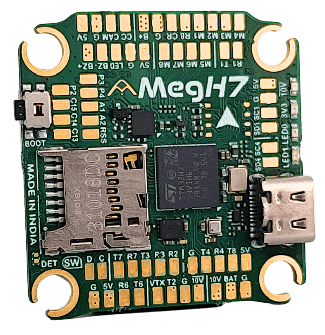

# Agam MegH7

::: warning
PX4 does not manufacture this (or any) autopilot.
Contact the [manufacturer](https://www.agamrobotics.com/) for hardware support or compliance issues.
:::

The [Agam MegH7](https://www.agamrobotics.com/agammegh7) is an STM32H743 flight controller in a 30.5 x 30.5mm form factor, with an onboard IMU, barometer, analog OSD, full-size microSD slot, CAN bus and seven UARTs.
This page describes hardware revision v1.2.

The board has no internal magnetometer, and provides two external I2C buses for a GPS/compass module or other peripherals.



::: info
This flight controller is [manufacturer supported](../flight_controller/autopilot_manufacturer_supported.md).
:::

## Key Features

- MCU: STM32H743 32-bit processor running at 480 MHz
- IMU: ICM-45686
- Barometer: BMP390
- OSD: AT7456E
- 7x UARTs (1, 2, 3, 4, 6, 7, 8)
- 1x CAN
- 2x external I2C buses
- 9x PWM outputs (8 motor outputs, 1 LED)
- Full-size microSD card slot for logging
- Optional onboard W25Q128 SPI flash on SPI1 (assembly option, not fitted on every board, not used by PX4)
- 1x JST-SH 1.0mm 8-pin ESC port (single or 4-in-1 ESCs, x8/octocopter compatible)
- 1x JST-SH 1.0mm 6-pin port for HD video systems such as Caddx Vista and DJI Air Unit
- Battery input voltage: 2S-8S
- BEC 5V 3A cont.
- BEC 10V 3A cont.
- Mounting: 30.5 x 30.5mm/Φ4mm holes with Φ3mm grommets
- Dimensions: 37.5 x 39 x 8.8mm
- Weight: 10g

## Where to Buy {#store}

The board can be bought from:

- [Agam Robotics](https://www.agamrobotics.com/shop)

## Connectors

The GPS, TELEM, CAN and RX connectors are JST-GH 1.25mm.
The ESC, DIGI VTX, SPI4, I2C4 and B/LD connectors are JST-SH 1.0mm.
Signal pins are 3.3V.

| Connector  | Type         | Function                                          |
| ---------- | ------------ | ------------------------------------------------- |
| USB Type-C |              | Firmware and configuration                        |
| microSD    |              | Logging                                           |
| ESC        | JST-SH 8-pin | Motor outputs, current sense, ESC telemetry       |
| GPS        | JST-GH 6-pin | GPS and I2C1                                      |
| TELEM      | JST-GH 6-pin | Telemetry, with flow control                      |
| RX         | JST-GH 4-pin | Serial RC input                                   |
| CAN        | JST-GH 4-pin | CAN bus                                           |
| DIGI VTX   | JST-SH 6-pin | HD video system, with 10V supply                  |
| SPI4       | JST-SH 8-pin | External SPI, with interrupt and data-ready lines |
| I2C4       | JST-SH 4-pin | External I2C                                      |
| B/LD       | JST-SH 4-pin | Buzzer and addressable LED strip                  |

The same signals are also broken out as solder pads on the bottom of the board, along with the analog camera and VTX pads, the analog inputs `RSS`, `A1` and `A2`, and the spare user IO pads `P2`, `P3`, `C13`, `C14` and `C15`.

::: info
The buzzer and LED strip outputs are powered from the 5V BEC, so neither is active when the board is powered from USB alone.
:::

PX4 drives only the first LED of a strip connected to `B/LD`, and uses it as the RGB status LED.

The 10V supply on `DIGI VTX` pin 1 and on the analog VTX `10V` pad is switched by the processor (PE5).
PX4 turns it on at boot.

## Pinouts

### ESC

| Pin | Signal                   | MCU pin |
| --- | ------------------------ | ------- |
| 1   | VBAT                     |         |
| 2   | GND                      |         |
| 3   | Current sense            | PC1     |
| 4   | ESC telemetry (UART8 RX) | PE0     |
| 5   | M1                       | PB0     |
| 6   | M2                       | PB1     |
| 7   | M3                       | PA0     |
| 8   | M4                       | PA1     |

### GPS

| Pin | Signal    | MCU pin |
| --- | --------- | ------- |
| 1   | +5V       |         |
| 2   | USART1 TX | PA9     |
| 3   | USART1 RX | PA10    |
| 4   | I2C1 SCL  | PB6     |
| 5   | I2C1 SDA  | PB7     |
| 6   | GND       |         |

### TELEM

| Pin | Signal    | MCU pin |
| --- | --------- | ------- |
| 1   | +5V       |         |
| 2   | UART7 TX  | PE8     |
| 3   | UART7 RX  | PE7     |
| 4   | UART7 CTS | PE10    |
| 5   | UART7 RTS | PE9     |
| 6   | GND       |         |

### RX

| Pin | Signal    | MCU pin |
| --- | --------- | ------- |
| 1   | USART6 TX | PC6     |
| 2   | USART6 RX | PC7     |
| 3   | +5V       |         |
| 4   | GND       |         |

### CAN

| Pin | Signal | MCU pin                       |
| --- | ------ | ----------------------------- |
| 1   | +5V    |                               |
| 2   | CAN H  | CAN1 via transceiver (PD1 TX) |
| 3   | CAN L  | CAN1 via transceiver (PD0 RX) |
| 4   | GND    |                               |

### DIGI VTX

| Pin | Signal                             | MCU pin |
| --- | ---------------------------------- | ------- |
| 1   | +10V (switched by PE5)             |         |
| 2   | GND                                |         |
| 3   | USART2 TX                          | PD5     |
| 4   | USART2 RX                          | PD6     |
| 5   | GND                                |         |
| 6   | USART3 RX (SBUS from the air unit) | PD9     |

### SPI4

| Pin | Signal | MCU pin |
| --- | ------ | ------- |
| 1   | +5V    |         |
| 2   | SCK    | PE12    |
| 3   | MISO   | PE13    |
| 4   | MOSI   | PE14    |
| 5   | CS     | PB12    |
| 6   | DRDY   | PD4     |
| 7   | EXTI   | PD3     |
| 8   | GND    |         |

### I2C4

| Pin | Signal   | MCU pin |
| --- | -------- | ------- |
| 1   | +5V      |         |
| 2   | I2C4 SCL | PD12    |
| 3   | I2C4 SDA | PD13    |
| 4   | GND      |         |

### B/LD

| Pin | Signal                            | MCU pin |
| --- | --------------------------------- | ------- |
| 1   | +5V                               |         |
| 2   | Buzzer, switched low side (`BZ-`) | PA15    |
| 3   | LED strip data                    | PA8     |
| 4   | GND                               |         |

### PWM Outputs

M1-M4 are on the ESC connector, and all of M1-M8 are also exposed as solder pads.
Outputs that share a timer form a group, and must use the same output rate and protocol (PWM or DShot).

| Output | MCU pin | Timer group |
| ------ | ------- | ----------- |
| M1     | PB0     | 1 (TIM3)    |
| M2     | PB1     | 1 (TIM3)    |
| M3     | PA0     | 2 (TIM5)    |
| M4     | PA1     | 2 (TIM5)    |
| M5     | PA2     | 2 (TIM5)    |
| M6     | PA3     | 2 (TIM5)    |
| M7     | PD14    | 3 (TIM4)    |
| M8     | PD15    | 3 (TIM4)    |

### Analog Inputs

The `A1` and `A2` pads connect directly to the processor, with no voltage divider, so their input must not exceed 3.3V.

| Pad   | MCU pin | Use in PX4                                                                                                              |
| ----- | ------- | ----------------------------------------------------------------------------------------------------------------------- |
| `RSS` | PC5     | Analog RSSI, used when the RC receiver does not report RSSI                                                             |
| `A1`  | PC4     | Analog airspeed sensor, enabled by setting [SENS_DPRES_ANSC](../advanced_config/parameter_reference.md#SENS_DPRES_ANSC) |
| `A2`  | PA4     | Not used                                                                                                                |

<a id="bootloader"></a>

## PX4 Bootloader Update

The board ships with a non-PX4 firmware pre-installed.
Before PX4 firmware can be installed, the _PX4 bootloader_ must be flashed.
Download the [agam_megh7_bootloader.bin](https://github.com/PX4/PX4-Autopilot/raw/main/boards/agam/megh7/extras/agam_megh7_bootloader.bin) bootloader binary and read [this page](../advanced_config/bootloader_update_from_betaflight.md) for flashing instructions.

## Building Firmware

To [build PX4](../dev_setup/building_px4.md) for this target:

```sh
make agam_megh7_default
```

## Installing PX4 Firmware

Firmware can be installed in any of the normal ways:

- Build and upload the source:

  ```sh
  make agam_megh7_default upload
  ```

- [Load the firmware](../config/firmware.md) using _QGroundControl_.
  You can use either pre-built firmware or your own custom firmware.

## PX4 Configuration

In addition to the [basic configuration](../config/index.md), the following parameters are important:

| Parameter                                                            | Setting                                                                                                                 |
| -------------------------------------------------------------------- | ----------------------------------------------------------------------------------------------------------------------- |
| [SYS_HAS_MAG](../advanced_config/parameter_reference.md#SYS_HAS_MAG) | This should be disabled since the board does not have an internal mag. You can enable it if you attach an external mag. |

## Serial Port Mapping

| UART   | Device     | Port                                                 |
| ------ | ---------- | ---------------------------------------------------- |
| USART1 | /dev/ttyS0 | GPS1 (GPS connector)                                 |
| USART2 | /dev/ttyS1 | TELEM2 (DIGI VTX connector)                          |
| USART3 | /dev/ttyS2 | TELEM3 (`T3` / `R3` pads, RX also on DIGI VTX pin 6) |
| UART4  | /dev/ttyS3 | TELEM4 (`T4` / `R4` pads)                            |
| USART6 | /dev/ttyS4 | RC input (RX connector)                              |
| UART7  | /dev/ttyS5 | TELEM1, with flow control                            |
| UART8  | /dev/ttyS6 | ESC telemetry (DShot)                                |

## Debug Port

### System Console

There is no serial console on this board.
The NSH shell is available over USB through the [MAVLink Shell](../debug/mavlink_shell.md), for example the _MAVLink Console_ in QGroundControl.

### SWD

The [SWD interface](../debug/swd_debug.md) (JTAG) pins are exposed as the two pads marked `D` and `C` beneath the boxed `SW` label on the bottom of the board:

- `SWDIO`: pad marked `D`
- `SWCLK`: pad marked `C`
- `GND`: as marked on board
- `VDD_3V3`: as marked on board

## Further info

- [Agam MegH7 product page](https://www.agamrobotics.com/agammegh7)
